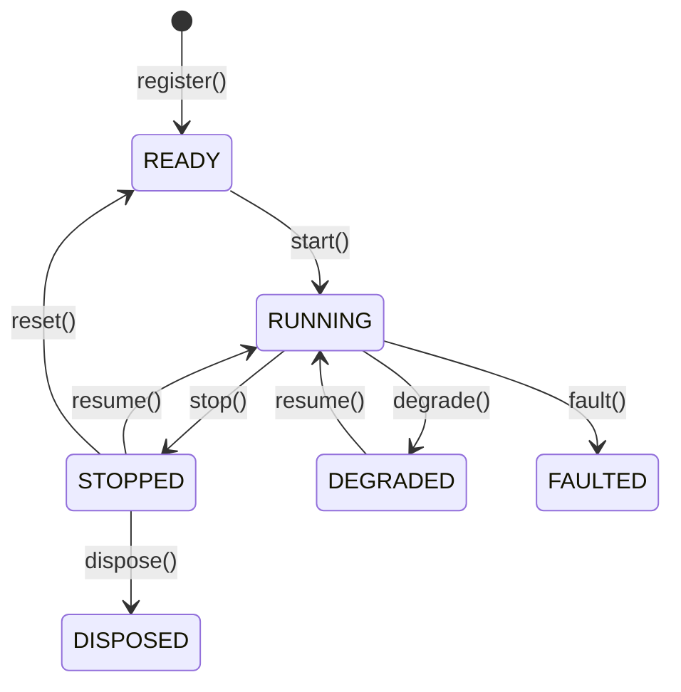

# NautilusTrader Actors 核心概念（中文版）

本文基于同目录的英文文档和
[官网最新版 Actors](https://nautilustrader.io/docs/latest/concepts/actors/) 整理翻译。
它不是逐句直译，而是一份面向使用者的中文概念说明：在保留官方语义和 API 名称的同时，
重点解释 Actor 的职责、生命周期、数据回调和实盘运行状态。

## Actor 是什么

数据 Actor 接收主动请求和实时订阅的数据、处理系统事件，并管理组件自身的状态。
Python 用户继承 `DataActor` 类，Rust 用户实现 `DataActor` trait。

Actor 提供以下能力：

- 请求和订阅市场数据及自定义数据。
- 发布自定义数据和信号。
- 处理事件、定时器和时间提醒。
- 访问缓存。
- 输出结构化日志。

`Strategy` 建立在 Actor 能力之上，并增加订单管理能力。可以将两者的关系概括为：

```text
DataActor = 数据处理 + 系统事件 + 状态管理
Strategy  = DataActor 能力 + 订单管理
```

只需要计算指标、监控行情、生成信号或维护数据状态时，优先使用 `DataActor`；
需要下单和管理订单时，则使用 `Strategy`。

## Python 基础示例

Actor 使用与策略类似的配置模式。下面的 Actor 订阅指定类型的 K 线，
并记录已经处理的 K 线数量：

```python
from nautilus_trader.common import DataActor
from nautilus_trader.config import DataActorConfig
from nautilus_trader.model import Bar
from nautilus_trader.model import BarType


class MyActorConfig(DataActorConfig):
    def __init__(self, bar_type: BarType, **_kwargs) -> None:
        self.bar_type = bar_type


class MyActor(DataActor):
    def __init__(self, config: MyActorConfig) -> None:
        super().__init__(config)

        # 在 Actor 上保存运行时状态
        self.count_of_processed_bars: int = 0

    def on_start(self) -> None:
        # 订阅与配置类型匹配的 K 线
        self.subscribe_bars(self.config.bar_type)

    def on_bar(self, bar: Bar) -> None:
        self.count_of_processed_bars += 1
```

这个示例体现了 Actor 的基本工作模式：配置对象提供构造数据，`on_start()` 注册订阅，
系统将数据分发给对应回调，Actor 则通过实例字段维护运行时状态。

## Actor 配置与 ID

数据 Actor 可以接收 `DataActorConfig` 的子类。基础配置支持可选的 `actor_id`。

### Python Actor ID

如果显式提供 `actor_id`，Actor 将以该 ID 注册；如果没有提供，Python Actor 默认使用类名。
注册时不允许出现重复 ID，在 Python 中会抛出 `RuntimeError`。

运行同一个 Actor 类的多个实例时，应为每个实例配置不同的 `actor_id`：

```python
config_1 = MyActorConfig(
    actor_id="BAR-ACTOR-001",
    bar_type=bar_type_1,
)

config_2 = MyActorConfig(
    actor_id="BAR-ACTOR-002",
    bar_type=bar_type_2,
)
```

把配置视为 Actor 的构造数据：用户提供的设置通过 `self.config` 读取，
运行期间变化的状态则保存在 Actor 自身。

```text
self.config.xxx  构造配置，运行期间通常不改变
self.xxx         Actor 的运行时状态
```

### Rust Actor ID

Rust Actor 的运行时身份和状态保存在 `DataActorCore` 中。通过 `actor_id()` 读取运行时 ID，
不要期待自动生成的 ID 被回写到 `DataActorConfig`。

没有配置 `actor_id` 的 Rust Actor 会以 `DataActor` 注册，而不是以具体实现类型注册。
因此，建议每个 Rust Actor 都显式配置唯一的 `actor_id`。

Rust 用户实现 `DataActor`，并使用 `self` 上的门面方法。`DataActorNative` 只用于原生运行时接线
和借用核心状态；仅在同一二进制的性能路径或内部运行时接线中导入它。

## 生命周期

Actor 的主要稳定状态如下：



上图只展示主要流程，省略了过渡状态和较少使用的合法路径。
如果一个生命周期操作存在处理器，只有处理器成功执行后，Actor 才会进入目标状态。

可以重写以下方法来响应生命周期事件：

<!-- markdownlint-disable MD060 -->

| 方法             | 调用时机                     | 典型用途             |
| -------------- | ------------------------ | ---------------- |
| `on_start()`   | Actor 开始运行。              | 注册数据订阅并启动定时器。    |
| `on_stop()`    | Actor 停止运行。              | 清理 Actor 拥有的资源。  |
| `on_resume()`  | Actor 从停止或降级状态恢复。        | 重新订阅数据或恢复定时任务。   |
| `on_reset()`   | Actor 被重置，包括回测运行之间的引擎重置。 | 清空需要重新初始化的运行时状态。 |
| `on_degrade()` | Actor 进入降级状态，只能提供部分功能。   | 暂停非必要功能。         |
| `on_fault()`   | Actor 遇到故障并进入故障状态。       | 记录故障并执行安全处理。     |
| `on_dispose()` | Actor 被销毁。               | 释放所有剩余资源。        |

<!-- markdownlint-enable MD060 -->

生命周期中的资源管理应保持对称：

```text
on_start()   注册资源  <-> on_stop()    释放资源
on_resume()  恢复资源  <-> on_degrade() 暂停资源
```

## 定时器与时间提醒

Actor 可以通过 `self.clock` 安排周期任务和一次性提醒：

```python
from datetime import timedelta

from nautilus_trader.common import DataActor
from nautilus_trader.common import TimeEvent


class MyActor(DataActor):
    def on_start(self) -> None:
        self._schedule_clock_events()

    def on_resume(self) -> None:
        self._schedule_clock_events()

    def on_stop(self) -> None:
        self._cancel_clock_events()

    def on_degrade(self) -> None:
        self._cancel_clock_events()

    def _schedule_clock_events(self) -> None:
        # 每 5 秒触发一次
        self.clock.set_timer(
            "my_actor.timer",
            timedelta(seconds=5),
            callback=self._on_timer,
        )

        # 1 分钟后触发一次
        self.clock.set_time_alert(
            "my_actor.alert",
            self.clock.utc_now() + timedelta(minutes=1),
            callback=self._on_alert,
        )

    def _cancel_clock_events(self) -> None:
        self.clock.cancel_timer("my_actor.timer")
        self.clock.cancel_timer("my_actor.alert")

    def _on_timer(self, event: TimeEvent) -> None:
        self.log.info("Timer fired")

    def _on_alert(self, event: TimeEvent) -> None:
        self.log.info("Alert triggered")
```

显式传入 `callback` 时，`TimeEvent` 会进入指定方法。没有传入回调时，
Actor 运行时会将时钟注册的默认处理器连接到 `on_time_event()`。

多个组件可能共享同一个时钟及其定时器命名空间。定时器名称应包含组件标识，
因为使用相同名称注册新定时器会替换已有定时器。停止或降级时应主动取消定时器。

## 系统能力

Actor 可以访问以下核心系统组件和 API：

<!-- markdownlint-disable MD060 -->

| API                                       | 作用                  |
| ----------------------------------------- | ------------------- |
| `self.cache`                              | 访问工具、订单和持仓等共享状态。    |
| `self.clock`                              | 获取当前时间并安排定时器或时间提醒。  |
| `self.log`                                | 输出结构化日志。            |
| `publish_data()` / `subscribe_data()`     | 发布和订阅结构化自定义数据。      |
| `publish_signal()` / `subscribe_signal()` | 发布和订阅轻量级提醒或通知。      |
| `subscribe_queue_state()`                 | 订阅实时运行器队列压力状态。      |
| `subscribe_socket_state()`                | 订阅实时 Socket 传输状态。   |
| `reconnect_socket()`                      | 请求恢复一个实时 Socket 端点。 |
| `unsubscribe_queue_state()`               | 停止接收队列压力状态。         |
| `unsubscribe_socket_state()`              | 停止接收 Socket 传输状态。   |
| `on_queue_state()`                        | 处理运行器队列压力状态变化。      |
| `on_socket_state()`                       | 处理 Socket 传输状态变化。   |

<!-- markdownlint-enable MD060 -->

Python 的 `DataActor` 和 `Strategy` API 不公开 `self.msgbus`。
结构化负载应使用自定义数据，简单数值和轻量通知则使用信号。

### 队列压力状态

实时 Actor 可以订阅运行器队列压力状态：

```python
from nautilus_trader.common import DataActor
from nautilus_trader.common import QueueStateChanged


class MyActor(DataActor):
    def on_start(self) -> None:
        self.subscribe_queue_state(priority=50)

    def on_stop(self) -> None:
        self.unsubscribe_queue_state()

    def on_queue_state(self, event: QueueStateChanged) -> None:
        self.log.warning(
            f"Queue {event.channel} changed {event.condition} to {event.state} "
            f"at depth {event.queue_depth}",
        )
```

可选的 `priority` 控制匹配订阅者之间的处理顺序，数值越大越先执行。
再次订阅不会改变已有优先级；如需修改，应先取消订阅，再以新优先级订阅。

`QueueStateChanged` 包含 Trader ID、运行器通道、队列条件、条件状态、队列深度、
平均分发时间、事件 ID 和时间戳。这类事件通过进程内的强类型消息总线传递，
没有外部网络表示。具体触发和清除语义参见[队列压力监控](live.md#queue-pressure-monitoring)。

### Socket 传输状态

Actor 可以订阅支持状态报告的实时适配器：

```python
from nautilus_trader.common import DataActor
from nautilus_trader.common import SocketStateChanged


class MyActor(DataActor):
    def on_start(self) -> None:
        self.subscribe_socket_state(priority=50)

    def on_stop(self) -> None:
        self.unsubscribe_socket_state()

    def on_socket_state(self, event: SocketStateChanged) -> None:
        self.log.info(
            f"Socket {event.endpoint} for {event.client_id} changed to {event.state}",
        )
```

`SocketStateChanged` 包含 Trader ID、客户端 ID、可选场所、稳定端点标签、传输状态、
事件 ID 和时间戳。端点是非敏感的逻辑标签，而不是原始连接 URL。

`SocketState.CONNECTED` 只表示底层传输可用，不代表认证成功、订阅重放完成或适配器就绪。
`SocketState.DISCONNECTED` 表示一个活动传输已经断开。具体支持范围和连接边沿语义参见
[Socket 传输状态](live.md#socket-transport-state)。

### 重连单个 Socket 端点

实时 Actor 和策略可以请求恢复一个端点，而不需要重启整个数据客户端或执行客户端。
调用时传入 `SocketStateChanged` 报告的客户端 ID 和端点标签：

```python
from nautilus_trader.model import ClientId


def recover_market_socket(self) -> None:
    self.reconnect_socket(
        client_id=ClientId("POLYMARKET"),
        endpoint="polymarket-market-streams",
    )
```

这个 API 采用“发起后观察”模式。方法成功返回只表示命令通过本地校验并进入队列，
不表示内核已经接受请求，也不表示恢复完成。

调用者应订阅 `subscribe_socket_state()`，并观察相同客户端和端点的状态。
请求被接受后，传输进入重连模式时会报告 `DISCONNECTED`，恢复后再报告 `CONNECTED`。

内核会记录未知或不支持的客户端、未知或有歧义的端点、重复请求、正在断开的传输和已关闭的传输。
这些拒绝不会产生 Socket 状态变化，也不会影响其他端点。

无效端点标签以及不可用或已关闭的运行器通道会同步失败。端点标签只允许 ASCII 字母、数字、
`.`、`-` 和 `_`；应传入逻辑标签，而不是原始 URL。

## 数据处理与回调

系统将请求响应和订阅更新分别分发。数据进入哪个回调取决于发起数据流的操作。

### 请求响应与订阅更新

系统区分两种数据流：

1. **请求响应**：

   - 通过 `request_bars()`、`request_quotes()` 等方法获取。
   - 通过 `on_historical_bars()`、`on_historical_quotes()` 等类型专用批量处理器接收。
   - 自定义数据的每个响应调用一次 `on_historical_data()`。单个 `CustomData` 以对象形式到达；
     批量响应以一个列表到达，其中也可能是空列表。
   - 适合初始数据加载和历史分析。

1. **订阅更新**：

   - 通过 `subscribe_bars()`、`subscribe_quotes()` 等方法获取。
   - 通过 `on_bar()`、`on_quote()` 等类型专用处理器接收。
   - 适合持续的事件处理。

最常见的区别如下：

<!-- markdownlint-disable MD060 -->

| 操作类型 | 数据形态    | 示例操作               | 回调                     |
| ---- | ------- | ------------------ | ---------------------- |
| 历史请求 | 通常为批量响应 | `request_bars()`   | `on_historical_bars()` |
| 实时订阅 | 持续单条更新  | `subscribe_bars()` | `on_bar()`             |

<!-- markdownlint-enable MD060 -->

### 常用操作与处理器

常用数据操作与回调的对应关系如下：

<!-- markdownlint-disable MD060 -->

| 操作                              | 类别  | 处理器                             | 用途             |
| ------------------------------- | --- | ------------------------------- | -------------- |
| `subscribe_data()`              | 订阅  | `on_data()`                     | 自定义数据更新。       |
| `subscribe_signal()`            | 订阅  | `on_signal()`                   | 信号更新。          |
| `subscribe_instrument()`        | 订阅  | `on_instrument()`               | 工具定义更新。        |
| `subscribe_instruments()`       | 订阅  | `on_instrument()`               | 一个场所的工具定义更新。   |
| `subscribe_book_deltas()`       | 订阅  | `on_book_deltas()`              | 订单簿增量。         |
| `subscribe_book_depth10()`      | 订阅  | `on_book_depth()`               | 十档订单簿深度快照。     |
| `subscribe_book_at_interval()`  | 订阅  | `on_book()`                     | 按时间间隔生成的订单簿快照。 |
| `subscribe_quotes()`            | 订阅  | `on_quote()`                    | 报价更新。          |
| `subscribe_trades()`            | 订阅  | `on_trade()`                    | 成交更新。          |
| `subscribe_mark_prices()`       | 订阅  | `on_mark_price()`               | 标记价格更新。        |
| `subscribe_index_prices()`      | 订阅  | `on_index_price()`              | 指数价格更新。        |
| `subscribe_bars()`              | 订阅  | `on_bar()`                      | K 线更新。         |
| `subscribe_funding_rates()`     | 订阅  | `on_funding_rate()`             | 资金费率更新。        |
| `subscribe_instrument_status()` | 订阅  | `on_instrument_status()`        | 工具状态更新。        |
| `subscribe_instrument_close()`  | 订阅  | `on_instrument_close()`         | 工具收盘更新。        |
| `subscribe_option_greeks()`     | 订阅  | `on_option_greeks()`            | 期权希腊字母更新。      |
| `subscribe_option_chain()`      | 订阅  | `on_option_chain()`             | 期权链切片快照。       |
| `request_data()`                | 请求  | `on_historical_data()`          | 历史自定义数据。       |
| `request_book_deltas()`         | 请求  | `on_historical_book_deltas()`   | 历史订单簿增量。       |
| `request_book_depth()`          | 请求  | `on_historical_book_depth()`    | 历史订单簿深度。       |
| `request_book_snapshot()`       | 请求  | `on_book()`                     | 订单簿快照。         |
| `request_instrument()`          | 请求  | `on_instrument()`               | 工具定义。          |
| `request_instruments()`         | 请求  | `on_instrument()`               | 多个工具定义。        |
| `request_quotes()`              | 请求  | `on_historical_quotes()`        | 历史报价。          |
| `request_trades()`              | 请求  | `on_historical_trades()`        | 历史成交。          |
| `request_bars()`                | 请求  | `on_historical_bars()`          | 历史 K 线。        |
| `request_funding_rates()`       | 请求  | `on_historical_funding_rates()` | 历史资金费率。        |

<!-- markdownlint-enable MD060 -->

### 请求与订阅示例

下面的示例同时展示历史请求和实时订阅：

```python
from collections.abc import Sequence

from nautilus_trader.common import DataActor
from nautilus_trader.config import DataActorConfig
from nautilus_trader.model import Bar
from nautilus_trader.model import BarType


class MyActorConfig(DataActorConfig):
    def __init__(self, bar_type: BarType, **_kwargs) -> None:
        self.bar_type = bar_type


class MyActor(DataActor):
    def __init__(self, config: MyActorConfig) -> None:
        super().__init__(config)

    def on_start(self) -> None:
        # 历史响应由 on_historical_bars() 处理
        self.request_bars(
            bar_type=self.config.bar_type,
            limit=100,
        )

        # 实时订阅更新由 on_bar() 处理
        self.subscribe_bars(self.config.bar_type)

    def on_historical_bars(self, bars: Sequence[Bar]) -> None:
        for bar in bars:
            self.log.info(f"Received historical bar: {bar}")

    def on_bar(self, bar: Bar) -> None:
        self.log.info(f"Received subscribed bar: {bar}")
```

独立的请求和订阅处理器让 Actor 能够区分启动数据与持续更新。
可以用历史 K 线初始化指标或基准状态，再通过实时 K 线持续更新。

:::tip
排查数据流问题时，先确认数据来源与回调是否匹配。如果日志显示已经收到 K 线，
但 `on_bar()` 没有执行，应检查数据是否来自请求并进入了 `on_historical_bars()`。
:::

## 订单事件处理

数据 Actor 不管理订单，也不定义订单事件回调。订单事件应在 `Strategy` 中通过专用订单回调
或 `on_order_event()` 处理，完整回调列表参见[策略的订单管理](strategies.md#order-management)。

如果其他组件需要使用 Actor 派生出的值，可以通过自定义数据或信号传递：

- 自定义数据适合结构化负载。
- 信号适合简单数值和轻量通知。

## 使用建议

- 在 `on_start()` 中订阅数据，在 `on_stop()` 中取消订阅并释放资源。
- 在 `on_resume()` 中恢复定时器或其他运行资源。
- 将配置放在 `self.config`，将变化的运行状态放在 Actor 实例字段。
- 同类 Actor 多实例运行时，始终显式指定唯一的 `actor_id`。
- 使用历史请求预热状态，使用实时订阅持续更新状态。
- 让定时器名称包含 Actor 标识，避免共享时钟下发生名称冲突。
- 不要把 `SocketState.CONNECTED` 当作适配器完全就绪。
- 需要处理订单时使用 `Strategy`，不要把订单逻辑放进 `DataActor`。

## 相关资料

- [官方英文 Actors](https://nautilustrader.io/docs/latest/concepts/actors/)。
- [仓库英文 Actors](actors.md)。
- [Strategies](strategies.md)：策略在 Actor 基础上增加订单管理能力。
- [Data](data/)：Actor 可以请求和订阅的数据类型。
- [Message Bus](message_bus.md)：Actor 用于通信的消息系统。
