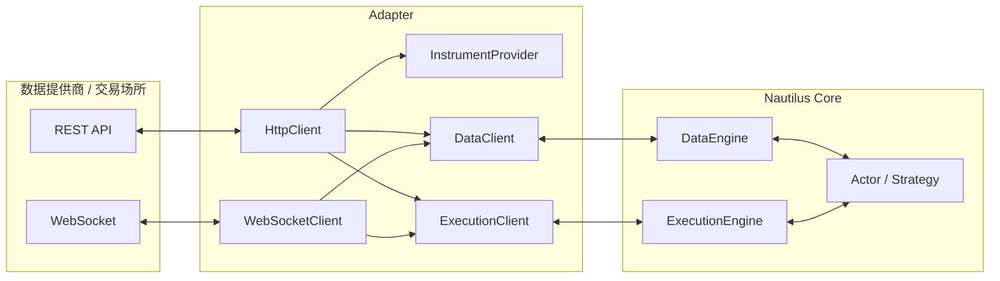
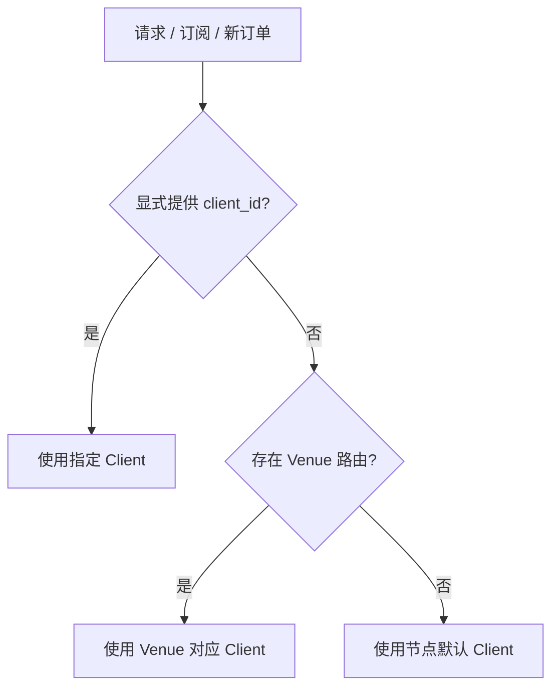

# NautilusTrader Adapters 核心概念（中文版）

本文基于同目录的英文文档和
[官网最新版 Adapters](https://nautilustrader.io/docs/latest/concepts/adapters/) 整理翻译。
它不是逐句直译，而是一份面向使用者的中文概念说明：在保留官方语义和 API 名称的同时，
重点解释适配器边界、工具加载、客户端路由、数据标准化和异步执行结果。

## Adapter 是什么

Adapter 将外部数据提供商和交易场所连接到 NautilusTrader。
它把场所专用的协议、符号和消息转换为 Data Engine 与 Execution Engine 使用的领域对象和事件。

官方 Python Adapter 从 `nautilus_trader.adapters` 导入。
每个集成实际支持的数据类型、订单类型、账户模式和场所功能，应以对应的
[Integration Guide](../integrations/index.md) 为准。

Adapter 是系统核心与外部协议之间的翻译边界：



策略不应直接调用 Adapter 内部的 HTTP 或 WebSocket 传输。
Actor 和 Strategy 使用统一的 Nautilus API，底层 Client、Engine 和路由负责连接具体场所。

## 典型组件

一个 Adapter 通常由以下组件组成：

<!-- markdownlint-disable MD060 -->

| 组件                   | 主要职责                                 |
| -------------------- | ------------------------------------ |
| `HttpClient`         | 与场所 REST API 通信。                     |
| `WebSocketClient`    | 建立和维护实时流连接。                          |
| `InstrumentProvider` | 加载场所工具定义，并解析为 Nautilus `Instrument`。 |
| `DataClient`         | 处理市场数据请求和实时订阅。                       |
| `ExecutionClient`    | 处理订单提交、修改、取消和执行报告。                   |

<!-- markdownlint-enable MD060 -->

这些组件各自承担不同边界：

- 传输 Client 处理网络协议、认证、序列化和连接生命周期。
- Instrument Provider 负责场所符号到 Nautilus 工具模型的转换。
- Data Client 把场所行情标准化为 Nautilus 数据类型。
- Execution Client 把领域命令转换为场所请求，并把场所结果转换为执行事件。
- Data Engine 和 Execution Engine 负责统一路由、状态处理和系统级不变量。

## 配置与路由

每个 Adapter 都会为其支持的客户端公开配置类型和 Factory。

配置通常选择：

- 产品类型。
- 测试或实盘环境。
- API 凭证。
- Instrument 加载策略。
- Adapter 专用的连接和行为选项。

构建 `LiveNode` 时，Factory 根据配置创建客户端。
节点可以同时注册多个 Data Client 和 Execution Client。

### 显式与默认路由

Actor 或 Strategy 在请求、订阅或发送订单时，可以通过 `client_id` 指定处理该操作的客户端。

未显式指定客户端时：

- Data Engine 根据 Venue 和节点配置的默认路由选择 Data Client。
- Execution Engine 根据 Venue 和节点配置的默认路由选择 Execution Client。



新订单由显式 Client、Venue 路由或默认路由决定第一跳。
已有订单的后续修改或取消命令，在已知来源时会返回创建该订单的原始 Execution Client。

### 自定义 Adapter 支持范围

:::note
公开 Python API 目前还没有完整接口，不能只用 Python 在仓库外实现一个完整 Adapter。
仓库外 Python Adapter 接口处于规划中；当前自定义场所集成使用 Rust Adapter trait。
:::

Python 所有权和公开 API 边界参见 [Python](python.md#support-boundaries)。
自定义 Adapter 的实现规范参见 [Adapter Developer Guide](../developer_guide/adapters.md)。

## Instrument Provider

Instrument Provider 从场所加载工具定义，并解析为 Nautilus `Instrument` 领域对象。
解析行为由各 Adapter 自己负责。

Adapter 的 Python API 可能提供：

- 独立工具加载函数。
- 专用 Instrument Provider 配置。
- Data Client 或 Execution Client 配置中的加载选项。
- 以上能力的组合。

Instrument Provider 有两个主要使用场景：

1. 为研究和回测独立发现可用工具。
1. 在 Sandbox 或 Live 环境启动期间，为 Actor 和 Strategy 加载运行时工具。

### 研究与回测

下面通过公开 Python API 加载一个 Binance USD-M 工具：

```python
import asyncio

from nautilus_trader.adapters.binance import BinanceDataClientConfig
from nautilus_trader.adapters.binance import BinanceEnvironment
from nautilus_trader.adapters.binance import BinanceInstrumentProviderConfig
from nautilus_trader.adapters.binance import BinanceProductType
from nautilus_trader.adapters.binance import load_binance_instruments


async def main() -> None:
    config = BinanceDataClientConfig(
        product_type=BinanceProductType.USD_M,
        environment=BinanceEnvironment.LIVE,
        instrument_provider=BinanceInstrumentProviderConfig(
            load_all=False,
            load_ids=["BTCUSDT-PERP.BINANCE"],
        ),
    )
    instruments = await load_binance_instruments(config)

    for instrument in instruments:
        print(instrument.id)


if __name__ == "__main__":
    asyncio.run(main())
```

这个模式适合在节点外发现工具、检查解析结果，或为研究和回测准备工具元数据。

### 实盘启动加载

每个 Integration 的启动加载方式不同。以 Binance 为例，可以加载完整工具目录：

```python
from nautilus_trader.adapters.binance import BinanceInstrumentProviderConfig


provider_config = BinanceInstrumentProviderConfig(load_all=True)
```

也可以只加载明确指定的工具：

```python
provider_config = BinanceInstrumentProviderConfig(
    load_all=False,
    load_ids=[
        "BTCUSDT-PERP.BINANCE",
        "ETHUSDT-PERP.BINANCE",
    ],
)
```

`load_ids` 使用包含 Venue 后缀的 Nautilus Instrument ID，而不是场所原始 Symbol：

```text
BTCUSDT-PERP.BINANCE  # Nautilus Instrument ID
BTCUSDT               # 场所原始 Symbol，不能直接替代上面的 ID
```

不同 Integration 的加载字段、默认值和过滤规则并不统一。
从一个 Adapter 复制配置到另一个 Adapter 前，必须检查对应 Integration Guide。

### 工具必须先进入缓存

:::warning
数据订阅、订单提交和执行对账不会自动加载 Instrument。
:::

使用工具前必须满足以下任一条件：

- 配置 Adapter 在启动时加载该工具。
- 显式请求该工具，并等待它到达缓存。

实盘策略不应在工具尚未进入缓存时订阅数据、构造订单或处理需要工具精度的执行报告。
对账遇到未加载工具时的行为参见
[Instrument availability](reconciliation.md#instrument-availability)。

## Data Client

Data Client 处理一个场所的市场数据请求和实时订阅。
它连接场所 API，并把输入标准化为 Nautilus 数据类型。

```text
场所原始消息 -> Adapter 解析和校验 -> Nautilus 数据对象 -> Data Engine -> Actor / Strategy
```

### 请求数据

Actor 和 Strategy 使用内置 `request_*` 方法请求工具定义或历史数据。
结果通过相应回调返回。

```python
from collections.abc import Sequence
from typing import Any

from nautilus_trader.model import Bar
from nautilus_trader.model import BarType
from nautilus_trader.model import InstrumentId
from nautilus_trader.trading import Strategy


class MyStrategy(Strategy):
    def on_start(self) -> None:
        # 请求工具定义
        self.request_instrument(
            InstrumentId.from_str("BTCUSDT-PERP.BINANCE"),
        )

        # 请求历史 K 线
        self.request_bars(
            BarType.from_str(
                "BTCUSDT-PERP.BINANCE-1-HOUR-LAST-EXTERNAL",
            ),
        )

    def on_instrument(self, instrument: Any) -> None:
        self.log.info(f"Received instrument: {instrument.id}")

    def on_historical_bars(self, bars: Sequence[Bar]) -> None:
        self.log.info(f"Received {len(bars)} historical bars")
```

请求响应和订阅更新使用不同回调。历史 K 线进入 `on_historical_bars()`，
不会进入实时 K 线处理器 `on_bar()`。

### 订阅实时数据

实时数据使用 `subscribe_*` 方法订阅：

```python
from nautilus_trader.model import Bar
from nautilus_trader.model import BarType
from nautilus_trader.model import InstrumentId
from nautilus_trader.model import TradeTick
from nautilus_trader.trading import Strategy


class MyStrategy(Strategy):
    def on_start(self) -> None:
        # 这里假设工具已经加载到缓存
        self.subscribe_trades(
            InstrumentId.from_str("BTCUSDT-PERP.BINANCE"),
        )
        self.subscribe_bars(
            BarType.from_str(
                "BTCUSDT-PERP.BINANCE-1-MINUTE-LAST-EXTERNAL",
            ),
        )

    def on_trade(self, trade: TradeTick) -> None:
        self.log.info(f"Trade: {trade}")

    def on_bar(self, bar: Bar) -> None:
        self.log.info(f"Bar: {bar}")
```

订阅的数据持续进入单条实时回调，例如 `on_trade()` 和 `on_bar()`。
完整请求、订阅与回调映射参见
[Actors：常用操作与处理器](actors.zh-CN.md#常用操作与处理器)。

### 请求与订阅的边界

<!-- markdownlint-disable MD060 -->

| 维度     | 请求                                        | 订阅                                       |
| ------ | ----------------------------------------- | ---------------------------------------- |
| 典型 API | `request_instrument()`、`request_bars()`。  | `subscribe_trades()`、`subscribe_bars()`。 |
| 数据形态   | 一次响应，历史数据通常为批量。                           | 持续实时更新。                                  |
| 典型回调   | `on_instrument()`、`on_historical_bars()`。 | `on_trade()`、`on_bar()`。                 |
| 主要用途   | 工具加载、历史初始化和研究。                            | 持续事件驱动处理。                                |

<!-- markdownlint-enable MD060 -->

具体 Adapter 不一定支持所有数据类型或历史请求。
通用 API 存在不代表每个场所都提供对应能力，必须检查 Integration Guide 的能力说明。

## Execution Client

Execution Client 负责一个场所的订单管理。
它把 Nautilus 订单命令转换成场所专用 API 调用，并把执行报告转换回 Nautilus 事件。

主要职责包括：

- 提交、修改和取消订单。
- 处理成交和执行报告。
- 与场所对账订单状态。
- 处理账户和持仓更新。

```text
Strategy -> ExecutionEngine -> ExecutionClient -> Venue
Strategy <- ExecutionEngine <- ExecutionClient <- Venue report
```

### 异步命令结果

:::warning
订单命令和场所结果是异步的。`OrderSubmitted` 只表示 Adapter 已开始订单提交路径，
不表示场所已经接受订单。
:::

传输故障可能让结果处于未知状态。例如请求已经到达场所，但确认消息在返回途中丢失。
此时不能直接假设订单被拒绝，否则重试可能产生重复订单。

Adapter 和 Execution Engine 通过以下证据确定结果：

- 实时执行流更新。
- 主动查询场所状态。
- 启动或运行时执行对账。

订单命令结果的完整语义参见 [Execution](execution.md#command-outcomes)。

### 执行客户端路由

新订单的 Execution Client 按以下优先级确定：

1. 命令显式选择的 Client。
1. Instrument Venue 对应的路由。
1. 节点配置的默认 Execution Client。

已有订单的来源 Client 已知时，后续修改和取消命令会返回该原始 Client，
从而避免同一订单被错误路由到另一个场所连接或账户。

### 有界历史对账安全

Execution Client 可以声明：

- 历史对账报告适用的最早时间下界。
- 所需订单来源是否完整。
- 所需成交来源是否完整。
- 所需持仓来源是否完整。

当 Adapter 提供这组契约时，Execution Engine 可以恢复权威订单状态，
同时避免在证据不足时把历史成交经济结果应用到持仓或 Portfolio。

这意味着系统可以知道“订单状态已经足够确定”，同时承认“历史证据不足以安全重算经济结果”。
具体不变量参见[有界历史安全](reconciliation.md#bounded-history-safety)。

## Adapter 能力与差异

统一的 Nautilus API 提供一致的调用方式，但不同 Adapter 的实际能力仍由场所决定。

选用或配置 Adapter 时，应核对：

- 支持的产品和账户类型。
- 可加载的 Instrument 类型及 Symbol 映射。
- 支持的实时和历史数据类型。
- 支持的订单类型、有效期和触发方式。
- 批量下单、修改和取消能力。
- 原生 GTD、只减仓和 Post-Only 语义。
- 执行报告、账户、持仓和成交历史范围。
- WebSocket 状态报告和定向重连支持。
- Sandbox、Testnet 和 Live 环境差异。
- API 速率限制和场所专用约束。

不要因为两个 Adapter 暴露相似配置类，就假设它们的默认值和行为一致。
公共领域模型统一了系统内部语义，但不能消除场所本身的功能差异。

## 使用建议

- 策略只调用 Nautilus 公共 API，不直接依赖 Adapter 内部网络 Client。
- 在节点配置中明确 Instrument 加载策略，不依赖订阅、下单或对账隐式加载工具。
- `load_ids` 使用完整 Nautilus Instrument ID，而不是原始场所 Symbol。
- 需要指定账户或连接时显式传入 `client_id`，否则确认 Venue 和默认路由正确。
- 把请求响应和实时订阅发送到各自回调，不混用历史与实时数据路径。
- 对 Adapter 不支持的数据、订单或账户功能快速失败，不在策略中静默降级。
- 不把 `OrderSubmitted` 当作场所接受，不把传输失败直接当作订单拒绝。
- 使用执行流、查询和对账处理未知订单结果，避免盲目重试。
- 部署前阅读对应 Integration Guide，并在 Testnet 或小资金环境验证场所专用行为。
- 自定义集成遵循 Rust Adapter trait 和开发者指南，不扩散场所协议细节到领域核心。

## 相关资料

- [官方英文 Adapters](https://nautilustrader.io/docs/latest/concepts/adapters/)。
- [仓库英文 Adapters](adapters.md)。
- [Integration Guides](../integrations/index.md)：各 Adapter 的功能、配置和限制。
- [Architecture 中文说明](architecture.zh-CN.md)：端口与适配器边界及依赖方向。
- [Actors 核心概念](actors.zh-CN.md)：数据请求、订阅和回调。
- [Strategies 核心概念](strategies.zh-CN.md)：订单管理和策略事件。
- [Live Trading 核心概念](live.zh-CN.md)：实盘节点、对账和 Socket 状态。
- [Execution](execution.md)：订单命令、状态与结果。
- [Data](data/)：Adapter 提供的市场数据类型。
- [Execution reconciliation](reconciliation.md)：执行状态恢复和一致性检查。
- [Adapter Developer Guide](../developer_guide/adapters.md)：自定义 Adapter 实现要求。
