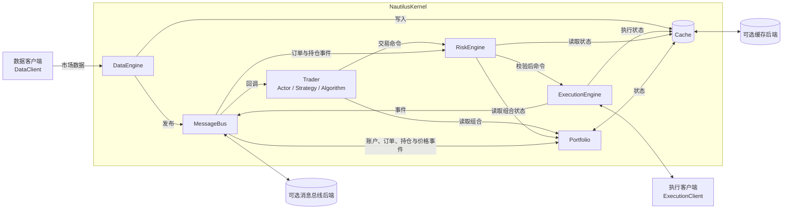
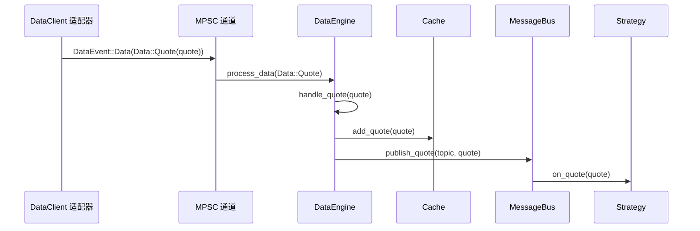
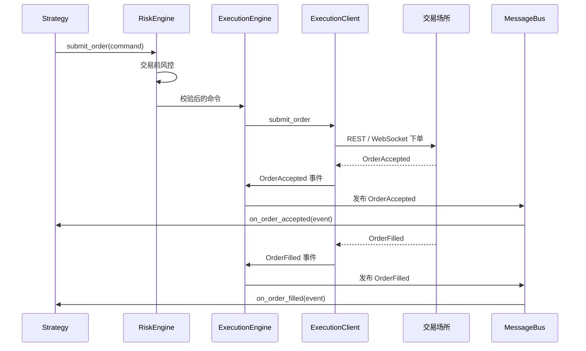
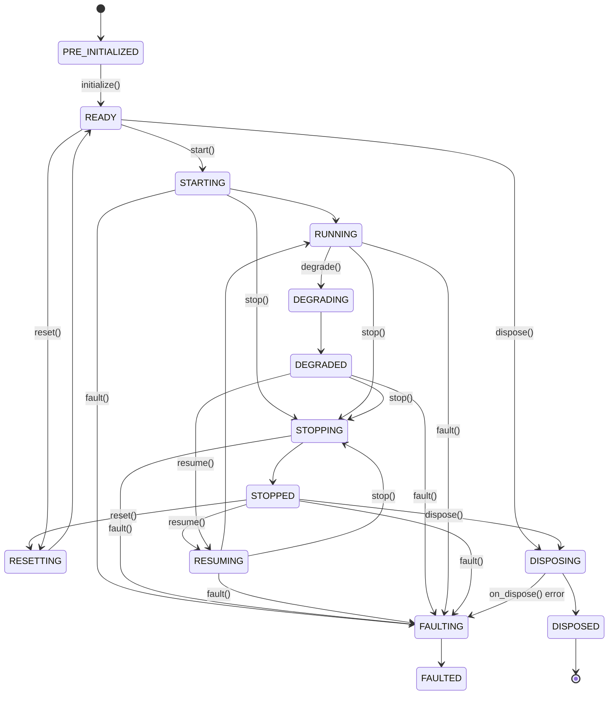
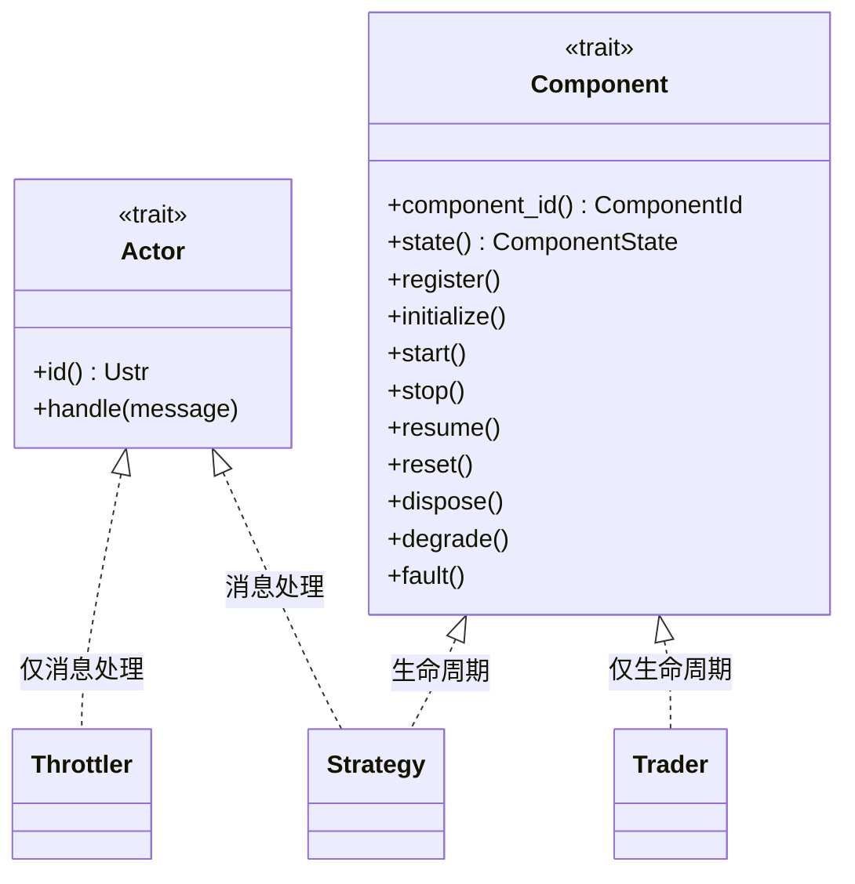
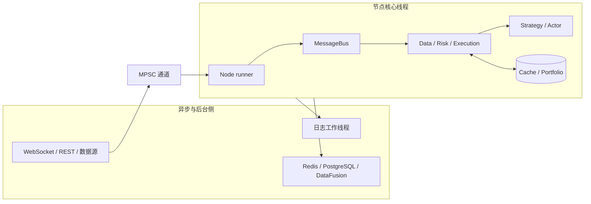
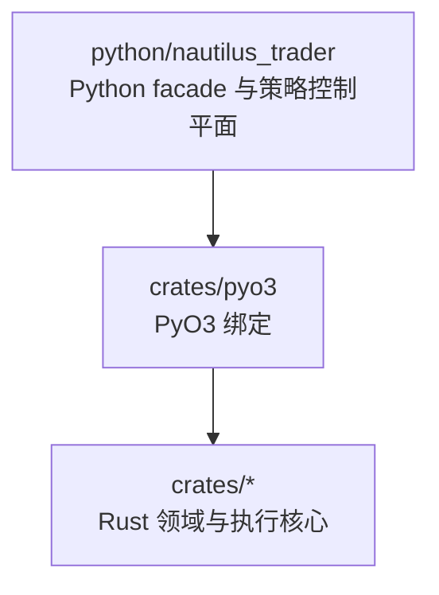
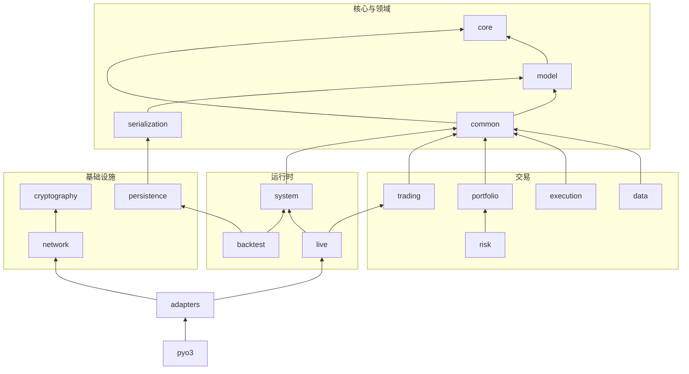

# NautilusTrader 架构说明（中文版）

本文基于同目录的英文架构文档、
[官网最新版 Architecture](https://nautilustrader.io/docs/latest/concepts/architecture/)
以及当前仓库源码整理。它不是逐句直译，而是一份面向工程阅读的中文说明：在保留官方设计语义的同时，
补充关键源码入口、运行时边界和部署约束。

本文中的 *Nautilus 系统边界* 指一个 Nautilus 节点实例的运行时。除非特别说明，
下文的“节点”均指单个 `BacktestNode`、`Sandbox` 或 `LiveNode` 实例。

## 架构结论

NautilusTrader 可以概括为：**以 Rust 为数据与交易执行核心、以 Python 为策略控制平面，
通过单线程事件驱动内核统一回测、沙盒和实盘语义，并用异步任务隔离网络与持久化 I/O**。

这套架构最重要的工程取舍是：

- **可靠性优先于可用性**：价格、数量、时间戳和订单状态一旦违反不变量，系统返回错误或快速失败，
  不允许错误数据继续传播。
- **确定性优先于内核并行度**：消息分发、策略回调、风控、执行协调和缓存访问集中在一个核心线程，
  从而减少锁竞争并保持事件顺序。
- **同一核心支撑多种环境**：回测、沙盒和实盘共享 `NautilusKernel`、领域模型和交易引擎，
  尽量缩小研究代码与生产代码之间的语义差距。
- **I/O 并发、状态串行**：WebSocket、REST、日志和数据库写入可在 Tokio 任务或后台线程运行，
  但它们通过通道把事件交回节点核心线程处理。
- **端口与适配器隔离外部系统**：交易所、经纪商、数据源、缓存数据库和消息总线后端通过显式接口接入，
  不把外部协议细节扩散到领域核心。
- **进程是主要隔离边界**：同一进程不支持并发运行多个节点；需要并行或故障隔离时，
  应采用“一节点一进程”。

## 设计理念

NautilusTrader 综合使用以下架构方法：

- [领域驱动设计（DDD）](https://en.wikipedia.org/wiki/Domain-driven_design)：以订单、持仓、账户、
  工具、价格和数量等领域对象承载业务规则。
- [事件驱动架构](https://en.wikipedia.org/wiki/Event-driven_programming)：市场数据、订单事件、
  持仓事件和账户状态以事件形式流经系统。
- [消息模式](https://en.wikipedia.org/wiki/Messaging_pattern)：同时支持发布/订阅、请求/响应和点对点消息。
- [端口与适配器](https://en.wikipedia.org/wiki/Hexagonal_architecture_(software))：
  核心通过数据客户端、执行客户端和存储接口连接外部世界。
- [Crash-only 设计](https://en.wikipedia.org/wiki/Crash-only_software)：不可恢复错误终止进程，
  由外部监督器负责重启，再走正常启动和恢复路径。

### 质量属性优先级

架构决策大致按以下顺序权衡：

1. 可靠性。
1. 性能。
1. 模块化。
1. 可测试性。
1. 可维护性。
1. 可部署性。

这个顺序解释了许多看似保守的选择。例如，系统宁可在无效价格或算术溢出处失败，
也不继续执行；宁可让核心线程串行处理状态变化，也不为了表面并发度引入共享状态竞态。

### 高保证工程

关键路径逐步采用高保证工程实践：

- 先用自然语言明确核心领域类型、风控和执行流程的不变量。
- 再将不变量固化为单元测试、属性测试、模糊测试和静态断言，并在 CI 中持续执行。
- 使用 Rust 所有权和类型系统限制错误状态，通过显式 `Result` 暴露可恢复失败。
- 仓库发布配置采用 panic 时中止进程；只有在保证收益值得成本时才引入形式化工具。
- 新适配器必须保持已有关键路径不变量，并为新增或改变的不变量提供可执行覆盖。

这种做法将更高的验证成本集中在可能影响真实资金的路径上，而不是平均施加到所有代码。

### 数据完整性与快速失败

交易系统中，一个错误价格、时间戳或数量可能进一步造成错误仓位、错误风控判断、错误下单，
甚至产生看似可信但实际无效的回测结果。因此，NautilusTrader 对下列情况采用快速失败：

- 时间戳、价格或数量运算超出合法范围时发生上溢或下溢。
- 反序列化得到 `NaN`、无穷大或越界值。
- 将负数转换为只接受正值的时间戳或数量。
- 价格、精度或时间戳输入格式错误。

失败形式取决于 API 契约：

- **Panic** 用于程序错误、错误 API 用法、基础不变量被破坏，或本会静默产生错误结果的算术。
- **`Result` 或 `Option`** 用于调用方能够合理处理的网络、文件 I/O、业务校验和用户输入问题。

```rust
let total_ns = timestamp1 + timestamp2; // 溢出时 panic。

let price = Price::new_checked(f64::NAN, precision); // 返回 Err。

let total_ns = timestamp1.checked_add(timestamp2.as_u64()); // 溢出时返回 None。
```

仓库的 release profile 设置了 `panic = "abort"`。因此，不可恢复不变量触发 panic 时，
仓库构建的进程会立即终止，交由进程监督器或编排平台处理。直接依赖 NautilusTrader crate 的
下游 Rust 二进制仍由自身的 release profile 决定 panic 行为。

### Crash-only 与恢复边界

Crash-only 并不意味着正常关闭也直接终止。正常运行仍使用 `stop` 和 `dispose`，
以停止客户端、保存配置的状态并刷新写入器。它主要约束不可恢复故障：

- **正常启动即恢复入口**：缓存和事件存储恢复沿普通启动流程执行，不维护一条独立且容易漂移的恢复路径。
- **外部状态可选持久化**：缓存后端和事件存储可跨重启保留选定状态；实际耐久性由后端及其配置决定。
- **外部监督器负责重启**：panic 中止会跳过故障进程内的优雅清理，重启策略不属于节点自身职责。
- **执行命令不可盲目重试**：交易所是否已接受命令可能不明确，恢复必须依赖执行状态协调与对账。
- **损坏状态不继续传播**：数据损坏或关键不变量失败时，终止当前操作或进程。

## 系统架构



`NautilusKernel` 拥有共享交易核心。适配器不直接修改策略状态，而是通过数据和执行引擎边界交换消息。

### 核心组件

<!-- markdownlint-disable MD060 -->

| 组件                | 主要职责                                   | 关键源码入口                                                |
| ----------------- | -------------------------------------- | ----------------------------------------------------- |
| `NautilusKernel`  | 构造并持有共享组件、选择环境时钟、配置消息设施、协调生命周期和恢复。     | `crates/system/src/kernel.rs::NautilusKernel`         |
| `MessageBus`      | 发布/订阅、请求/响应、点对点命令与事件路由，以及可选外部消息出口。     | `crates/common/src/msgbus/core.rs::MessageBus`        |
| `Cache`           | 保存工具、账户、订单、持仓和市场数据等内存状态，并提供索引查询。       | `crates/common/src/cache/mod.rs::Cache`               |
| `DataEngine`      | 管理订阅和数据请求，处理报价、成交、K 线、订单簿及自定义数据。       | `crates/data/src/engine/mod.rs::DataEngine`           |
| `RiskEngine`      | 执行订单字段、余额、数量、名义价值、只减仓、交易状态和速率校验。       | `crates/risk/src/engine/mod.rs::RiskEngine`           |
| `ExecutionEngine` | 路由交易命令、维护订单与持仓状态、处理回报和成交，并执行状态协调。      | `crates/execution/src/engine/mod.rs::ExecutionEngine` |
| `Portfolio`       | 从账户、订单、持仓和价格事件派生余额、净仓位、保证金、PnL 和风险敞口。  | `crates/portfolio/src/portfolio.rs::Portfolio`        |
| `Trader`          | 注册 Actor、Strategy 和执行算法，管理其时钟、订阅和生命周期。 | `crates/system/src/trader.rs::Trader`                 |

<!-- markdownlint-enable MD060 -->

#### `NautilusKernel`

内核是一个组合根和生命周期边界。源码中的 `NautilusKernel` 直接持有共享 `Cache`、时钟、
`Portfolio`、三个主要引擎、订单模拟器和 `Trader`。这些核心对象主要使用 `Rc<RefCell<_>>` 共享，
因此内核不是跨线程同步边界，也不应被当作可在线程间任意移动的并发容器。

启动时，内核初始化日志、可选持久化、消息处理器和关闭路由；正常关闭时，先停止 Trader，
再保存状态、停止引擎、取消定时器并结束事件存储运行。回放事件存储时则采用专门的恢复语义，
避免启动实盘客户端和交易流程。

#### `MessageBus`

消息总线把组件从直接引用关系中解耦，支持：

- **发布/订阅**：按层次化主题向一个或多个订阅者广播数据和事件，并支持通配模式。
- **请求/响应**：通过关联 ID 匹配请求与返回结果。
- **点对点端点**：将类型化命令或事件发送到已注册处理器。
- **可选外部后端**：序列化并发送选定发布内容；实盘节点也可接收配置的外部流。

外部消息后端提供的是传输能力，不等同于持久化恢复。崩溃后的权威状态应来自缓存数据库、
事件存储和执行对账，而不是假定所有外部消息都能被重放。

#### `Cache`

`Cache` 是节点的高频状态读模型。策略、风控、执行和组合组件通过索引读取工具、行情、订单、
账户和持仓。配置数据库后，它可以持久化选定状态，但内存状态与异步数据库写入并不是分布式事务。

#### `DataEngine`

`DataEngine` 位于外部数据客户端与内部消费者之间。它负责：

- 管理实时订阅、取消订阅和历史数据请求。
- 将各种数据类型分派到对应处理路径。
- 更新缓存或订单簿状态。
- 按主题向 `MessageBus` 发布数据。
- 维护 K 线聚合、合成数据和自定义数据等派生流程。

#### `RiskEngine`

`RiskEngine` 是策略命令到执行引擎之间的交易前控制层。订单只有通过配置的订单合法性、
余额、数量、名义价值、只减仓、交易状态和频率限制后才会继续下行。校验失败时生成
`OrderDenied`，命令不会到达交易场所。

配置允许绕过部分风控路径，但这是一项显式运行配置，不改变默认架构边界。

#### `ExecutionEngine`

`ExecutionEngine` 根据显式客户端 ID、账户发行方、场所路由映射或默认客户端选择
`ExecutionClient`。它在发送前维护订单归属和本地状态，并接收场所返回的接受、拒绝、取消、
到期和成交事件。执行事件随后更新缓存、驱动持仓与组合变化，并发布给策略。

#### `Portfolio`

`Portfolio` 不是独立账本，而是基于缓存和事件计算出的组合视图。它订阅账户、持仓、报价、
K 线和标记价格等消息，维护余额、保证金、已实现/未实现 PnL、敞口和组合快照。

#### `Trader`

`Trader` 是用户交易组件的协调者。它持有已注册的 Actor、Strategy、执行算法及各自的时钟和
状态回调，负责初始化、启动、停止、重置、恢复与释放这些组件。

### 环境上下文

<!-- markdownlint-disable MD060 -->

| 环境         | 数据来源  | 执行方式               | 主要用途         |
| ---------- | ----- | ------------------ | ------------ |
| `Backtest` | 历史数据。 | 模拟执行。              | 研究、回放与确定性测试。 |
| `Sandbox`  | 实时数据。 | 模拟执行。              | 接近实盘输入条件的演练。 |
| `Live`     | 实时数据。 | 实盘场所连接，包括模拟盘或真实账户。 | 生产交易。        |

<!-- markdownlint-enable MD060 -->

三种环境共享 `nautilus-system` crate 中的 `NautilusKernel`，以及同一套缓存、组合、数据、风控、
执行、Trader 和消息基础设施。环境差异主要由时钟、数据源、执行客户端与节点运行器注入。

共享核心有助于维持回测与实盘一致性，但不代表二者结果完全相同。实盘网络延迟、消息到达顺序、
交易所行为和外部状态本身仍具有非确定性。

## 关键数据流

### 一条报价的生命周期



1. 场所专用 `DataClient` 从 WebSocket 等连接收到原始数据，解析为 `QuoteTick`。
1. 实盘适配器通过异步无界 MPSC 通道发送 `DataEvent::Data(Data::Quote(quote))`；
   回测引擎则直接馈送数据。
1. 节点运行器在核心线程取出事件，经消息端点调用 `DataEngine::process_data`。
1. `DataEngine` 分派到 `handle_quote`，先尝试执行 `Cache::add_quote`。
1. 引擎按工具 ID 构造主题，例如 `data.quotes.BINANCE.BTCUSDT-PERP`，再通过
   `MessageBus` 发布。
1. 已订阅策略的 `on_quote` 在同一核心线程同步运行；缓存写入成功时，策略读取到的是同一报价。

:::note
报价、成交和 K 线遵循“先尝试写缓存，再发布”的路径。同步持久化或入队错误会阻止内存插入，
但引擎会记录错误并继续发布该值。内置数据库后端的实际写入是异步的，后续数据库失败不会回滚
已经完成的内存插入。订单簿增量和深度快照直接发布，由 `BookUpdater` 订阅维护订单簿状态。
:::

### 一张订单的生命周期



1. 策略创建领域订单并调用 `submit_order`，形成 `SubmitOrder` 命令。
1. `RiskEngine` 执行交易前校验；失败则产生 `OrderDenied`，流程在节点内部终止。
1. `ExecutionEngine` 按客户端、账户或场所路由选择 `ExecutionClient`。
1. 执行适配器通过 REST 或 WebSocket 将命令发送到交易场所。
1. 场所返回接受、成交、取消、拒绝或到期事件；`ExecutionEngine` 更新缓存中的订单状态，
   再通过消息总线把事件送达风控、组合和策略。
1. 成交事件进一步驱动持仓和组合状态变化。

:::warning
网络超时不代表下单失败。对未知执行结果进行自动重试可能产生重复订单，必须通过客户端订单 ID、
场所查询和执行对账确认权威状态。
:::

## 组件生命周期

实现 `Component` trait 的类型使用有限状态机。`ComponentState` 表示状态，
`ComponentTrigger` 约束允许的转换。



稳定状态：

- `PRE_INITIALIZED`：对象已创建，但尚未准备好履行职责。
- `READY`：配置完成，可以启动。
- `RUNNING`：正常运行。
- `STOPPED`：已成功停止。
- `DEGRADED`：仍在运行，但可能无法满足完整能力约定。
- `FAULTED`：检测到故障后已关闭。
- `DISPOSED`：已关闭并释放资源。

过渡状态：

- `STARTING`、`STOPPING`、`RESUMING`、`RESETTING`、`DISPOSING`、`DEGRADING` 和
  `FAULTING` 分别包围对应生命周期回调。
- 回调应保持短暂；发生错误时，转换通常停留在当前过渡状态。
- `dispose()` 是例外：`on_dispose` 失败会转入 `FAULTED`，使组件仍可被退役。

数据、风控和执行引擎有自己的生命周期方法，但不实现 `Component` trait；`Trader`、Strategy、
执行算法等用户组件使用统一的 `Component` 生命周期。

## Actor、Component 与消息分发

Rust 实现将“接收定向消息”和“生命周期管理”拆成两个独立 trait：



- `Actor` 提供 `handle`，通过 Actor ID 注册和查找定向消息接收者。
- `Component` 管理注册、启动、停止、恢复、重置、降级、故障和释放。
- `Throttler` 等类型可以只实现 `Actor`。
- `Trader` 可以只实现 `Component`。
- Strategy 和执行算法等数据 Actor 可以同时拥有消息处理与生命周期能力。

消息总线访问不依赖 `Actor`。节点线程上的代码可以直接使用线程局部 `MessageBus` API；
`Actor` 只负责通过注册表按 Actor ID 定向分发。

:::danger
Actor 和 Component 注册表内部包含共享 `Rc<UnsafeCell<dyn ...>>` 句柄。生命周期包装函数有私有借用
保护，但原始注册表句柄不具备同等保护；两个同时存在的同一 Actor 可变引用会导致未定义行为。
`ActorRef` 必须在一个同步作用域内获取、使用并释放，不能保存，也不能跨越 `.await`。
:::

## 并发、线程与进程模型

### 单线程交易核心

一个节点内，下列操作在驱动节点的单一核心线程上消费和分发：

- `MessageBus` 路由和 Actor 回调。
- 策略逻辑与订单管理。
- 风控检查与执行协调。
- 缓存读写与组合状态更新。

这种设计与 [LMAX 架构](https://martinfowler.com/articles/lmax.html) 的单线程事务处理思想相近。
它减少了共享状态锁，提供清晰的事件先后关系，并帮助保持回测与实盘代码路径一致。

### 后台并发



后台工作使用独立线程或进程级多线程 Tokio runtime：

- WebSocket、REST、适配器和数据源作为异步任务运行。
- 日志事件交给核心线程之外的工作线程。
- Redis 和 PostgreSQL 缓存后端把写入排队到异步任务。
- DataFusion 在 Tokio runtime 上运行目录查询 future。

异步生产者通过通道发送数据和执行事件，节点运行器取出后，再使用当前线程的 `MessageBus`
调用引擎端点。每个线程拥有自己的消息总线实例，线程或任务之间依靠通道跨越边界。

### 一进程一节点

:::warning[同一进程只并发运行一个节点]
不支持在同一进程中并发运行多个 `LiveNode` 或 `BacktestNode`，原因包括：

- 日志模式和时间戳使用全局状态，回测会在静态时间与实时时间之间切换日志时钟。
- 消息总线、Actor/Component 注册表和通道发送器安装在线程局部状态中。
- Tokio runtime 和日志工作线程属于进程级共享状态。

多个节点可以顺序运行，但前一个节点必须先完成 `dispose`。生产环境若需要运行多个策略，
可把它们加入同一个 `LiveNode`；若需要并行计算、资源隔离或独立故障域，应让每个节点运行在
独立进程中。
:::

## 存储、消息与恢复职责

<!-- markdownlint-disable MD060 -->

| 机制                       | 主要职责                      | 不应假定的能力             |
| ------------------------ | ------------------------- | ------------------- |
| 内存 `Cache`               | 当前节点的低延迟状态与索引查询。          | 进程退出后仍然存在。          |
| Cache database           | 持久化配置选择的缓存状态，支持启动恢复。      | 所有内存更新与异步写入构成原子事务。  |
| Event store              | 记录和回放配置的事件流与运行边界。         | 替代交易场所的权威执行状态。      |
| Message bus backing      | 把选定发布内容发送到外部，或为实盘节点接入外部流。 | 自动提供完整、持久、可重放的恢复日志。 |
| Execution reconciliation | 对比本地与场所订单、成交和持仓状态。        | 对未知结果安全地盲目重发命令。     |

<!-- markdownlint-enable MD060 -->

恢复顺序的核心原则是：先从配置的持久化后端恢复可恢复状态，再连接外部客户端并完成执行对账，
最后允许策略继续交易。具体顺序由节点类型和配置决定，不应由策略自行拼接一套旁路恢复流程。

## 工程代码组织

Rust workspace 位于 `crates/`，公开 Python 包位于 `python/nautilus_trader/`。
PyO3 将 Rust 绑定汇总为 `nautilus_trader._libnautilus` 扩展模块，Python 目录提供公开 facade
和辅助工具。

### 分层与 crate 职责

<!-- markdownlint-disable MD060 -->

| 分层    | 主要 crate                                                                | 职责                        |
| ----- | ----------------------------------------------------------------------- | ------------------------- |
| 核心与领域 | `core`、`model`、`common`、`serialization`                                 | 时间、字符串、领域类型、消息、缓存、时钟和序列化。 |
| 交易与分析 | `analysis`、`indicators`、`data`、`execution`、`portfolio`、`risk`、`trading` | 分析、指标、策略、数据与交易引擎、风控和组合状态。 |
| 基础设施  | `network`、`cryptography`、`infrastructure`、`persistence`、`event_store`   | 网络、签名、数据库、对象存储、目录和事件存储。   |
| 运行时   | `system`、`live`、`backtest`                                              | 共享内核与环境专用节点。              |
| 集成    | `adapters/*`                                                            | 交易场所、经纪商、数据源、区块链和沙盒客户端。   |
| 接口与工具 | `pyo3`、`plugin`、`cli`、`testkit`                                         | Python 绑定、插件、CLI 和测试支持。   |

<!-- markdownlint-enable MD060 -->

### 语言边界



`nautilus-core` 和 `nautilus-model` 仍为原生调用方保留可选 C FFI；其他 workspace crate
主要通过 Rust API 或 PyO3 暴露能力。PyO3 会校验绑定参数，并把 Rust 错误转换为 Python 异常。
不兼容的 Python 实参通常会在进入 Rust 方法体前被拒绝。

### 主要依赖方向

下图只展示用于理解整体结构的主要直接依赖，箭头指向被依赖方：



### 主要 feature flag

<!-- markdownlint-disable MD060 -->

| Feature     | 主要 crate                          | 作用                              |
| ----------- | --------------------------------- | ------------------------------- |
| `streaming` | `data`、`system`、`live`、`backtest` | 增加目录流式持久化支持。                    |
| `cloud`     | `persistence`                     | 增加 AWS、Azure、GCP 和 HTTP 对象存储后端。 |
| `python`    | 面向 Python 的 crate                 | 增加 PyO3 绑定及所需传递 feature。        |
| `defi`      | 领域、数据、运行时与绑定 crate                | 增加 DeFi 和区块链类型及运行路径。            |

<!-- markdownlint-enable MD060 -->

源码构建需要 Rust 工具链；预编译 Python wheel 在运行时不要求安装 Rust。

## 性能与内存分配

事件驱动核心会高频分配和释放小对象，消息分发、订单事件和订单簿维护都会持续使用堆。
在订单流密集负载中，系统默认分配器可能成为显著热点。

`nautilus` CLI 和 Python wheel 为 Rust 分配使用
[mimalloc](https://github.com/microsoft/mimalloc)。官方基准中，回测引擎根据负载不同约提升
3% 至 44%，订单流越密集收益通常越大；代价是 mimalloc 段缓存带来少量常驻内存增加。

Rust 二进制只能链接一个全局分配器，因此 NautilusTrader 库 crate 本身保持分配器中立。
直接依赖这些 crate 构建应用时，应由最终二进制显式选择全局分配器。

## 架构约束与使用建议

### 适合的扩展方式

- 新交易所或数据源应实现数据/执行客户端接口，并把协议解析限制在 `adapters/*`。
- 新策略和执行算法应通过 `Trader` 注册，使用消息订阅和领域命令与核心交互。
- 自定义状态持久化应接入缓存数据库或事件存储边界，而不是让策略直接维护另一套权威订单状态。
- 需要水平扩展时，以进程为单位部署节点，并明确外部数据、命令和状态的一致性协议。

### 需要特别警惕的边界

- 单线程核心不等于整个进程单线程；后台 I/O 仍然并发，事件到达顺序可能变化。
- `Rc<RefCell<_>>` 适合节点线程内部共享，不适合跨线程传递。
- `MessageBus` 解耦组件，但同步回调仍占用核心线程；耗时策略逻辑会阻塞后续市场数据和执行事件。
- 数据库写入可能异步完成；内存更新成功不代表持久化已经落盘。
- `panic = "abort"` 依赖外部监督器提供重启能力，并依赖正确配置的状态后端缩短恢复时间。
- 回测与实盘共享核心只能保证代码路径尽量一致，不能消除市场微结构、延迟和场所行为差异。
- 涉及 `ActorRef` 或注册表原始句柄时必须遵守同步、短生命周期和不重入约束。

## 源码阅读路线

建议按下面顺序阅读，以较小成本建立完整心智模型：

1. `crates/system/src/kernel.rs::NautilusKernel`：先看组合根、构造和生命周期。
1. `crates/common/src/msgbus/`：理解主题、端点、请求/响应和线程局部总线。
1. `crates/data/src/engine/mod.rs::DataEngine`：跟踪一条报价如何进入缓存并发布。
1. `crates/trading/src/strategy/`：查看策略如何订阅数据并产生交易命令。
1. `crates/risk/src/engine/mod.rs::RiskEngine`：理解交易前校验和拒单路径。
1. `crates/execution/src/engine/mod.rs::ExecutionEngine`：理解客户端路由、订单状态与执行事件。
1. `crates/portfolio/src/portfolio.rs::Portfolio`：理解组合如何从事件派生。
1. `crates/live/src/runner.rs` 与 `crates/backtest/`：对比实时通道驱动和历史数据驱动。
1. `crates/adapters/`：最后阅读具体场所如何实现端口。

## 相关资料

- [官方英文 Architecture](https://nautilustrader.io/docs/latest/concepts/architecture/)。
- [仓库英文 Architecture](architecture.md)。
- [Overview](overview.md)：高层产品与系统介绍。
- [Python](python.md)：Python 所有权、运行时和公开 API 边界。
- [Rust](rust.md)：原生 Rust API 与运行方式。
- [Message Bus](message_bus.md)：消息总线的主题、端点与请求/响应模型。
- [Cache](cache.md)：缓存状态、索引与持久化。
- [Execution](execution.md)：执行事件模型。
