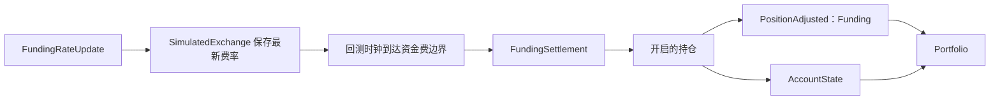

# 回测账户与保证金（中文版）

本文基于同目录的英文文档
[Backtest Accounts and Margin](accounts-and-margin.md) 整理翻译。

回测场所使用模拟账户处理余额、保证金和资金费结算。
完整账户模型和保证金公式参见 [Accounting](../accounting.md)。

## 资金费

回测会根据 `FundingRateUpdate` 数据，在资金费边界进行永续合约资金费结算。

当更新包含 `next_funding_ns` 时，模拟交易所会保存最新费率，
回测时钟则在该时间戳发出一条 `FundingSettlement`。

如果没有 `next_funding_ns`，只有当 `ts_event` 落在 `interval` 边界上时，
交易所才会结算。没有边界的更新仍会作为 Strategy 数据，但不会产生资金费支付。



在 `Portfolio` 观察到新状态前，结算会先调整开启的持仓及匹配的账户余额。

`PositionAdjusted` 仍然是持仓会计事件。
正资金费率会扣减多头持仓、增加空头持仓的资金；
相应调整会改变已实现盈亏，而匹配的账户余额更新会记录这笔现金变动。

## 账户

每个回测场所使用以下三种 `account_type` 之一：`CASH`、`MARGIN` 或 `BETTING`。

低层 API 直接接受模型类型：

```python
from nautilus_trader.backtest import BacktestEngine
from nautilus_trader.config import BacktestEngineConfig
from nautilus_trader.model import AccountType
from nautilus_trader.model import Money
from nautilus_trader.model import OmsType
from nautilus_trader.model import Venue

engine = BacktestEngine(BacktestEngineConfig())
engine.add_venue(
    venue=Venue("BINANCE"),
    oms_type=OmsType.NETTING,
    account_type=AccountType.CASH,
    starting_balances=[Money.from_str("10_000 USDT")],
)
```

高层 API 接受相同的枚举值，但使用字符串表示初始余额：

```python
from nautilus_trader.config import BacktestVenueConfig
from nautilus_trader.model import AccountType
from nautilus_trader.model import BookType
from nautilus_trader.model import OmsType

venue = BacktestVenueConfig(
    name="SIM",
    oms_type=OmsType.NETTING,
    account_type=AccountType.CASH,
    book_type=BookType.L1_MBP,
    starting_balances=["10_000 USDT"],
)
```

## 保证金模型

保证金账户默认使用 `LeveragedMarginModel`。

如果模拟应按 Instrument 固定的初始保证金和维持保证金百分比预留资金，
且不应再按账户杠杆降低比例，则传入 `StandardMarginModel`：

```python
from nautilus_trader.config import BacktestVenueConfig
from nautilus_trader.model import AccountType
from nautilus_trader.model import BookType
from nautilus_trader.model import OmsType
from nautilus_trader.model import StandardMarginModel

venue = BacktestVenueConfig(
    name="SIM",
    oms_type=OmsType.NETTING,
    account_type=AccountType.MARGIN,
    book_type=BookType.L1_MBP,
    starting_balances=["1_000_000 USD"],
    margin_model=StandardMarginModel(),
)
```

`BacktestVenueConfig` 可以直接接受内置的 `StandardMarginModel`
和 `LeveragedMarginModel` 对象。

当前高层配置不能通过类路径字符串加载自定义保证金模型。
