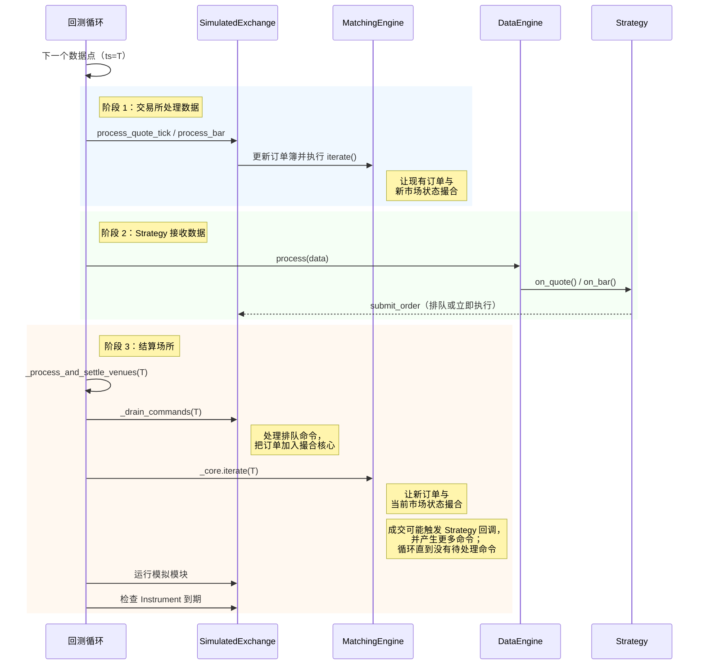

# 回测执行流程（中文版）

本文基于同目录的英文文档
[Backtest Execution Flow](execution-flow.md) 整理翻译。

回测循环会先处理市场状态，再调用 Strategy 回调，
随后结算相同时间戳产生的命令。

## 数据与消息顺序

在主回测循环中，新市场数据会先用于订单执行处理，
然后再由 DataEngine 分发给 Actor 和 Strategy。

### 主循环流程

对于每一个数据点，引擎都会执行三个阶段：

- **交易所处理数据。** 模拟交易所根据收到的市场数据更新订单簿，
  然后迭代撮合引擎，使现有订单与新的市场状态撮合。
- **Strategy 接收数据。** DataEngine 通过 `on_quote`、`on_bar` 等回调，
  把数据点分发给 Actor 和 Strategy。Strategy 可以在回调中提交、取消或修改订单。
- **结算场所。** 引擎排空所有待处理的场所命令，再迭代撮合引擎以撮合新提交的订单。
  该循环会持续到没有待处理命令，因此 `on_order_filled` 中提交的对冲单等级联订单，
  也能在同一时间戳内完成结算。

这三个阶段确保静置订单先看到新到达的市场数据，
随后才轮到刚提交的订单参与撮合。

时间事件使用同一套结算机制，但会按时间戳成批处理：
时间戳 T 的所有回调先执行，然后结算 T 时刻的场所，最后才推进到 T+1。

内部聚合 K 线所使用的定时器行为，参见
[内部 Bar 聚合时序](bar-execution.zh-CN.md#内部-bar-聚合时序)。

### 命令结算

如果订单成交触发 Strategy 回调并提交其他订单，
例如在 `on_order_filled` 中提交止损单，这些级联命令会在相同的时间戳和事件周期内结算。

引擎会反复排空场所命令队列及期间新产生的命令，
直到当前时间戳不再有待处理命令。
模拟模块只会在所有命令结算完成后，每个周期运行一次。

配置 `LatencyModel` 后，命令会进入场所的传输中队列，
其未来时间戳根据模拟延迟计算。

结算循环会把当前时间戳已经到期的传输中命令视为待处理命令，
因此零延迟或同 Tick 延迟配置仍能正确结算。
未来时间戳的命令会被延后，直到引擎推进到相应时间才处理。

### 关闭语义

`BacktestEngine::end()` 与
[回测 API 与重复运行：出错时关闭](apis-and-runs.zh-CN.md#出错时关闭)
介绍的 `shutdown_on_error` 配置彼此独立。

它会调用每个 Strategy 的 `on_stop` 处理器，
排空并结算处理器产生的命令，例如 `close_all_positions` 和 `cancel_all_orders`，
然后停止各引擎。

- `on_stop` 命令使用正常的场所队列和延迟，优先级不会高于更早进入传输中的命令。
- 如果停止前订单先于 `on_stop` 取消命令到达场所，它仍可能成交。
  如果该成交改变了净风险敞口，之后的 reduce-only 平仓单可能被拒绝。
- 需要确定性清仓的 Strategy 应在停止前进入“只退出”状态，
  并在取消和平仓命令仍在传输中时避免提交新的开仓单。
- Strategy 已处于 `Stopped` 状态，因此不会为产生的事件调用 Strategy 事件处理器。
  `OrderFilled` 等事件仍会记录日志，但会跳过 `on_order_filled` 等回调。
  需要响应成交的逻辑必须在 `on_stop` 返回前运行。
- 关闭时不会重新运行模拟模块。
  `SimulationModule::process` 每个时间戳只运行一次；重复调用会重复应用外汇展期利息等副作用。
- `LatencyModel` 会把配置的延迟应用到尾部命令，
  包括最后一个数据 Tick 或 `on_stop` 中产生的命令。
  关闭路径会把引擎时钟推进到最晚的传输中到达时间戳，
  使这些命令在引擎停止前仍能完成结算。

## 仅使用定时器的回测

回测引擎支持只有定时器、没有市场数据的运行。
这适用于定时操作或测试基于定时器的逻辑。
各定时器会按时间顺序触发。

## 确定性 Trade ID

回测和 Sandbox 执行共用的模拟交易所，会为每一笔生成的成交发出确定性的 `TradeId`。

ID 格式为 `T-{hash:016x}-{count:03d}`。
其中，16 位十六进制值是 `(venue, raw_id, ts_init)` 的 FNV-1a Hash，
末尾计数器用于区分相同 `ts_init` 下的多笔成交，例如 Bar 驱动成交的多个腿。

确定性 Trade ID 具有以下性质：

- **跨运行确定。** 相同回放数据每次都会产生相同的 `TradeId`，
  从而保持下游去重和 Golden Output 比较稳定。
- **跨重置防碰撞。** 回测数据中的 `ts_init` 固定，实盘和 Sandbox 中则单调递增。
  因此，`BacktestEngine.reset()`，或者带持久化订单的 Sandbox 中重置内存
  `IdsGenerator`，都不会生成与 Cache 中现有 ID 冲突的 `TradeId`。
- **长度受限。** 无论场所名称多长，Hash 都能使标识符保持在
  `TradeId` 的 36 字符上限以内。

场所的 `use_random_ids` 标志仍控制 `VenueOrderId` 和 `PositionId` 的生成，
但 `TradeId` 始终是确定性的，不受该标志影响。
