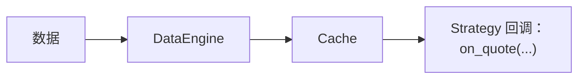

# NautilusTrader Cache 核心概念（中文版）

本文基于同目录的英文文档 [Cache](cache.md) 整理翻译。
它不是机械逐句直译，而是一份面向使用者的中文概念说明：在保留官方 API、
配置字段和状态语义的同时，重点解释缓存写入时机、查询方式、持久化边界和安全清理策略。

## Cache 是什么

`Cache` 是保存交易状态和近期市场数据的中央内存存储。
Actor 和 Strategy 使用它读取由数据引擎和执行引擎维护的数据，
也可以通过应用自定义 Key 共享原始字节。

Cache 的主要职责包括：

- 保存当前订单簿，以及有容量上限的报价、成交、K 线和其他市场数据历史。
- 追踪订单、持仓、账户、Instrument 和货币，直到相应对象被清理或重置。
- 在组件之间共享由调用方序列化的数据；配置后端数据库后，也可以持久化这些数据。

## 缓存工作机制

事件流经系统时，各引擎会把内置数据加入 `Cache`。
实盘适配器以异步方式向引擎发送事件，因此缓存会在引擎处理事件时发生变化，
而不是在适配器刚收到事件时变化。

对于报价、成交和 K 线，`DataEngine` 会先尝试写入 `Cache`，再发布给订阅者。
写入成功后，Strategy 处理器开始运行时就能读取最新值。

订单簿增量和深度快照会直接发布。
当前订单簿状态则由 `BookUpdater` 订阅单独维护。



完整的数据流步骤参见
[架构：一条报价的生命周期](architecture.zh-CN.md#一条报价的生命周期)。

### 基础示例

在 Strategy 中，通过 `self.cache` 访问共享 Cache：

```python
def on_bar(self, bar: Bar) -> None:
    # 从缓存读取近期 K 线
    last_bar = self.cache.bar(self.bar_type, index=0)  # 写入成功后，这就是当前 K 线
    previous_bar = self.cache.bar(self.bar_type, index=1)
    third_last_bar = self.cache.bar(self.bar_type, index=2)

    # 读取当前持仓状态
    if self.last_position_opened_id is not None:
        position = self.cache.position(self.last_position_opened_id)
        if position is not None and position.is_open:
            open_quantity = position.quantity

    # 读取该 Instrument 的未结订单
    open_orders = self.cache.orders_open(instrument_id=self.instrument_id)
```

## 配置

使用 `CacheConfig` 配置 `Cache` 的行为和容量。
根据[环境上下文](architecture.zh-CN.md#环境上下文)，
将其传给 `BacktestEngine` 或 `LiveNode`。

两种环境使用相同的容量设置：

```python
from nautilus_trader.config import BacktestEngineConfig
from nautilus_trader.config import CacheConfig
from nautilus_trader.config import LiveNodeConfig

# 回测环境
engine_config = BacktestEngineConfig(
    cache=CacheConfig(
        tick_capacity=10_000,  # 每个 Instrument 保留最近 10,000 个 Tick
        bar_capacity=5_000,  # 每种 BarType 保留最近 5,000 根 K 线
    ),
)

# 实盘环境
node_config = LiveNodeConfig(
    cache=CacheConfig(
        tick_capacity=10_000,
        bar_capacity=5_000,
    ),
)
```

:::tip
默认情况下，`Cache` 为每个 Instrument 的每种 Tick 序列最多保留 10,000 个值，
并为每种 BarType 最多保留 10,000 根 K 线。

这些限制彼此独立，不是合并后的总量。
当 Strategy 需要更长的内存回看窗口且可以接受额外内存占用时，可以提高这些值。
:::

### 配置选项

`CacheConfig` 支持以下参数：

```rust
use nautilus_common::{cache::CacheConfig, enums::SerializationEncoding};

let config = CacheConfig {
    encoding: SerializationEncoding::MsgPack,
    timestamps_as_iso8601: false,
    buffer_interval_ms: None,
    bulk_read_batch_size: None,
    use_trader_prefix: true,
    use_instance_id: false,
    flush_on_start: false,
    drop_instruments_on_reset: true,
    tick_capacity: 10_000,
    bar_capacity: 10_000,
    persist_account_events: true,
    save_market_data: false,
};
```

:::note
每种 BarType 都有独立的容量限制。
例如，同时使用 1 分钟和 5 分钟 K 线时，两种 BarType 都可以各自保存最多
`bar_capacity` 根 K 线。

达到 `bar_capacity` 后，`Cache` 会自动删除最旧的数据。
:::

### 数据库配置

配置数据库后端后，进程重启时可以恢复已经成功持久化且受支持的缓存记录。
可恢复记录包括通用数据、货币、Instrument、账户、订单和持仓。

启动过程不会恢复有容量上限的市场数据历史，也不会恢复此前正在运行的进程本身。

`CacheConfig` 控制缓存行为。
连接设置属于具体的后端配置，例如 `RedisCacheConfig` 或 `PostgresCacheConfig`。

后端数据库是一种恢复机制，不是完整事件归档，也不是保持同步的分布式缓存。
每个节点都拥有自己的内存 Cache；让多个节点指向同一个数据库命名空间，
并不会自动保持这些节点的内存缓存一致。

Rust 原生调用方应构建具体的数据库配置，并通过 `CacheDatabaseFactory` trait
创建传给系统 Builder 的适配器：

```rust
use nautilus_common::{
    cache::{CacheConfig, database::CacheDatabaseFactory},
    enums::SerializationEncoding,
};
use nautilus_infrastructure::redis::cache::RedisCacheConfig;

let config = CacheConfig {
    encoding: SerializationEncoding::MsgPack,
    timestamps_as_iso8601: true,
    buffer_interval_ms: Some(100),
    ..Default::default()
};

let database = RedisCacheConfig {
    host: Some("localhost".to_string()),
    port: Some(6379),
    connection_timeout: 2,
    response_timeout: 2,
    ..Default::default()
};

let cache_database = database
    .create(trader_id, instance_id, config.clone())
    .await?;
```

对于 Rust 原生实盘节点，应在启动前挂载适配器：

```rust
let node_config = LiveNodeConfig {
    trader_id,
    ..Default::default()
};
let mut node = LiveNode::build("LiveNode".to_string(), Some(node_config))?;
node.set_cache_database(cache_database)?;
node.run().await?;
```

默认配置 `LiveExecEngineConfig.load_cache = true`。
节点会在连接客户端或对账执行状态前，恢复已经持久化的缓存状态并重建派生索引。

如果设置 `CacheConfig.flush_on_start = true`，节点会改为清空后端数据。

Python 将相同的数据库配置传给 `LiveNodeBuilder.with_cache_database_factory`。
节点会在启动时构建并拥有该适配器，因此只有运行节点时才会建立连接：

```python
from nautilus_trader.common import Environment
from nautilus_trader.infrastructure import RedisCacheConfig
from nautilus_trader.live import LiveNode
from nautilus_trader.model import TraderId

node = (
    LiveNode.builder("LiveNode", TraderId("TRADER-001"), Environment.LIVE)
    .with_cache_database_factory(RedisCacheConfig(host="localhost", port=6379))
    .build()
)

try:
    node.run()
finally:
    node.dispose()
```

如果需要使用 Postgres 存储缓存数据，应改为传入 `PostgresCacheConfig`。
Postgres 不支持 Actor 或 Strategy 状态持久化，因此不能与 `load_state` 或 `save_state` 组合使用。

这两种配置都来自 `nautilus_trader.infrastructure`。

:::warning
必须始终释放节点。
当配置了 `CacheConfig.buffer_interval_ms` 时，`dispose()` 会关闭后端并刷新仍在缓冲区中的写入。
`run()` 返回后直接退出可能丢失这些写入。
:::

## 使用 Cache

### 访问市场数据

`Cache` 提供订单簿、报价、成交、K 线和其他市场数据的访问接口。
有容量上限的市场数据序列使用反向索引，因此索引 0 表示最新条目。

#### 访问 K 线

```python
# 获取一种 BarType 的所有缓存 K 线
bars = self.cache.bars(bar_type)  # 返回 list[Bar] 或 None

# 获取最新 K 线
latest_bar = self.cache.bar(bar_type)  # 返回 Bar 或 None

# 按索引获取历史 K 线，0 表示最新
second_last_bar = self.cache.bar(bar_type, index=1)  # 返回 Bar 或 None

# 检查 K 线是否存在并获取数量
bar_count = self.cache.bar_count(bar_type)
has_bars = self.cache.has_bars(bar_type)
```

#### 报价 Tick

```python
# 获取报价
quotes = self.cache.quotes(instrument_id)  # 返回 list[QuoteTick] 或 None
latest_quote = self.cache.quote(instrument_id)  # 返回 QuoteTick 或 None
second_last_quote = self.cache.quote(instrument_id, index=1)  # 返回 QuoteTick 或 None

# 检查报价可用性
quote_count = self.cache.quote_count(instrument_id)
has_quotes = self.cache.has_quote_ticks(instrument_id)
```

#### 成交 Tick

```python
# 获取成交
trades = self.cache.trades(instrument_id)  # 返回 list[TradeTick] 或 None
latest_trade = self.cache.trade(instrument_id)  # 返回 TradeTick 或 None
second_last_trade = self.cache.trade(instrument_id, index=1)  # 返回 TradeTick 或 None

# 检查成交可用性
trade_count = self.cache.trade_count(instrument_id)
has_trades = self.cache.has_trade_ticks(instrument_id)
```

#### 订单簿

```python
# 获取当前订单簿
book = self.cache.order_book(instrument_id)  # 返回 OrderBook 或 None

# 检查订单簿是否存在
has_book = self.cache.has_order_book(instrument_id)

# 获取已应用的订单簿更新数量
update_count = self.cache.book_update_count(instrument_id)
```

#### 访问价格

```python
from nautilus_trader.model import PriceType

# 按类型获取当前价格，返回 Price 或 None
price = self.cache.price(
    instrument_id=instrument_id,
    price_type=PriceType.MID,  # 可选 BID、ASK、MID、LAST
)
```

#### BarType

```python
from nautilus_trader.model import AggregationSource, PriceType

# 获取一个 Instrument 的所有可用 BarType，返回 list[BarType]
bar_types = self.cache.bar_types(
    instrument_id=instrument_id,
    price_type=PriceType.LAST,  # 可选 BID、ASK、MID、LAST
    aggregation_source=AggregationSource.EXTERNAL,
)
```

#### 简单示例

```python
from nautilus_trader.model import Bar, BarType
from nautilus_trader.trading import Strategy


class MarketDataStrategy(Strategy):
    def on_start(self) -> None:
        # 订阅 1 分钟 K 线
        self.bar_type = BarType.from_str(f"{self.instrument_id}-1-MINUTE-LAST-EXTERNAL")
        self.subscribe_bars(self.bar_type)

    def on_bar(self, bar: Bar) -> None:
        bars = (self.cache.bars(self.bar_type) or [])[:3]
        if len(bars) < 3:
            return

        # 读取最近三根 K 线用于分析
        current_bar = bars[0]
        prev_bar = bars[1]
        prev_prev_bar = bars[2]

        # 读取最新报价和成交
        latest_quote = self.cache.quote(self.instrument_id)
        latest_trade = self.cache.trade(self.instrument_id)

        if latest_quote is not None:
            current_spread = latest_quote.ask_price - latest_quote.bid_price
            self.log.info(f"Current spread: {current_spread}")
```

### 交易对象

`Cache` 提供以下交易对象的访问接口：

- 订单。
- 持仓。
- 账户。
- Instrument。

#### 订单

可以按 Venue、Strategy、Instrument、账户或订单方向查询订单。

##### 基础订单访问

```python
# 根据客户端订单 ID 获取指定订单
order = self.cache.order(ClientOrderId("O-123"))

# 获取系统中的所有订单
orders = self.cache.orders()

# 按条件筛选订单
orders_for_venue = self.cache.orders(venue=venue)  # 指定 Venue 的所有订单
orders_for_strategy = self.cache.orders(strategy_id=strategy_id)  # 指定 Strategy 的所有订单
orders_for_instrument = self.cache.orders(instrument_id=instrument_id)  # 指定 Instrument 的所有订单
```

##### 订单状态查询

```python
# 按当前状态获取订单
open_orders = self.cache.orders_open()  # 当前在交易场所活动的订单
closed_orders = self.cache.orders_closed()  # 已完成生命周期的订单
emulated_orders = self.cache.orders_emulated()  # 系统在本地模拟的订单
inflight_orders = self.cache.orders_inflight()  # 已向交易场所提交或修改，但尚未确认的订单
local_active_orders = (
    self.cache.orders_active_local()
)  # 仍由本地管理的订单，包括 initialized、emulated 或 released

# 检查具体订单状态
exists = self.cache.order_exists(client_order_id)  # 检查缓存中是否存在指定 ID 的订单
is_open = self.cache.is_order_open(client_order_id)  # 检查订单当前是否开启
is_closed = self.cache.is_order_closed(client_order_id)  # 检查订单是否关闭
is_emulated = self.cache.is_order_emulated(client_order_id)  # 检查订单是否在本地模拟
is_inflight = self.cache.is_order_inflight(client_order_id)  # 检查订单是否已提交或修改但尚未确认
is_active_local = self.cache.is_order_active_local(client_order_id)  # 检查订单是否仍由本地管理
```

##### 订单统计

```python
# 获取不同状态的订单数量
open_count = self.cache.orders_open_count()  # 未结订单数
closed_count = self.cache.orders_closed_count()  # 已关闭订单数
emulated_count = self.cache.orders_emulated_count()  # 模拟订单数
inflight_count = self.cache.orders_inflight_count()  # 传输中订单数
local_active_count = (
    self.cache.orders_active_local_count()
)  # 本地活动订单数，包括 initialized、emulated 或 released
total_count = self.cache.orders_total_count()  # 系统订单总数

# 获取筛选后的订单数量
buy_orders_count = self.cache.orders_open_count(side=OrderSide.BUY)  # 当前未结买单数
venue_orders_count = self.cache.orders_total_count(venue=venue)  # 指定 Venue 的订单总数
```

#### 持仓

`Cache` 会保留持仓，直到持仓被清理或缓存被重置，
并提供多种持仓查询方式。

##### 持仓访问

```python
# 根据 ID 获取指定持仓
position = self.cache.position(PositionId("P-123"))

# 按状态获取持仓
all_positions = self.cache.positions()  # 系统中的所有持仓
open_positions = self.cache.positions_open()  # 当前所有开启持仓
closed_positions = self.cache.positions_closed()  # 所有已关闭持仓

# 按不同条件筛选持仓
venue_positions = self.cache.positions(venue=venue)  # 指定 Venue 的持仓
instrument_positions = self.cache.positions(instrument_id=instrument_id)  # 指定 Instrument 的持仓
strategy_positions = self.cache.positions(strategy_id=strategy_id)  # 指定 Strategy 的持仓
long_positions = self.cache.positions(side=PositionSide.LONG)  # 所有多头持仓
```

##### 持仓状态查询

```python
# 检查持仓状态
exists = self.cache.position_exists(position_id)  # 检查指定 ID 的持仓是否存在
is_open = self.cache.is_position_open(position_id)  # 检查持仓是否开启
is_closed = self.cache.is_position_closed(position_id)  # 检查持仓是否关闭

# 获取持仓与订单之间的关系
orders = self.cache.orders_for_position(position_id)  # 与指定持仓相关的所有订单
position = self.cache.position_for_order(client_order_id)  # 查找指定订单关联的持仓
```

##### 持仓统计

```python
# 获取不同状态的持仓数量
open_count = self.cache.positions_open_count()  # 当前开启的持仓数
closed_count = self.cache.positions_closed_count()  # 已关闭持仓数
total_count = self.cache.positions_total_count()  # 系统持仓总数

# 获取筛选后的持仓数量
long_positions_count = self.cache.positions_open_count(side=PositionSide.LONG)  # 开启的多头持仓数
instrument_positions_count = self.cache.positions_total_count(
    instrument_id=instrument_id
)  # 指定 Instrument 的持仓总数
```

#### 账户

```python
# 访问账户信息
account = self.cache.account(account_id)  # 根据 ID 获取账户
account = self.cache.account_for_venue(venue)  # 获取指定 Venue 的账户
account_id = self.cache.account_id(venue)  # 获取指定 Venue 的账户 ID
```

#### Instrument

```python
# 获取 Instrument 信息
instrument = self.cache.instrument(instrument_id)  # 根据 ID 获取指定 Instrument
all_instruments = self.cache.instruments()  # 获取缓存中的所有 Instrument

# 获取指定 Venue 的 Instrument
venue_instruments = self.cache.instruments(venue=venue)

# 获取 Instrument ID
instrument_ids = self.cache.instrument_ids()  # 获取所有 Instrument ID
venue_instrument_ids = self.cache.instrument_ids(venue=venue)  # 获取指定 Venue 的 Instrument ID
```

### 清理缓存数据

长时间运行的会话会不断积累已关闭订单、已关闭持仓、账户事件和不再使用的 Instrument。
Cache 提供定向清理和批量清理方法，使 Strategy 和实盘执行引擎无需重启系统，
也能控制内存用量。

#### 定向清理

以下方法用于删除单个实体。
如果实体仍处于活动状态，每个方法都会拒绝清理：

- `cache.purge_order(client_order_id)`：删除订单及以该订单为 Key 的所有索引条目。
  未结订单不会被删除。
- `cache.purge_position(position_id)`：删除持仓、持仓快照及以该持仓为 Key 的索引条目。
  开启的持仓不会被删除。
- `cache.purge_instrument(instrument_id)`：删除 Instrument 及每个以该 Instrument 为范围的映射，
  包括订单簿、报价、成交、标记价格、指数价格、资金费率、Instrument 状态、Greeks，
  以及引用该 Instrument 的 K 线。

只要 Instrument 仍有关联的非终态订单或非关闭持仓，`purge_instrument` 就会跳过清理。
非终态订单是尚未进入关闭状态的任何订单，
包括 initialized、submitted、accepted、emulated、released 和 inflight 订单。

:::warning
`purge_instrument` 适用于由 Actor 或 Strategy 自己管理 Instrument 生命周期的场景。
只有所有者才能判断何时不再需要该 Instrument。

如果其他组件仍依赖该 Instrument，清理会导致查询不到 Instrument，并丢失市场数据历史。
活动订阅由 DataEngine 管理；如果不再需要更新，应先取消订阅，再清理 Instrument。
:::

#### 批量清理

以下方法按时间清理较早的条目。
它们接收当前时间戳，以及以秒为单位的缓冲窗口或回看窗口：

- `cache.purge_closed_orders(ts_now, buffer_secs)`：删除关闭时间早于
  `buffer_secs` 缓冲窗口的已关闭订单。
- `cache.purge_closed_positions(ts_now, buffer_secs)`：删除关闭时间早于
  `buffer_secs` 缓冲窗口的已关闭持仓。
- `cache.purge_account_events(ts_now, lookback_secs)`：删除早于
  `lookback_secs` 回看窗口的账户状态事件；传入 `0` 会删除全部事件。

#### 实盘交易中的自动清理

`LiveExecEngineConfig` 通过定时器调度批量清理。
所有清理间隔默认都是 `None`，即禁用相应循环。

设置间隔可以启用清理循环；设置缓冲窗口或回看窗口，
可以控制需要继续保护多久以内的近期条目。

以下示例使用实盘交易配置指南建议的初始值：

```python
from nautilus_trader.config import LiveExecEngineConfig

exec_engine = LiveExecEngineConfig(
    purge_closed_orders_interval_mins=15,
    purge_closed_orders_buffer_mins=60,
    purge_closed_positions_interval_mins=15,
    purge_closed_positions_buffer_mins=60,
    purge_account_events_interval_mins=15,
    purge_account_events_lookback_mins=60,
)
```

间隔越短，清理运行得越频繁；缓冲或回看窗口越短，删除的数据越新。
应根据内存限制，以及对账或分析需要保留的近期执行上下文，分别选择每个值。

完整参数参见
[配置实盘交易节点：内存管理](../how_to/configure_live_trading.zh-CN.md#内存管理)。

:::note
Instrument 清理没有自动循环，因为删除 Instrument 的正确时机取决于 Strategy 状态，
而不是数据存在时间。

应由拥有该 Instrument 生命周期的 Actor 或 Strategy 调用 `cache.purge_instrument`。
:::

### 自定义数据

`Cache` 可以使用应用自定义的字符串 Key 保存原始字节。
加入缓存前应先序列化值，读取后再反序列化。
Actor 和 Strategy 可以通过这些条目共享少量应用数据。

#### 基础存储与读取

```python
# 存储已经序列化的数据
self.cache.add(key="my_key", value=b"some binary data")

# 读取已经序列化的数据
stored_data = self.cache.get("my_key")  # 返回 bytes 或 None
```

:::warning
`Cache` 不是通用数据库。
大型数据集或复杂查询应使用专用存储系统。
:::

## 最佳实践与常见问题

### Cache 与 Portfolio 的用途

`Cache` 和 `Portfolio` 的职责不同。

**Cache：**

- 保留执行对象、部分对象历史和有容量上限的近期市场数据，直到清理或重置。
- 立即应用本地状态变化，例如在提交订单前初始化订单。
- 在引擎处理外部事件时应用相应状态变化，例如订单成交。

**Portfolio：**

- 聚合持仓、风险敞口和账户信息。
- 根据缓存状态和市场价格计算当前 Portfolio 价值。

```python
from nautilus_trader.model import PositionChanged
from nautilus_trader.trading import Strategy


class MyStrategy(Strategy):
    def on_position_changed(self, event: PositionChanged) -> None:
        # 读取缓存持仓保留的成交记录
        position = self.cache.position(event.position_id)
        fills = position.events() if position is not None else []

        # 从 Portfolio 读取当前聚合风险敞口
        current_exposure = self.portfolio.net_exposure(event.instrument_id)
```

### Cache 与 Strategy 变量

共享的序列化数据应使用 Cache 条目，Strategy 本地工作状态应使用 Strategy 变量。

**Cache 存储：**

- 可供共享系统 Cache 的 Actor 和 Strategy 使用。
- 配置后端数据库且写入成功完成后，可以持久化通用字节条目。
- 单个 Strategy 重置后仍然可用；Cache 或执行引擎重置会清除内存条目。

**Strategy 变量：**

- 封装类型化、Strategy 专用的计算结果和中间值。
- 不向其他组件公开，也不会自动持久化。

Actor 和 Strategy 跨进程重启的状态持久化使用独立的 `on_save` 和 `on_load` Hook，
并要求使用支持该功能的后端。

参见实盘交易指南中的
[缓存数据库配置](../how_to/configure_live_trading.zh-CN.md#缓存数据库配置)。

将共享数据加入 Cache 前，先进行序列化：

```python
import json

from nautilus_trader.trading import Strategy


class MyStrategy(Strategy):
    def on_start(self) -> None:
        shared_data = {
            "last_reset": self.clock.timestamp_ns(),
            "trading_enabled": True,
        }
        self.cache.add("shared_strategy_info", json.dumps(shared_data).encode())
```

另一个 Strategy 可以按以下方式读取缓存数据：

```python
import json

from nautilus_trader.trading import Strategy


class AnotherStrategy(Strategy):
    def on_start(self) -> None:
        data_bytes = self.cache.get("shared_strategy_info")
        if data_bytes is not None:
            shared_data = json.loads(data_bytes)
            self.log.info(f"Shared data retrieved: {shared_data}")
```

## 相关指南

- [Data](data/)：Cache 中存储的数据类型。
- [Strategies（中文版）](strategies.zh-CN.md)：Strategy 如何访问 Cache 中的市场数据和状态。
- [Reports](reports.md)：如何根据缓存数据生成报告。
