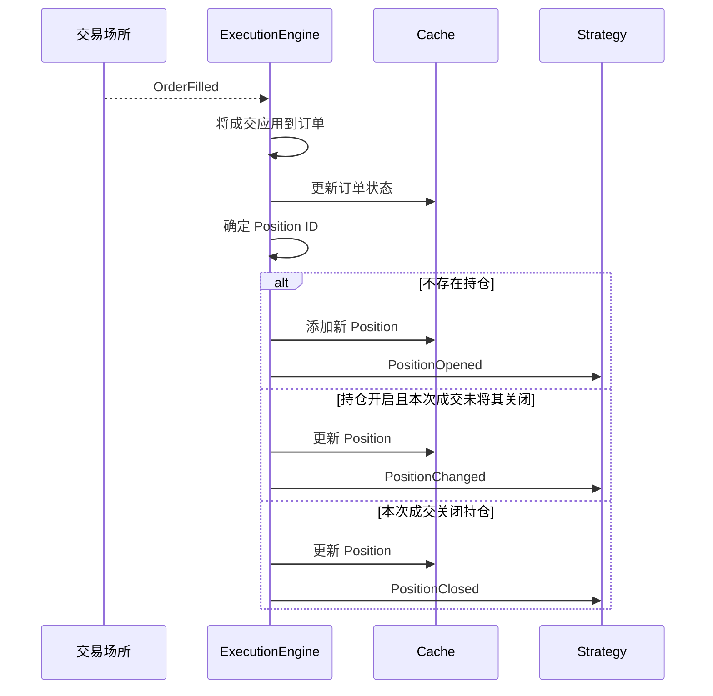

# NautilusTrader Events 核心概念（中文版）

本文基于同目录的英文文档 [Events](index.md) 整理翻译。
它不是机械逐句直译，而是一份面向使用者的中文概念说明：在保留官方事件名称、
处理器和字段语义的同时，重点解释事件分发顺序、订单状态变化，以及成交与持仓事件的关系。

## Event 是什么

NautilusTrader 使用 Event 表示执行、持仓、账户和时间状态的变化。
`MessageBus` 将这些事件路由给感兴趣的组件；如果事件类型受支持，
也会将其路由给 Strategy 处理器。

本文介绍事件类型、分发方式，以及订单成交和成交修正如何产生持仓事件。

## 事件类别

<!-- markdownlint-disable MD060 -->

| 类别  | 示例                                            | 来源                              |
| --- | --------------------------------------------- | ------------------------------- |
| 订单  | `OrderAccepted`、`OrderFilled`、`OrderCanceled` | 执行管道                            |
| 持仓  | `PositionOpened`、`PositionAdjusted`           | 成交和会计状态变化                       |
| 账户  | `AccountState`                                | `ExecutionClient` / `Portfolio` |
| 时间  | `TimeEvent`                                   | `Clock`（定时器和时间提醒）               |

<!-- markdownlint-enable MD060 -->

## 处理器分发顺序

事件到达 Strategy 后，系统会按固定顺序调用处理器。
具体事件处理器先执行，聚合处理器随后执行，因此可以选择任一种粒度，也可以同时使用两者。

### 订单事件

订单事件的分发顺序为：

1. 具体事件处理器，例如 `on_order_filled`。
1. `on_order_event`，接收所有订单事件。

### 持仓事件

发送给 Strategy 的持仓生命周期事件按以下顺序分发：

1. 具体事件处理器，例如 `on_position_opened`。
1. `on_position_event`，接收所有已分发的持仓生命周期事件。

### 时间事件

定时器和时间提醒会产生 `TimeEvent` 对象。
调用 `set_timer` 或 `set_time_alert` 时，可以通过 `callback` 将事件交给自己的方法。

如果省略 `callback`，系统会优先使用之前以相同名称注册的回调；
如果不存在这样的回调，事件将交给 `on_time_event`。

## 订单事件

订单事件可以初始化订单、改变订单状态或修正其成交历史。
执行管道会将事件应用到订单和缓存，随后通过 `MessageBus` 发布。

下表展示主要状态变化。部分成交、外部订单和已触发订单还支持其他状态变化，
详见完整的 [订单状态流](../orders/index.md#order-state-flow)。

<!-- markdownlint-disable MD060 -->

| 事件                                                | 主要状态变化                             | 处理器                        |
| ------------------------------------------------- | ---------------------------------- | -------------------------- |
| [`OrderInitialized`](order_initialized.md)        | 创建订单或将订单实体化                        | `on_order_initialized`     |
| [`OrderDenied`](order_denied.md)                  | Initialized -> Denied              | `on_order_denied`          |
| [`OrderEmulated`](order_emulated.md)              | Initialized -> Emulated            | `on_order_emulated`        |
| [`OrderReleased`](order_released.md)              | Emulated -> Released               | `on_order_released`        |
| [`OrderSubmitted`](order_submitted.md)            | Initialized/Released -> Submitted  | `on_order_submitted`       |
| [`OrderAccepted`](order_accepted.md)              | Submitted -> Accepted              | `on_order_accepted`        |
| [`OrderRejected`](order_rejected.md)              | Submitted -> Rejected              | `on_order_rejected`        |
| [`OrderTriggered`](order_triggered.md)            | Accepted -> Triggered              | `on_order_triggered`       |
| [`OrderPendingUpdate`](order_pending_update.md)   | Accepted -> PendingUpdate          | `on_order_pending_update`  |
| [`OrderPendingCancel`](order_pending_cancel.md)   | Accepted -> PendingCancel          | `on_order_pending_cancel`  |
| [`OrderUpdated`](order_updated.md)                | PendingUpdate -> 先前状态              | `on_order_updated`         |
| [`OrderModifyRejected`](order_modify_rejected.md) | PendingUpdate -> 先前状态              | `on_order_modify_rejected` |
| [`OrderCancelRejected`](order_cancel_rejected.md) | PendingCancel -> 先前状态              | `on_order_cancel_rejected` |
| [`OrderCanceled`](order_canceled.md)              | PendingCancel/Accepted -> Canceled | `on_order_canceled`        |
| [`OrderExpired`](order_expired.md)                | Accepted -> Expired                | `on_order_expired`         |
| [`OrderFilled`](order_filled.md)                  | Accepted -> Filled/PartiallyFilled | `on_order_filled`          |
| [`OrderFillVoided`](order_fill_voided.md)         | 修正已知成交；否则确认订单处于终态                  | `on_order_fill_voided`     |

<!-- markdownlint-enable MD060 -->

### Python 订单事件通用字段

每一种具体的 Python 订单事件都提供以下字段：

<!-- markdownlint-disable MD060 -->

| 字段                | 说明                  |
| ----------------- | ------------------- |
| `trader_id`       | Trader 实例标识符。       |
| `strategy_id`     | 与订单关联的 Strategy。    |
| `instrument_id`   | 订单对应的 Instrument。   |
| `client_order_id` | 客户端分配的订单标识符。        |
| `event_id`        | 唯一事件标识符。            |
| `ts_event`        | 事件发生时的 UNIX 纳秒时间戳。  |
| `ts_init`         | 事件初始化时的 UNIX 纳秒时间戳。 |

<!-- markdownlint-enable MD060 -->

每个订单事件页面都会列出该类型独有的字段。
`venue_order_id`、`account_id` 和 `reconciliation` 只存在于公开它们的 Python 事件类上。

例如，[`OrderFilled`](order_filled.md) 还提供 `last_qty`、`last_px`、
`trade_id` 和 `commission`。
[`OrderFillVoided`](order_fill_voided.md) 则标识被修正的成交，并携带累计作废数量。

:::tip
可以重写 `on_order_event`，在一个位置处理所有订单事件。
具体事件处理器会先执行，因此也可以组合使用两种处理方式。
:::

## 持仓事件

持仓生命周期事件描述由成交和成交修正引起的缓存持仓变化。
`ExecutionEngine` 处理每一个 `OrderFilled`，更新或创建持仓，
并发出相应的生命周期事件。

当 `OrderFillVoided` 修正一笔已经在本地应用的成交时，
系统会根据有效成交历史重建每个受影响的缓存持仓，而不会生成一笔方向相反的成交。

修正事件发布后：

- 如果修正后的持仓仍然开启，执行引擎发出 `PositionChanged`。
- 如果修正后的持仓已经关闭，执行引擎发出 `PositionClosed`。
- 如果修正只影响订单而不影响持仓，则不会产生持仓事件。

<!-- markdownlint-disable MD060 -->

| 事件                                       | 触发条件              | 处理器                   |
| ---------------------------------------- | ----------------- | --------------------- |
| [`PositionOpened`](position_opened.md)   | 一笔成交创建新持仓。        | `on_position_opened`  |
| [`PositionChanged`](position_changed.md) | 一笔成交或修正改变仍然开启的持仓。 | `on_position_changed` |
| [`PositionClosed`](position_closed.md)   | 一笔成交或修正使持仓数量归零。   | `on_position_closed`  |

<!-- markdownlint-enable MD060 -->

[`PositionAdjusted`](../positions.md#position-adjustments) 记录正常成交之外的数量或已实现盈亏变化，
例如基础货币手续费和资金费用。

Strategy 不会通过持仓事件处理器接收 `PositionAdjusted`。
如需检查这些记录，应使用 `position.adjustments()` 查看调整历史。

### 从成交到持仓：因果链

下图展示一条 `OrderFilled` 事件如何产生持仓事件，
这是订单管理与持仓追踪之间的关键连接。



具体过程如下：

1. **成交到达。** `ExecutionEngine` 通过执行管道收到 `OrderFilled` 事件。
1. **更新订单状态。** 引擎将成交应用到订单对象，并把更新后的订单写入 `Cache`。
1. **确定 Position ID。** 引擎根据 OMS 类型和 Strategy 配置，确定成交所属的持仓。
1. **创建或更新持仓。** 此时有三种结果：

   - **不存在该 ID 的持仓：** 引擎根据成交创建 `Position`，
     将其加入 `Cache`，然后发出 `PositionOpened`。
   - **持仓存在且成交后仍然开启：** 引擎将成交应用到持仓，
     更新 `Cache`，然后发出 `PositionChanged`。
   - **持仓存在且本次成交将其关闭：** 当数量归零时，引擎将成交应用到持仓，
     更新 `Cache`，然后发出 `PositionClosed`。

1. **持仓反转。** 当一笔成交使持仓方向反转时，
   例如持有多头 10 又卖出成交 15，引擎会将成交拆为两部分：
   一部分关闭原持仓并发出 `PositionClosed`，另一部分开启新持仓并发出 `PositionOpened`。

### 持仓事件字段

三个持仓生命周期事件类共享一组核心字段，
并随着持仓状态发展而公开更多字段。
勾号表示 Python 类公开该字段，短横线表示该类没有此字段。

<!-- markdownlint-disable MD060 -->

| 字段                 | Opened | Changed | Closed | 说明                      |
| ------------------ | ------ | ------- | ------ | ----------------------- |
| `trader_id`        | ✓      | ✓       | ✓      | Trader 实例标识符。           |
| `strategy_id`      | ✓      | ✓       | ✓      | 拥有该持仓的 Strategy。        |
| `instrument_id`    | ✓      | ✓       | ✓      | 持仓对应的 Instrument。       |
| `position_id`      | ✓      | ✓       | ✓      | 唯一持仓标识符。                |
| `account_id`       | ✓      | ✓       | ✓      | 持仓所属的账户。                |
| `opening_order_id` | ✓      | ✓       | ✓      | 开启持仓的订单。                |
| `closing_order_id` | -      | -       | ✓      | 关闭持仓的订单。                |
| `entry`            | ✓      | ✓       | ✓      | 开仓成交的方向。                |
| `side`             | ✓      | ✓       | ✓      | 当前持仓方向。                 |
| `signed_qty`       | ✓      | ✓       | ✓      | 带符号数量，负数表示空头。           |
| `quantity`         | ✓      | ✓       | ✓      | 无符号持仓数量。                |
| `peak_quantity`    | -      | ✓       | ✓      | 持有过的最大数量。               |
| `peak_qty`         | -      | ✓       | ✓      | `peak_quantity` 的兼容性别名。 |
| `last_qty`         | ✓      | ✓       | ✓      | 本次成交或修正的数量。             |
| `last_px`          | ✓      | ✓       | ✓      | 本次成交或修正的价格。             |
| `currency`         | ✓      | ✓       | ✓      | 持仓的计价货币。                |
| `avg_px_open`      | ✓      | ✓       | ✓      | 平均开仓价格。                 |
| `avg_px_close`     | -      | ✓       | ✓      | 平均平仓价格，如可用。             |
| `realized_return`  | -      | ✓       | ✓      | 以比率表示的已实现收益。            |
| `realized_pnl`     | ✓      | ✓       | ✓      | 当前周期以成本货币计价的已实现盈亏。      |
| `unrealized_pnl`   | -      | ✓       | ✓      | 由引擎设为零。                 |
| `duration`         | -      | -       | ✓      | 持仓时间，单位为纳秒。             |
| `ts_opened`        | -      | ✓       | ✓      | 持仓开启时的时间戳。              |
| `ts_closed`        | -      | -       | ✓      | 持仓关闭时的时间戳。              |
| `event_id`         | ✓      | ✓       | ✓      | 唯一事件标识符。                |
| `ts_event`         | ✓      | ✓       | ✓      | 触发事件的时间戳。               |
| `ts_init`          | ✓      | ✓       | ✓      | 事件创建时的时间戳。              |

<!-- markdownlint-enable MD060 -->

### 在订单与持仓之间追踪

`Cache` 提供在订单和持仓之间导航的方法：

```python
# 从持仓查找所有产生过成交的相关订单
orders = self.cache.orders_for_position(position.id)

# 从订单查找其所属持仓
position = self.cache.position_for_order(order.client_order_id)

# 开仓订单直接保存在持仓上
opening_order_id = position.opening_order_id
```

## 账户事件

`AccountState` 事件表示余额和保证金快照，在以下情况下触发：

- 交易场所通过执行客户端报告账户更新。
- 对于启用了 `calculate_account_state` 的保证金账户，
  `Portfolio` 在持仓更新后重新计算账户状态。

账户状态包含余额、保证金、账户类型和基础货币。
`Portfolio` 在内部订阅这些事件，以持续维护风险敞口和余额追踪。

完整字段列表参见 [`AccountState`](account_state.md)。

## 事件处理边界

Strategy 通过 `on_order_filled()` 等具体回调，
或聚合回调 `on_order_event()` 接收订单事件。

Python Data Actor 不公开订单事件回调，也不公开原始消息总线。
如果需要从 Strategy 向 Data Actor 发送派生值，应使用 Signal。

参见 [Actors：订单事件处理](../actors.zh-CN.md#订单事件处理)。

## 相关指南

- [Orders](../orders/)：订单类型和状态机。
- [Positions](../positions.md)：持仓生命周期和盈亏。
- [Execution](../execution.md)：执行流程和风险检查。
- [Strategies（中文版）](../strategies.zh-CN.md)：Strategy 中的处理器实现。
- [Architecture（中文版）](../architecture.zh-CN.md)：数据和执行流程模式。
