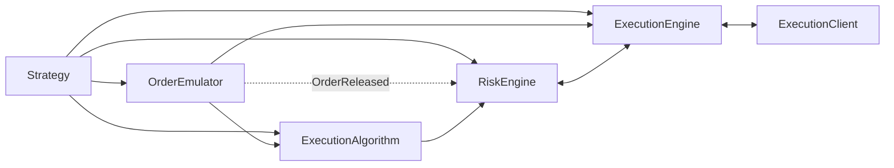

# NautilusTrader Execution 核心概念（中文版）

本文基于同目录的英文文档 [Execution](execution.md) 整理翻译。
它保留原有 API、事件名称、配置字段和执行语义，重点说明订单路由、风险检查、
场所执行、对账与持仓更新之间的关系。

NautilusTrader 协调多个 Strategy 和 Venue 的订单提交、风险检查、场所执行、对账和持仓更新。

主要执行组件包括：

- `Strategy`
- `ExecutionAlgorithm`
- `OrderEmulator`
- `RiskEngine`
- `ExecutionEngine`
- `ExecutionClient`

## 执行流程

`Strategy` 在 Data Actor 能力之上增加订单和执行管理方法：

- `submit_order(...)`
- `submit_order_list(...)`
- `modify_order(...)`
- `cancel_order(...)`
- `cancel_orders(...)`
- `cancel_all_orders(...)`
- `close_position(...)`
- `close_all_positions(...)`
- `query_account(...)`
- `query_order(...)`

这些方法通过 MessageBus 发送点对点执行命令。
创建订单时还会发布 `OrderInitialized` 等事件。

不同命令采用不同路由：

- `submit_order(...)`：模拟订单路由到 `OrderEmulator`；设置了 `exec_algorithm_id` 时，
  路由到 `ExecutionAlgorithm`；其他订单路由到 `RiskEngine`。
- `submit_order_list(...)`：根据订单模拟设置和 `exec_algorithm_id` 使用相同的分支规则。
- `modify_order(...)`：模拟订单路由到 `OrderEmulator`，其他订单路由到 `RiskEngine`。
- 取消和查询命令根据命令类型及订单状态，可以直接路由到 `OrderEmulator`、
  `ExecutionAlgorithm` 或 `ExecutionEngine`。

新订单通常先进入以下路径之一：

```text
Strategy -> OrderEmulator 或 ExecutionAlgorithm 或 RiskEngine
```

后续路径为：

```text
OrderEmulator -> ExecutionAlgorithm 或 ExecutionEngine

ExecutionAlgorithm -> RiskEngine -> ExecutionEngine -> ExecutionClient
```



执行路径会先根据订单模拟和算法路由产生分支，
随后才到达 ExecutionEngine 和 ExecutionClient。

## 命令结果

执行命令根据当前可用证据确定结果：

<!-- markdownlint-disable MD060 -->

| 证据      | 含义               | 结果                         |
| ------- | ---------------- | -------------------------- |
| 明确的本地失败 | 校验证明命令没有发出。      | 拒绝提交；如果失败可归因于该命令，则拒绝修改或取消。 |
| 明确结果    | 撮合引擎或场所明确确认结果。   | 应用相应的已接受、已更新、已取消或已拒绝事件。    |
| 未知实盘结果  | 命令可能已到达场所，但结果未知。 | 保持命令处于传输中，不虚构拒绝结果。         |

<!-- markdownlint-enable MD060 -->

失败事件取决于命令类型，以及失败在何时变得明确：

<!-- markdownlint-disable MD060 -->

| 命令           | 事件                    | 含义                              |
| ------------ | --------------------- | ------------------------------- |
| 提交订单或订单列表    | `OrderDenied`         | 本地检查阻止提交，不会发出 `OrderSubmitted`。 |
| 提交订单或订单列表    | `OrderRejected`       | 提交已进入执行流程，之后被明确证明失败。            |
| 修改           | `OrderModifyRejected` | 请求的修改被明确证明失败。                   |
| 取消、全部取消或批量取消 | `OrderCancelRejected` | 请求的取消被明确证明失败。                   |

<!-- markdownlint-enable MD060 -->

准备修改或取消命令时，只有当失败可归因于该命令且能证明命令没有发出，
NautilusTrader 才会发出相应拒绝事件。
否则，系统只记录失败，不会虚构命令结果。

成功的批量响应仍可能包含单个订单的明确失败。
如果整个请求失败，但没有逐订单证据，就不能证明每个子命令都失败。

:::note[未知实盘结果]
传输错误、超时、断开连接、任务取消、适配器请求重试耗尽、缺少确认，
以及发送后的解析失败，通常都会使场所结果保持未知。

只有当场所特有语义能够证明命令未被接受时，HTTP 状态码和限流结果才是明确结果。

实盘引擎最初会让未知结果保持传输中状态，
等待流式更新、轮询、查询或对账确定场所状态。
达到配置的重试上限后，后续传输中检查可以应用终态对账事件。
:::

**传输中订单**是仍在等待结果的订单：

- `SUBMITTED`：初始提交正在等待接受或拒绝。
- `PENDING_UPDATE`：修改正在等待确认。
- `PENDING_CANCEL`：取消正在等待确认。

实盘对账如何监控和解决这些状态，参见
[Runtime checks](reconciliation.md#runtime-checks)。

## OrderDenied 原因

本地拒单事件 `OrderDenied` 携带标准化的 `CATEGORY_CONDITION` 原因代码，
并且可以包含诊断后缀。只有开头的代码属于规范值。

消息使用以下格式：

- `CODE`：不需要诊断后缀。
- `CODE: value`：包含一个类型化值或自由文本诊断。
- `CODE: key=value, key=value`：包含多个需要消除歧义的类型化值。
- `CODE: value; free text`：一个类型化值后跟自由文本诊断。

下表涵盖执行算法、客户端、RiskEngine 和 ExecutionEngine 发出的本地拒单。
这些代码是本地拒单原因的事实来源。

场所拒单 `OrderRejected` 则携带场所提供的含义。
适配器会移除协议包装，并限制不可信场所文本的长度，
但不会将其替换为标准化的本地拒单代码。

价格和数量检查还可以在 `OrderModifyRejected` 上发出以下代码开头的原因：

- `PRICE_PRECISION_EXCEEDS_MAXIMUM`
- `PRICE_NOT_POSITIVE`
- `QUANTITY_PRECISION_EXCEEDS_MAXIMUM`
- `QUANTITY_EXCEEDS_MAXIMUM`
- `QUANTITY_BELOW_MINIMUM`

对于价格原因，`field` 为 `PRICE` 或 `TRIGGER_PRICE`，表示被拒绝的命令字段。
其他修改拒绝原因仍使用自由文本；`OrderDeniedCode` 不对它们分类。

只有场所证据证明 Post-only 订单会穿过市场或立即撮合时，
`OrderRejected.due_post_only` 才为 `true`。
其他场所拒绝会将其保持为 `false`。

下表根据 `crates/model` 中的 `OrderDeniedReason` 枚举整理。

<!-- markdownlint-disable MD060 -->

| 代码                                               | 说明                              |
| ------------------------------------------------ | ------------------------------- |
| `PRICE_PRECISION_EXCEEDS_MAXIMUM`                | 价格精度超过 Instrument 上限。           |
| `PRICE_NOT_POSITIVE`                             | 价格不是正数。                         |
| `QUANTITY_PRECISION_EXCEEDS_MAXIMUM`             | 数量精度超过 Instrument 上限。           |
| `QUANTITY_CONVERSION_FAILED`                     | 无法转换订单数量以进行风险检查。                |
| `QUANTITY_EXCEEDS_MAXIMUM`                       | 有效订单数量超过 Instrument 上限。         |
| `QUANTITY_BELOW_MINIMUM`                         | 有效订单数量低于 Instrument 下限。         |
| `INVALID_MAX_NOTIONAL_PER_ORDER`                 | 配置的单笔订单最大名义价值无效。                |
| `INVALID_ORDER_SIDE`                             | 订单方向不适用于当前操作。                   |
| `MISSING_EXPIRE_TIME`                            | GTD 订单缺少到期时间。                   |
| `EXPIRE_TIME_IN_PAST`                            | 订单到期时间已经过去。                     |
| `MISSING_TRAILING_OFFSET_TYPE`                   | 订单缺少必需的追踪偏移类型。                  |
| `UNSUPPORTED_TRAILING_OFFSET_TYPE`               | 不支持订单的追踪偏移类型。                   |
| `MISSING_TRIGGER_TYPE`                           | 订单缺少必需的触发类型。                    |
| `MISSING_TRAILING_OFFSET`                        | 订单缺少必需的追踪偏移值。                   |
| `INSTRUMENT_NOT_FOUND`                           | Cache 中找不到 Instrument。          |
| `POSITION_NOT_FOUND`                             | 找不到 Reduce-only 订单对应的持仓。        |
| `MARKET_PRICE_UNAVAILABLE`                       | 订单风险检查没有可用市场价格。                 |
| `TRAILING_STOP_CALCULATION_FAILED`               | 无法计算追踪止损触发价。                    |
| `NOTIONAL_CALCULATION_FAILED`                    | 无法计算订单名义价值。                     |
| `NOTIONAL_BELOW_MINIMUM`                         | 订单名义价值低于 Instrument 下限。         |
| `NOTIONAL_EXCEEDS_MAXIMUM`                       | 订单名义价值超过 Instrument 上限。         |
| `NOTIONAL_EXCEEDS_MAX_PER_ORDER`                 | 订单名义价值超过配置的单笔订单上限。              |
| `NOTIONAL_EXCEEDS_FREE_BALANCE`                  | 订单名义价值超过账户可用余额。                 |
| `INITIAL_MARGIN_CALCULATION_FAILED`              | 无法计算订单初始保证金。                    |
| `INITIAL_MARGIN_EXCEEDS_FREE_BALANCE`            | 订单初始保证金超过账户可用余额。                |
| `BETTING_BALANCE_LOCKED_CALCULATION_FAILED`      | 无法计算投注订单需要锁定的余额。                |
| `CUMULATIVE_NOTIONAL_EXCEEDS_FREE_BALANCE`       | 累计订单名义价值超过账户可用余额。               |
| `CUMULATIVE_INITIAL_MARGIN_CALCULATION_FAILED`   | 无法计算累计初始保证金。                    |
| `CUMULATIVE_INITIAL_MARGIN_EXCEEDS_FREE_BALANCE` | 累计初始保证金超过账户可用余额。                |
| `REDUCE_ONLY_WOULD_INCREASE_POSITION`            | Reduce-only 订单会增加持仓。            |
| `ORDER_LIST_INCOMPLETE`                          | Cache 中缺少订单列表中的部分订单。            |
| `ORDER_LIST_DENIED`                              | 订单列表未通过风险检查，因此订单被拒绝。            |
| `TRADING_HALTED`                                 | 交易已经停止，新订单被拒绝。                  |
| `TRADING_STATE_REDUCING`                         | 交易处于降低风险状态，该订单会增加风险敞口。          |
| `RATE_LIMIT_EXCEEDED`                            | 超过订单提交速率限制。                     |
| `STREAM_RECONCILING`                             | 执行流不可用或正在恢复，应在恢复后重试。            |
| `NO_EXECUTION_CLIENT`                            | 找不到处理该路由命令的 ExecutionClient。    |
| `CLIENT_VENUE_MISMATCH`                          | ExecutionClient 不处理该订单所属 Venue。 |
| `SUBMIT_FAILED`                                  | 向 ExecutionClient 提交订单失败。       |
| `INVALID_CLIENT_ORDER_ID`                        | Client Order ID 对该 Venue 无效。    |
| `INVALID_POSITION_ID`                            | 提交订单时提供的 Position ID 无效。        |
| `UNSUPPORTED_ORDER_LIST`                         | Venue 不支持请求的订单列表。               |
| `UNSUPPORTED_ORDER_TYPE`                         | 不支持该订单类型。                       |
| `UNSUPPORTED_TIME_IN_FORCE`                      | 不支持该订单的 Time in Force。          |
| `UNSUPPORTED_TP_SL`                              | Venue 不支持请求的止盈/止损参数。            |
| `VALIDATION_FAILED`                              | 订单提交前校验失败。                      |

<!-- markdownlint-enable MD060 -->

## 订单管理系统（OMS）

订单管理系统类型决定一个 Instrument 的订单如何映射到持仓。
无论模拟还是真实环境，Strategy 和 Venue 都使用 `OmsType` 枚举定义 OMS 类型。

`OmsType` 有三种取值：

- `UNSPECIFIED`：Strategy 使用 Venue 的 OMS 类型。
- `NETTING`：每个 Instrument 和 Strategy 的持仓合并为一个持仓。
- `HEDGING`：每个 Instrument 和 Strategy 可以同时保持多个开启持仓。

Strategy 和 Venue 的 OMS 类型不同时，`ExecutionEngine` 会在 `OrderFilled` 事件上
分配或覆盖 `position_id`。虚拟持仓存在于 NautilusTrader 中，
但在 Venue 上并不是独立持仓。

<!-- markdownlint-disable MD060 -->

| Strategy OMS | Venue OMS | 结果                                |
| ------------ | --------- | --------------------------------- |
| `NETTING`    | `NETTING` | 每个 Instrument 和 Strategy 一个持仓。    |
| `HEDGING`    | `HEDGING` | 每个 Instrument 和 Strategy 可以有多个持仓。 |
| `NETTING`    | `HEDGING` | 跨 Venue 持仓维护一个虚拟持仓。               |
| `HEDGING`    | `NETTING` | 在 Venue 的单一净持仓上维护多个虚拟持仓。          |

<!-- markdownlint-enable MD060 -->

### OMS 配置

如果 Strategy 未设置 `oms_type` 或使用 `UNSPECIFIED`，
`ExecutionEngine` 会遵循 Venue 的 OMS 类型，且不会覆盖 Venue `position_id`。

回测 Venue 应配置为被模拟 Venue 实际使用的 OMS 类型。

Venue 的持仓模式可能需要适配器特有配置。
例如，参见 [Binance Futures hedge mode](../integrations/binance.md#futures-hedge-mode)。

### 自定义 Position ID 与 NETTING

自定义 Position ID 只适用于 `HEDGING` OMS。
`NETTING` 中每个 Instrument 和 Strategy 只有一个持仓，
其确定性 ID 格式为 `{instrument_id}-{strategy_id}`。

`ExecutionEngine` 会在提交时执行该规则。
如果有效 OMS 解析为 `NETTING`，而 `submit_order` 或 `submit_order_list` 收到的
`position_id` 不等于 `{instrument_id}-{strategy_id}`，订单会被拒绝，
并产生说明不匹配原因的 `OrderDenied` 事件。

该规则仍然允许常见的平仓写法：`Strategy.close_position(position)` 会转发 `position.id`。
在 `NETTING` 下，它正是确定性 ID，因此会被接受。

如果要使用任意 ID 标记或划分持仓，应为 Strategy 配置 `oms_type=HEDGING`。

对于 `submit_order_list`，只要提供了 `position_id`，
引擎还会拒绝任何包含多个 Instrument 的订单列表，无论使用何种 OMS。

一个持仓只属于一个 Instrument，因此该组合会以明确的 `OrderDenied` 原因被拒绝。
其他多 Instrument 注意事项参见 [Order lists](orders/advanced.md#order-lists)。

### 跨 NETTING 周期回放持仓

在 `NETTING` 下，引擎会在关闭和重新开启周期之间复用同一个 Position ID，
因此持仓回放日志可能累积曾经应用到该 ID 的所有成交。

`ExecutionEngineConfig.carry_replay_events_on_reopen` 控制重新开启时是否保留该日志：

<!-- markdownlint-disable MD060 -->

| `carry_replay_events_on_reopen` | 行为                     |
| ------------------------------- | ---------------------- |
| `False`，默认值                     | 只保留当前周期状态，限制每笔成交的处理成本。 |
| `True`                          | 允许修正更早成交，但持仓状态可能持续增长。  |

<!-- markdownlint-enable MD060 -->

实盘交易会固定使用 `True`：`LiveExecEngineConfig` 始终保留回放日志，
因此 Venue 的 [`OrderFillVoided`](events/order_fill_voided.md) 即使引用更早周期也能正确解析。

模拟 Venue 永远不会发出成交作废，因此回测使用有界的默认值。
如果自定义或外部 ExecutionClient 可以修正上一周期的成交，
应显式启用该选项。

如果没有保留日志，引擎会找不到匹配的持仓片段，并拒绝修正。

已实现盈亏快照会跟随修正。
如果成交作废影响更早周期，系统会跨周期边界重建持仓，
改变归档快照所描述的边界。

引擎随后将这些快照归入修正后历史自身的关闭周期，
使每个周期的已实现盈亏只计算一次。
只影响当前周期的作废不会改变归档。

参见 [Position snapshotting](positions.md#position-snapshotting)。

## RiskEngine

`RiskEngine` 存在于所有 NautilusTrader 系统中，包括回测、Sandbox 和实盘环境。
它位于提交和修改路径上，也会接收 `OrderEmulator` 发出的 `OrderReleased` 等订单事件。

取消和查询命令会直接路由到其他执行组件，不经过 `RiskEngine`。

除非在 `RiskEngineConfig` 中绕过相应检查，否则引擎会校验：

- Instrument 的价格和触发价精度。
- 价格为正数；允许负价格的 Instrument 除外，包括期权、期货价差、期权价差和现货商品。
- 数量精度，以及基础数量的最小值和最大值。
- GTD 订单尚未到期。
- `reduce_only` 订单不会增加所引用的持仓。
- 引擎级 `max_notional_per_order` 限制和 Instrument `max_notional` 限制。
- 非保证金账户的现金账户余额影响。
- 提交和修改速率限制。
- 交易状态限制：`ACTIVE`、`HALTED`、`REDUCING`。

如果提交时风险检查失败，系统会产生带有标准化[原因代码](#orderdenied-原因)的
`OrderDenied` 事件。如果修改时风险检查失败，则产生 `OrderModifyRejected`。

### 交易状态

`TradingState` 枚举有三种取值：

- `ACTIVE`：提交和修改命令正常执行。
- `HALTED`：新的提交和修改命令被拒绝，取消命令仍然可以通过。
- `REDUCING`：允许取消；只有不会增加风险敞口的提交或修改命令才会被接受。

配置详情参见
[`RiskEngineConfig` API Reference](/docs/python-api-latest/config.html#nautilus_trader.risk.RiskEngineConfig)。

## 执行算法

`ExecutionAlgorithm` 接收通过 `exec_algorithm_id` 选中的主订单，
并可以将其拆分为更小的派生订单。

NautilusTrader 支持自定义算法，并内置原生 Rust TWAP 实现。

### TWAP（时间加权平均价格）

TWAP 按固定间隔拆分主订单，以降低一次提交全部数量造成的市场冲击。

在已经初始化的 `BacktestEngine` 中注册原生算法：

```python
from nautilus_trader.model import ExecAlgorithmId
from nautilus_trader.config import ExecutionAlgorithmConfig

engine.add_native_exec_algorithm(
    "TwapAlgorithm",
    ExecutionAlgorithmConfig(exec_algorithm_id=ExecAlgorithmId("TWAP")),
)
```

路由到 TWAP 的订单必须在 `exec_algorithm_params` 中提供以下字符串值：

<!-- markdownlint-disable MD060 -->

| Key             | 含义                  |
| --------------- | ------------------- |
| `horizon_secs`  | 与间隔共同决定拆分数量的执行时间范围。 |
| `interval_secs` | 各拆分订单之间的时间间隔。       |

<!-- markdownlint-enable MD060 -->

两个值都必须能解析为正数，且 `horizon_secs` 必须大于或等于 `interval_secs`。
算法会立即提交第一笔拆分订单，然后按配置间隔提交剩余订单。

如果订单类型、Instrument 或调度计划不受支持或无效，
TWAP 会在提交前拒绝主订单。

### 编写执行算法

定义 Python 执行算法时，应继承 `ExecutionAlgorithm` 并实现 `on_order(...)`：

```python
from nautilus_trader.model import ExecAlgorithmId
from nautilus_trader.trading import ExecutionAlgorithm
from nautilus_trader.config import ExecutionAlgorithmConfig


class MyExecutionAlgorithm(ExecutionAlgorithm):
    def __init__(self) -> None:
        super().__init__(
            ExecutionAlgorithmConfig(exec_algorithm_id=ExecAlgorithmId("MY-ALGO")),
        )

    def on_order(self, order) -> None: ...
```

Python 执行算法可以访问 Cache、Portfolio 和用于定时器的 Clock，
还可以使用 Signal 及创建派生订单的方法。

注册后，MessageBus 会根据订单的 `exec_algorithm_id`，
将其路由到 `ExecAlgorithmId` 匹配的算法。

可选字段 `exec_algorithm_params` 的类型为 `Mapping[str, str]`。
如需把订单列表作为整体处理，应重写 `on_order_list(...)`；
其默认实现会把每张订单分别传给 `on_order(...)`。

:::warning
执行订单前，应校验必需的 `exec_algorithm_params` Key，并解析其字符串值。

如果订单无法执行，应调用 `deny_order(...)` 并提供标准化[原因代码](#orderdenied-原因)，
例如 `VALIDATION_FAILED: horizon_secs not found in exec_algorithm_params`。
:::

执行算法接收的订单称为主订单。
使用以下方法创建派生订单：

- `spawn_market(...)`：创建 `MARKET` 订单。
- `spawn_market_to_limit(...)`：创建 `MARKET_TO_LIMIT` 订单。
- `spawn_limit(...)`：创建 `LIMIT` 订单。

每种方法都将主订单作为第一个参数。
默认情况下，方法会从主订单数量中扣除派生订单的 `quantity`。
传入 `reduce_primary=False` 可以保持主订单数量不变。

:::warning
使用 `reduce_primary=True` 时，派生数量不能超过主订单的 `leaves_qty`，
即尚未成交的剩余数量。
:::

如果派生订单在被接受前遭到拒单或拒绝，
已经扣除的数量会自动恢复到主订单。
订单一旦被 Venue 接受，该扣减即视为已经提交。

执行算法可以继续创建派生订单、提交主订单剩余数量，或同时执行两者。
内置 TWAP 算法会在最后一个间隔提交主订单剩余数量。

### 派生订单

每张派生订单都会把 `exec_spawn_id` 设为主订单的 `client_order_id`。
自身 `client_order_id` 使用以下格式：

```text
{exec_spawn_id}-E{spawn_sequence}
```

例如，从 `O-20230404-001-000` 创建的第一张派生订单 ID 为
`O-20230404-001-000-E1`。

:::note
“主订单”和“派生订单”用于区分执行拆单，
不要与条件订单关系中的 Parent Order 和 Child Order 混淆。
:::

### 管理执行算法订单

`Cache` 提供两个主要查询：

- `orders_for_exec_algorithm(...)`：返回某个算法的订单，
  可以按 Venue、Instrument、Strategy、账户和方向筛选。
- `orders_for_exec_spawn(...)`：根据主订单的 `ClientOrderId`，
  返回该主订单及其派生订单。

## Own Order Book

启用 `manage_own_order_books` 后，`ExecutionEngine` 会为每个 Instrument
维护自己工作订单的 Market-by-order（MBO/L3）视图。

Strategy 可以从公开订单簿中减去这些订单，以估算净可用流动性。
生命周期、查询、过滤和审计参见
[Own order book](order_book.md#own-order-book)。

### 安全取消查询

从 Own Order Book 查询取消候选订单时，
应在 `status` 过滤条件中排除 `PENDING_CANCEL`。

:::warning
包含 `PENDING_CANCEL` 可能重复发出取消请求，
并反复选中已经在等待确认的订单。
:::

## 超额成交

订单累计成交数量超过原始数量时，就发生超额成交。
例如，一张 100 单位的订单累计成交 110 单位，超额成交量为 10。

### 超额成交的成因

当报告数量超过订单数量时，引擎会观察到超额成交。
这可能是真实的 Venue 结果，也可能是使用不同 Trade ID 重复发送的成交，
或 Venue 报告不一致。仅凭数量无法确定原因。

实盘成交可以通过两个通道到达：

- 通过 WebSocket 到达的实时成交事件。
- 定期轮询 Venue 成交历史和持仓状态的对账。

稳定的 `trade_id` 使引擎能够在两个通道之间去重同一笔成交。
如果逻辑上相同的成交使用不同 ID 到达，引擎会将其视为不同报告。

配置详情参见
[配置实盘交易节点：持续对账](../how_to/configure_live_trading.zh-CN.md#持续对账)。

### 系统行为

应用每个成交事件前，`ExecutionEngine` 会把订单当前 `filled_qty` 与新到达的
`last_qty` 相加，并与原始 `quantity` 比较，以检查潜在超额成交。

配置项 `allow_overfills` 默认值为 `False`，用于控制处理方式：

<!-- markdownlint-disable MD060 -->

| `allow_overfills` | 行为                                   |
| ----------------- | ------------------------------------ |
| `False`           | 记录日志并拒绝成交，保留订单当前状态。                  |
| `True`            | 记录警告、应用成交，并在 `overfill_qty` 中追踪超出数量。 |

<!-- markdownlint-enable MD060 -->

允许超额成交后，订单的 `overfill_qty` 字段会记录超出数量。
订单状态转换为 `FILLED`，`leaves_qty` 则限制为零。

### 重复成交检测

`Order` 模型强制规定每个 `trade_id` 只能应用一笔成交。
如果订单上已经存在相同 ID，`Order.apply()` 会返回错误。

#### 核心引擎路径

应用成交前，`ExecutionEngine` 会调用 `Order.is_duplicate_fill()` 比较：

- `trade_id`
- `order_side`
- `last_px`
- `last_qty`

完全匹配的成交会被跳过，并记录警告。

如果 `trade_id` 相同但其他字段不同，四字段检查不会把它归类为完全重复。
之后 `Order.apply()` 会拒绝重复使用的 ID，引擎则记录并丢弃该成交。

#### 对账路径

对账路径会在生成 `OrderFilled` 事件前检查 `trade_id`。
只要订单上已经存在该 ID，无论价格或数量如何，报告都会被丢弃。

模拟和推断出的对账成交使用确定性 ID。
因此，进程重启后使用相同输入重放，会产生相同 `trade_id` 并被去重。

### 配置

在实盘交易中，通过 `LiveExecEngineConfig` 启用超额成交容忍：

```python
from nautilus_trader.config import LiveExecEngineConfig

config = LiveExecEngineConfig(
    allow_overfills=True,
)
```

:::warning
应根据 Venue 的执行约定选择该设置。
默认值 `False` 可以保护本地状态，
但真实 Venue 发生合法超额成交后，可能留下状态差异。

`True` 会应用超出数量，但不能代替重复成交检测。
应使用[执行对账](reconciliation.md)检测差异。
:::

## 成交修正

部分 Venue 可能在之后减少或作废一笔成交。
NautilusTrader 将其记录为 [`OrderFillVoided`](events/order_fill_voided.md) 事件，
而不是方向相反的成交。

该事件标识原始 Trade，并携带累计作废数量和费用修正。

ExecutionEngine 会重建受影响的订单和持仓，
刷新 Portfolio 的持仓和盈亏 Cache，
然后才把修正发布给 Strategy 和 ExecutionAlgorithm。

支持成交修正的适配器会在作废后请求一次权威账户刷新。

对于会重新开启订单的修正，或仍使订单保持可执行的部分修正，
适配器必须先发布所引用的成交。

如果本地不存在该成交，一条不会重新开启订单的修正会使整张订单进入终态，
即使 `voided_qty` 小于订单数量也是如此。
之后的工作状态报告不会重新开启 `VOIDED` 订单。

完整约定参见
[`OrderFillVoided` contract](events/order_fill_voided.md#contract)。

### 成交作废的成因

作废是 Venue 针对已经报告的 Trade 执行的操作。
不同资产类别中常见的原因包括：

- **错误执行审查：** Venue 作废与成交时市场明显不符的成交，
  或由交易所系统故障引起的成交。
- **结算失败：** 已撮合 Trade 未能结算，因此成交没有产生经济效果。
- **事件失效：** 标的事件被取消或参赛者退出，使已撮合持仓不再具有风险敞口。
- **交易后重述：** Venue 在清算期间重述 Trade 的数量或费用。

该事件不会重述成交价格，
因此 Venue 价格调整无法用一条修正事件表达。

不同 Venue 会通过不同方式把 Break 发送给客户端。
FIX Venue 使用 [`ExecType <150>`](https://www.onixs.biz/fix-dictionary/5.0.sp2/tagnum_150.html)
的 `H`（Trade Cancel）和 `G`（Trade Correct）值发出信号。

如果 Venue 通过带外方式通知，Break 会通过[执行对账](reconciliation.md)呈现。

### Venue 参考资料

各 Venue 会公布采取相关操作的条件：

<!-- markdownlint-disable MD060 -->

| Venue            | 机制                            | 参考资料                                                                                                                                            |
| ---------------- | ----------------------------- | ----------------------------------------------------------------------------------------------------------------------------------------------- |
| Nasdaq           | 明显错误交易，Rule 11890。            | [Clearly erroneous transactions policy](https://www.nasdaqtrader.com/Trader.aspx?id=ClearlyErroneous)                                           |
| NYSE             | 明显错误执行，Rule 7.10。             | [Clearly erroneous execution review](https://www.nyse.com/trade/cee)                                                                            |
| Cboe US equities | 明显错误执行，BZX Rule 11.17。        | [Clearly erroneous execution form](https://www.cboe.com/us/equities/trading/cee_form/)                                                          |
| CME Group        | 交易取消和价格调整，Rule 588。           | [CME rulebook chapter 5](https://www.cmegroup.com/rulebook/CME/I/5/5.pdf)                                                                       |
| Betfair          | 作废投注，以累计作废数量 `sv` 报告。         | [Void bets on the Stream API](https://support.developer.betfair.com/hc/en-us/articles/360000391492-How-are-void-bets-treated-by-the-Stream-API) |
| Polymarket       | 链上回滚或重组后出现 `FAILED` Trade 状态。 | [User channel](https://docs.polymarket.com/developers/CLOB/websocket/user-channel)                                                              |

<!-- markdownlint-enable MD060 -->

如果 Venue 在适配器消费的数据流上发布作废，NautilusTrader 适配器就会发出 `OrderFillVoided`：

- [Betfair](../integrations/betfair.md#voided-fills)：来自订单变更消息的 `sv` 字段。
- [Polymarket](../integrations/polymarket.md#trades)：来自用户通道的 Trade 状态。

## 对账报告

ExecutionEngine 从实盘适配器接收四种对账报告。
当对应订单不在 Cache 中时，每种报告都有不同的正常用途。
显式限制范围的历史数据则可以使用[仅投影到订单的成交](#仅投影到订单的成交)。

<!-- markdownlint-disable MD060 -->

| 报告类型                   | 用途          | 缺少订单时的操作          |
| ---------------------- | ----------- | ----------------- |
| `OrderStatusReport`    | 更新订单状态。     | 创建订单并推断报告中的成交。    |
| `FillReport`           | 独立成交。       | 创建市场订单，再应用成交元数据。  |
| `OrderWithFills`       | 订单状态及成交。    | 创建订单、应用成交并推断剩余状态。 |
| `PositionStatusReport` | Venue 持仓快照。 | 记录报告；持仓仍由成交派生。    |

<!-- markdownlint-enable MD060 -->

### 各报告类型的适用场景

适配器应选择与 Venue 事件匹配的报告类型：

- 如果订单生命周期更新和成交详情通过不同数据流到达，使用 `OrderStatusReport`。
- 对于有成交但没有用户级订单的 Venue 主动平仓，使用 `FillReport`。
  Hyperliquid 强制平仓采用此模式。
- 如果一条 Venue 事件同时包含订单状态及其成交，使用 `OrderWithFills`。
  Binance Futures 对交易所生成的 ADL、强制平仓和结算订单使用此模式。

### 仅投影到订单的成交

启动对账期间，一份范围受限的历史报告可以证明订单状态和已成交数量，
但不能证明该成交属于当前持仓生命周期。

此时，引擎只把 `OrderFilled` 事件投影到订单。
订单会达到报告中的准确状态，
但成交不会创建或改变持仓，也不会更新 Portfolio 的经济状态。

这种投影只适用于对账恢复。
原始报告仍然可用，权威持仓报告可以单独对账当前 Venue 持仓。

所需证据参见
[Bounded history safety](reconciliation.md#bounded-history-safety)。

### 创建外部订单

如果报告引用的订单不在 Cache 中，引擎会创建一张**外部订单**。

这涵盖 Venue 主动发起的 ADL、强制平仓或结算、
其他进程下达的订单，以及本地尚未观察到的订单。

引擎按以下顺序分配所有权：

- 通过 `register_external_order_claims` 声明该 Instrument 的 Strategy。
- 默认回退到 `EXTERNAL` Strategy。

如果报告包含 `client_order_id`，外部订单会直接使用它；
否则，根据 `venue_order_id` 派生 Client Order ID。

引擎把订单加入 Cache，注册其 Venue Order ID，
并发出适用的 `OrderAccepted`、`OrderFilled`、`OrderCanceled` 或 `OrderExpired` 事件。
持仓随后通过正常事件管道更新。

## 相关指南

- [Events（中文版）](events/index.zh-CN.md)：订单与持仓事件类型及分发方式。
- [Execution reconciliation](reconciliation.md)：实盘状态恢复和运行时一致性检查。
- [Order book](order_book.md)：公开和自有订单簿行为。
- [Orders](orders/)：订单类型和管理。
- [Positions](positions.md)：根据成交追踪持仓。
- [Strategies（中文版）](strategies.zh-CN.md)：Strategy 如何提交订单。
