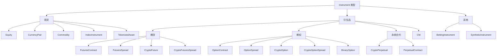

# NautilusTrader Instruments 核心概念（中文版）

本文基于同目录的英文文档 [Instruments](index.md) 整理翻译。
它不是机械逐句直译，而是一份面向使用者的中文概念说明：在保留官方语义、
类型名称、字段和 API 的同时，重点解释交易工具的身份、精度、限制、保证金和费用模型。

## Instrument 是什么

Instrument 表示可交易资产、合约或本地合成市场的规格定义。
市场数据、订单、持仓、会计处理、Portfolio 计算和适配器符号体系，
都会引用 `InstrumentId` 及其对应的 Instrument 定义。

NautilusTrader 为 Rust 和 Python 用户提供同一套 Instrument 模型。
Rust 示例使用 `nautilus_model`，Python 示例使用 `nautilus_trader.model`。

## Instrument 类型

<!-- markdownlint-disable MD060 -->

| Instrument 类型                                     | 类别     | 说明                             | 常见适配器                          |
| ------------------------------------------------- | ------ | ------------------------------ | ------------------------------ |
| [`Equity`](equity.md)                             | 现货     | 在现金市场交易的上市股票或 ETF。             | Databento、Interactive Brokers。 |
| [`CurrencyPair`](currency_pair.md)                | 现货     | 以基础货币/计价货币形式表示的法币外汇或加密货币现货交易对。 | Binance、Kraken、OKX、Tardis。     |
| [`Commodity`](commodity.md)                       | 现货     | 黄金、原油等现货商品。                    | Interactive Brokers。           |
| [`Cfd`](cfd.md)                                   | 差价合约   | 跟踪某项标的资产的差价合约。                 | Interactive Brokers。           |
| [`IndexInstrument`](index_instrument.md)          | 现货参考   | 不可直接交易的参考指数。                   | Interactive Brokers。           |
| [`TokenizedAsset`](tokenized_asset.md)            | 代币化现货  | 加密交易场所中的代币化资产。                 | Kraken。                        |
| [`FuturesContract`](futures_contract.md)          | 期货     | 具有到期日的期货合约。                    | Databento、Interactive Brokers。 |
| [`FuturesSpread`](futures_spread.md)              | 期货价差   | 由多个腿组成、交易所定义的期货策略。             | Databento、Interactive Brokers。 |
| [`CryptoFuture`](crypto_future.md)                | 加密期货   | 具有到期日的加密货币期货合约。                | BitMEX、Bybit、Deribit、OKX。      |
| [`CryptoFuturesSpread`](crypto_futures_spread.md) | 加密期货价差 | 交易所定义的加密货币期货价差。                | Deribit、OKX。                   |
| [`CryptoPerpetual`](crypto_perpetual.md)          | 永续合约   | 加密货币永续期货合约。                    | Binance、BitMEX、Bybit、dYdX。     |
| [`PerpetualContract`](perpetual_contract.md)      | 通用永续合约 | 跨资产类别的永续期货合约。                  | Architect AX、Binance。          |
| [`OptionContract`](option_contract.md)            | 期权     | 交易所交易的看跌或看涨期权。                 | Databento、Interactive Brokers。 |
| [`OptionSpread`](option_spread.md)                | 期权价差   | 由多个腿组成、交易所定义的期权策略。             | Databento、Interactive Brokers。 |
| [`CryptoOption`](crypto_option.md)                | 加密期权   | 以加密资产为标的的期权。                   | Bybit、Deribit、OKX、Tardis。      |
| [`CryptoOptionSpread`](crypto_option_spread.md)   | 加密期权价差 | 交易所定义的加密货币期权价差。                | Deribit、OKX。                   |
| [`BinaryOption`](binary_option.md)                | 二元结果   | 以 0 或 1 结算的二元工具。               | Hyperliquid、OKX、Polymarket。    |
| [`BettingInstrument`](betting_instrument.md)      | 投注市场   | 体育或游戏市场中的选项。                   | Betfair。                       |
| [`SyntheticInstrument`](synthetic_instrument.md)  | 本地合成工具 | 通过公式派生的本地 Instrument。          | 仅限本地。                          |

<!-- markdownlint-enable MD060 -->

## 分类体系

NautilusTrader 按 Instrument 所代表的市场结构进行分类：



## 通用字段

多数具体 Instrument 都具有相同的核心结构。
每种类型的页面会列出该类型完整的构造参数和结构体字段。

<!-- markdownlint-disable MD060 -->

| 字段                | 含义                                           |
| ----------------- | -------------------------------------------- |
| `id`              | Nautilus `InstrumentId`，由 Symbol 和 Venue 组成。 |
| `raw_symbol`      | Nautilus 规范化之前，交易场所使用的原生 Symbol。             |
| `price_precision` | 价格值配置的小数位数。                                  |
| `size_precision`  | 数量值配置的小数位数。                                  |
| `price_increment` | 最小有效价格步长。                                    |
| `size_increment`  | 最小有效数量步长。                                    |
| `multiplier`      | 用于名义价值和盈亏计算的合约乘数。                            |
| `lot_size`        | 交易场所发布时使用的整数手数或每手股数。                         |
| `margin_init`     | 以名义价值小数比例表示的初始保证金率。                          |
| `margin_maint`    | 以名义价值小数比例表示的维持保证金率。                          |
| `maker_fee`       | Maker 费率，负值表示返佣。                             |
| `taker_fee`       | Taker 费率，负值表示返佣。                             |
| `max_quantity`    | 已知时允许的最大订单数量。                                |
| `min_quantity`    | 已知时允许的最小订单数量。                                |
| `max_notional`    | 已知时允许的最大订单名义价值。                              |
| `min_notional`    | 已知时允许的最小订单名义价值。                              |
| `max_price`       | 已知时允许的最大报价或订单价格。                             |
| `min_price`       | 已知时允许的最小报价或订单价格。                             |
| `info`            | 从交易场所或数据源保留的适配器元数据。                          |
| `ts_event`        | Instrument 定义事件发生时的 UNIX 纳秒时间戳。              |
| `ts_init`         | Nautilus 初始化该对象时的 UNIX 纳秒时间戳。                |
| `tick_scheme`     | 类型支持可变 Tick 时，已注册的可变 Tick 方案名称。              |

<!-- markdownlint-enable MD060 -->

## 符号体系

每个 Instrument 都有唯一的 `InstrumentId`。
它由 Nautilus Symbol 和 Venue 组成，两部分以句点分隔。
独立的 `raw_symbol` 字段则保留交易场所使用的原生 Symbol。

例如，Binance Futures 中的以太坊永续合约表示为：

```text
ETHUSDT-PERP.BINANCE
```

同一交易场所中的原生 Symbol 理应唯一，但并非所有交易所都能保证这一点。
Nautilus 的 `{symbol}.{venue}` 组合在一个系统内必须唯一。

:::warning
Instrument 定义必须与市场数据和交易场所的订单语义一致。
错误定义可能截断价格或数量、使用错误币种计算名义价值，
也可能使回测接受实盘交易场所会拒绝的价格。
:::

## Rust 与 Python 接口

Rust 用户使用 `nautilus_model` 中的 Instrument 结构体和 `InstrumentAny`：

```rust
use nautilus_model::instruments::{CurrencyPair, InstrumentAny};
```

Python 用户通常使用 `nautilus_trader.model` 中的 Instrument 类：

```python
from nautilus_trader.model import CurrencyPair
```

两套接口表达同一份 Instrument 契约：身份、精度、步长、币种、限制、
保证金、费用、元数据和时间戳。

## 加载 Instrument

可以通过 `TestInstrumentProvider` 实例化通用的测试 Instrument：

```python
from nautilus_trader.testkit.providers import TestInstrumentProvider

audusd = TestInstrumentProvider.default_fx_ccy("AUD/USD")
```

实盘集成适配器会公开用于缓存 Instrument 定义的 `InstrumentProvider` 对象。
如果集成支持，可以使用 `InstrumentProviderConfig(load_all=True)` 加载全部定义；
也可以通过 `load_ids` 加载一组已知 Instrument。

提交订单前，中央缓存中必须存在与订单匹配的 Instrument 定义。

## 查找 Instrument

Strategy 和 Actor 从中央缓存中获取 Instrument：

```rust tab="Rust"
use nautilus_model::identifiers::InstrumentId;

let instrument_id = InstrumentId::from("ETHUSDT-PERP.BINANCE");
let instrument = cache.instrument(&instrument_id);
```

```python tab="Python"
from nautilus_trader.model import InstrumentId

instrument_id = InstrumentId.from_str("ETHUSDT-PERP.BINANCE")
instrument = self.cache.instrument(instrument_id)
```

也可以订阅一个 Instrument，或者订阅某个 Venue 的所有 Instrument：

```python
self.subscribe_instrument(instrument_id)
self.subscribe_instruments(venue)
```

`DataEngine` 收到 Instrument 更新时，会将该对象传给 `on_instrument()` 处理器。

## 精度

在订单校验中，`price_precision` 和 `size_precision` 分别规定
`RiskEngine` 接受的价格和数量最大小数位数。
`price_increment` 和 `size_increment` 则记录相应的最小步长。

<!-- markdownlint-disable MD060 -->

| 字段                | 约束对象            | 示例                |
| ----------------- | --------------- | ----------------- |
| `price_precision` | 订单价格、触发价格和成交价格。 | `2` -> `50000.01` |
| `size_precision`  | 订单数量和成交数量。      | `5` -> `1.00001`  |

<!-- markdownlint-enable MD060 -->

价格步长的精度必须与 `price_precision` 一致，
数量步长的精度必须与 `size_precision` 一致。

例如，`price_precision=2` 应与 `price_increment=Price(0.01, 2)` 搭配。

可以使用 Instrument 的工厂方法，将值舍入到配置的精度：

```python
instrument = self.cache.instrument(instrument_id)

price = instrument.make_price(0.90500)
quantity = instrument.make_qty(150)
```

Instrument 构造要求声明的精度与对应步长的精度一致，
这些方法会将值舍入到该步长的精度。
但它们不会保证结果是 `0.25` 等步长值的整数倍。

:::warning
`RiskEngine` 不会自动舍入数值。
如果 Instrument 只支持两位小数，而创建的 `Price` 有五位小数，订单将被拒绝。

请使用 `instrument.make_price()` 和 `instrument.make_qty()` 显式舍入。
`RiskEngine` 也不校验数值是否为步长的整数倍，
因此提交订单前必须确保价格和数量符合交易场所规定的步长。
:::

## 限额、保证金与费用

交易场所和适配器提供的 Instrument 定义可以包含以下可选限制：

- `max_quantity` 和 `min_quantity`。
- `max_notional` 和 `min_notional`。
- `max_price` 和 `min_price`。

保证金模型使用 `margin_init` 和 `margin_maint` 计算初始保证金和维持保证金。
Maker 与 Taker 费率用于计算手续费。

Nautilus 在适配器和回测中统一使用以下费率约定：

- 正费率表示手续费。
- 负费率表示返佣。

更深入的会计处理行为参见 [Accounting](../accounting.md)。

## 元数据

`info` 字段以可序列化为 JSON 的字典形式，保留原始数据或适配器特有的元数据。
当交易场所提供的有用信息不适合纳入 Nautilus 统一 Instrument API 时，可以将其保存在这里。

## 相关指南

- [Data](../data/)：介绍引用 Instrument 的市场数据类型。
- [Orders](../orders/)：介绍引用 Instrument 的订单字段。
- [Synthetics](../synthetics.md)：介绍通过本地公式派生的 Instrument。
- [Python API Reference](/docs/python-api-latest/model/instruments.html)：列出 Python 构造器和成员。
