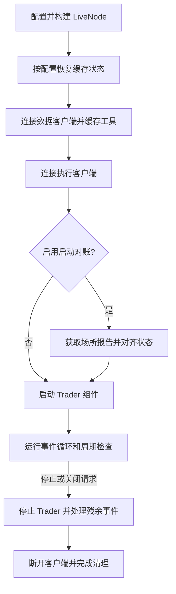

# NautilusTrader Live Trading 核心概念（中文版）

本文基于同目录的英文文档和
[官网最新版 Live Trading](https://nautilustrader.io/docs/latest/concepts/live/) 整理翻译。
它不是逐句直译，而是一份面向实盘部署的中文概念说明：在保留官方语义和 API 名称的同时，
重点解释节点生命周期、事件循环所有权、执行对账、运行状态监控和安全关闭。

NautilusTrader 允许回测策略在不修改交易逻辑的情况下部署到实盘。
同一套 Actor、Strategy 和 Execution Algorithm 可以同时运行于回测引擎和实盘交易节点。

:::danger
实盘交易涉及真实资金风险。部署到生产环境前，必须理解系统配置、节点运维、执行对账，
以及回测与实盘之间在延迟、流动性、成交和场所行为上的差异。
:::

## 实盘运行模型

实盘节点通过 `LiveNode` 把数据客户端、执行客户端、Trader、缓存、Portfolio 和交易引擎
组合成一个运行单元。它负责有序启动、持续事件处理、运行时维护和协调关闭。

可以把实盘路径概括为：

```text
场所连接 -> 数据与执行状态准备 -> Trader 启动 -> 持续事件处理 -> 协调关闭
```

回测与实盘共用策略和领域模型，不代表二者环境完全相同。实盘额外面对：

- 网络连接中断、重试和死连接。
- 订单命令结果不确定及执行状态对账。
- 外部场所状态与本地缓存状态之间的偏差。
- 队列堆积、处理延迟和宿主事件循环竞争。
- 进程信号、服务监督和优雅关闭。

## LiveNode 生命周期

Rust `LiveNode::run()` 在启动 Trader 组件前准备缓存和场所状态，
随后拥有事件循环并负责协调关闭。



启动顺序的核心保证是：工具信息和执行状态先准备完成，策略之后才开始交易。

当节点连接了缓存数据库并启用缓存加载时，系统会先恢复缓存。
连接、执行对账或 Trader 启动失败都会中止启动，并进入统一的协调清理路径。

### 启动阶段

启动阶段通常依次完成：

1. 构建内核、引擎、缓存、Portfolio 和 Trader。
1. 按配置从后端恢复缓存状态。
1. 连接数据客户端并加载工具定义。
1. 连接执行客户端。
1. 根据配置执行启动对账。
1. 启动 Actor、Strategy 和 Execution Algorithm。
1. 进入稳定事件循环。

策略启动前完成状态准备，可以避免策略在工具缺失、订单状态未知或持仓尚未对齐时开始下单。

### 关闭阶段

正常停止请求进入协调关闭路径。节点先停止 Trader，处理允许的残余事件，
再断开客户端并停止引擎。

关闭不是立即终止进程。调用方应等待节点运行任务完成，再释放节点资源。

## 事件循环所有权

Python 提供两种主要运行入口：

<!-- markdownlint-disable MD060 -->

| 入口            | 所有者                | 适用场景                       |
| ------------- | ------------------ | -------------------------- |
| `run()`       | `LiveNode` 拥有调用线程。 | 独立交易进程、节点负责信号处理、使用数据库缓存后端。 |
| `run_async()` | 宿主拥有事件循环。          | ASGI 服务、仪表盘或其他异步服务与节点共同运行。 |

<!-- markdownlint-enable MD060 -->

两种入口执行相同的启动顺序、维护、对账和关闭流程。差别只在于谁负责事件循环和信号处理。

`run()` 由节点拥有调用线程和信号处理。`run_async()` 不安装信号处理器，
`SIGINT` 和 `SIGTERM` 由宿主应用处理。

### 托管事件循环示例

下面展示在已有 asyncio 事件循环中同时运行 `LiveNode` 和应用服务的所有权模式。
节点配置和 `serve_requests()` 的具体实现由应用提供。

```python
import asyncio

from nautilus_trader.live import LiveNode
from nautilus_trader.live import LiveNodeHandle


async def wait_until_running(
    handle: LiveNodeHandle,
    task: asyncio.Task[None],
) -> None:
    while not handle.is_running:
        if task.done():
            await task
            raise RuntimeError("LiveNode stopped during startup")
        await asyncio.sleep(0.01)


async def serve_with_node(node: LiveNode) -> None:
    cache = node.cache
    portfolio = node.portfolio
    handle = node.handle()
    run_task: asyncio.Task[None] | None = None
    service_task: asyncio.Task[None] | None = None

    try:
        run_task = asyncio.create_task(node.run_async())
        await wait_until_running(handle, run_task)

        service_task = asyncio.create_task(
            serve_requests(cache, portfolio, handle),
        )
        done, _ = await asyncio.wait(
            (run_task, service_task),
            return_when=asyncio.FIRST_COMPLETED,
        )

        if run_task in done:
            await run_task
            raise RuntimeError("LiveNode stopped while the service was running")

        await service_task
    finally:
        if service_task is not None and not service_task.done():
            service_task.cancel()
            await asyncio.gather(service_task, return_exceptions=True)

        try:
            if run_task is not None:
                handle.stop()
                await run_task
        finally:
            node.dispose()
```

### `run_async()` 所有权规则

`run_async()` 返回协程，并在整个运行期间借用节点。
启动前应先取得 `cache`、`portfolio` 和 `handle()`：

- 节点运行期间可以继续使用这些对象。
- 通过节点本身读取其他状态会抛出异常，直到运行结束并归还节点。
- `handle()` 是例外，运行期间始终可用，因为宿主依靠它停止节点。
- `is_running` 也始终可查询，因为它读取同一个 Handle。

节点运行期间调用 `dispose()` 不会执行任何操作，也不会安排延后释放。
必须等运行任务完成后再调用 `dispose()`。

`LiveNodeHandle` 可以安全地从任意线程调用，包括信号处理器。
`stop()` 只发出优雅关闭请求并立即返回；运行任务要到关闭流程完成后才会结束。

取消 `run_async()` 任务会请求同样的协调关闭，等待关闭完成，然后重新抛出取消异常。
这使 `asyncio.timeout` 和任务组仍保持调用方预期的取消语义。

### ASGI 集成

官方兼容性覆盖默认 asyncio 循环和 uvloop。Uvicorn 管理的 ASGI lifespan 可以使用相同模式，
并让应用保留信号处理所有权。

ASGI 服务报告启动完成前，应等待 Handle 进入 `Running`，同时检查节点任务是否已经失败。
启动后仍要持续监督运行任务，节点意外结束应被视为服务故障。

节点稳定运行时会周期性地把控制权交还宿主循环，避免事件突发长期饿死宿主回调。
但启动和关闭阶段会连续排空队列；大量工具加载或关闭积压可能在排空期间占用循环。

### 每个进程一个 LiveNode

:::warning
一个进程只运行一个并发 `LiveNode`。运行器把通道发送端和消息总线绑定到线程局部存储，
其他运行时状态则属于进程级。`run_async()` 也会拒绝同一事件循环中的第二个托管节点。
:::

需要更多节点时，应使用独立进程，而不是在一个进程或事件循环中创建多个节点。

ASGI lifespan 构建交易节点时，应用只能使用一个 Worker。实盘交易不要启用热重载，
因为热重载会重启 Worker 及其节点。

如需扩展 HTTP 请求处理能力，应增加不构建交易节点的独立服务进程。

### 数据库缓存后端限制

配置了缓存数据库后端的节点不能运行在宿主事件循环中。
这些后端通过阻塞调用线程等待 Worker 任务，会直接阻塞宿主循环。

数据库缓存后端节点应使用 `run()`，不要使用 `run_async()`。

## 配置边界

实盘配置通常包括：

- `LiveNodeConfig` 和内核设置。
- 数据客户端与执行客户端配置。
- 执行引擎和对账设置。
- Actor、Strategy 和 Execution Algorithm 配置。
- 缓存后端、状态加载和持久化设置。
- 多场所客户端路由。
- 队列监控和错误关闭策略。

配置结构中 `T` 与 `Option<T>` 的默认值、覆盖语义和 Builder 模式，参见
[Configuration](configuration.md)。完整节点配置流程参见
[配置实盘交易节点](../how_to/configure_live_trading.md)。

## 执行对账

实盘中的本地订单和持仓状态可能与场所状态发生偏差。启动对账在 Trader 组件启动前，
使用场所报告对齐缓存中的订单和持仓状态。

运行期间还可以持续检查：

- 在途订单。
- 打开订单。
- 持仓。
- 自有订单簿。

当适配器声明其历史报告有明确范围时，只有报告集合与保留状态能够证明一个连贯持仓转换，
启动对账才会应用报告中的成交经济结果。

历史不完整或存在歧义时，系统仍可能恢复精确订单状态，
但不会据此改变持仓或 Portfolio 的经济结果。

:::warning
Socket 断开、订单命令成功入队或本地方法成功返回，都不能单独证明订单已经被场所接受、
拒绝、取消或修改。命令结果必须由流式更新、查询或执行对账提供证据。
:::

提交、修改和取消命令如何形成结果，参见[命令结果](execution.md#command-outcomes)。
对账配置、恢复流程、运行时检查和不变量参见[执行对账](reconciliation.md)。

## Rust 运行器指标

Rust `LiveNode` 通过 `LiveNodeHandle::metrics_snapshot()` 暴露基础运行器指标。
应在调用 `run()` 前取得 Handle，再从另一个任务轮询快照，并通过相邻快照的差值计算速率和利用率。

```rust
use std::time::Duration;

use nautilus_common::enums::Environment;
use nautilus_live::node::{LiveNode, RunnerMetricsDelta};

let mut node = LiveNode::builder(trader_id, Environment::Live)?
    // 在这里添加客户端、Actor 和 Strategy
    .build()?;

let metrics_handle = node.handle();

tokio::spawn(async move {
    let mut prev = metrics_handle.metrics_snapshot();
    let mut interval = tokio::time::interval(Duration::from_secs(1));

    loop {
        interval.tick().await;

        let next = metrics_handle.metrics_snapshot();
        let delta = RunnerMetricsDelta::from_snapshots(prev, next);
        if delta.elapsed_ns == 0 {
            prev = next;
            continue;
        }

        let elapsed_s = delta.elapsed_ns as f64 / 1_000_000_000.0;
        let data_event_rate = delta.data_events as f64 / elapsed_s;
        let data_event_staleness_ns = if next.data_events.last_dispatch_at_ns == 0 {
            0
        } else {
            next.elapsed_ns
                .saturating_sub(next.data_events.last_dispatch_at_ns)
        };

        log::info!(
            "Runner metrics: data_event_rate={data_event_rate:.0} \
             data_event_staleness_ns={data_event_staleness_ns} \
             dispatch_utilization={:.6} loop_utilization={:.6} \
             mean_dispatch_ns={} data_queue_depth={}",
            delta.dispatch_utilization(),
            delta.loop_utilization(),
            delta.mean_dispatch_ns(),
            next.data_events.queue_depth,
        );

        prev = next;
    }
});

node.run().await?;
```

快照覆盖进入稳定状态后的 `LiveNode::run` 通道分发，包括关闭宽限期内的残余分发。

<!-- markdownlint-disable MD060 -->

| 指标或阶段                     | 覆盖范围                 |
| ------------------------- | -------------------- |
| `dispatch_busy_ns`        | 五个事件与命令分发分支。         |
| `maintenance_busy_ns`     | 非分发的维护循环工作。          |
| `external_msgbus_busy_ns` | 外部消息总线相关的非分发工作。      |
| 启动缓冲与启动刷新                 | 不包含在快照中。             |
| 最终事件循环后的队列排空              | 不包含在快照中。             |
| 队列深度                      | 运行期间维护 Tick 取得的时点样本。 |

<!-- markdownlint-enable MD060 -->

关闭宽限期内的队列深度可能已经过时。快照是无锁读取，跨字段不一定来自完全一致的同一时刻。
应使用相邻快照和饱和差值计算派生指标，避免计数器变化导致下溢。

当 `LiveNode::run` 进入稳定状态时，计数器会重置。

## 队列压力监控

设置 `LiveNodeConfig.queue_monitor` 后，`LiveNode` 会把运行器队列样本转换成强类型状态变化。
监控默认关闭；字段未设置时不会发布队列状态事件。

### 配置阈值

下面的配置应用于所有受监控的运行器通道：

```rust tab="Rust"
use nautilus_live::config::{LiveNodeConfig, QueueMonitorConfig};

let config = LiveNodeConfig {
    queue_monitor: Some(
        QueueMonitorConfig::builder()
            .queue_depth_trigger(1_000)
            .queue_depth_clear(500)
            .mean_dispatch_ns_trigger(250_000)
            .mean_dispatch_ns_clear(150_000)
            .build(),
    ),
    ..Default::default()
};
```

```python tab="Python"
from nautilus_trader.live import LiveNodeConfig
from nautilus_trader.live import QueueMonitorConfig


config = LiveNodeConfig(
    queue_monitor=QueueMonitorConfig(
        queue_depth_trigger=1_000,
        queue_depth_clear=500,
        mean_dispatch_ns_trigger=250_000,
        mean_dispatch_ns_clear=150_000,
    ),
)
```

四个阈值应用于以下通道：

- `time_events`。
- `exec_events`。
- `exec_commands`。
- `data_events`。
- `data_commands`。

每个清除阈值必须严格低于对应的触发阈值。相等或反向阈值会被配置验证拒绝。

### 状态转换

实盘运行器每 100 毫秒在维护 Tick 上评估一次监控状态，并先采样当前队列深度。
队列深度是时点值；平均分发时间使用上一次指标快照以来累计的消息数和分发忙碌时间。

<!-- markdownlint-disable MD060 -->

| 条件           | 测量值              | `Triggered`                                     | `Cleared`                                     |
| ------------ | ---------------- | ----------------------------------------------- | --------------------------------------------- |
| `Backlogged` | 当前队列深度。          | `queue_depth >= queue_depth_trigger`。           | `queue_depth <= queue_depth_clear`。           |
| `Slow`       | 采样窗口内每个通道平均分发时间。 | `mean_dispatch_ns >= mean_dispatch_ns_trigger`。 | `mean_dispatch_ns <= mean_dispatch_ns_clear`。 |

<!-- markdownlint-enable MD060 -->

每个通道分别跟踪 `Backlogged` 和 `Slow`。值落在清除阈值与触发阈值之间时保留先前状态，
因此不会重复发布事件。这种滞回可以避免阈值附近频繁抖动。

如果两个条件在同一个 Tick 上跨越阈值，节点会发布两个事件，之后也分别清除。

没有任何分发的采样窗口不会评估 `Slow`。该条件保留先前状态，
直到后续窗口中实际发生分发。

### 强类型事件分发

每次状态转换都会在 `events.system.QueueStateChanged` 发布新的 `QueueStateChanged`。
事件包含：

- Trader ID。
- 运行器通道。
- 队列条件和转换状态。
- 跨越阈值时的队列深度和平均分发时间。
- 新的事件 ID 和事件时间戳。

Actor 通过 `subscribe_queue_state()` 订阅，并在 `on_queue_state()` 中接收。
Python 从 `nautilus_trader.common` 导出 `SystemChannel`、`QueueCondition`、`QueueState`
和 `QueueStateChanged`。

这些事件只在进程内强类型消息总线上发布，没有供外部消息总线流式传输的线路表示。
使用示例参见 [Actors：队列压力状态](actors.zh-CN.md#队列压力状态)。

## Socket 传输状态

选择接入 Socket 状态报告的适配器，可以让 Actor 观察底层传输是否可用。
当前文档列出的支持适配器包括 Binance Futures、Hyperliquid、Lighter 和 Polymarket。

### 发布与路由

`LiveNode` 在 `events.system.SocketStateChanged` 发布 `SocketStateChanged`，其中包含：

- Trader ID 和客户端 ID。
- 可选 Venue。
- 稳定端点标签。
- 传输状态。
- 新的事件 ID 和事件时间戳。

内核处理适配器的中性状态通知时，使用内核时钟设置两个事件时间戳。
适配器通过运行器的系统事件通道发送通知，与市场数据通道分离。

这个内部系统事件通道不属于队列压力监控范围。

### 状态语义

<!-- markdownlint-disable MD060 -->

| 状态             | 表示                      | 不表示                  |
| -------------- | ----------------------- | -------------------- |
| `CONNECTED`    | TCP 或 WebSocket 底层传输可用。 | 认证成功、订阅重放完成或适配器恢复完成。 |
| `DISCONNECTED` | 一个已经活动的底层传输丢失。          | 在途订单已拒绝、取消或已经得到最终结果。 |

<!-- markdownlint-enable MD060 -->

失败的初次连接和重试不会发布状态事件。主动关闭不会发布断开事件；
传输丢失已经报告后，重连耗尽也不会再添加一个额外事件。

Socket 状态是运维证据，不是交易命令结果。一次断开本身不会拒绝、取消或解决在途命令；
必须依据流式更新、查询或执行对账判断命令结果。

### 死连接检测

连接可能停止传输但没有正式关闭。例如 NAT 或负载均衡器在不发送 `FIN` 或 `RST` 的情况下
丢弃连接，此时写入仍可能成功进入发送缓冲区，应用无法直接发现连接已失效。

配置了 Heartbeat 的传输，如果连续三个 Heartbeat 间隔没有收到任何入站帧，就会触发重连。
因为发送 Heartbeat 建立了对端应答预期，所以可以用该间隔判断沉默何时意味着连接丢失。

没有 Heartbeat 的传输不使用这个检测窗口，因为系统无法保证维持窗口所需的入站帧。

Heartbeat 检测统计帧而不是市场数据。Keepalive 回复会刷新窗口，
因此市场安静本身不会误触发断线。

如果适配器还需要检测“传输健康但行情停止流动”，可以设置独立 Idle Timeout。
这个窗口只由 Text 和 Binary 帧刷新，适用于已知场所会按固定节奏推送数据的情况。

如果场所以文本负载回复 Keepalive，该回复会像正常数据一样刷新 Idle Timeout。
此时只有 Idle Timeout 小于 Heartbeat 间隔时，这个窗口才具有区分意义。

### 端点标签

端点标签标识一个逻辑适配器传输，同时避免暴露原始 URL。

<!-- markdownlint-disable MD060 -->

| 适配器             | 端点标签示例                                                                                                         | 重连说明                                |
| --------------- | -------------------------------------------------------------------------------------------------------------- | ----------------------------------- |
| Binance Futures | `binance-futures-market-streams`、`binance-futures-public-streams`。                                             | 报告传输状态。                             |
| Polymarket      | `polymarket-market-streams`、`polymarket-market-streams-1`、`polymarket-rtds-streams`、`polymarket-user-streams`。 | 每个 WebSocket 有独立状态 Sink 和重连 Handle。 |
| Hyperliquid     | `hyperliquid-data-streams`、`hyperliquid-user-streams`。                                                         | 报告状态并注册重连 Handle。                   |
| Lighter         | `lighter-data-streams`、`lighter-user-streams`。                                                                 | 报告状态，但不注册重连 Handle。                 |

<!-- markdownlint-enable MD060 -->

Polymarket 的主 CLOB 市场连接使用 `polymarket-market-streams`，额外连接分片使用带数字的标签。
RTDS 数据和用户执行事件使用各自标签。

Hyperliquid 的数据端点和执行端点都可以通过 `reconnect_socket()` 定向恢复。
Lighter 只报告状态，因此不能用该命令定向重连 Lighter 端点。

### 适配器与 Actor 集成

适配器构造 `SocketStateSink`，并传给 `connect_with_state_sink()` 或
`connect_stream_with_state_sink()`。

发布 Socket 状态需要 `LiveNode` 运行器；独立的 `AsyncRunner` 不发布这些事件。

Actor 通过 `subscribe_socket_state()` 订阅，在 `on_socket_state()` 中接收。
Python 从 `nautilus_trader.common` 导出 `SocketState` 和 `SocketStateChanged`。

状态事件只在进程内强类型总线上传递，外部消息总线和线路格式不公开这些事件。

### 定向重连端点

Actor 或 Strategy 可以使用状态事件中的端点标签调用：

```python
self.reconnect_socket(client_id, endpoint)
```

运行器通过内核和拥有该端点的引擎路由强类型命令。
引擎只调用目标传输的重连 Handle，不会对包含它的整个 `DataClient` 或 `ExecutionClient`
执行断开和重新连接生命周期。

这个 API 采用“发起后观察”模式：

1. 成功返回只表示命令通过本地校验并进入队列。
1. 它不确认内核已经接受请求。
1. 它也不确认传输已经恢复。
1. 请求被接受后，目标端点进入重连模式并发布 `DISCONNECTED`。
1. 随后的 `CONNECTED` 表示底层传输恢复。

正常 WebSocket 控制器仍负责认证、订阅重放和适配器恢复逻辑。

内核会记录未知客户端、不支持的客户端、未知或有歧义的端点、重复请求、
正在断开的传输和已经关闭的传输。这些拒绝不发布 Socket 状态变化，也不影响其他端点。

端点标签只使用标识符字符，绝不包含原始 URL。

## 错误触发关闭

设置 `LiveNodeConfig.shutdown_on_error=True` 后，Rust 错误日志会请求关闭实盘节点：

```python
from nautilus_trader.config import LiveNodeConfig


config = LiveNodeConfig(shutdown_on_error=True)
```

Rust Logger 记录内核启动后的第一个 `log::error!`，包括其他线程产生的错误日志。
实盘事件循环下次检查关闭状态时，内核会发布 `ShutdownSystem` 命令。

关闭请求沿正常停止路径执行：

1. 停止 Trader。
1. 等待停止后的延迟。
1. 断开客户端。
1. 停止引擎。

这个过程不会直接中止进程。

即使错误日志被组件过滤器抑制，或 Logging 处于旁路模式，仍会请求关闭。
新的内核运行开始时会清除并重新启用触发器，因此进程可以在不重新初始化日志系统的情况下重启节点。

每个引擎原有的 `graceful_shutdown_on_error` 选项已经移除。
错误关闭应统一配置在 Node/Kernel 层。

:::warning
`shutdown_on_error` 只观察 Rust `log` 记录，不观察 Python `logging.error()` 调用。
:::

## 生产部署建议

- 每个进程只运行一个 `LiveNode`，更多节点使用独立进程。
- 实盘 ASGI 应使用单 Worker，关闭热重载，并持续监督节点运行任务。
- 配置缓存数据库后端时使用 `run()`，不要把节点放进宿主事件循环。
- 启动 Trader 前启用并验证适当的执行对账策略。
- 不把 Socket `CONNECTED` 当成认证、订阅恢复或适配器就绪。
- 不把方法成功返回或命令成功入队当成场所确认。
- 为队列监控配置有滞回的触发与清除阈值，并根据容量测试调整。
- 通过相邻指标快照的差值监控吞吐、延迟、队列深度和利用率。
- 使用 Actor 的队列和 Socket 状态回调记录运维证据，但用执行事件和对账判断订单结果。
- 通过 `LiveNodeHandle.stop()` 请求优雅关闭，并等待运行任务完成后再调用 `dispose()`。
- 根据部署策略决定是否启用 `shutdown_on_error`，同时单独处理 Python 层错误。
- 在仿真和小资金环境中验证连接恢复、对账、关闭和故障转移流程后，再扩大实盘规模。

## 相关资料

- [官方英文 Live Trading](https://nautilustrader.io/docs/latest/concepts/live/)。
- [仓库英文 Live Trading](live.md)。
- [Architecture 中文说明](architecture.zh-CN.md)：节点边界、线程模型和部署约束。
- [Actors 核心概念](actors.zh-CN.md)：队列和 Socket 状态订阅。
- [Strategies 核心概念](strategies.zh-CN.md)：策略回调、订单管理和市场退出。
- [Execution reconciliation](reconciliation.md)：状态恢复与运行时一致性检查。
- [Python](python.md)：Python 所有权、运行时和公开 API 边界。
- [配置实盘交易节点](../how_to/configure_live_trading.md)：节点和执行引擎配置。
- [使用 Rust 运行实盘交易](../how_to/run_rust_live_trading.md)：Rust 节点设置和场所连接。
- [Adapters](adapters.md)：场所连接能力。
- [Execution](execution.md)：命令结果和订单执行。
- [Message Bus](message_bus.md)：进程内强类型发布与订阅。
- [Backtesting](backtesting/)：实盘部署前的策略测试。
