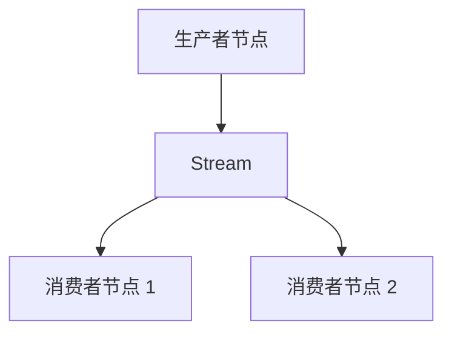

# NautilusTrader Message Bus 核心概念（中文版）

本文基于同目录的英文文档 [Message Bus](message_bus.md) 整理翻译。
它不是机械逐句直译，而是一份面向使用者的中文概念说明：在保留官方语义、API 名称、
配置字段和消息格式的同时，重点解释消息路由、不可变性、Python 与 Rust 的使用边界，
以及外部消息流的入口和出口。

## MessageBus 是什么

`MessageBus` 通过消息传递实现系统组件之间的通信。
组件不需要直接依赖彼此，因此系统可以保持松耦合。

它支持三种消息模式：

- 点对点（Point-to-Point）。
- 发布/订阅（Publish/Subscribe）。
- 请求/响应（Request/Response）。

通过 `MessageBus` 交换的消息分为三类：

- 数据（Data）。
- 事件（Events）。
- 命令（Commands）。

可以把消息总线理解为组件之间的路由层：发布者只负责把消息发往指定主题，
订阅者只关心自己订阅的主题，双方不需要持有对方的对象引用。

## 主题层级

NautilusTrader 将市场数据主题放在 `data` 根主题下。
实时数据直接发布到 `data.<kind>...`，例如：

```text
data.book.deltas.XCME.ESZ24
```

当请求数据、回放数据或工作流生成的数据以可按主题寻址的形式经过消息总线时，
`DataEngine` 会将其发布到 `data.pipeline.<kind>...`。

长请求、分组请求和聚合链可能在父请求完成前拆分、转换数据，
并将数据扇入到后续处理流程。这些仍然属于数据消息，
但不具备普通实时发布所声明的实时排序和时序语义。

例如，管道路径中的订单簿增量使用：

```text
data.pipeline.book.deltas.XCME.ESZ24
```

带关联关系的请求响应会交给按关联 ID（correlation ID）索引的响应处理器。
`data.response` 是用于捕获响应发布的通道，不是管道数据路径。

## 消息完整性

消息一旦创建，其字段就不得再被修改，其中也包括 `params` 映射等容器字段。
组件可以读取消息并据此派生本地状态，但不能改写原始消息。

消息不可变可以确保每个消费者看到相同输入，保留消息发出时的事实，
并消除一类由共享状态引发的竞态问题。回放、调试和审计也都依赖消息在分发后保持稳定。

由此产生三条所有权规则：

- 调用方提供的请求选项保留在消息上。
- 返回给调用方的响应元数据保留在响应上。
- 组件工作流状态保存在组件自己拥有的上下文中，并按消息 ID 或请求 ID 索引。

工作流状态包括限定后的日期范围、分组状态、回放游标、计数器和处理标志等。
当组件需要派生消息时，应使用所需值创建一条新消息，而不是修改原消息。

## 数据与信号发布

`MessageBus` 属于较底层的组件，用户通常不会直接与它交互。
`DataActor` 和 `Strategy` 在其上提供了类型化方法：

```python
def publish_data(self, data_type: DataType, data: CustomData) -> None:
def publish_signal(self, name: str, value, ts_event: int = 0) -> None:
```

这些方法允许 Python 组件发布自定义数据和信号，而无需暴露原始消息总线。

## 直接访问边界

Python 的 `DataActor` 和 `Strategy` API 不公开 `self.msgbus`。
Python 组件应使用自定义数据或信号完成受支持的组件间通信。
Rust 组件则可以直接使用类型化的消息总线门面。

## 消息传递方式

NautilusTrader 是事件驱动框架，组件通过发送和接收消息进行协作。
系统主要提供三种消息传递方式。

<!-- markdownlint-disable MD060 -->

| 消息方式                    | 用途           | 最适合的场景             |
| ----------------------- | ------------ | ------------------ |
| 自定义数据发布/订阅              | 交换结构化交易数据    | 交易指标、衍生指标和需要持久化的数据 |
| 信号发布/订阅                 | 发送轻量通知       | 简单告警、标志和状态更新       |
| Rust `MessageBus` 发布/订阅 | 按主题进行底层类型化通信 | 原生运行时组件            |

<!-- markdownlint-enable MD060 -->

每种方式解决的问题不同，应根据消息结构、持久化要求和组件运行语言选择。

### Rust MessageBus 主题发布/订阅

#### 概念

`MessageBus` 是 NautilusTrader 中所有消息的中心枢纽。
Rust 组件可以向命名主题发布类型化消息，也可以为主题注册订阅处理器。
这个底层接口不属于 Python Actor 或 Strategy 的公开 API。

#### 优点与适用场景

原生组件需要以下能力时，可以直接访问消息总线：

- 在系统内部进行跨组件通信。
- 自定义类型化主题和负载。
- 解耦发布者和订阅者，使双方无需相互了解。
- 将消息同时广播给多个订阅者。
- 处理不适合 Data Actor 模型的事件。
- 在高级场景中完整控制消息传递。

#### 注意事项

- 主题名称需要手动维护，拼写错误可能导致消息无法被接收。
- 消息处理器需要手动定义。

### 自定义数据发布/订阅

#### 概念

自定义数据用于在 Data Actor 与 Strategy 之间交换结构化值。
一个 `CustomData` 值携带 `DataType`、负载、事件时间戳和初始化时间戳，
以支持消息路由和事件排序。

#### 优点与适用场景

以下场景适合使用自定义数据：

- 交换市场数据、指标、自定义度量或期权 Greeks 等结构化交易数据。
- 通过内置的 `ts_event` 和 `ts_init` 保证正确事件排序，这对回测准确性至关重要。
- 通过已注册的自定义数据类完成持久化和序列化，并与数据目录集成。
- 在系统组件之间使用标准化方式交换交易数据。

#### 注意事项

- 负载必须公开 `ts_event` 和 `ts_init`。
- 如需持久化，必须注册可序列化的自定义数据类。

#### 快速示例

```python
from dataclasses import dataclass

from nautilus_trader.model import CustomData
from nautilus_trader.model import DataType


@dataclass
class GreeksData:
    delta: float
    gamma: float
    ts_event: int
    ts_init: int


data_type = DataType("GreeksData")
data = CustomData(
    data_type,
    GreeksData(
        delta=0.75,
        gamma=0.1,
        ts_event=1_630_000_000_000_000_000,
        ts_init=1_630_000_000_000_000_000,
    ),
)
self.publish_data(data_type, data)

self.subscribe_data(data_type)


def on_data(self, data: CustomData) -> None:
    if data.data_type == data_type:
        greeks = data.data
        self.log.info(f"Delta: {greeks.delta}, Gamma: {greeks.gamma}")
```

注册和持久化要求参见 [Custom data](custom_data.md)。

### 信号发布/订阅

#### 概念

信号（Signal）是 Actor 框架内发布和订阅简单通知的轻量方式。
它不要求定义自定义类，是三种方式中最容易使用的一种。

#### 优点与适用场景

以下场景适合使用信号：

- 发送 `RiskThresholdExceeded` 或 `TrendUp` 等简单通知和告警。
- 无需定义自定义类即可快速发送临时消息。
- 以简单原始值广播告警或标志。
- 通过 `publish_signal` 和 `subscribe_signal` 使用直接的 API。
- 将一条信号同时发送给多个订阅者。
- 以最少配置完成组件间通知。

#### 注意事项

- 每条信号只携带一个值。发布时该值会转换为字符串，
  因此处理器收到的 `signal.value` 始终是 `str`，复杂数据结构不会被保留。
- 在 `on_signal` 处理器中，应通过 `signal.name` 区分不同信号。

#### 快速示例

```python
# 定义信号常量以便统一管理（可选，但建议这样做）
import types

from nautilus_trader.common import LogColor
from nautilus_trader.core.datetime import unix_nanos_to_dt

signals = types.SimpleNamespace()
signals.NEW_HIGHEST_PRICE = "NewHighestPriceReached"
signals.NEW_LOWEST_PRICE = "NewLowestPriceReached"

# 在 DataActor 或 Strategy 中订阅
self.subscribe_signal(signals.NEW_HIGHEST_PRICE)
self.subscribe_signal(signals.NEW_LOWEST_PRICE)

# 在 DataActor 或 Strategy 中发布
self.publish_signal(
    name=signals.NEW_HIGHEST_PRICE,
    value=signals.NEW_HIGHEST_PRICE,  # 为简单起见，值可以与名称相同
    ts_event=bar.ts_event,  # 使用触发事件的时间戳
)


# 处理器名称固定为 on_signal
def on_signal(self, signal):
    match signal.name:
        case signals.NEW_HIGHEST_PRICE:
            self.log.info(
                f"New highest price was reached. | "
                f"Signal value: {signal.value} | "
                f"Signal time: {unix_nanos_to_dt(signal.ts_event)}",
                color=LogColor.GREEN,
            )
        case signals.NEW_LOWEST_PRICE:
            self.log.info(
                f"New lowest price was reached. | "
                f"Signal value: {signal.value} | "
                f"Signal time: {unix_nanos_to_dt(signal.ts_event)}",
                color=LogColor.RED,
            )
```

### 选择指南

<!-- markdownlint-disable MD060 -->

| 使用场景               | 推荐方式                    | 所需设置                                  |
| ------------------ | ----------------------- | ------------------------------------- |
| 原生系统级通信            | Rust `MessageBus` 发布/订阅 | 类型化主题和处理器                             |
| Python 组件间的结构化数据   | `DataActor` 自定义数据方法     | `DataType`、`CustomData` 和 `on_data()` |
| Python 组件间的简单告警和通知 | `DataActor` 信号方法        | 信号名称和 `on_signal()`                   |

<!-- markdownlint-enable MD060 -->

## 外部出口与入口

`MessageBus` 可以把序列化消息写入外部 Stream。
Rust 原生实盘节点通过注入的 `MessageBusExternalEgress` 和
`MessageBusExternalIngress` 接口连接外部总线。

这样，核心节点无需依赖 Redis、消息代理、共享内存实现或套接字协议。

:::info
Redis 是可序列化消息内置支持的外部后端。最低支持 Redis 6.2，
因为自动裁剪功能依赖该版本提供的 `MINID` Stream 裁剪。
:::

### 外发消息格式

配置外部出口后，发布消息会先分发给进程内订阅者，
随后序列化为现有的 `BusMessage` 线格式：

- `topic`：内部发布调用使用的准确消息总线主题，例如
  `data.quotes.BINANCE.BTCUSDT` 或 `events.order.S-001`。
- `type`：规范的负载类型名称，例如 `QuoteTick` 或 `OrderEventAny`。
- `encoding`：根据消息总线编码策略选择的负载编码。
- `payload`：按所选编码序列化后的字节。

直接写入 Redis Stream 的外部生产者必须提供 `topic`、`type` 和 `payload`。
`topic` 必须是有效的发布主题，不能包含 `*` 或 `?`。
`encoding` 可省略，省略时默认为 JSON。

接收节点会跳过缺少 `type` 的条目，因为此时无法选择负载解码器。

外部出口以 `publish(BusMessage)` 的形式接收该记录。
这个外发调用不得阻塞节点的消息总线线程。
具有容量上限的出口实现在队列已满时会丢弃消息，而不会向交易循环施加背压。
关闭消息总线时，也会关闭已配置的出口。

### 入站消息处理

入站外部 Stream 通过独立的 Rust `MessageBusExternalIngress` trait 暴露。
入口返回相同形状的 `BusMessage { topic, payload_type, encoding, payload }`。

`republish_external_message` 会解码受支持的入站消息，并将其重新发布到内部，
但不会再次把消息转发到外部，从而避免消息回环。

接收方消息总线必须先为流式传输注册入站负载类型。
未注册的类型会被跳过，并且不会尝试解码。

### 自定义数据 Envelope

对于自定义数据，出口写入 Redis `payload` 字段、入口从该字段读取的是一个 Envelope，
而不是裸的自定义对象。规范 JSON Envelope 如下：

```json
{
  "type": "MyData",
  "data_type": {
    "type_name": "MyData",
    "metadata": {
      "source": "external"
    },
    "identifier": "optional-storage-key"
  },
  "payload": {
    "value": 42,
    "ts_event": 0,
    "ts_init": 0
  }
}
```

Envelope 要求包含 `type` 和 `payload`。
入站时 `data_type` 可省略；省略后，系统会使用无元数据、无标识符的消息类型作为默认值。

在规范的外发格式中：

- `data_type.type_name` 使用相同的自定义类型名称。
- `metadata` 是一个对象，可以为空。
- 只有已赋值时才会包含 `identifier`。
- Envelope 的 `type` 必须与 Redis Stream 记录的 `type` 一致。
- `payload` 是传给已注册类 `from_json(...)` 方法的裸对象。

MessagePack 使用相同的映射字段，只是将其编码为 MessagePack 字节。

Python 自定义数据类必须在节点启动前注册：

```python
from nautilus_trader.model import register_custom_data_class

register_custom_data_class(MyData)
```

外部客户端订阅会为流式传输注册负载类型，
而 `register_custom_data_class(...)` 会安装进程级 JSON 解码器。
两种注册都必须完成。

类的具体要求参见
[Custom data：Registration architecture](custom_data.md#registration-architecture)。

### Redis 外发任务

使用 Redis 时，消息会通过多生产者、单消费者（MPSC）通道传给独立 Rust 任务，
该任务负责把消息写入 Redis Stream。

将 I/O 转移到独立任务，可以防止发布线程被阻塞。

### 各编码支持的外发类型

使用 MessagePack 或 JSON 时，Rust 原生外部出口会转发可序列化的类型化发布，
包括：

- 工具、报价、成交、K 线、订单簿增量和十档深度快照。
- 标记价格、指数价格、资金费率和期权 Greeks（`OptionGreeks`）更新。
- 账户状态、Portfolio 快照、订单事件、持仓事件和自定义数据。
- 启用 `defi` feature 后的 DeFi 区块、池、流动性更新、手续费收取和闪电事件。

以下类型不会被转发，因为它们没有实现 Serde 序列化：

- 完整订单簿快照。
- `GreeksData` 记录。
- 期权链切片。
- DeFi 池交换（pool swaps）。

使用 SBE 或 Cap'n Proto 时，Rust 原生外部出口会通过 Schema 编解码器转发内置市场数据：

- 报价、成交和 K 线。
- 订单簿增量和十档深度快照。
- 标记价格、指数价格和资金费率更新。
- 期权 Greeks。

选择这些 Schema 编码时，其他负载类型会被丢弃，并记录一条 debug 日志。

## 配置

消息总线外部后端由行为配置和后端技术自身的配置共同组成。
`MessageBusConfig` 控制消息总线行为，`RedisMessageBusConfig` 保存 Redis 连接设置，
并实现 `MessageBusBackingFactory`。

```rust
use nautilus_common::{
    enums::SerializationEncoding,
    msgbus::{MessageBusBackingFactory, MessageBusConfig},
};
use nautilus_infrastructure::redis::msgbus::RedisMessageBusConfig;

let config = MessageBusConfig {
    encoding: SerializationEncoding::Json,
    encoding_market_data: Some(SerializationEncoding::Sbe),
    timestamps_as_iso8601: true,
    buffer_interval_ms: Some(100),
    autotrim_mins: Some(30),
    use_trader_prefix: true,
    use_trader_id: true,
    use_instance_id: false,
    streams_prefix: "streams".to_string(),
    types_filter: Some(vec!["QuoteTick".to_string(), "TradeTick".to_string()]),
    ..Default::default()
};

let redis_config = RedisMessageBusConfig::default();
let backing = redis_config.create(trader_id, instance_id, config.clone())?;
```

现有 Rust 调用方可以继续使用 `RedisMessageBusFactory::new(redis_config)`，
该包装器会把工作委托给配置实现。

### 后端配置

使用内置 Redis 后端时必须提供 `RedisMessageBusConfig`。
对于本机回环地址上的默认 Redis 设置，可以传入 `RedisMessageBusConfig::default()`。

Rust 通过具体类型显式选择 Redis。
配置中不存在面向用户的 `type = "redis"` 或 `backing_type = "redis"` 选择器。

Rust 原生调用方可以使用 `LiveNodeBuilder::with_external_msgbus_egress`
注入 `MessageBusExternalEgress`。具体连接信息应在构造该出口接口时传入，
核心消息总线无需为注入式出口提供 `RedisMessageBusConfig`。

Rust 实盘运行时接受 `MessageBusConfig.external_streams`。
调用方通过 `LiveNodeBuilder::with_external_ingress` 注入 `MessageBusExternalIngress` 后，
运行时会消费入站 `BusMessage`。

配置只负责命名外部 Stream Key，注入的入口才是实际运行时数据源。

Rust 调用方也可以通过 `LiveNodeBuilder::with_external_msgbus_factory`
安装 `RedisMessageBusConfig`。如果同时配置工厂与单独注入的出口或入口，构建会失败。
工厂总是安装出口，并且仅在 `external_streams` 非空时创建入口。

Python 为内置后端配置提供相同的 Builder 方法，目前支持 `RedisMessageBusConfig`。
现有的 `RedisMessageBusFactory` 包装器仍受支持，但 Python 不接受任意工厂类。

内置 Redis 入口会从节点启动时的当前时间戳开始读取每个已配置的 Stream，
因此不会回放节点启动前已经存在的条目。

启动后，入口会推进每个 Stream 的最后已读 ID，连接重试时也会保留这些 ID。
如需可靠回放启动前的数据，应使用缓存恢复或事件存储。
`external_streams` 提供的是实时转发，而不是消费者组积压队列。

### 编码

Rust 原生外部消息总线出口支持以下编码名称：

- JSON（`json`）。
- MessagePack（`msgpack`）。
- Cap'n Proto（`capnp`，要求启用 Rust `capnp` feature）。
- SBE（`sbe`，要求启用 Rust `sbe` feature）。

使用 `encoding` 配置写入消息所用的默认编码。
`encoding_market_data` 可以覆盖由外部总线二进制编解码器支持的市场数据负载编码。
`encoding_builtin` 可以覆盖账户状态、Portfolio 快照、订单事件和持仓事件的编码。

自定义类型和未映射负载类型始终使用 `encoding`。

`MessageBusConfig::validate` 要求默认 `encoding` 支持自定义负载，
因此默认编码只能是 JSON 或 MessagePack。

类别级覆盖编码必须得到该类别内每一种已发布负载类型的支持。
SBE 和 Cap'n Proto 当前只能用于 `encoding_market_data`，
并且必须启用对应的 Rust feature。

在 Schema 编解码器覆盖内置事件类别前，
`encoding_builtin = "sbe"` 和 `encoding_builtin = "capnp"` 都会校验失败。

Redis 缓存的负载路径仅支持 MessagePack 和 JSON。
SBE 与 Cap'n Proto 是 Rust 原生外部消息总线出口的 Schema 负载编码，
不是 Redis 缓存编码；为 Redis 缓存负载选择其中任一种都会报错。

:::tip
默认使用 `json`，便于人类阅读并与其他系统互操作。
如果更关注负载大小和序列化性能，可以使用 `msgpack`。
:::

### 时间戳格式

默认情况下，时间戳格式为 UNIX Epoch 纳秒整数。
将 `timestamps_as_iso8601` 设为 `true`，可以改用 ISO 8601 字符串格式。

### 消息 Stream Key

消息 Stream Key 用于标识各 Trader 节点并组织 Stream 中的消息。
`trader-` 前缀、Trader ID 和实例 ID 都是可选段，由下述配置项控制；
Streams 前缀始终存在。

所有段都启用时，Trader Key 结构如下：

```text
trader-{trader_id}:{instance_id}:{streams_prefix}
```

使用默认配置时，`use_trader_prefix` 和 `use_trader_id` 启用，
`use_instance_id` 禁用，因此基础 Stream Key 为：

```text
trader-{trader_id}:{streams_prefix}
```

这些选项控制 Redis Stream Key，不会改写传给注入式
`MessageBusExternalEgress` 的 `topic`；该主题仍是内部消息总线的发布主题。

当 `stream_per_topic` 为 `True` 时，Redis 出口会把主题追加到 Stream Key。
为 `False` 时，Redis 将所有消息写入基础 Stream Key，并把主题保留为消息字段。

#### Trader 前缀

`use_trader_prefix` 控制 Key 是否以 `trader-` 开头。

#### Trader ID

`use_trader_id` 控制 Key 是否包含节点的 Trader ID。

#### 实例 ID

每个 Trader 节点都会获得一个唯一的 UUIDv4 实例 ID。
消息分布在多个 Stream 时，可以通过实例 ID 区分不同 Trader 实例。

将 `use_instance_id` 设为 `True`，即可把实例 ID 加入 Trader Key。
在多节点交易系统中跨多个 Stream 跟踪和识别 Trader 时，这一设置尤其有用。

#### Streams 前缀

`streams_prefix` 字符串可以把单个 Trader 实例的所有 Stream 分组，
也可以组织多个实例的消息。

如果希望 Stream Key 只使用该值，应设置 `streams_prefix`，
并将其他 Key 前缀选项设为 `false`。

#### 每个主题一个 Stream

`stream_per_topic` 控制生产者是否为每个主题写入独立 Stream。
这对 Redis 后端尤其相关，因为 Redis 监听 Stream 时不支持通配主题。

设为 `False` 后，所有消息都会写入同一个 Stream。

:::info
Redis 不支持通配 Stream 主题。为获得更好的 Redis 兼容性，建议将该选项设为 `False`。
:::

### 类型过滤

如果已经配置并启用消息总线后端，发布到消息总线的消息会被序列化并写入 Stream。
为了避免高频报价等数据淹没 Stream，可以阻止特定消息类型向外部发布。

将负载类型名称列表传给消息总线配置的 `types_filter` 参数即可启用过滤。
列表中的类型会从外部发布中排除。

```python
from nautilus_trader.config import MessageBusConfig

# 创建启用类型过滤的 MessageBusConfig
message_bus = MessageBusConfig(types_filter=["QuoteTick", "TradeTick"])
```

### Stream 自动裁剪

使用 `autotrim_mins` 设置以分钟为单位的回看窗口，
使用 `autotrim_maxlen` 设置每个 Redis Stream 的近似最大条目数。
两种策略可以单独配置，也可以同时启用。

同时设置时，消息总线会删除超过时间窗口或超过条目数量阈值的条目。

Redis 会使用近似裁剪执行 `autotrim_maxlen`，以获得更好的写入性能，
因此实际 Stream 可能略微超过所配置的条目数阈值。

:::info
Redis 实现对每个 Stream 最多每分钟裁剪一次，
因此条目保留时间可能比 `autotrim_mins` 窗口多出大约一分钟。
:::

## 外部 Stream

`LiveNode` 内部的消息总线称为“内部消息总线”。
生产者节点把消息发布到外部 Stream，消费者节点监听这些 Stream，
接收并反序列化消息负载，然后发布到自己的内部消息总线。



:::tip
将 `LiveDataEngineConfig.external_clients` 设置为代表外部流式客户端的 `client_id` 列表。
`DataEngine` 会过滤发往这些客户端的订阅命令，
确保对这些客户端的订阅由外部流式传输提供所需数据。

Rust `DataEngine` 跳过外部客户端订阅时，会为消息总线上的入站重新发布注册对应的流式负载类型。
:::

### 配置示例

以下示例展示一套流式传输配置：生产者节点向外部发布 Binance 数据，
下游消费者节点再把这些数据消息发布到自己的内部消息总线。

#### 生产者节点

生产者节点的 `MessageBus` 被配置为向 `"binance"` Stream 发布消息。
`use_trader_id`、`use_trader_prefix` 和 `use_instance_id` 均设为 `false`，
从而产生简单、可预测且便于消费者注册的 Stream Key。

```rust
let message_bus = MessageBusConfig {
    use_trader_id: false,
    use_trader_prefix: false,
    use_instance_id: false,
    streams_prefix: "binance".to_string(), // <---
    stream_per_topic: false,
    autotrim_mins: Some(30),
    ..Default::default()
};

let redis_config = RedisMessageBusConfig {
    connection_timeout: 2,
    response_timeout: 2,
    ..Default::default()
};

let mut node = LiveNode::builder(trader_id, Environment::Live)?
    .with_msgbus_config(message_bus)
    .with_external_msgbus_factory(Box::new(redis_config))
    .build()?;
node.run().await?;
```

#### 消费者节点

消费者节点的 `MessageBus` 被配置为从同一个 `"binance"` Stream 接收消息。
`RedisMessageBusConfig` 根据 `external_streams` 创建入口，
`LiveNode::run` 则把收到的消息发布到节点内部消息总线。

示例把 `"BINANCE_EXT"` 声明为外部客户端，
使 `DataEngine` 不会尝试向该客户端 ID 发送数据命令。

```rust
let data_engine = LiveDataEngineConfig {
    external_clients: Some(vec![ClientId::from("BINANCE_EXT")]),
    ..Default::default()
};

let message_bus = MessageBusConfig {
    external_streams: Some(vec!["binance".to_string()]), // <---
    ..Default::default()
};

let redis_config = RedisMessageBusConfig {
    connection_timeout: 2,
    response_timeout: 2,
    ..Default::default()
};

let mut node = LiveNode::builder(trader_id, Environment::Live)?
    .with_data_engine_config(data_engine)
    .with_msgbus_config(message_bus)
    .with_external_msgbus_factory(Box::new(redis_config))
    .build()?;
node.run().await?;
```

## 相关指南

- [Actors（中文版）](actors.zh-CN.md)：Actor 通过消息总线处理事件。
- [Architecture（中文版）](architecture.zh-CN.md)：消息总线在系统架构中的作用。
