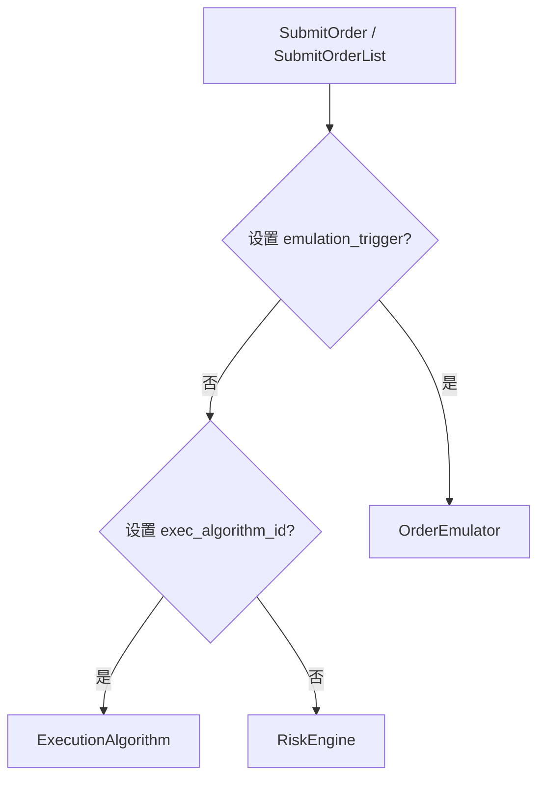

# NautilusTrader Strategies 核心概念（中文版）

本文基于同目录的英文文档和
[官网最新版 Strategies](https://nautilustrader.io/docs/latest/concepts/strategies/) 整理翻译。
它不是逐句直译，而是一份面向策略开发者的中文概念说明：在保留官方语义和 API 名称的同时，
重点解释策略生命周期、事件回调、交易命令路由、受控退出和多策略标识。

阅读本文前，建议先了解 [Actors 核心概念](actors.zh-CN.md)。`Strategy` 继承 `DataActor` 的
数据请求、订阅、定时器和状态管理能力，并在此基础上增加订单与持仓管理。

## Strategy 是什么

一个 NautilusTrader 策略通常由两部分组成：

- 策略实现：继承 `Strategy` 类并实现所需逻辑。
- 可选策略配置：继承 `StrategyConfig` 类，描述策略的构造参数。

策略提供以下能力：

- 请求历史数据。
- 订阅实时数据。
- 设置时间提醒和定时器。
- 访问中央缓存。
- 查询账户、持仓和风险敞口。
- 创建、提交、修改和取消订单。
- 管理订单、持仓和退出流程。

同一个策略实现可以加入回测、沙盒或实盘环境。只要策略没有把环境差异写入交易逻辑，
同一份源代码就可以同时用于回测和实盘交易。

NautilusTrader 提供的是一组通用的数据接入、事件处理和订单管理构件，
因此可以承载趋势、动量、再平衡、配对、做市等不同类型的策略。

:::info Rust 实现
Rust 策略实现所需的 `DataActor` 回调，并使用 `nautilus_strategy!` 生成 `Strategy` 实现。
随后可通过 `self` 上的 `clock()`、`cache()`、`order()` 和 `portfolio()` 等门面方法访问系统能力。

`DataActorNative` 用于原生运行时接线和 Actor 核心状态；`StrategyNative` 提供订单工厂、
订单管理器和 Portfolio 等借用状态。仅在同一二进制的性能路径或内部运行时接线中导入它们。
:::

## 策略实现

Python 策略继承 `Strategy`。构造函数至少必须初始化父类：

```python
from nautilus_trader.trading import Strategy


class MyStrategy(Strategy):
    def __init__(self) -> None:
        super().__init__()
```

在此基础上，实现策略需要的生命周期、数据、订单和持仓回调。

:::warning
策略在 `__init__` 返回后才注册到 Trader。注册前访问 `clock`、`cache`、`portfolio`
或 `order_factory` 会抛出 `RuntimeError`。

构造函数只初始化普通状态；访问系统组件、请求数据和发送命令等操作应放在 `on_start()` 中。
:::

## 回调与分发规则

`Strategy` 回调以 `on_*` 命名，在状态变化或事件到达时执行。
策略只需要实现自身逻辑实际使用的回调。

同类事件通常同时提供专用回调和通用回调。系统按“最具体 → 最通用”的顺序调用，
从而允许策略在专用处理器中处理细节，并在通用处理器中集中记录或审计。

:::warning
实时订阅数据、订单事件和持仓事件只在策略处于 `RUNNING` 状态时分发。
其他状态下到达的消息会被记录，但不会交给策略回调。

历史请求响应不受这个状态门控限制。即使策略已经停止，晚到的响应仍可能进入
`on_historical_*` 回调，因此这些处理器必须能安全地处理停止后的响应。
:::

### 生命周期回调

生命周期变化会触发以下回调：

<!-- markdownlint-disable MD060 -->

| 回调             | 用途                       |
| -------------- | ------------------------ |
| `on_start()`   | 获取工具、注册指标、请求历史数据并订阅实时数据。 |
| `on_stop()`    | 取消订单、平仓、取消订阅并清理资源。       |
| `on_resume()`  | 恢复暂停或降级后的运行资源。           |
| `on_reset()`   | 重置策略运行状态。                |
| `on_dispose()` | 释放剩余资源。                  |
| `on_degrade()` | 进入降级模式并暂停非必要功能。          |
| `on_fault()`   | 处理故障状态。                  |
| `on_save()`    | 返回需要保存的用户状态字典。           |
| `on_load()`    | 从已保存的状态字典恢复用户状态。         |

<!-- markdownlint-enable MD060 -->

状态保存与加载的接口如下：

```python
def on_save(self) -> dict[str, bytes]:
    return {
        "custom_state": self.custom_state_bytes,
    }


def on_load(self, state: dict[str, bytes]) -> None:
    self.custom_state_bytes = state["custom_state"]
```

策略应只保存真正需要跨重启恢复的用户状态。订单、持仓和账户等权威状态由 NautilusTrader
的缓存、执行协调和持久化边界管理，不应在策略内另建一套相互竞争的权威状态。

### 数据回调

策略继承 Actor 的数据回调。实时订阅更新进入单条数据处理器，历史请求响应进入
`on_historical_*` 批量处理器。

<!-- markdownlint-disable MD060 -->

| 数据类别   | 实时处理器                    | 历史请求处理器                         |
| ------ | ------------------------ | ------------------------------- |
| 订单簿增量  | `on_book_deltas()`       | `on_historical_book_deltas()`   |
| 订单簿深度  | `on_book_depth()`        | `on_historical_book_depth()`    |
| 订单簿快照  | `on_book()`              | `on_book()`                     |
| 报价     | `on_quote()`             | `on_historical_quotes()`        |
| 成交     | `on_trade()`             | `on_historical_trades()`        |
| K 线    | `on_bar()`               | `on_historical_bars()`          |
| 标记价格   | `on_mark_price()`        | `on_historical_mark_prices()`   |
| 指数价格   | `on_index_price()`       | `on_historical_index_prices()`  |
| 资金费率   | `on_funding_rate()`      | `on_historical_funding_rates()` |
| 工具定义   | `on_instrument()`        | `on_instrument()`               |
| 工具状态   | `on_instrument_status()` | -                               |
| 工具收盘   | `on_instrument_close()`  | -                               |
| 期权希腊字母 | `on_option_greeks()`     | -                               |
| 期权链切片  | `on_option_chain()`      | -                               |
| 自定义数据  | `on_data()`              | `on_historical_data()`          |
| 信号     | `on_signal()`            | -                               |

<!-- markdownlint-enable MD060 -->

操作与回调的完整对应关系参见
[Actors：常用操作与处理器](actors.zh-CN.md#常用操作与处理器)。

### 订单事件回调

订单事件依次进入：

1. 具体订单事件处理器，例如 `on_order_accepted()` 或 `on_order_rejected()`。
1. 通用处理器 `on_order_event()`。

常用订单回调包括：

```python
def on_order_initialized(self, event: OrderInitialized) -> None:
def on_order_denied(self, event: OrderDenied) -> None:
def on_order_emulated(self, event: OrderEmulated) -> None:
def on_order_released(self, event: OrderReleased) -> None:
def on_order_submitted(self, event: OrderSubmitted) -> None:
def on_order_rejected(self, event: OrderRejected) -> None:
def on_order_accepted(self, event: OrderAccepted) -> None:
def on_order_canceled(self, event: OrderCanceled) -> None:
def on_order_expired(self, event: OrderExpired) -> None:
def on_order_triggered(self, event: OrderTriggered) -> None:
def on_order_pending_update(self, event: OrderPendingUpdate) -> None:
def on_order_pending_cancel(self, event: OrderPendingCancel) -> None:
def on_order_modify_rejected(self, event: OrderModifyRejected) -> None:
def on_order_cancel_rejected(self, event: OrderCancelRejected) -> None:
def on_order_updated(self, event: OrderUpdated) -> None:
def on_order_filled(self, event: OrderFilled) -> None:
def on_order_fill_voided(self, event: OrderFillVoided) -> None:
def on_order_event(self, event: Any) -> None:
```

Python API 不公开统一的 `OrderEvent` 基类。`on_order_event()` 收到的是与专用处理器相同的
具体事件对象，例如 `OrderAccepted`。

### 持仓事件回调

持仓事件使用相同的两级分发顺序：

1. `on_position_opened()`、`on_position_changed()` 或 `on_position_closed()`。
1. 通用处理器 `on_position_event()`。

```python
def on_position_opened(self, event: PositionOpened) -> None:
def on_position_changed(self, event: PositionChanged) -> None:
def on_position_closed(self, event: PositionClosed) -> None:
def on_position_event(self, event: Any) -> None:
```

Python API 同样不公开统一的 `PositionEvent` 基类，通用回调收到具体持仓事件对象。

计时事件使用 `on_time_event()`，订单聚合事件使用 `on_order_event()`，持仓聚合事件使用
`on_position_event()`。Python API 不提供通用的 `on_event()` 回调。

### 启动处理示例

下面的 `on_start()` 展示典型策略启动流程：先确认工具已进入缓存，再注册指标、
请求历史 K 线并订阅实时数据。

```python
def on_start(self) -> None:
    self.instrument = self.cache.instrument(self.instrument_id)
    if self.instrument is None:
        self.log.error(f"Could not find instrument for {self.instrument_id}")
        self.stop()
        return

    # 注册需要由 K 线更新的指标
    self.register_indicator_for_bars(self.bar_type, self.fast_ema)
    self.register_indicator_for_bars(self.bar_type, self.slow_ema)

    # 请求历史数据，并订阅实时数据
    self.request_bars(self.bar_type)
    self.subscribe_bars(self.bar_type)
    self.subscribe_quotes(self.instrument_id)
```

实盘中的缓存检查非常重要。直接订阅默认工具已经由 Instrument Provider 配置加载，
或由更早的工具请求写入缓存；如果工具不存在，应停止策略而不是继续构造订单。

注册到 K 线的指标会先接收请求响应中的历史 K 线，然后系统才调用
`on_historical_bars()`。因此历史请求可以预热指标，但策略在使用指标值前仍应检查
`indicators_initialized()`。

## 时钟与定时器

策略通过 `self.clock` 获取时间，并创建产生 `TimeEvent` 的时间提醒或周期定时器。

获取带时区的当前 UTC 时间：

```python
from datetime import datetime


now: datetime = self.clock.utc_now()
```

获取从 UNIX epoch 开始的纳秒时间戳：

```python
unix_nanos: int = self.clock.timestamp_ns()
```

设置一分钟后触发的一次性提醒：

```python
from datetime import timedelta


self.clock.set_time_alert(
    name="MyStrategy.TimeAlert1",
    alert_time=self.clock.utc_now() + timedelta(minutes=1),
)
```

设置每分钟触发一次的周期定时器：

```python
from datetime import timedelta


self.clock.set_timer(
    name="MyStrategy.Timer1",
    interval=timedelta(minutes=1),
)
```

定时器建立后开始计时，默认在一个完整间隔后首次触发；设置 `fire_immediately=True`
可在开始时间立即触发。实盘中的时间提醒可能出现几微秒级延迟。

不提供 `callback` 时，事件进入 `on_time_event()`；提供回调时，事件直接进入指定方法。
定时器名称共享时钟命名空间，因此应包含策略标识并在停止时主动取消。

## 缓存访问

Trader 的中央 `Cache` 保存行情数据和订单、持仓等执行对象。
多数查询支持筛选；请求的数据不存在时，基础查询通常返回 `None`。

```python
last_quote = self.cache.quote(self.instrument_id)
last_trade = self.cache.trade(self.instrument_id)
last_bar = self.cache.bar(self.bar_type)

order = self.cache.order(client_order_id)
position = self.cache.position(position_id)
```

缓存是策略读取当前系统状态的主要入口。不要假设任何查询必然有结果，
尤其是在实盘启动、恢复或数据尚未到达的阶段。

## Portfolio 访问

Trader 的中央 `Portfolio` 提供账户、持仓、损益、保证金和风险敞口查询。

<!-- markdownlint-disable MD060 -->

| 查询类型      | 常用 API                                                |
| --------- | ----------------------------------------------------- |
| 账户        | `account()`。                                          |
| 锁定余额      | `balances_locked()`。                                  |
| 初始保证金     | `instrument_initial_margins()`。                       |
| 维持保证金     | `instrument_maintenance_margins()`。                   |
| 未实现损益     | `unrealized_pnl()` / `unrealized_pnls()`。             |
| 已实现损益     | `realized_pnl()` / `realized_pnls()`。                 |
| 总损益       | `total_pnl()` / `total_pnls()`。                       |
| 净敞口       | `net_exposure()` / `net_exposures()`。                 |
| 净持仓       | `net_position()`。                                     |
| 持仓方向      | `is_net_long()` / `is_net_short()` / `is_net_flat()`。 |
| 账户是否完全净平  | `is_completely_net_flat()`。                           |
| 绩效统计和账户快照 | `statistics()` / `snapshots(account_id)`。             |

<!-- markdownlint-enable MD060 -->

多数查询可接受 `account_id`，部分聚合查询也接受 `venue` 和 `target_currency`。
如果同时提供 `venue` 和 `account_id`，二者必须解析到同一账户，否则查询抛出 `ValueError`。

Portfolio 向策略公开查询接口，改变引擎状态的内部命令仍保留在 Rust 运行时中。
权益、盯市估值和多账户查询范围参见 [Portfolio](portfolio.md)。

## 交易命令

`Strategy` 提供 `OrderFactory`，用于以较少样板代码创建各种订单。
也可以直接调用具体订单类型的构造函数，但工厂方法通常更清晰并与策略上下文集成。

### 提交订单

`SubmitOrder` 和 `SubmitOrderList` 的第一跳由订单参数决定：



- 设置 `emulation_trigger` 时，订单首先发送到 `OrderEmulator`。
- 未设置模拟触发但设置 `exec_algorithm_id` 时，订单首先发送到对应的 `ExecutionAlgorithm`。
- 两者都未设置时，订单首先发送到 `RiskEngine`。

如果同时指定订单模拟和执行算法，订单先进入 `OrderEmulator`，释放后再路由到
`ExecutionAlgorithm`。

下面创建并提交一个由最新价触发模拟的限价买单：

```python
from nautilus_trader.model import LimitOrder
from nautilus_trader.model import OrderSide
from nautilus_trader.model import Price
from nautilus_trader.model import TriggerType


def buy(self) -> None:
    order: LimitOrder = self.order_factory.limit(
        instrument_id=self.instrument_id,
        order_side=OrderSide.BUY,
        quantity=self.instrument.make_qty(self.trade_size),
        price=Price.from_str("5000.00"),
        emulation_trigger=TriggerType.LAST_PRICE,
    )

    self.submit_order(order)
```

下面把一个市价买单交给 TWAP 执行算法：

```python
from nautilus_trader.model import ExecAlgorithmId
from nautilus_trader.model import MarketOrder
from nautilus_trader.model import OrderSide
from nautilus_trader.model import TimeInForce


def buy_with_twap(self) -> None:
    order: MarketOrder = self.order_factory.market(
        instrument_id=self.instrument_id,
        order_side=OrderSide.BUY,
        quantity=self.instrument.make_qty(self.trade_size),
        time_in_force=TimeInForce.FOK,
        exec_algorithm_id=ExecAlgorithmId("TWAP"),
        exec_algorithm_params={"horizon_secs": "20", "interval_secs": "2.5"},
    )

    self.submit_order(order)
```

### 取消订单

策略可以取消单个订单、批量取消订单，或按工具取消全部订单，并可选择按方向过滤。

订单已经关闭或处于待取消状态时，系统记录警告。订单当前处于打开状态时，
取消命令会使其状态变为 `PENDING_CANCEL`。

不同取消命令的路由如下：

<!-- markdownlint-disable MD060 -->

| 命令                    | 路由规则                                                               |
| --------------------- | ------------------------------------------------------------------ |
| `cancel_order()`      | 模拟订单进入 `OrderEmulator`；本地活动的算法订单进入对应执行算法；其他订单进入 `ExecutionEngine`。 |
| `cancel_all_orders()` | 打开或在途订单进入 `ExecutionEngine`；模拟订单进入 `OrderEmulator`；算法订单逐个取消。       |
| `cancel_orders()`     | 始终作为一个 `BatchCancelOrders` 命令进入 `ExecutionEngine`。                 |

<!-- markdownlint-enable MD060 -->

命令离开策略后，相关的托管 GTD 定时器也会被取消。

```python
# 取消单个订单
self.cancel_order(order.client_order_id)

# 取消同一工具的一组订单
self.cancel_orders(
    [
        order1.client_order_id,
        order2.client_order_id,
        order3.client_order_id,
    ],
)

# 取消该工具的全部订单
self.cancel_all_orders(self.instrument_id)
```

批量取消中的所有订单必须属于同一工具，且不能包含模拟订单或本地订单。

### 修改订单

可以修改模拟订单，或在场所处于打开状态且场所支持修改的订单。
订单已经关闭或处于待取消状态时，系统记录警告；打开订单的状态会变为 `PENDING_UPDATE`。

:::warning
修改命令至少要有一个值与原订单不同，否则命令无效。
:::

`ModifyOrder` 的路由规则：

- 当前为模拟订单时，首先发送到 `OrderEmulator`。
- 其他订单首先发送到 `RiskEngine`。
- 与取消命令不同，修改命令不会路由到执行算法。

```python
from nautilus_trader.model import Quantity


new_quantity: Quantity = Quantity.from_int(5)
self.modify_order(
    order.client_order_id,
    quantity=new_quantity,
)
```

在模拟器或场所支持的情况下，也可以修改价格和触发价格。

`modify_orders()` 将多项修改作为一个 `BatchModifyOrders` 命令发送到 `RiskEngine`。
与批量取消相同，所有订单必须属于同一工具，且不能包含模拟订单或本地订单。

## 受控市场退出

`market_exit()` 为单个策略提供受控退出流程：取消策略的全部订单并平掉全部持仓。
退出完成后策略仍保持运行，因此以后可以重新入场。

```python
self.market_exit()
```

如果策略不处于 `RUNNING` 状态，或已有退出流程正在执行，调用只记录警告并返回。

退出流程依次执行：

1. 调用 `on_market_exit()`。
1. 取消策略的所有打开和在途订单。
1. 使用带 `MARKET_EXIT` 标签的市价单关闭全部持仓。
1. 按 `market_exit_interval_ms` 定期检查，直到订单完成且持仓关闭。
1. 如果没有活动订单但持仓仍未关闭，再次提交平仓单。
1. 净平后调用 `post_market_exit()`；达到 `market_exit_max_attempts` 时也会结束流程，
   并记录仍未完成的订单和持仓。

策略可以在退出开始和完成时执行自定义逻辑：

```python
class MyStrategy(Strategy):
    def on_market_exit(self) -> None:
        self.log.info("Beginning market exit")

    def post_market_exit(self) -> None:
        self.log.info("Market exit complete")
```

退出期间，非只减仓订单会以 `MARKET_EXIT_IN_PROGRESS` 为原因被自动拒绝。
退出流程自己的平仓单带有 `MARKET_EXIT` 标签，因此可以通过。

对于订单列表，只要其中一个订单不是只减仓，整个列表都会被拒绝，
以保留括号订单等相互依赖订单的整体语义。

策略产生新订单前可以检查退出状态：

```python
def on_quote(self, tick: QuoteTick) -> None:
    if self.is_exiting():
        return

    # 正常订单逻辑
```

设置 `manage_stop=True` 后，调用 `stop()` 会先执行市场退出，净平后再停止策略：

```python
config = StrategyConfig(manage_stop=True)
```

市场退出相关配置：

<!-- markdownlint-disable MD060 -->

| 配置项                         | 默认值     | 作用                |
| --------------------------- | ------- | ----------------- |
| `manage_stop`               | `False` | 停止前是否自动执行市场退出。    |
| `market_exit_interval_ms`   | `100`   | 两次退出完成状态检查之间的毫秒数。 |
| `market_exit_max_attempts`  | `100`   | 结束退出流程前允许的最大检查次数。 |
| `market_exit_time_in_force` | `GTC`   | 平仓市价单使用的有效期类型。    |
| `market_exit_reduce_only`   | `True`  | 平仓市价单是否设置为只减仓。    |

<!-- markdownlint-enable MD060 -->

如果只想快速净平而不运行完整的市场退出流程，可使用 `close_position()` 或
`close_all_positions()`。二者提交平仓市价单，同时允许策略继续发送新订单。

## 策略配置

独立配置类可以明确策略在何处以及如何实例化。配置能够在线路上传输，
从而支持分布式回测和远程实盘交易。

配置是可选能力。简单策略可以直接把参数传给构造函数；需要分布式回测或远程实盘时，
则应定义可序列化配置。

### `StrategyConfig` 构造语义

`StrategyConfig` 在 Rust 中实现：`__new__` 构造并验证基础字段，`__init__` 本身不执行工作。
子类在 `__init__` 中保存自己的字段，并在 `__new__` 中把 `strategy_id`、`order_id_tag`
等基础字段转发给父类。

在 `__new__` 中移除子类字段，可以避免自定义字段名称被错误匹配为父类字段。

下面的配置将工具、K 线类型、EMA 周期和精确的交易数量参数化：

```python
from decimal import Decimal

from nautilus_trader.config import StrategyConfig
from nautilus_trader.model import Bar
from nautilus_trader.model import BarType
from nautilus_trader.model import InstrumentId
from nautilus_trader.model import StrategyId
from nautilus_trader.trading import Strategy


class MyStrategyConfig(StrategyConfig):
    _CUSTOM_FIELDS = (
        "instrument_id",
        "bar_type",
        "fast_ema_period",
        "slow_ema_period",
        "trade_size",
    )

    def __new__(cls, *args, **kwargs):
        for field in cls._CUSTOM_FIELDS:
            kwargs.pop(field, None)
        return super().__new__(cls, *args, **kwargs)

    def __init__(
        self,
        instrument_id: InstrumentId,
        bar_type: BarType,
        trade_size: Decimal,
        fast_ema_period: int = 10,
        slow_ema_period: int = 20,
        **_kwargs,
    ) -> None:
        super().__init__()
        self.instrument_id = instrument_id
        self.bar_type = bar_type
        self.trade_size = trade_size
        self.fast_ema_period = fast_ema_period
        self.slow_ema_period = slow_ema_period


class MyStrategy(Strategy):
    def __init__(self, config: MyStrategyConfig) -> None:
        super().__init__(config)

        # 策略自身的运行时状态
        self.time_started = None
        self.count_of_processed_bars: int = 0

    def on_start(self) -> None:
        self.time_started = self.clock.utc_now()
        self.subscribe_bars(self.config.bar_type)

    def on_bar(self, bar: Bar) -> None:
        self.count_of_processed_bars += 1


config = MyStrategyConfig(
    instrument_id=InstrumentId.from_str("ETHUSDT-PERP.BINANCE"),
    bar_type=BarType.from_str("ETHUSDT-PERP.BINANCE-15-MINUTE-LAST-EXTERNAL"),
    trade_size=Decimal("1"),
    strategy_id=StrategyId("MyStrategy-001"),
)

strategy = MyStrategy(config=config)
```

配置数据和运行时状态应明确分开：

<!-- markdownlint-disable MD060 -->

| 数据类别  | 存放位置          | 示例                                        |
| ----- | ------------- | ----------------------------------------- |
| 构造配置  | `self.config` | `trade_size`、`instrument_id`、`bar_type`。  |
| 运行时状态 | 策略实例字段        | `time_started`、`count_of_processed_bars`。 |

<!-- markdownlint-enable MD060 -->

策略经常只交易一个工具，但框架不施加单工具限制；单个策略可以处理的工具数量只受机器资源限制。

## 托管 GTD 到期

策略可以管理有效期为 GTD（*Good 'til Date*）的订单到期。
当交易所或经纪商不支持 GTD，或希望在策略侧统一管理到期行为时，可以启用此功能。

在 `StrategyConfig` 中设置：

```python
config = StrategyConfig(manage_gtd_expiry=True)
```

提交 GTD 订单后，策略会自动创建内部时间提醒。到期时间到达时，
如果订单尚未关闭，策略将取消该订单。

策略启动时也会为缓存中的打开 GTD 订单恢复提醒，并取消已经过期的订单。

部分场所本身支持 GTD，例如 Binance Futures。使用 `manage_gtd_expiry` 时，
应在执行客户端配置中设置 `use_gtd=False`，避免场所和策略同时管理到期而产生冲突。

## 多策略实例与订单 ID

运行同一个策略类的多个实例时，每个实例都需要唯一的 Strategy ID 和订单 ID 标签。
系统依靠这些标识把命令和事件归属到正确策略，并保持同一 Trader 下的客户端订单 ID 唯一。

### 订单 ID 标签

在配置中设置 `strategy_id`。运行时从 Strategy ID 最后一个以连字符分隔的部分提取订单 ID 标签：

```text
MyStrategy-001 -> 001
MyStrategy-002 -> 002
```

同时提供 `order_id_tag` 时，运行时会把标签附加到 Strategy ID，除非 ID 已以该标签结尾：

```text
strategy_id = MyStrategy-PRIMARY
order_id_tag = ABC
runtime strategy ID = MyStrategy-PRIMARY-ABC
```

没有配置 `strategy_id` 时，基础 ID 来自策略类型名。设置 `order_id_tag="ABC"` 后注册为
`MyStrategy-ABC`；没有标签时，系统分配从 `000` 开始的下一个数字标签。

运行时从 Strategy ID 最后一个连字符分段读取标签，因此 `order_id_tag` 自身不能包含连字符。
`StrategyConfig(order_id_tag="A-B")` 会抛出 `ValueError`。

不继承 `StrategyConfig` 的自定义配置会把标签一直带到注册阶段，届时无效标签会导致
`RuntimeError`。Trader ID 也以相同方式携带标签，其最后一个分段会进入生成的标识符。

:::warning
重复注册 Strategy ID 会抛出 `RuntimeError`。两个不同 Strategy ID 如果共享相同的
订单 ID 标签，也会因标签冲突而抛出 `RuntimeError`。
:::

:::info Rust 实现
Rust 把 `StrategyConfig` 视为不可变构造输入。运行时 `StrategyId` 携带订单 ID 标签，
并通过 `strategy_id.get_tag()` 统一 Actor 注册、客户端订单 ID、订单列表 ID 和持仓 ID 的生成。
:::

## 实盘安全与使用建议

- 在 `__init__` 中只初始化普通字段，在 `on_start()` 中访问系统组件。
- 在提交订单前确认工具存在于缓存，并确认指标已经完成初始化。
- 让实时订单逻辑只依赖 `RUNNING` 状态下的回调，同时让历史回调能处理停止后的晚到响应。
- 使用具体订单和持仓回调处理业务逻辑，使用通用回调集中记录和审计。
- 对缓存和 Portfolio 查询的 `None` 结果进行显式处理。
- 修改订单前确认至少一个字段发生变化，并了解修改命令不会进入执行算法。
- 批量取消或修改前确认所有订单属于同一工具，且不包含模拟订单或本地订单。
- 受控退出期间通过 `is_exiting()` 阻止普通开仓逻辑。
- 需要停止前自动净平时使用 `manage_stop=True`，并根据场所延迟调整退出检查参数。
- 使用 `Decimal` 或 NautilusTrader 领域类型表示交易数量、价格和资金，不用二进制浮点数维护策略状态。
- 为每个策略实例配置唯一 Strategy ID 和订单 ID 标签。

## 相关资料

- [官方英文 Strategies](https://nautilustrader.io/docs/latest/concepts/strategies/)。
- [仓库英文 Strategies](strategies.md)。
- [Actors 核心概念](actors.zh-CN.md)：策略继承的数据处理与生命周期基础。
- [Events](events/)：事件类型与回调分发。
- [Orders](orders/)：订单类型、模拟和管理。
- [Execution](execution.md)：交易命令经过系统的完整流程。
- [Portfolio](portfolio.md)：账户、损益和风险敞口查询。
- [Backtesting](backtesting/)：使用历史数据测试策略。
