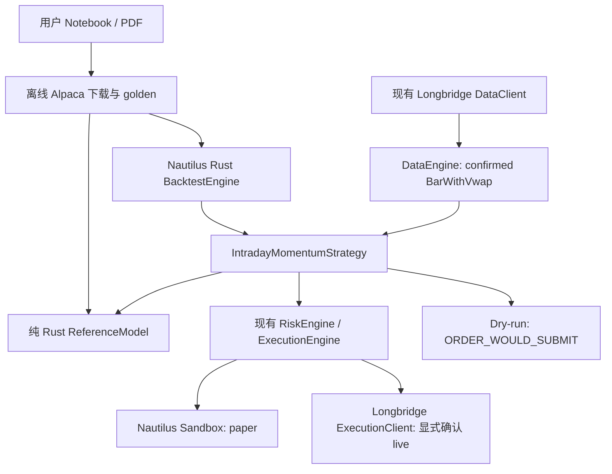

# Notebook SPY 日内动量：Rust 运行说明

本入口复现用户提供的 `intraday trading strategy final.ipynb` 最终 RVOL + refined stop + dynamic sizing 版本。
它替代旧示例中 HLC3 VWAP、额外 VWAP 入场过滤及多股票扩展的说明。本策略只交易 SPY，可多可空。
SLC、横截面排名、regime 和额外指标均不属于这次迁移的 alpha。

当前状态：原生回测与 Notebook 数学对账已有结果；真实 Longbridge 预热被历史标的额度 `301607` 阻断。
没有发送真实订单，也没有完成真实行情下整日 sandbox paper 验收。**不能认定已具备长期实盘运行条件。**

## 数据与架构



- 内部时刻：UnixNanos，session 为 America/New_York，处理 EST/EDT。
- 实时日历：Longbridge trading_days 与 half_trading_days；常规 09:30–16:00，半日市 09:30–13:00。
- 数据：供应商一分钟 VWAP，或 Longbridge `turnover/volume`；不是 `(H+L+C)/3`。
- 只有 SDK `is_confirmed` 的一分钟推送进入严格模型；原始 OHLC 精度保留，时间转换为完成时刻。
- 预热：逐日读取本地缓存；没有缓存才限速访问历史 API；当前日未完成部分不持久缓存。
- 一天缺失分钟、历史不足、数据超时会拒绝交易；不填造行情。

## 信号与状态

设 O 为当天开盘、P 为前一完整交易日收盘：

```text
sigma = mean(此前 14 日同一分钟 abs(close / 当日 open - 1))
upper = max(O, P) * (1 + VM * sigma)
lower = min(O, P) * (1 - VM * sigma)
AVWAP = cumulative(provider_minute_vwap * volume) / cumulative(volume)
RVOL = volume / mean(此前 14 日同一分钟 volume)
```

默认在 10:00、10:30……15:30 的已完成分钟边界检查：

```text
raw entry = LONG  if close > upper and RVOL >= threshold
            SHORT if close < lower and RVOL >= threshold
            FLAT  otherwise
long_stop  = close < max(upper, AVWAP)
short_stop = close > min(lower, AVWAP)

if raw entry != FLAT: target = raw entry
else if long_stop OR short_stop: target = FLAT
else: 保留之前 target
```

**这个 entry 优先、止损 OR 不看持仓方向的顺序来自 Notebook 实际代码。**
VWAP 只参与 refined stop，不再作为额外 entry filter。两个半小时决策点之间不引入新的 alpha 止损。
账户日损、行情超时、订单失败和 EOD 属于执行安全，可以在中间分钟停止风险。

状态为 Flat/Long/Short；订单层单独维护 pending order 和目标。反手先平仓，确认 PositionClosed 后再开仓。
挂单、撤单未终结时不重复开仓。订单 ID 包含 strategy、signal timestamp 和当日序号。
Fill 使用下单时保存的信号与报价上下文，避免后续信号覆盖旧订单的成交归因。

## 参数

| 参数 | 默认 | 调整的作用 |
| --- | --- | --- |
| lookback_days | 14 | sigma 同分钟历史长度；变大更平滑，适应较慢 |
| volatility_multiplier | 1.0 | 扩大/缩小噪声区间，不改变 VWAP |
| volume_lookback_days | 14 | RVOL 历史窗口；独立于 sigma |
| relative_volume_threshold | 1.0 | 入场分钟相对量门槛；不是累计日成交量 |
| volatility_lookback_days | 14 | 日收益样本标准差窗口；生产只用已完成收益 |
| target_daily_volatility | 0.03 | 日杠杆目标分子；不改变信号 |
| max_leverage | 4 | 目标杠杆上限；实际持仓随价格/权益变化可超过初始目标 |
| decision_interval_minutes | 30 | 决策频率；修改即偏离 Notebook 默认实验 |
| flatten_before_close_minutes | 1 | 正常市 15:59 提前清仓，半日市 12:59 |
| max_position_notional / max_order_notional | 400000 USD | 额外执行上限，不修改 reference signal |
| max_daily_loss | 0.03 | 相对当日首次有效决策权益，达到后平仓并锁定当日；次日恢复 |
| directional_stops | false | true 启用按模型持仓方向退出的研究变体，默认保留 Notebook |
| risk_per_trade | null | 可选账户风险比例；按 band/VWAP 距离限制股数，并在报价到达时检查账户权益损失 |
| max_orders_per_day | 100 | 达到上限后停止新增风险；平仓仍允许 |
| stale_data_seconds / order_timeout_seconds | 120 / 120 | watchdog 按分钟检查，HALT/query/cancel；不盲重试开仓 |
| paper_cost_per_share | 0.0045 USD | sandbox 每股佣金+模拟滑点的成本近似，不是 Longbridge 实际收费 |

理论 `shares=floor(AUM*leverage/O)`，再应用 lot、instrument precision、notional 与购买力上限。
quantity、价格、资金和费用为 Decimal / Nautilus domain types。4× 是研究目标上限，不代表账户一定有该额度或可借到 SPY。

## 构建与测试

以下命令在仓库根执行。当前只需原生 Rust 功能，避免构建 PyO3 或整个 workspace。
本机磁盘有限，示例用 dev profile、关闭 incremental、两个编译进程；需要正式发布时再做定向 release 构建。

```bash
CARGO_INCREMENTAL=0 cargo build -p nautilus-backtest \
  --no-default-features --features examples \
  --bin intraday-backtest --bin intraday-optimize -j 2
CARGO_INCREMENTAL=0 cargo build -p nautilus-longbridge \
  --no-default-features --features intraday --bin intraday -j 2

CARGO_INCREMENTAL=0 cargo test -p nautilus-trading --profile dev \
  --no-default-features --features examples --lib intraday_momentum -j 2
CARGO_INCREMENTAL=0 cargo test -p nautilus-trading --profile dev \
  --no-default-features --features examples \
  --test intraday_parity --test intraday_semantics --test lookahead -j 2
INTRADAY_BACKTEST_BIN="$PWD/target/debug/intraday-backtest" CARGO_INCREMENTAL=0 \
  cargo test -p nautilus-trading --profile dev --no-default-features \
  --features examples --test intraday_native_parity -- --ignored
```

原生集成测试独立构建 backtest binary，以免产生 trading→backtest→trading 的依赖环。
它运行两次 golden 回放，逐笔比较独立 expected，以及七个输出文件的逐字节确定性。

## 已缓存数据与回测

- 原始 Alpaca：`test_data/local/intraday_momentum/alpaca/page-*.json.gz`，199 页、1,985,051 行。
- 日历与来源：同目录 `calendar.json`、`manifest.json`。
- 完整规范数据：`test_data/local/intraday_momentum/spy_notebook_full.csv`。
- 规范数据筛选后：2,484 个 390 分钟交易日、968,760 行；沿用 Notebook 事后完整日筛选。
- Golden：`tests/data/intraday_momentum`，30 个真实 SPY 交易日。

```bash
# 快速 golden 原生回测
./target/debug/intraday-backtest \
  --config examples/research/intraday_backtest.json \
  --output reports/intraday/golden

# 原 Notebook chronological train / test；日期含首尾；各自预热 14 日
./target/debug/intraday-backtest \
  --input test_data/local/intraday_momentum/spy_notebook_full.csv \
  --start 2016-01-04 --end 2023-12-27 --output reports/intraday/train
./target/debug/intraday-backtest \
  --input test_data/local/intraday_momentum/spy_notebook_full.csv \
  --start 2023-12-28 --end 2025-12-30 --output reports/intraday/test

# 已有结果的逐项审计；不重跑引擎、不再次选参
./target/debug/intraday-backtest \
  --input test_data/local/intraday_momentum/spy_notebook_full.csv \
  --start 2023-12-28 --end 2025-12-30 --output reports/intraday/test --audit-existing
```

每个输出目录包含 metrics.json、trades.csv、daily_returns.csv、equity_curve.csv、drawdown.csv、
parity_report.json、strategy_report.json。成交 quote 来自下一分钟 open，不能当作真实历史 bid/ask。
`realistic=true` 可加入配置的 spread_bps、impact_bps 和每股滑点；费用与价格摩擦分开统计，不再次从 PnL 扣除。
最大敞口/杠杆按成交及已完成分钟 close 观察，未声称捕捉分钟内极值。
收益和波动年化按 252 个交易日、Sharpe 无风险基准为 0；Max Drawdown 使用日终权益，非盘中回撤。

Alpaca 下载器为离线研究工具，生产 binary 不依赖它：

```bash
.venv/bin/python examples/research/intraday_alpaca_download.py \
  --notebook '/Users/hadow/Downloads/intraday trading strategy final.ipynb' \
  --output test_data/local/intraday_momentum/alpaca
```

只读取指定凭证到内存，不打印、不复制到配置。逐页缓存，0.6 秒请求间隔，429/临时错误退避，
剩余磁盘低于 2 GiB 时停止下载并保留完成页面。缓存已验证可复用，不要求再次访问 API。

## 训练与参数选择

```bash
./target/debug/intraday-optimize \
  --input test_data/local/intraday_momentum/spy_notebook_full.csv \
  --output reports/intraday/new-training-experiment
```

按 session 80/20 拆分，train-only 遍历 lookback 14/30/90、VM 1/1.2/1.5、target vol .01/.02/.03、
RVOL 1/1.2/1.5/1.8/2/2.5，共最多 162 组。每次创建独立引擎/策略状态，不共享可变状态。
先保存 selected_config，再做一次 OOS。`experiment.lock` 防止同目录误重跑 OOS；失败中断后应先检查已有结果。
**本轮使用 Notebook 已选定默认参数，没有在看过测试收益后重做优化。**
重新研究时应保留新的最终未触碰区间；把现在已看过的 test 再当成未知 OOS 会产生 data snooping。

## Dry-run / Paper / Live

OAuth client ID 使用用户已授权的环境配置，API_KEY/SECRET_KEY 不用于 Longbridge 生产连接。

```bash
export LONGBRIDGE_OAUTH_CLIENT_ID='2bcd116c-41bc-4ad5-8d73-280f0d53b1e4'

# 纯本地配置和路由检查
./target/debug/intraday --mode dry-run \
  --config crates/adapters/longbridge/examples/intraday_native.json --validate

# 真实 Longbridge 数据，只有理论订单
./target/debug/intraday --mode dry-run \
  --config crates/adapters/longbridge/examples/intraday_native.json

# 相同真实数据，Nautilus 本地 sandbox 撮合，不连接 broker 下单客户端
./target/debug/intraday --mode paper \
  --config crates/adapters/longbridge/examples/intraday_native.json
```

可用 `--duration-seconds 60` 做有界观察；默认到下一个 session close 后停止，并留 10 秒处理退出。
行情预热失败会停止启动。当前 SPY 请求实际返回历史标的配额 301607，所以不能绕过历史完整性直接交易。

Live 接口需要 `--mode live --confirm-live <account_id>`，account_id 是 Nautilus 配置中的账户标识，
**不是对实际 OAuth 资金账户号码的独立核验**。这一点必须在正式实盘准入前补上。
本轮未启动 live；仅有这个参数并不证明所有实盘条件满足。

## Live readiness 与下一步

已实现：默认不发单、模式隔离、启动 reconciliation、已有 SPY 仓位/挂单拒绝启动、唯一订单 ID、
pending 阻止重复、真实 fill 日志、失败 HALT、行情 watchdog、订单超时 query、提前清仓与残留报警。

尚未验收或仍缺少的条件：

1. 历史额度恢复后，在常规和半日 session 上完成真实行情 dry-run / paper 全流程，包括 Long、Short、反手、日终 flat。
2. 验证断线、重连补数据、部分成交、撤单竞态和退出拒单；当前缺失分钟直接 HALT，尚无自动回补后续跑。
3. 持久化订单/模型恢复与 broker 仓位认领尚未实现；重启遇到已有 exposure 会拒绝启动，需要人工对账。
4. 核验真实 OAuth 账户身份、broker buying power、做空资格/借券、实际费用。当前预算限制不能替代 broker 限额。
5. 现有 Longbridge 查询成交费用字段缺失会记 0；live PnL 需与 broker 账单费用补充对账。

因此目前交付的是可复现研究及受保护运行入口，**不宣称已经通过长期 live 运行验收**。
测试及实际收益见 [parity_report.md](../parity_report.md)，前视审计见 [lookahead_audit.md](../lookahead_audit.md)。
