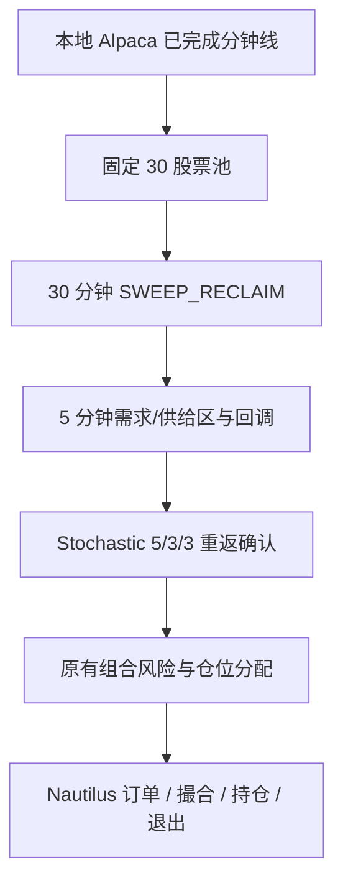

# SLC 的 HTF / CISD 重构与 Alpaca 缓存回测

## 研究范围

参考 [JustExecution/HTF_indicator](https://github.com/JustExecution/HTF_indicator)，固定阅读版本
[`b3a09cd8bad7497ffe76df8886db927e3c7199ed`](https://github.com/JustExecution/HTF_indicator/blob/b3a09cd8bad7497ffe76df8886db927e3c7199ed/HTF_SUITE.pine)。
它是 Pine 图表指标，不是包含账户、撮合和交易成本的策略回测。这里独立实现可逐事件验证的
扫流动性与价格确认规则，没有移植其绘图代码或宣称与 Pine 完全一致。

源项目的 C2 在扫过 C1 高/低后收回边界；C3/C4 会因新的极值或反向模型失败。
它的 HTF 历史请求使用 `lookahead_on` 配合 `[1]` 及更早偏移，不能仅凭
`lookahead_on` 判定该请求泄漏。但图表会根据后来 C3/C4 更新历史模型的显示状态，
且当前 HTF 蜡烛仍在变化，这些显示行为不能作为过去已知的交易信号。

本轮不添加 SMT、FVG、投影价格或其他指标组合；先隔离验证结构与确认两个变化。

## 执行路径



`SLC_ONLY` 是 SLC-HTF Intraday v1 策略口径：横截面动量、SPY/QQQ/IWM Regime、
VWAP、RVOL 和当日趋势不再是信号硬门槛；已有字段只保留为兼容研究和审计数据。

Rust `structure.rs` 集中管理高周期结构与交付状态确认；`data.rs` 只负责已完成数据的
聚合和更新顺序，`signal.rs` 将结构、触区和确认组合成交易信号。
原有风险、下单、止损、止盈与 Longbridge 路由继续复用。

## 新结构模式

`slc.structure_mode = "SWEEP_RECLAIM"`：

- 多头：C2.low < C1.low 且 C2.close >= C1.low。
- 空头：C2.high > C1.high 且 C2.close <= C1.high。
- 同时扫出两边且收回时，方向有歧义，返回 RANGE。
- C2 完整收盘后才发布方向；仅在随后的 C3/C4 期间有效。
- 已观测分钟线破坏上一根 HTF 极值时立即失效，不等待 HTF 收盘。
- 完成 C3 后，失效边界跟随 C3 的高/低；完成 C4 后旧模型到期。
- 新的无歧义扫出可以建立新模型；历史信号不会被删除或回写。
- 跨日或中间缺少完整 HTF 桶时清除扫出上下文。EMA 历史保留。
- `require_htf_ema` 继续有效：若启用，EMA20/50 也必须同向并已预热。

`SWING` 保持原有确认摆动高低点的模式，也是兼容默认值。新模式不允许用加权分数
掩盖尚未确认的结构；本次四组均使用严格模式，不使用 `WEIGHTED_EVIDENCE`。

美股 09:30 ET 为聚合锚点，使用显式 UTC 纳秒交易日历处理 DST。
不满整周期的尾部 HTF 桶不发布。研究统一采用 30 分钟；60 分钟模式当天第一个
C2 最早到 11:30 才能确认，和仅上午开仓的窗口组合容易大幅减少机会。

## CISD 的明确含义

`slc.confirmation_mode = "CISD"`：

- 连续阴线段记录最高开盘价；之后已完成的收盘价向上穿越它，生成多头 CISD。
- 连续阳线段记录最低开盘价；之后已完成的收盘价向下穿越它，生成空头 CISD。
- 十字星不中断连续段；相等只算触及，严格越过才算确认。
- 确认必须在相应需求/供给区触碰之后或同一根完成的触碰 K 线上发生。
- 当前价格仍须在 CISD 水平的正确一边，且满足原有触区确认窗口和离区条件。
- 跨交易日或缺失 5 分钟桶后清空 CISD 状态；重复时间戳不能重放事件。

这是可审计的“反向蜡烛段开盘价收回”研究定义。
源 Pine 的 CISD 还跟踪价格新极值并向历史寻找蜡烛段，二者并非逐项等价。
CISD 是额外的价格硬门槛，不借用 Stochastic 的分数；原有计分阈值按既有消融规则
减去未启用的 Stochastic 权重。信号新增 `structure_confirmed_at`、
`cisd_confirmed_at`、`cisd_level`，便于检查信息何时可用。

## 配置与复现

默认运行仍兼容旧配置。新机制通过以下字段启用：

```json
{
  "ablation": "SLC_ONLY",
  "slc": {
    "htf_minutes": 30,
    "structure_mode": "SWEEP_RECLAIM",
    "confirmation_mode": "STOCHASTIC_REENTRY",
    "require_htf_ema": false,
    "require_intraday_trend": false,
    "confirmation_window_bars": 8,
    "max_level_age_bars": 48,
    "max_level_tests": 2,
    "impulse_atr": 1.0,
    "impulse_volume": 1.0,
    "min_level_score": 5.0,
    "max_level_distance_atr": 1.5,
    "minimum_confirmation_volume": 1.0
  },
  "directions": ["LONG", "SHORT"],
  "trading_windows": [[5, 120], [270, 375]],
  "risk": {
    "risk_per_trade": "0.0025",
    "max_daily_loss": "0.01",
    "max_positions": 3
  }
}
```

`max_positions` 是同时持仓数，不是每天成交次数。
其他关键参数仍由既有 SLC 配置决定：区域强度、测试次数、确认窗口和最大滑点。
这里不根据测试期收益调整这些参数。

```bash
CARGO_INCREMENTAL=0 CARGO_BUILD_WARNINGS=warn \
  cargo --config 'build.warnings="warn"' build -p nautilus-backtest \
  --no-default-features --features examples --bin slc-momentum-backtest -j2

CARGO_INCREMENTAL=0 CARGO_BUILD_WARNINGS=warn \
  cargo --config 'build.warnings="warn"' test -p nautilus-trading \
  --profile dev --no-default-features --features examples --lib slc_momentum -j2

.venv/bin/python examples/research/slc_alpaca.py --years 2024 2025

# 2024Q1 仅查看拒绝分布后冻结参数，2025 独立评估
.venv/bin/python examples/research/slc_alpaca.py --profile operational \
  --years 2025 --output reports/slc_htf_operational_fixed --workers 2
```

Python 仅整理缓存、调用 Rust 可执行文件并统计报告。所有策略、仓位、交易、撮合和
账户计算均由 Rust Nautilus BacktestEngine 执行。无需 PyO3、Python 策略或联网。
原生入口仍支持 `INPUT.json OUTPUT.json --start YYYY-MM-DD --end YYYY-MM-DD`。
临时事件文件在同季度四组完成后删除，可用原缓存和冻结脚本重建。

## 回测限制

- 正式研究池固定为 30 只高流动性股票，覆盖 11 个 GICS 行业；不是按回测收益选股，
  也不代表完整 point-in-time 指数成分。原五股票池只保留作管线诊断。
- 缓存是当时下载的 Alpaca 原始分钟线，feed 未指定；不是历史 NBBO 报价。
- 回测日历取 SPY 的完整 390 分钟交易日；其他标的缺失日独立保留为缺失，不再取
  30 只股票的事后共同日期交集。半日和不完整日仍不参与信号。
- v1 不使用历史市值、行业相对强度、横截面百分位或 Regime 作为入场条件。
- 诊断集报价路径为 O-O-L-H-C；2025 评估仅为五只候选生成 O-L-H-C 报价，
  三个指数只用已完成分钟线。完整价差 1bp，开盘前 30 分钟加倍，按美分向外取整；
  固定深度 1000 股，原生尺寸影响和每次成交一 tick 滑点，另收 1bp 成交额佣金。
  每分钟的固定 OHLC 顺序本身就是执行假设。
- 做空可借性默认可用，没有借券费、逐笔流动性、历史队列或真实延迟。
- 每季度独立 10 万美元账户。跨季度汇总是净 PnL 相加的诊断曲线，不是假装连续复利；
  每季度内多股共享账户、执行组合风险。季度边界重置也会重置亏损历史。
- 2024/2025 已在此前研究中被观察，本次固定参数对照不等于从未查看的样本外检验。
- 盈利、低回撤或更多交易均不能单独证明增量 alpha；低交易数尤其不足以下结论。

## 旧五股票硬门槛基线结果

2024Q1 只用于观察拒绝频率，未用 PnL 选择参数。随后冻结生成器、Rust 二进制和四组
配置，在 2025Q1–Q4 的 236 个共同完整交易日上独立运行。每季度账户从 10 万美元
重新开始；下表按四季度交易和净 PnL 合并，年化指标来自拼接后的诊断权益曲线。

| 变体 | 成交 | 胜率 | 净 PnL | Profit Factor | 平均 R | Sharpe | 最大回撤 |
|---|---:|---:|---:|---:|---:|---:|---:|
| SWING + Stochastic | 2 | 50.0% | -$11.81 | 0.750 | -0.231 | -0.206 | 0.072% |
| SWEEP_RECLAIM + Stochastic | 1 | 100.0% | +$35.48 | 无亏损样本 | +0.709 | 1.033 | 0.019% |
| SWING + CISD | 18 | 27.8% | -$984.97 | 0.140 | -0.650 | -2.757 | 0.985% |
| SWEEP_RECLAIM + CISD | 9 | 44.4% | -$124.52 | 0.578 | -0.223 | -0.721 | 0.297% |

HTF sweep/reclaim 将 CISD 的交易数从 18 降到 9，亏损从 $984.97 降到 $124.52，
说明它在这份样本中具有明显的错误交易过滤作用；但完整变体仍亏损，不能称为正 alpha。
纯 HTF 变体只有一笔交易，Sharpe 和 100% 胜率没有统计意义。CISD 在当前定义下增加了
交易频率，却显著恶化结果。本轮没有继续用 2025 PnL 调参，避免把失败样本优化成漂亮结果。

最主要的拒绝原因是 `MOMENTUM_WEAK`、当日趋势不一致、`HTF_RANGE`、低 RVOL 和市场
环境不允许，因此这组结果只解释为何 v1 移除了额外硬门槛，不能作为 v1 的绩效结果。
完整变体的 9 笔中，空头 6 笔净亏 $29.92，多头 3 笔净亏 $94.60；
这只是诊断线索，样本量不足以据此关闭多头。完整可复现结果位于
`reports/slc_htf_operational_fixed/`，其中 `plan.json` 固定输入哈希、二进制哈希、
上游 commit 和配置，`summary.json` 保存合并指标；压缩日志和逐次报告保留，巨大的临时
事件文件已删除。

结论是：此次重构提高了因果性和可审计性，HTF 结构过滤在样本内降低了损失，但整套
策略尚未证明可交易。下一轮应扩充到 point-in-time 股票池、历史报价和可借券数据，
预先登记参数后使用未观察时期做 walk-forward；在此之前不把新模式设为模拟盘或实盘默认。

回放还覆盖了零 MFE 的成交路径，并修复一个既有报告错误：
`then_some(pnl / mfe)` 会在 `mfe == 0` 时仍提前执行除法。现在先显式检查 MFE，
零 MFE 返回空捕获率。这个修复不改变信号、订单或 PnL，只阻止报告阶段 panic。
