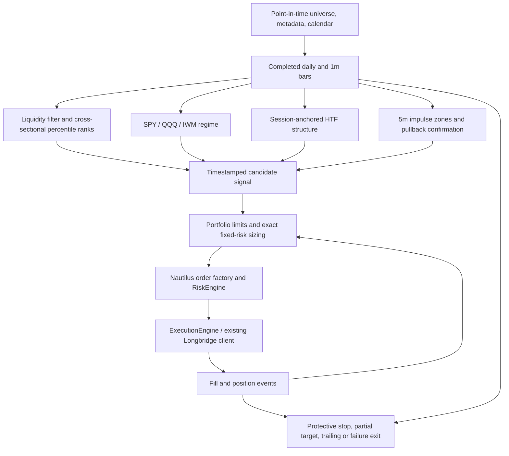
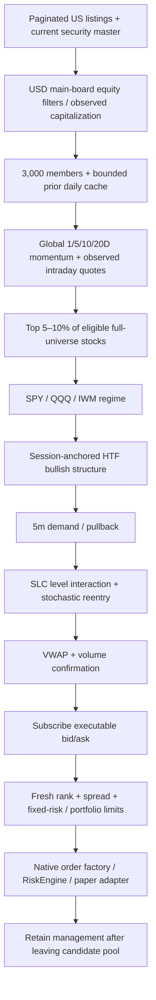

# Cross-sectional momentum and SLC intraday research

This is a configurable long/short US equity research example, not an established profitable strategy.
The specification below was written before implementation. All parameter defaults are hypotheses.

The subsequent local-cache zero-trade diagnosis, confirmation-state fix and frozen parameter
comparison are documented in the [Chinese research report](slc_momentum_results/fixed1000_spy_iwm_improvement.md)
and its [machine-readable results](slc_momentum_results/fixed1000_spy_iwm_improvement.json).
The original zero-trade baseline remains preserved. Candidate research parameters do not change
paper defaults. `report.entry_rejected` now separates entry-window rejections from the existing
all-session `report.rejected`; both count repeated first-failure evaluations, not independent trades.

## Long/short extension specification

The implementation has explicit LONG/SHORT permissions while preserving LONG-only defaults for
existing configurations. Full-market operation selects the strongest tail for longs and the weakest
tail for shorts, retaining the original global percentiles. A side must match confirmed HTF
structure. With `require_intraday_trend` enabled, session return, minute EMA alignment and VWAP
must also support that direction. Full-system F retains its separate VWAP confirmation gate.
Longs wait for demand pullbacks; shorts wait for supply rallies. Stochastic oversold reentry and
overbought reentry are symmetric, as are VWAP/volume confirmation, structural stops, R targets,
trailing and momentum-failure exits. A held symbol cannot reverse before its current order/position
lifecycle finishes.

Gross notional and risk reservations cover both directions; opposite positions never cancel risk
capacity merely because net exposure is small. Shorts receive a separate conservative margin
multiplier. Native sell entries and buy-to-cover protection reuse the existing execution client;
Longbridge opening shorts require a fresh maximum-sell-quantity check before submission. Historical
short availability and borrow costs must be stated separately from strategy signal validity.

The original July–August 2026 full-universe run was blocked by actual Longbridge monthly history quota error `301607`
(`requested:1000/limit:1000`). The cache retains 1,000 gap responses containing 4,904 daily bars;
candidate minute downloads have not started. No full-period return or alpha claim is available.
See the [data and validation record](slc_momentum_results/long_short_2026_jul_aug.json) and
the [Chinese history workflow](slc_momentum.zh-CN.md#先筛选再下载的历史回放) for resumable native commands.
The runner now also exposes `--history-fill-ranking-cli` and `--history-minutes-cli` as explicit,
read-only fallbacks through the authenticated `longbridge kline history` command. This is an
alternative client path, not evidence that the service-side unique-symbol quota is bypassed; its
audit files and final replay coverage must still be checked.

Requested historical interval: 2026-07-01 through 2026-08-31 inclusive, America/New_York. Replay must
not backdate the September security master or treat September cache receipt timestamps as historical
availability. Historical OHLC and modeled quotes, if used for exploratory replay, must be clearly
separated from actual historical quote replay and from survivorship-free full-market results.

The official [history endpoint](https://open.longbridge.com/docs/quote/pull/history-candlestick)
documents 1,000 bars per response, an endpoint-specific 60 requests/30 seconds limit and monthly
unique-symbol quotas. The downloader must honor those limits as well as the adapter's common quote
limiter. The [trading FAQ](https://open.longbridge.com/docs/qa/trade) and
[quantity estimate API](https://open.longbridge.com/docs/trade/order/estimate_available_buy_limit)
describe US short support and account-specific quantity checks. No broker orders are authorized by
this implementation/backtest task.

### Fixed quota universe and two-index research variant

The current historical research uses the fixed 1000 securities with successful daily-gap
responses. Daily rankings still select the strongest and weakest eligible 10%; minute downloads
cover only their union and the required regime indices. Cache acquisition order biases this
mostly A–F universe; it is not representative of all US equities or point-in-time membership.

`strategy.regime_benchmarks = ["SPY.US.LONGBRIDGE", "IWM.US.LONGBRIDGE"]` explicitly selects
the authorized research variant. With `slc.regime_votes = 2`, both indices must agree for a
directional regime; missing either index prevents new signals. Omitting the field still requires
SPY, QQQ and IWM. Cached QQQ daily bars remain available for the configured five-session relative
strength calculation, while QQQ minute history is excluded because of quota error `301607`.

All 43 July–August sessions have ranking coverage. Subsequent read-only probes found that SPY
and IWM minute requests for August 31 also return `301607`, although AA succeeds. Both indices
have 21,060 verified regular-session minute bars from June 12 through August 28. The separate
`2026-jul-aug-fixed1000-through-aug28` plan therefore covers 42 research sessions. The original
43-session plan remains intact; shorter-period results must not be labeled a full July–August
backtest. See the [access and validation record](slc_momentum_results/fixed1000_spy_iwm_2026_jul_aug.json)
and [Chinese run instructions](slc_momentum.zh-CN.md#固定-1000-股研究变体).

Persisted rankings use `serde_json`'s `float_roundtrip` feature. A regression test preserves
distinct adjacent floating-point scores, preventing JSON ingestion from changing their tie order.

Minute replay uses the existing adapter's observed-price envelope rule and instrument price
precision. Raw CSV files stay unchanged; `ohlc_envelope_normalizations` records affected bar-end
timestamps. Nonpositive OHLC records are retained in the source and listed in
`discarded_nonpositive_ohlc`, without manufacturing quotes or replacement bars.
`complete_minute_prices` reports price gaps separately from completion of the requested sessions.
The July 1–August 28 native replay completed all 42 sessions with zero signals, zero trades and
zero net PnL. Equity stayed at USD 100,000; cash reconciliation passed with no unresolved orders,
positions or execution errors. Sharpe, Sortino, Calmar and trade-based ratios are undefined.
This inactive result does not establish profitability or incremental component alpha.

All 651 required minute histories are cached locally (649 candidate stocks plus SPY and IWM),
using approximately 405 MiB of raw CSV. Across 5,511 selected symbol-sessions, 2,148,718 of
2,149,290 expected minutes have valid prices. The 572 missing minutes affect 386 symbol-sessions,
with at most five missing minutes per symbol-session and no entirely missing selected day.
The result therefore has `complete_period=true` and `complete_minute_prices=false`.
The research record retains complete metrics, rejection counts, source handling and provenance;
the unavailable August 31 session remains excluded and the full-period result remains blocked.

## Repository audit

| Area                       | Existing implementation                                          | Integration decision                                                                                                                                             |
| -------------------------- | ---------------------------------------------------------------- | ---------------------------------------------------------------------------------------------------------------------------------------------------------------- |
| Strategy and Actor         | `crates/trading/src/strategy`, `crates/common/src/actor`         | Implement `Strategy` and `DataActor`; no broker abstraction.                                                                                                     |
| Indicators                 | `crates/indicators/src`                                          | Reuse EMA, ATR, VWAP and MA-smoothed Stochastics.                                                                                                                |
| Data and bars              | `crates/model/src/data/bar.rs`, `crates/data/src/aggregation.rs` | Use native Bar/BarType. A small session scheduler supplies exchange-calendar boundaries; generic fixed UTC offsets do not define US sessions across DST.         |
| Instruments and arithmetic | `crates/model/src/instruments`, `types`                          | Native Instrument, Price, Quantity, Money; Decimal for executable prices, sizing, cash, fees and risk.                                                           |
| Portfolio, Cache           | `crates/portfolio`, `crates/common/src/cache`                    | Authoritative account equity, orders, fills and positions remain in Nautilus.                                                                                    |
| Risk                       | `crates/risk/src/engine`, `sizing.rs`                            | Reuse native fixed-risk sizing and RiskEngine; add strategy-level reservations/concentration limits.                                                             |
| Execution and events       | `crates/execution`, `crates/model/src/events`                    | Native orders, position identifiers and event callbacks; reserve before dispatch, release only after terminal events.                                            |
| Clock                      | `crates/common/src/clock`                                        | Nautilus event time; no wall-clock access in signal logic.                                                                                                       |
| Backtest and live          | `crates/backtest`, `crates/live`                                 | Same strategy and feature state for both runtimes.                                                                                                               |
| Longbridge                 | `crates/adapters/longbridge`                                     | Reuse its clients/factories, OAuth and reconciliation. Native adapter supports market/limit/MIT/LIT, not exchange-native stop/stop-limit.                        |
| Existing strategies        | `momentum_pullback`, Longbridge `examples/slc`                   | The former is daily swing trading. The old SLC implementation is obsolete per the user and is not a specification or implementation reference for this strategy. |
| Tests                      | Rust rstest, trading/backtest/adapter suites                     | Add focused deterministic model and engine tests; no generated-code edits.                                                                                       |

The workspace already contained unrelated modified and untracked momentum/SLC files at task start.
These are not a clean upstream baseline and must not be attributed to this change.

## Sources and evidence limits

- [Specified video](https://www.youtube.com/watch?v=nwMijcBpEo0): direct page,
  timedtext transcript endpoint, oEmbed title/description endpoint and exact-ID search did not
  return verifiable content in this session. No rule or performance claim is attributed to it.
- [SLC blueprint](https://www.scribd.com/document/1021759527/SLC-Execution-Blueprint-by-Data-Trader):
  the accessible document body describes directional higher-timeframe structure, strong lower-timeframe
  zones, a touch followed by stochastic extreme/reentry (5/3/3 example), candle-close decisions,
  stops outside the zone and targets of at least 2R. It rejects ranging structure and repeatedly
  broken levels. It provides no verified US-equity profitability evidence.
- [Jegadeesh and Titman, 1993](https://onlinelibrary.wiley.com/doi/10.1111/j.1540-6261.1993.tb04702.x):
  winner/loser portfolios and subsequent 3–12 month returns motivate relative selection, not an
  intraday alpha claim.
- [French momentum construction](https://mba.tuck.dartmouth.edu/pages/faculty/ken.french/Data_Library/det_mom_factor.html):
  a reproducible cross-sectional benchmark uses prior months 2–12. Shorter 1/5/10/20-day features
  in this project are a separate hypothesis, potentially exposed to short-term reversal and costs.

## Strategy specification

### Full-market integration specification

The full-market mode separates selection from intraday execution. A paginated Longbridge screener
supplies the current US security master. A bounded, explicitly configured 3,000-stock universe is
formed by market capitalization (symbol as tie-breaker), not by today's return or page order. Completed
daily history is cached by symbol; previous-close features and optional timestamped intraday quote
observations feed the same cross-sectional ranker. Top 5–10% is measured across eligible stocks in
that full universe and is never recomputed within the subscribed candidate subset.

Ranking snapshots carry their data cutoff, publication time, session, coverage, exclusions and
expiry. Only published, unexpired snapshots authorize entries. Missing coverage, failed scans or
capacity exhaustion cannot silently turn a partial universe into the whole market. Existing
positions remain managed when their symbols leave the candidate pool.

The existing Longbridge data client shares its single SDK quote context with the scanner. Only
signal-ready symbols and retained positions need streaming execution quotes. Completed minute bars are fetched
in bounded batches and delivered as one native CustomData event, so cross-symbol collection latency
cannot cause an early quote callback to freeze a half-filled minute. New candidates receive historical
warmup before signal evaluation. Historical warmup never generates retroactive orders. The downstream
order is global momentum membership, regime, HTF structure, demand/pullback, SLC confirmation,
VWAP/volume, then the existing risk and execution framework.

The implementation must test 3,000-stock ranking, candidate churn, stale/future snapshots, retained
positions, warmup boundaries and acknowledged subscription-slot release. Real-market profitability
and connected order acceptance are separate from these engineering checks.

### SLC mechanism review from the supplied document

The follow-up video [Supply & Demand DOESN'T Work (Here's What Actually Does)](https://www.youtube.com/watch?v=JBpm1pd1RF8)
was verified as a Data Trader upload through its public player metadata. Its caption endpoints
returned no usable transcript. The user then supplied `/Users/hadow/Downloads/slc.docx`; its text
and all nine embedded chart images were inspected. The rules below come from that supplied document,
especially sections 2.1–2.4, rather than an assertion that the new video's full contents were verified.
The document's profitability statements are not independent performance evidence.

SLC is an ordered eligibility process. Structure determines the allowed direction; a level identifies
where to wait; confirmation is evaluated only after an eligible interaction with that level. A large
score cannot compensate for a missing structure, level interaction or confirmation.

The document distinguishes two level scenarios:

1. **Fresh pullback:** price revisits an untouched impulse-origin zone, then confirms a reaction in
   the HTF direction. Merely touching the zone is insufficient.
2. **Once-broken level:** for the document's supply example, price first closes above supply, later
   makes a strong move back below it, and only then retests from below before confirmation. The long
   implementation mirrors this: demand breaks below, price reclaims above the full zone, and a later
   candle retests from above. This symmetry is an engineering interpretation. A second adverse break
   invalidates the level. Breaks and distinct touches are separate counters.

A broken level is ineligible while waiting for a reclaim. The reclaim candle cannot also be its
retest because completed OHLC cannot establish that intrabar sequence. Reclaim requires a directional
body of `reclaim_impulse_atr` times ATR and a close beyond the whole zone; the numerical threshold is
our configurable formalization of “strong break,” not a number attributed to the source. Set
`max_level_breaks: 0` to retain the earlier immediate-invalidation policy; the revised default is 1.
The existing touch-count and age limits still apply and are not reset to rescue an overtested level.

The stochastic example is a crossing of the **extreme boundary**, not a K/D crossover: long K enters
oversold and returns above its boundary; supply confirmation is the inverse at overbought. Keep
5/3/3 as the existing blueprint-derived default. EMA, VWAP, volume, momentum ranking and portfolio
limits are explicit additions of this US-equity implementation, not mandatory rules attributed to
the supplied document. Structural stop placement and the default 2R target remain unchanged.
The existing additional requirement that the confirmation close finish outside the zone remains:
above demand for longs, below supply for the symmetric detector check. It is stricter than merely
touching a zone and seeing stochastic reentry. Selection compares quality among confirmed eligible
levels, so an untouched higher-scoring zone cannot hide a valid confirmation at another zone.
Completed stochastic reentry is retained within the touch confirmation window, allowing later
completed candles to satisfy price, VWAP and volume gates. A new distinct touch, adverse zone break,
return into the stochastic extreme or window expiry clears that permission. Expiry checks event
time as well as observed bar count, so missing bars cannot prolong a confirmation.
Signals record the distinct touch/break counts and reclaim timestamp. Reclaimed demand uses the
separate `MOMENTUM_SLC_BREAK_RETEST` setup type; fresh demand uses `MOMENTUM_SLC_PULLBACK`.



### Data contract and causal ordering

1. Input OHLCV prices are unadjusted executable prices. Daily histories crossing a corporate action
   must be reset or supplied with point-in-time adjustment factors; future back-adjustments are
   inadmissible. Point-in-time universe membership, sector, sector ETF and market capitalization
   carry effective and publication timestamps. Missing mandatory metadata rejects the candidate.
2. An explicit session table contains UTC open/close timestamps sourced from an exchange calendar.
   US regular open is 09:30 America/New_York; holidays are absent and half-days have an early close.
   No weekday-only calendar and no assumption that UTC open is constant across DST.
3. One-minute input bars are final, timestamped at interval end, with `ts_init >= ts_event` recording
   availability. Longbridge's updating, start-stamped bars require finalization and normalization
   before entering the common strategy logic. Unconfirmed bars cannot enter the research model.
4. Aggregate 5m and configured 30/60/240m from consecutive completed 1m bars anchored at that
   session's open. Discard incomplete buckets, including the terminal short HTF bucket. A hole
   invalidates that bucket. A level is born only after its displacement bar closes; a swing is
   known only after its right-hand confirmation bar closes.
5. Cross-sectional snapshots use a single cutoff. Daily features require session close strictly
   before the active session open. All symbols/benchmarks use matching daily endpoints. Intraday
   refreshes share a completed minute cutoff and never depend on symbol callback ordering.
   Late data cannot revise a frozen decision. Missing or stale benchmarks produce NO_TRADE.
6. Signals are calculated after confirmation close and are executable only on a later quote.
   A bar-only simulation may not execute against the signal candle's earlier high/low.

### Selection, structure and confirmation

Price, average 20-session dollar volume, market cap, gap, ATR/price and RVOL filters precede ranking.
Rank configurable daily returns (defaults 1/5/10/20), relative returns to SPY/QQQ/sector ETF and
relative volume with tie-aware percentiles. Weighted percentile scores are normalized by total
weight. Sorting is O(N log N) per refresh, feature updates are per symbol, and correlations are
computed only against the bounded active portfolio. Subtracting a common benchmark return does
not change a cross-sectional ranking: SPY and QQQ RS weights are redundant when their lookbacks
match a return feature. Do not interpret these as independent alpha factors.

SPY/QQQ/IWM each vote using session VWAP, EMA20/50, short index momentum and opening range;
breadth can strengthen the vote when coverage is sufficient. Bearish blocks longs by default;
neutral raises the confirmation threshold and reduces risk. Missing warmup is not neutral.

Bullish HTF structure requires two causally confirmed higher swing highs and higher swing lows;
EMA alignment can be required. Lower/lower is bearish; all other cases are range. Demand/supply
zones use a prior base candle followed by an ATR-sized displacement with relative volume.
Quality includes impulse, volume, age, distinct revisits, distance and trend/momentum alignment.
Consecutive bars within a zone count as one visit. Invalidated, stale or overtested zones cannot
produce signals. Reference levels include prior-day and opening-range high/low, confirmed swings,
session VWAP and impulse-anchored VWAP; they do not automatically become tradeable demand zones.

The main setup requires strong rank, bullish structure, a valid demand-zone pullback, oversold
stochastic after the touch, subsequent upward extreme-boundary reentry, and price reclaim. VWAP, RVOL, EMA
and candle direction add configurable confirmation weight. Stochastic is replaceable through a
confirmation-mode setting; unverified video-specific rules are not embedded. Shorts use the weak tail, bearish structure, supply rallies and overbought downward reentry.
Both directions require matching observed intraday trend when `require_intraday_trend` is enabled.
New paper templates enable this gate and both directions; old configs default to LONG.

### Risk, execution and state

`SCANNING → CANDIDATE → HTF_VALID → LEVEL_FOUND → WAITING_CONFIRMATION → SIGNAL_READY →
ORDER_SUBMITTED → POSITION_OPEN → MANAGING → EXIT`; invalidated setups return to scanning.
Order state is driven by native terminal/fill events, including partial fills and cancel/fill races.
A signal identity consists of symbol, confirmation timestamp and zone creation timestamp.
An outstanding entry or position prevents a second entry for the same symbol.

Initial stop is below demand/swing support minus an ATR buffer, rounded down to the instrument
tick. Reject nonpositive or too-small distances. Native fixed-risk sizing is further capped by
free capital, per-position/total/sector notional, aggregate/sector risk, participation, position
counts, rolling correlation and daily loss/consecutive-loss limits. Pending orders reserve risk
and capital. Portfolio loss gates use mark-to-market equity and latch until the next session.
Risk budgets are sizing limits, not guarantees against gaps or failed execution.

Market, limit, stop and stop-limit entries are explicit modes. This Longbridge runner accepts
market/limit entries and uses broker MIT protective orders; stop/stop-limit entry emulation is not provided. Protective stops
must be broker-supported; process-local signals and trailing exits are not durable protection.
Partial take profit defaults to 1R; main target defaults to 2R. ATR/structure targets, chandelier/
ATR trailing, VWAP loss and rank deterioration with selling pressure/weakening structure are
independent configurable exits. Cancel acknowledgments precede discretionary market exits to
avoid outstanding protection reversing a position while a discretionary exit fills. Trading windows default to
09:35–11:30 ET, with an optional afternoon window; flatten ahead of each session's actual close.

### Research protocol

All runs include commissions, adverse spread, slippage and a participation/impact assumption.
The synthetic fixture widens opening spreads; optional stress runs multiply spreads and commissions.
The native size-aware fill model adds depth/impact and one tick of adverse slippage. This is a
declared stress model, not a calibrated small-cap or high-RVOL execution estimate.
OHLC paths are ambiguous; report synthetic execution separately from historical quote replay.

Use identical universe, dates, costs and risk budgets for A momentum-only, B momentum+SLC,
C B+VWAP, D B+volume, E B+VWAP+volume and F full system. Add full-minus-stochastic,
full-minus-regime and SLC-only controls: A–F alone cannot identify these marginal contributions.
Changing score components must also change their threshold so an ablation does not accidentally
retain the removed filter via an impossible score.

Report daily-equity CAGR, Sharpe and Sortino, minute-sampled drawdown and Calmar; trade win rate, profit factor,
expectancy, R distribution, winners/losers, exposure and turnover. Undefined ratios remain null.
Cohort reports group entry regime/setup/time/symbol/sector/rank/confirmation. Trade-level Sharpe
is not an annualized portfolio Sharpe. Exposure uses minute observations clipped to regular-session
boundaries; it is an approximation between observations. Turnover includes every partial fill.

Sensitivity varies one parameter family at a time with predeclared neighboring values.
Chronological train/validation/test folds warm indicators with prior data, prohibit trades before
each fold's start, flatten at fold end, and select using validation only before a sealed test.
Entry regime and stock ATR/price cohorts are reported. Secular bull/bear/high-volatility/
low-volatility/sideways market-period validation still requires historical data with those periods.
Preserve every attempted parameter set to make data-snooping visible.

Without verified historical data, the runner's synthetic smoke tests establish engineering behavior
only. Momentum, SLC, VWAP, stochastic and regime contributions remain unmeasured. Paper routing
requires separate account credentials, real session data, restart/reconciliation tests, and broker
order-contract tests before live capital is considered.

## Files and commands

- `crates/trading/src/examples/strategies/slc_momentum/`: `mod.rs`, `config.rs`, `data.rs`,
  `market.rs`, `selection.rs`, `signal.rs`, `risk.rs`, `strategy.rs`, `tests.rs` provide typed configuration,
  temporal data state, ranking, structure/levels/confirmation, exact risk sizing and orchestration.
- `crates/backtest/examples/slc_momentum.rs`: native quote-driven BacktestEngine replay.
- `examples/backtest/slc_momentum_research.py`: synthetic fixture, metrics, A–F plus three controls,
  23 neighboring configurations, spread/commission stress, walk-forward and standalone chart.
- `examples/backtest/test_slc_momentum_research.py`: metrics, temporal split and cash-audit tests.
- `crates/adapters/longbridge/examples/node_slc_momentum.rs`: read-only probe and paper-only node.
- `crates/adapters/longbridge/examples/slc_momentum_paper.example.json`: configuration template.
- `crates/{trading,backtest,adapters/longbridge}/Cargo.toml` and
  `crates/trading/src/examples/strategies/mod.rs` register these entry points.
  `nautilus-data` is an optional existing workspace dependency used for native bar building.
  `Cargo.lock` records that workspace dependency; its unrelated pre-existing changes remain intact.
- `docs/integrations/slc_momentum.md` contains the audit, specification and delivery evidence;
  `docs/integrations/slc_momentum_results/` contains `comparison.json`, `runs.jsonl.gz`,
  `verification.json`, `fixture.json`, `longbridge_probe.json`, `chart.html` and `chart.png`.
  The subsequent native date-range check is stored separately in `rust_date_range.json` and
  `rust_date_range_report.json.gz`.

From the repository root:

### Direct Rust replay with inclusive dates

```bash
CARGO_INCREMENTAL=0 cargo run -p nautilus-backtest --profile dev --no-default-features \
  --features examples --example slc-momentum -j 2 -- \
  /path/to/normalized-input.json /path/to/report.json \
  --start 2025-02-18 --end 2025-02-19

# Shorter recommended invocation; Cargo reuses the already-built artifact:
cargo run -p nautilus-backtest --features examples --example slc-momentum -- /path/to/normalized-input.json /path/to/report.json \
  --start 2025-02-18 --end 2025-02-19
```

This path uses the existing Rust BacktestEngine and Strategy; it requires no PyO3 or Python runtime.
Both dates are inclusive **America/New_York calendar dates**. The supplied exchange calendar defines
the first session open and final session close, including DST and early closes. Weekends and holidays
inside that calendar span are skipped. Both flags must be present; reversed dates, empty trading
ranges and ranges beyond the supplied calendar coverage fail explicitly. With neither flag, the
existing `strategy.trading_start` / `trading_end` nanosecond boundaries still apply.

Keep prior sessions and data in the input for warmup. Only bars available before the selected start
warm the strategy; quotes and bars available within the interval enter the engine. Events after the
end cannot update it. The JSONL reader processes one line at a time, retaining only warmup bars and
selected replay events. Missing quotes or missing session-edge quote coverage cause an error instead
of silently shortening the requested interval. This checks session boundaries within one minute;
it is not a per-symbol completeness certificate. The strategy separately rejects incomplete bars,
missing benchmarks and stale data. Provide a complete calendar rather than inferring holidays from
missing quotes. The CLI does not download data or contact Longbridge.

Output includes `requested_dates`, `date_timezone`, effective boundaries in `configuration`,
`warmup_bars`, `replay_events`, exact fill-cash `net_pnl`, native `Portfolio::statistics()` results,
and the existing signal/trade/equity audit. Native statistics retain their own calculation semantics;
they do not replace the daily-equity research metrics below. Flat terminal state and no strategy
errors are required for a successful exit.

### Optional research orchestration

```bash
cargo test -p nautilus-trading --profile dev --features examples --lib slc_momentum -j 2
.venv/bin/python -m pytest examples/backtest/test_slc_momentum_research.py -q
cargo build -p nautilus-backtest --profile dev --features examples --example slc-momentum -j 2
.venv/bin/python examples/backtest/slc_momentum_research.py \
  --synthetic --output /tmp/slc-research \
  --ablation --sensitivity --cost-stress --walk-forward --fold-sessions 3 2 2
```

The 3/2/2 split is only a small engineering fixture. Real research defaults to 60/20/20 sessions:

```bash
.venv/bin/python examples/backtest/slc_momentum_research.py \
  --input /path/to/normalized-input.json --output /tmp/slc-historical \
  --ablation --sensitivity --cost-stress --walk-forward
```

`--input` accepts the same JSON schema produced by `--synthetic`, with `synthetic: false`, explicit
provenance, point-in-time metadata/calendar and the actual normalized JSONL event path. Event prices
and sizes are decimal strings; timestamps are UTC nanoseconds. The runner rejects bar-only fills,
future availability, malformed prices and unresolved orders/positions. It warms only data available
before the configured start and replays only the selected trading interval. It freezes a copy of the
executable and records its SHA-256 so a rebuild cannot change a running experiment.

Native USD margin/position accounting rounds realized PnL at each reduction fill. Reports retain both
exact fill-cash `pnl` and native `native_booked_pnl`; `account_rounding_delta` makes the difference
visible. The cash audit is exact within each trade and bounds native booking differences by one
USD cent per reduction fill, rather than treating a missing fill as numerical noise.

## Configuration

The JSON configuration uses the repository's existing serde/serde_json support; it does not introduce
a second YAML loader. Defaults are in `config.rs`. The paper template deliberately contains zero
market-cap placeholders and refuses to connect until these are replaced with real timestamped
security-master observations. Its example sector group is not historical sector membership.
The paper node supplies the current exchange calendar; backtests require a complete historical table.

```json
{
  "momentum": {
    "lookbacks": [1, 5, 10, 20],
    "return_weights": [0, 1, 1, 1],
    "spy_weight": 0,
    "qqq_weight": 0,
    "sector_weight": 1,
    "relative_volume_weight": 1,
    "intraday_weight": 1,
    "min_percentile": 80,
    "refresh_minutes": 5
  },
  "slc": {
    "htf_minutes": 60,
    "ltf_minutes": 5,
    "stochastic_k": 5,
    "stochastic_d": 3,
    "stochastic_smoothing": 3,
    "max_level_tests": 1,
    "max_level_breaks": 1,
    "reclaim_impulse_atr": 0.5,
    "confirmation_threshold": 9
  },
  "risk": {
    "risk_per_trade": "0.005",
    "max_daily_loss": "0.02",
    "max_total_risk": "0.02",
    "max_positions": 4
  },
  "entry_mode": "LIMIT",
  "trading_windows": [[5, 120]],
  "batch_delay_ms": 2000,
  "dry_run": true,
  "exit": {"target_r": "2", "partial_r": "1", "trailing_enabled": true}
}
```

Trading windows are minutes after 09:30 ET; an optional `[270, 375]` window is 14:00–15:45 ET.
The default opening-range filter needs 15 completed minutes, so the configured 09:35 entry window
is an outer permission boundary, not a promise to trade at 09:35. Intraday RVOL requires at least
five complete prior sessions and compares cumulative volume at the same minute of the session;
at most 20 profiles are retained. Daily history needs the longest configured lookback plus one
aligned completed session. Correlations use aligned daily returns, not price levels.

## Full-market Rust pipeline

The native example now supports a separate global universe and an intraday working set. The old
five-stock JSON still selects only those five stocks. Use the new
[`slc_momentum_market.example.json`](../../crates/adapters/longbridge/examples/slc_momentum_market.example.json)
for a 3,000-stock run.



Build binaries separately to reuse the existing dependency artifacts on a small disk:

```bash
CARGO_INCREMENTAL=0 cargo build -p nautilus-longbridge --profile dev \
  --no-default-features --features examples --example longbridge-slc-momentum -j2
CARGO_INCREMENTAL=0 cargo build -p nautilus-backtest --profile dev \
  --no-default-features --features examples --example slc-momentum -j2

# Read-only: choose the next still-open US session, including the next trading day after US close.
cargo run -p nautilus-longbridge --features examples --example longbridge-slc-momentum -- --prepare-market \
  crates/adapters/longbridge/examples/slc_momentum_market.example.json \
  test_data/local/slc_momentum/YYYY-MM-DD/market.json

# Read-only: cache prior daily history before the US open.
cargo run -p nautilus-longbridge --features examples --example longbridge-slc-momentum -- --prefetch-market \
  test_data/local/slc_momentum/YYYY-MM-DD/market.json

# During the regular session: authoritative simulated-account equity, no strategy orders.
cargo run -p nautilus-longbridge --features examples --example longbridge-slc-momentum -- --dry-run \
  test_data/local/slc_momentum/YYYY-MM-DD/market.json

# Explicit operator action enables simulated orders using the same pipeline.
cargo run -p nautilus-longbridge --features examples --example longbridge-slc-momentum -- --paper \
  test_data/local/slc_momentum/YYYY-MM-DD/market.json
```

On the current older macOS installation, prefix Cargo commands with `CARGO_BUILD_WARNINGS=warn`
and use `cargo --config 'build.warnings="warn"'` to allow the known linker deployment warnings.
Rust/Clippy warnings are still checked separately. No PyO3 build is needed.

Preparation writes a dated configuration and a universe audit. It enumerates every screener page
before selecting by capitalization; duplicate pages or changing totals fail preparation. SDK screener
`counter_id` and indicator rows are normalized explicitly. Current market capitalization comes from
`calc_indexes(TotalMarketValue)` as Decimal, avoiding display-unit conversion. Unsupported counters,
OTC, non-USD listings and identified fund/warrant/preferred/unit products are excluded. Main-board
classification and product-name checks are a conservative provider-based filter, not a certified
point-in-time common-share security master. This current universe is never presented as historical
survivorship-free membership.

The default snapshot refresh is 15 minutes, with a 20-minute lifetime and 60-second quote age limit.
Coverage includes usable aligned daily history, not merely successful HTTP responses. Halted, delisted and other non-normal quote statuses do not enter the observed ranking inputs. Below 95%
coverage or 500 eligible stocks, selection is empty. The exact percentile threshold is calculated
across all eligible members; 3,000 raw members need not produce 300 candidates after liquidity and
volatility exclusions. Equal-score ties use midranks; exceeding candidate capacity fails closed.
Daily-only ranking requires an explicitly session-long snapshot lifetime. An empty opening snapshot retries at the bounded polling interval; it does not freeze an empty selection for the whole day.

All ranking inputs are observed before publication. The strategy independently verifies membership,
coverage, cutoff, score ordering, global percentiles and expiry. It never reranks the candidate pool.
An old or absent snapshot cannot authorize a new signal/order. Existing positions retain execution
quotes, features, protective orders and risk reservations; a pending entry which loses membership is
canceled through the existing exit sequence on the market update, without waiting for another quote.
An incomplete current-session minute sequence blocks both benchmark regime and stock confirmation;
global quote coverage cannot substitute for complete VWAP/structure input.
Candidate-only breadth is rejected as a substitute for market breadth.

Only candidates, SPY/QQQ/IWM and retained positions load minute bars. Four concurrent history requests
share the adapter's 10 requests/second and five-in-flight guard. Completed minutes are published in
one native `MarketUpdate` CustomData event after the collection batch finishes. Polled bars require
a successor minute; unclosed bars are excluded. New candidates receive up to four 1,000-bar batches
by default. Warmup advances features and levels without evaluating historical entries. Five-minute
signals older than the configured `max_bar_delay_seconds` (120 seconds) cannot be submitted.
Execution quotes are subscribed only after confirmation; the order still waits for a later fresh
bid/ask. Longbridge subscription slots are released after acknowledged unsubscription, with all
quote/depth/trade/bar state changes serialized to prevent rotation races.

The cache defaults to 512 MiB, overwrites each symbol's prior-session file atomically and checks for
at least 2 GiB free disk before each 100-symbol download batch. It does not download 3,000 minute
histories or create a PyO3 build. Keep only dated configurations/audits you need; no personal data or
existing broker positions are deleted by the runner.

Industry→sector ETF mappings are explicit configuration. The full-market template maps all 139 English
industry labels observed in the connected scan to the 11 sector ETFs and enables sector-score weight 1.
The ETF→sector mapping follows the [issuer's sector list](https://www.ssga.com/us/en/individual/capabilities/equities/sector-investing/select-sector-etfs).
These are provider-label mappings, not a claim to possess licensed historical company-level GICS data.
Unmapped industries make preparation fail when sector-score weight is nonzero. An explicit zero weight
allows the conservative `UNMAPPED` risk group and SPY proxy; it must not be represented as sector RS. Broker RVOL supplies the global
intraday snapshot, while entry volume confirmation uses the strategy's completed 5-minute bars and
prior-session profiles. These are distinct observations, not interchangeable measurements.

Verification commands:

```bash
CARGO_INCREMENTAL=0 cargo test -p nautilus-trading --lib --profile dev \
  --no-default-features --features examples -j2
CARGO_INCREMENTAL=0 cargo test -p nautilus-longbridge --lib \
  --example longbridge-slc-momentum --profile dev --no-default-features --features examples -j2
python3 -m unittest discover -s examples/backtest -p test_slc_momentum_market.py -v
# Actual execution in the last test is the compiled Rust engine; Python creates/discards invented data.
cargo run -p nautilus-backtest --features examples --example slc-momentum -- INPUT.json OUTPUT.json --start YYYY-MM-DD --end YYYY-MM-DD
```

The global-ranker tests use 3,000 daily histories, verify 300/150 candidates, input-order invariance,
future-data exclusion, missing/stale quote rejection and snapshot expiry. The native integration
check routes two 3,000-member snapshots through the real engine, opens one constructed SLC trade,
removes its candidate membership while held, verifies that its protective exit remains active,
and finishes with no orders or positions. With the same candles and expired snapshots it produces
zero signals/trades. These invented cases verify engineering behavior and provide no estimate of
alpha, profitability or realistic broker fills. See the linked test source for reproducible assertions.

A second native replay places an untriggered stop entry, removes its candidate membership while its
quote feed is quiet, and verifies cancellation before a later triggering quote. Removing only the
selection change allows the otherwise identical order to trade. This exercises the shared pending
order lifecycle; the Longbridge paper runner still permits only market/limit entries. The native
size-aware fill model constructs its own depth and replenishes it on matching passes, so reducing
`ask_size` does not establish a realistic partial-fill test. Connected partial-fill/cancel races remain
an explicit paper-acceptance requirement. No matching-engine behavior or fill-price risk guard was weakened.

Native replay accepts optional top-level `slippage_probability` in `[0, 1]`, default 1, and records
the resolved value. This controls the native model's additional one-tick stress; size-aware impact,
quoted spread and commissions remain. At a limit boundary this stress can produce a fill outside
the strategy's risk budget; the strategy halts rather than silently accepting it. These are declared
simulation assumptions, not broker execution guarantees.

### Full-market validation on 2026-09-15

The [machine-readable validation record](slc_momentum_results/full_market.json) separates connected
read-only data checks from invented native replay. The prepared local configuration is
`test_data/local/slc_momentum/2026-09-15/market.json`; the reusable template remains free of credentials.

| Check                          | Observed result                                                                                                      |
| ------------------------------ | -------------------------------------------------------------------------------------------------------------------- |
| Paginated US screener          | 8,254 records; 15 unsupported counters excluded                                                                      |
| Prepared universe              | 3,000 stocks, 11 sector ETF groups, zero unmapped industries                                                         |
| Daily history                  | 203,026 bars; 19 stocks lack sufficient aligned history and are excluded from ranking                                |
| Read-only quote path           | 2,946 stocks returned normal trading status; this was outside the regular session                                    |
| Disk                           | About 40 MiB of cache JSON, 47 MiB allocated; approximately 9.4 GiB free after checks                                |
| Trading library                | 510 tests passed, including 39 SLC cases                                                                             |
| Longbridge adapter / scanner   | 23 / 2 tests passed                                                                                                  |
| Native date CLI                | 13 tests passed                                                                                                      |
| Native full-market replay      | Two tests, four runs: held-symbol rotation, expired selection, pending cancellation and unchanged-membership control |
| Orders submitted to Longbridge | Zero                                                                                                                 |

The backtest and Longbridge examples pass strict Clippy. Trading-library Clippy reports 12 existing
diagnostics in the unrelated `momentum_pullback` module and none in `slc_momentum`. Affected Rust
format checks and Python Ruff checks pass. Broad repository pre-flight and real broker-order
acceptance are not claimed.

Files added or extended for this full-market follow-up:

- `slc_momentum/market.rs` adds the native global selection/event contract; `config.rs`, `data.rs`,
  `selection.rs`, `signal.rs`, `strategy.rs`, `mod.rs` and `tests.rs` integrate and validate it.
- `crates/adapters/longbridge/examples/slc_momentum_market.rs` and
  `slc_momentum_market.example.json` add preparation, cached history, global scanning and configuration.
  `node_slc_momentum.rs` connects this collector to the existing paper node.
- `crates/adapters/longbridge/src/data.rs` and `factories.rs` share the existing quote context and
  reconcile subscription rotation after acknowledgments.
- `crates/backtest/examples/slc_momentum.rs` replays native market packets;
  `examples/backtest/test_slc_momentum_market.py` drives the compiled Rust binary with temporary data.
- This specification and `slc_momentum_results/full_market.json` record the current delivery.

For the prepared September 15 session, the exchange calendar gives 09:30–16:00 New York,
21:30–04:00 next day Shanghai. During that session, run `--dry-run` with the dated configuration
first, then use `--paper` when ready to enable simulated orders. Both require a flat isolated simulated
account with no pre-existing orders. Launching either command before the supported session fails
explicitly; no background paper session was started by this validation.

These checks do not estimate returns. The existing synthetic ablation/walk-forward artifacts below
predate this full-market integration and have not been relabeled. Verified historical point-in-time
membership, corporate actions, quotes and sector data are still required to measure momentum/SLC
contribution, VWAP/stochastic value or regime drawdown reduction. The current cached universe must
not be reused as a survivorship-free historical universe.

## Longbridge dry run and paper plan

```bash
cargo build -p nautilus-longbridge --profile dev --no-default-features \
  --features examples --example longbridge-slc-momentum -j 2
# Set LONGBRIDGE_OAUTH_CLIENT_ID in the process environment; credentials are not stored in this tree.
cargo run -p nautilus-longbridge --features examples --example longbridge-slc-momentum -- --probe /tmp/slc-longbridge-probe.json
# After filling the template with current, timestamped metadata, during the US regular session:
cargo run -p nautilus-longbridge --features examples --example longbridge-slc-momentum -- --dry-run /path/to/paper.json
# Explicit operator action: the following enables simulated orders only.
cargo run -p nautilus-longbridge --features examples --example longbridge-slc-momentum -- --paper /path/to/paper.json
```

The node always uses `Environment::Sandbox` and `papertrading: true`; there is no real-capital flag.
`--probe` creates no execution client and submits no orders. `--dry-run` connects the simulated
account to obtain authoritative equity and reconcile, but does not submit strategy orders.
Start requires an isolated flat account with no open orders. Calendar queries are chunked into
at most 28 days. The legacy small-pool runner limits warmup to 20 total symbols and 1–8 batches
of 1,000 one-minute bars per symbol. The full-market mode below has separate bounded collection. The SDK and existing adapter handle
endpoint throttling/retry; the warmup context is closed before the LiveNode context starts.
The bounded paper history is intended for the default 60m setup. A 240m/EMA50 setup or daily
lookbacks beyond the 70 fetched daily bars needs a separately prepared longer warmup; insufficient
history remains NO_TRADE and is not replaced with shortened indicators.
The documented quote budget is 10 requests/second with at most five concurrent requests and one
quote connection. The legacy runner issues history/calendar calls sequentially; full-market history uses at most four concurrent requests through the same process-wide limiter. Trade requests retain the
existing adapter's 30-per-30-second limiter and minimum 20 ms spacing; no second limiter or retry loop
is introduced around it. The bounded probe did not exhaust a rate limit or place an order.
See the [official limits](https://open.longbridge.com/docs) and
[trading-day query contract](https://open.longbridge.com/docs/quote/pull/trade-day).

Paper acceptance should cover, in order:

1. Several complete dry-run sessions: data alignment, missing-minute detection, snapshots, levels,
   quote freshness and decision logs. Compare a fixed dataset replay against the dry-run decisions.
2. Small simulated orders: rejection, partial entry, cancel/fill race, MIT stop triggering, partial
   exit, stop modification and graceful shutdown. Confirm the broker's actual MIT contract.
3. Daily-loss halts, stale feeds, reconnect and an unexpected existing position. Restart currently
   fails closed on an account with positions/orders; it does not reconstruct a prior strategy state.
4. Review simulated account statements against local cash/position logs and calibrate costs before
   considering a separate live-capital change.

## Limitations and leakage audit

- The specified video remains unverified. `STOCHASTIC_REENTRY` and `PRICE_RESPONSE` are explicit
  replaceable confirmation policies; neither claims to reproduce inaccessible video content.
- Long and short signals share gross risk/exposure limits. Opening short orders use a fresh account-specific quantity estimate; historical short availability and recalls are not modeled. A capacity estimate is not an irrevocable locate.
- No verified survivorship-free, point-in-time US equity dataset was supplied. A current stock list,
  current sector membership or current market cap cannot be reused as historical truth.
- Corporate-action ingestion/adjustment is not implemented. The input contract requires action-free
  lookback windows or externally prepared point-in-time adjustments/reset history. Longbridge warmup
  requests unadjusted bars; splits and distributions must be audited before paper decisions are trusted.
- HTF pivots use a completed right-hand bar; zones are created after displacement close and cannot
  signal on that same candle. Whole-market batches freeze at a common completed cutoff. Late/conflicting
  data halts new entries; an unavailable benchmark is not guessed to be neutral.
- VWAP/AVWAP are OHLCV approximations. Zone quality, single-candle bases, confirmed three-bar pivots,
  stochastic threshold reentry and default weights are hypotheses, not independently proven factors.
- Research variants retain common liquidity/data/risk controls. Momentum-only does not require
  stochastic readiness; removing stochastic does not introduce an extra replacement price filter.
- The simulator's depth, slippage and maker/taker fee assumptions are not calibrated to Longbridge
  commissions, queue priority, small-cap impact or trading halts. Protective orders do not guarantee
  fills through gaps. Gap risk can exceed the configured fixed-risk budget.
- Partial reductions retain conservative original portfolio reservations until the position and all
  related orders are terminal. External/manual trading in the same account is unsupported.
- Position management persists in memory. Durable recovery, disconnect failover and a broker-verified
  order contract remain paper acceptance work; this implementation is not declared live-ready.
- The example retains research observations in memory and the native replay loads the selected
  interval. Use bounded folds for large universes; streaming archival is needed before multi-year,
  whole-market runs on a machine with limited memory or disk.
- The broad synthetic fixture deliberately constructs impulses, pullbacks and volume changes. Its
  statistics, sensitivity and fold results test software paths; they cannot estimate economic alpha.
  Many parameters and repeated experiments create overfitting risk. Preserve the attempt ledger,
  predeclare parameter neighborhoods, reserve untouched market periods and report uncertainty.

Momentum contribution, SLC contribution, combined incremental alpha, VWAP value, stochastic value
and regime drawdown reduction all remain unestablished until those historical and paper checks exist.

## Supplied-document revision and native date-range validation

The [current audit and metrics](slc_momentum_results/rust_date_range.json) and
[compressed native input/report](slc_momentum_results/rust_date_range_report.json.gz) record the
revised mechanism on **invented engineering data**, using the Rust executable directly with
`--start 2025-02-18 --end 2025-02-19`. The existing standard-library fixture generator prepared
JSONL data offline; no Python extension or PyO3 participates in replay.

| Check                                          | Result                                                     |
| ---------------------------------------------- | ---------------------------------------------------------- |
| Inclusive replay interval                      | 2025-02-18 through 2025-02-19, America/New_York            |
| Prior warmup / selected engine events          | 21,339 bars / 35,118 events                                |
| Signals / completed trades                     | 2 / 2                                                      |
| Fill-cash net PnL after modeled costs          | -187.72 USD                                                |
| Native booked PnL                              | -187.70 USD; 0.02 USD bounded per-fill rounding difference |
| Maximum drawdown                               | 0.2685% on this two-session synthetic path                 |
| Remaining orders / positions / strategy errors | 0 / 0 / 0                                                  |
| Cash and causal execution audit                | Passed                                                     |
| Legacy nanosecond configuration                | Identical complete strategy report and native statistics   |
| Remove every event after the end date          | Identical complete strategy report and native statistics   |

The audit retains all requested research metrics, input/event/executable/source hashes and setup
breakdowns. With two nearly identical invented losing trades, annualized ratios have no useful
economic interpretation. Both trades use fresh demand. The once-broken demand/supply sequence is
covered by deterministic tests, not by a claim that this fixture measures its incremental value.
No historical alpha, new ablation matrix or new walk-forward result is claimed for this revision.

Prior document/date-CLI validation: **505 trading-library tests passed**, including **34 SLC cases**, plus
**13 date-CLI tests passed**. The additional SLC cases cover demand/supply reclaim symmetry, weak
reclaim rejection, mandatory later retest, second-break invalidation, retained touch/age limits,
wick versus close breaks and evidence recorded in the distinct setup. Date tests cover parsing,
legacy arguments, DST, holiday/weekend selection, early closes and incomplete quote coverage.
The backtest example passes Clippy with `--no-deps -- -D warnings`; the affected Rust files pass
format checks. Trading-library Clippy was rerun and still reports 12 pre-existing errors, all in
`momentum_pullback`; it reports none in `slc_momentum`. The native test commands are:

```bash
CARGO_INCREMENTAL=0 cargo test -p nautilus-trading --profile dev --no-default-features \
  --features examples --lib slc_momentum -j 2
CARGO_INCREMENTAL=0 cargo test -p nautilus-backtest --profile dev --no-default-features \
  --features examples --example slc-momentum -j 2
```

Changes in this follow-up are limited to `slc_momentum/{config,signal,strategy,tests}.rs`, the
existing `crates/backtest/examples/slc_momentum.rs` entry point, the paper configuration template,
this specification and the two new evidence files. Legacy SLC code is not used as a reference.
Duplicate temporary replay files and source-image extracts were removed (29.6 MiB). The reusable
synthetic JSONL fixture and native executable remain available; disk space after validation was
approximately 9.9 GiB. Incremental compilation stayed disabled during these checks.

## Earlier baseline validation and research results

This archived matrix predates the supplied-document break/retest revision and the explicit date CLI.
It is retained as baseline evidence, not relabeled as a run of the revised mechanism. Current checks
are recorded separately below.

The saved [comparison](slc_momentum_results/comparison.json) contains every requested metric and
entry cohort. The [execution audit](slc_momentum_results/verification.json) records 48 native runs
and 374 closed trades, all with zero remaining orders/positions and no strategy errors. The
[compressed raw reports](slc_momentum_results/runs.jsonl.gz) preserve each run's input and native
output, plus the offline dry run. The [fixture configuration](slc_momentum_results/fixture.json)
is synthetic; regenerate its `events.jsonl` with the research command above. Its event SHA-256 and
the executable SHA-256 are recorded in the audit. Raw report inputs retain the original temporary
paths as execution provenance; update paths when replaying elsewhere.

The constructed trading interval covers ten sessions, 2025-02-14 through 2025-02-28, after
separate daily/intraday warmup. Starting equity is USD 100,000. **These are invented market paths,
not historical returns.** Each matrix cell below is an engineering result after modeled costs.

| Variant               | Trades | Net PnL (USD) | Mean R  | Maximum drawdown |
| --------------------- | -----: | ------------: | ------: | ---------------: |
| A: momentum only      | 40     | -1,100.33     | -0.6475 | 1.1153%          |
| B: momentum + SLC     | 10     | -1,083.54     | -0.6397 | 1.1794%          |
| C: B + VWAP           | 10     | -1,083.54     | -0.6397 | 1.1794%          |
| D: B + volume         | 10     | -1,083.54     | -0.6397 | 1.1794%          |
| E: B + VWAP + volume  | 10     | -1,083.54     | -0.6397 | 1.1794%          |
| F: full system        | 10     | -924.45       | -0.6395 | 1.0051%          |
| SLC only              | 10     | -924.45       | -0.6395 | 1.0051%          |
| Full minus stochastic | 10     | -924.45       | -0.6395 | 1.0051%          |
| Full minus regime     | 10     | -1,083.54     | -0.6397 | 1.1794%          |

All nine variants have profit factor 0 on this deliberately losing fixture. The raw annualized
Sharpe values are approximately -780 (A), -778 (B–E / without regime) and -1,300 (F / other controls):
repeated nearly identical invented daily losses have tiny variance. These numbers have no useful
economic interpretation. Identical B–E outcomes mean these particular paths do not distinguish
VWAP/volume effects; they do not prove that either filter is redundant on market data.

All 23 neighboring configurations ran. Three produced no trades (one stochastic period, the higher
score threshold and the shorter window); the others produced ten. This reveals gating sensitivity,
not a stable profitable parameter neighborhood. Spread and commission stress at 2x and 3x produced
net PnL -916.88 and -974.78 respectively. Sizing includes costs, and bid changes affect stop timing,
so total PnL need not be monotonic in this end-to-end stress test; it is not a fixed-fill fee-only test.

Walk-forward used two chronological 3/2/2-session folds, with three predeclared candidates each.
Both retained the baseline because validation had fewer than five trades. Each sealed test had
two trades: net PnL -185.30 / -183.26 and maximum drawdown 0.2651% / 0.2621%. The status is
`BASELINE_ONLY_INSUFFICIENT_VALIDATION_TRADES`, not successful optimization. Historical bull,
bear, high/low-volatility and sideways-period tests remain unrun because verified data is absent.

The [interactive chart](slc_momentum_results/chart.html) and
[static preview](slc_momentum_results/chart.png) show the full-system fixture's candles, VWAP,
causally observed demand/supply zones, fill entry/exit, initial stop/target and momentum.
Hover over VWAP for market regime, HTF structure and stochastic values.

Verification performed locally:

- Trading library: **498 tests passed**, including 27 SLC cases covering ranking, causal timestamps,
  DST/partial-session aggregation, regimes, HH/HL, demand/supply, freshness, stochastic, long gates,
  disabled-direction rejection, symmetric long/short fixed risk, stops/targets/trailing, loss latch, sector limits and duplicate orders.
- Research Python: **6 tests passed**, including sealed walk-forward selection, native cash rounding,
  rejection of same-event entries and exclusion of overnight delivery delays from exposure.
- Offline dry run: two signals, zero trades/turnover, no residual orders/positions or errors.
- The paper template rejects placeholder market caps before connecting. No connected paper-order
  session was run; the observed US regular session was closed during validation.
- [Longbridge read-only probe](slc_momentum_results/longbridge_probe.json): 68 calendar sessions,
  20 one-minute bars, 40 daily bars, valid positive minute OHLC and **zero orders submitted**.
- Focused Python Ruff checks passed. The new trading module has no Clippy diagnostics; the broad
  trading Clippy command is blocked by 12 existing diagnostics in the unrelated `momentum_pullback`
  module. Those files were not changed to make this task pass. Broad pre-commit/pre-flight checks
  and a clean upstream baseline are not claimed.
- Backtest and Longbridge example Clippy checks passed with `--no-deps -- -D warnings`. The final
  build replayed F again after configuration-boundary validation changes and produced an exactly
  identical full native report. The recorded matrix preserves its original executable hash.

The local macOS 12.7.6 host/toolchain emits deployment-target linker warnings for some cached
objects. Example builds used `cargo --config 'build.warnings="warn"' build ...` to retain visible
linker diagnostics; Rust warning lints were not disabled. Clippy subprocesses also need
`CARGO_BUILD_WARNINGS=warn` on this host to inherit the Cargo warning-display setting; Rust checks
still use `-D warnings`. A newer supported build host should run
the normal commands and the full contribution checks before any PR or operational deployment.
After archiving and re-reading the reports, obsolete temporary runs and rebuildable Rust incremental
caches were removed. Built executables and all delivery evidence remain; final available disk space
was approximately 9.6 GiB. The next incremental compilation may take longer because its cache was cleared.

| Research question                                  | Evidence-supported answer                                                                      |
| -------------------------------------------------- | ---------------------------------------------------------------------------------------------- |
| How much does cross-sectional momentum contribute? | Unmeasured on historical data.                                                                 |
| How much does SLC contribute?                      | Unmeasured on historical data.                                                                 |
| Does momentum + SLC add alpha?                     | Not established.                                                                               |
| Does VWAP add value?                               | Not established; this fixture does not separate its effect.                                    |
| Does stochastic add value?                         | Not established; this fixture does not separate its effect.                                    |
| Does the regime filter reduce drawdown?            | A synthetic sizing difference is observable; historical drawdown reduction is not established. |
