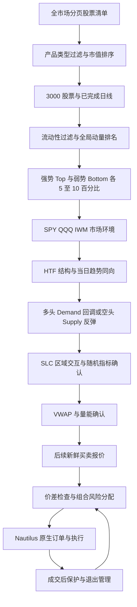
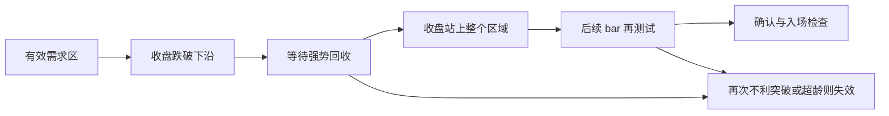

# 横截面动量与 SLC 日内交易系统

本文解释当前 Rust 实现的执行逻辑、设计哲学和参数调整方法，面向使用、研究及维护这套系统的人。
对应英文文档为 [slc_momentum.md](slc_momentum.md)，实现核对日期为 **2026-09-15**。

当前系统交易美股，支持做多和做空，使用 NautilusTrader 原生策略、数据、风控、订单及执行基础设施。
新模拟盘模板启用双向交易及当日日内趋势过滤；没有填写 `directions` 的旧配置仍默认只做多。
全市场扫描、日期回测和 Longbridge 模拟盘入口均直接运行 Rust，无须 PyO3。
已完成的工程测试不能证明策略盈利；真实历史数据上的增量 alpha 仍未验证。

本地缓存的零成交诊断、确认状态修复与冻结参数对照见
[回测改进研究记录](slc_momentum_results/fixed1000_spy_iwm_improvement.md)。
下文的 42 日零成交数字保留为原始基线，候选参数不会自动覆盖模拟盘默认配置。

## 多空方向与当日趋势

### 固定 1000 股研究变体

当前账户历史股票额度用尽后，研究池固定为已经成功取得排名补片的 1000 只股票。
成员名单保存在 `test_data/local/slc_momentum/2026-jul-aug-fixed1000/universe.json`，回测期间不变。
这份名单受缓存取得顺序影响，主要是字母 A–F 开头的股票，不能代表完整美股市场或无幸存偏差的样本。
每日仍按当时已知日线重新排名，取合格股票的强弱两端各 10%；未通过流动性、波动或数据完整性过滤的股票不参与排名。

经用户指定，本轮 `strategy.regime_benchmarks` 为 `["SPY.US.LONGBRIDGE", "IWM.US.LONGBRIDGE"]`，
`slc.regime_votes=2`。两个指数均投多头票才是 BULLISH，均投空头票才是 BEARISH，否则为 NEUTRAL；
任一指定指数数据缺失仍停止生成新信号。默认 `regime_benchmarks=null` 继续要求 SPY、QQQ、IWM 三个指数。
QQQ 分钟查询因额度不可用而排除，但已有 QQQ 日线继续用于 5 日相对强度计算。
固定池在 2026-07-01 至 2026-08-31 的 43 个交易日均满足排名覆盖要求；完整区间的分钟数据仍受下述访问限制影响。

后续访问核验发现：SPY、IWM 的 **8 月 31 日**分钟日期查询和分页查询也返回 `301607`；
AA 同期查询成功。因此，早期某一天查询成功不能证明整个区间都可取得。
当前两个指数均已逐分钟校验 2026-06-12 至 2026-08-28 的 21,060 根数据。
另建 `2026-jul-aug-fixed1000-through-aug28` 目录研究 7 月 1 日至 8 月 28 日的 42 个交易日，
保留原 43 日计划；不得将较短区间结果标成完整 7–8 月结果。
访问证据、下载状态及测试记录见 [固定池双指数研究记录](slc_momentum_results/fixed1000_spy_iwm_2026_jul_aug.json)。

**原始基线结果：2026-07-01 至 2026-08-28 的 42 个交易日已全部完成 Rust 回放。**
649 只逐日候选股的并集加 SPY、IWM，共 651 份分钟历史已下载完成，原始 CSV 合计约 405 MiB。
策略产生 0 个信号、0 笔交易，账户权益从 100,000 美元保持为 100,000 美元；净盈亏、回撤、敞口和换手均为 0。
Sharpe、Sortino、Calmar、胜率、Profit Factor、Expectancy 和平均 R 均无可计算样本，记录为 `null`。
现金核对通过，无遗留订单、持仓或执行错误。这一结果反映当前配置未交易，不能证明策略有效或确认组件有增量 alpha。

逐日候选股和指数共覆盖 5,511 个“股票 × 交易日”，预期 2,149,290 根分钟线中有 2,148,718 根有效价格记录；
386 个股票交易日合计缺 572 根，单个股票交易日最多缺 5 根，没有整日无有效价格的候选股。
因此 `complete_period=true`，但 `complete_minute_prices=false`。
主要评估拒绝原因为当日趋势不匹配 253,070 次、HTF RANGE 57,196 次、关键区无效 42,042 次、数据不满足要求 24,726 次；
这些是重复评估的拒绝次数，不是不同股票或错失交易的数量。结果和全部拒绝计数保存在上述研究记录及本地 `result.json`。

真实数据首日回放发现部分开盘分钟线的开盘价落在源 high/low 之外。历史 CSV 入口与现有 Longbridge
适配器保持同一规则：`high=max(high, open, close)`、`low=min(low, open, close)`，保留已经报告的价格。
原始 CSV 不修改，也不补造缺失分钟；输出 `ohlc_envelope_normalizations` 按股票记录发生转换的 K 线结束时间，
便于回查原始响应。该转换与假设的分钟内成交路径均属于研究数据处理，不能当作历史报价验证。
非正 OHLC 记录另列入 `discarded_nonpositive_ohlc`，不生成该分钟的 K 线或报价；其余有效股票照常更新。
`complete_minute_prices` 与是否跑完所选交易日分别报告，存在价格缺口的研究结果不能解释为完整报价上的收益。

该变体复用同一 Rust Strategy、排名器、下载器及回放器。股票池、指数配置和每日冻结排名均记入报告，
不得把其结果与 3000 股、三指数、盘中刷新配置的结果混称。

```bash
cargo run -p nautilus-longbridge --features examples --example longbridge-slc-momentum -- --history-plan-exploratory \
  test_data/local/slc_momentum/2026-jul-aug-fixed1000/app.json \
  test_data/local/slc_momentum/2026-jul-aug-fixed1000 2026-07-01 2026-08-31

cargo run -p nautilus-longbridge --features examples --example longbridge-slc-momentum -- --history-minutes \
  test_data/local/slc_momentum/2026-jul-aug-fixed1000

cargo run -p nautilus-backtest --features examples --example slc-momentum -- --history \
  test_data/local/slc_momentum/2026-jul-aug-fixed1000 \
  test_data/local/slc_momentum/2026-jul-aug-fixed1000/result.json \
  --start 2026-07-01 --end 2026-08-31
```

上面的完整区间命令仍要求 8 月 31 日指数数据。当前较短区间使用独立目录续传及回放：

```bash
SLC_HISTORY_ROOT=test_data/local/slc_momentum/2026-jul-aug-fixed1000-through-aug28
cargo run -p nautilus-longbridge --features examples --example longbridge-slc-momentum -- --history-minutes "$SLC_HISTORY_ROOT"
cargo run -p nautilus-backtest --features examples --example slc-momentum -- --history "$SLC_HISTORY_ROOT" "$SLC_HISTORY_ROOT/result.json" \
  --start 2026-07-01 --end 2026-08-28
```

下载数据保存在本地：日线位于 `market-cache/`，排名补片位于研究目录的 `ranking-gap/`，
分钟分页位于 `minute/<InstrumentId>/<查询截止时间>.csv`。使用同一 `plan.json` 和研究目录重跑
`--history-minutes` 时，下载器读取已有分页，并跳过 `complete.json` 与计划范围一致的股票。
中断后可用原命令续传。缓存覆盖范围内调整回测 `--start/--end` 只读取本地文件，不调用 Longbridge。
不同研究目录之间目前需要显式复用缓存；改变下载计划的截止时间也不保证自动合并重叠分页。

### 方向判断

系统仍按同一顺序执行：全市场流动性过滤 → 横截面排名 → 指数 Regime → 个股 HTF 结构 →
5 分钟关键区回调/反弹 → SLC 确认 → VWAP/量能 → 仓位与订单。
增加空头的作用是扩大可交易的市场情形；收益、回撤和成本是否改善需要实测，不能由方向数量推出。

| 判断层           | 多头 LONG                         | 空头 SHORT                        |
| ------------- | ------------------------------- | ------------------------------- |
| Momentum      | 合格股票中的强势端 Top 5%–10%            | 同一全市场排名的弱势端 Bottom 5%–10%       |
| 原始 percentile | ≥ `min_percentile`，如 90         | ≤ `100 - min_percentile`，如 10   |
| Regime        | BULLISH 或 NEUTRAL               | BEARISH 或 NEUTRAL               |
| HTF           | 两个更高高点和更高低点，可要求 EMA 快线高于慢线      | 两个更低高点和更低低点，可要求 EMA 快线低于慢线      |
| 当日趋势          | 当前收盘价高于当日开盘价、VWAP，1M EMA 快线高于慢线 | 当前收盘价低于当日开盘价、VWAP，1M EMA 快线低于慢线 |
| 关键区           | 上冲留下的 Demand，等待回调               | 下跌留下的 Supply，等待反弹               |
| 随机指标          | 触区后进入低于 20 的区域，再向上重返 20         | 触区后进入高于 80 的区域，再向下重返 80         |
| 量能、价格行为       | 重启向上的确认柱及 RVOL                  | 重启向下的确认柱及 RVOL                  |
| 初始止损          | 需求区下沿减 ATR buffer，向下取整到 tick    | 供给区上沿加 ATR buffer，向上取整到 tick    |
| 退出委托          | SELL                            | BUY（买入平空）                       |
| 目标和跟踪         | 目标高于入场，跟踪止损只能提高                 | 目标低于入场，跟踪止损只能降低                 |

NEUTRAL 对两个方向均提高确认阈值、降低风险预算。HTF 为 RANGE、日内趋势冲突、报价过期、
排名过期或关键区失效时，不会因为另一方向已开放而绕过条件。同一股票在前一笔订单与持仓生命周期
彻底结束前，不能反向开仓。

排名日志保留原始 percentile，空头不会把 4 改写为 96。比较方向强弱及动量失效时，多头使用
`percentile`，空头使用 `100 - percentile`。因此，空头原始排名从 4 升至 35 是变弱；
若同时价格收回 VWAP 上方、买盘放量、HTF 空头结构变弱，可以触发 `MOMENTUM_FAILURE`。
组合相关性使用绝对相关系数，方向相反也不会抵消总名义敞口或风险预留，这是保守的集中度限制。

下文需求区、向上回收和做多算例用于展开多头流程；空头使用上表的对称条件，共用其余状态、质量评分和风控。

### 双向配置及参数作用

以下字段放在 `strategy` 内；示例只展示本次相关字段，完整配置仍需股票池、交易日历及价格步长。

```json
{
  "directions": ["LONG", "SHORT"],
  "momentum": {"min_percentile": 90},
  "market": {"universe_size": 3000, "top_fraction": 0.10, "max_candidates": 600},
  "slc": {"require_intraday_trend": true, "minimum_intraday_return": 0.0},
  "risk": {"short_margin_ratio": "1.5"}
}
```

- `directions` 可以是 `["LONG"]`、`["SHORT"]` 或二者；空列表、重复值和未知值会被拒绝。
- `min_percentile=95` 对应两端各 5%；90 对应两端各 10%。提高该值会缩小两个方向的候选池。
- `max_candidates` 是两端合计容量。3000 只、两端各 10% 时设为 600；实际合格股票可能更少。
  它是计算候选容量，实时订阅仍只给信号待执行及已持仓股票，并另有订阅上限。
- `require_intraday_trend=true` 要求结构方向同时得到当天开盘以来收益、VWAP 和 1M 均线支持。
  该判断只使用已经完成的当前分钟数据。
- `minimum_intraday_return` 单位是小数收益率。0 仍要求严格同方向，0.003 表示至少上涨/下跌 0.3%。
  提高它会减少弱趋势交易，也可能错过较早的反转。
- `short_margin_ratio=1.5` 使空头资金上限更保守，允许范围为 1–10。它是内部预算系数，不能替代券商实际保证金或可卖空额度。

多空共用 `max_positions`、总风险、行业风险、总敞口、日亏损和连续亏损闸门；增加方向不会自动翻倍账户预算。
空头现金盈亏为 `卖出开仓金额 - 买入平仓金额 - 费用`，R 倍数以初始上方止损距计算，价格与金额保持 Decimal。

Longbridge 的空头开仓带 `SHORT_ENTRY` 标记，发送前查询账户当时的最大卖出数量；不足、查询失败或超时均拒绝开仓。
检查期间收到撤单会在发送前终止该开仓。买入平空和保护单不依赖新的可卖空额度查询。
这项查询只是当时的容量检查，不能保证后续不会发生券源变化或强制回补。

长桥香港帮助文档说明，日内买回平仓的做空与隔夜融券计息不同；本日内回测仅在每日确实平仓时假设融券利息为零，
普通佣金、点差和滑点照常计算。账户地区和具体收费需按实际账户规则核对。
参考：[美股卖空常见问题](https://longbridge.com/hk/zh-CN/support/topics/us-trade/dp0vs2)、
[最大可买数量接口（支持美股卖空估算）](https://open.longbridge.com/docs/trade/order/estimate_available_buy_limit)。

### 先筛选再下载的历史回放

1. 复用现有全市场日线缓存，仅补齐排名计算缺少的少量日线。
2. 每个历史交易日只用前一日及更早的完整日线，加当日开盘价，冻结两端排名。
3. 对入选股票下载分钟历史，并保留必要的 HTF 预热；基准 SPY、QQQ、IWM 同样需要分钟历史。
4. 每次最多 1000 根，向过去翻页；已有页面和完成标记可续用。并发上限 4，共享历史接口与行情接口限流器。
5. Rust 回测按交易日分批执行相同 Strategy，每日清仓后将净值传入下一天，避免一次把数千万条事件装入内存。

这条历史研究入口采用 **每日冻结排名**；模拟盘默认的每 15 分钟全市场刷新仍是另一配置。
历史研究不能用今天的 Top 名单反推两个月前的机会。每日仅几百只候选，轮换后两个月的并集仍可能较大。

```bash
# 仅补齐排名缺口；需要已授权的 Longbridge 只读 API 连接。
cargo run -p nautilus-longbridge --features examples --example longbridge-slc-momentum -- --history-fill-ranking \
  test_data/local/slc_momentum/2026-09-15/market.json \
  test_data/local/slc_momentum/2026-jul-aug 2026-07-01 2026-08-31

# 原生 Rust 逐日筛选；此入口显式标注当前股票池快照造成的历史偏差。
cargo run -p nautilus-longbridge --features examples --example longbridge-slc-momentum -- --history-plan-exploratory \
  test_data/local/slc_momentum/2026-09-15/market.json \
  test_data/local/slc_momentum/2026-jul-aug 2026-07-01 2026-08-31

# 仅下载 plan.json 中逐日入选的候选股及必要基准。
cargo run -p nautilus-longbridge --features examples --example longbridge-slc-momentum -- --history-minutes \
  test_data/local/slc_momentum/2026-jul-aug

# 直接运行原生 Rust 回测，不加载 PyO3。
cargo run -p nautilus-backtest --features examples --example slc-momentum -- --history \
  test_data/local/slc_momentum/2026-jul-aug \
  test_data/local/slc_momentum/2026-jul-aug/result.json \
  --start 2026-07-01 --end 2026-08-31
```

历史接口按每 30 秒 60 次的规则另留余量；不要与其他行情下载进程同时争用同一连接和账户配额。
月度历史查询还有限制不同股票数量的规则，账户实际额度不足时会保留进度并报错。
历史只读请求的连接/请求超时最多重试 3 次，与限流重试共享预算；每次重试仍经过两个限流器。
`301607` 月度额度错误不自动重试。
参考：[Longbridge 历史 K 线限制](https://open.longbridge.com/docs/quote/pull/history-candlestick)。

2026-09-15 实际补片过程中，接口返回 `301607`、`requested:1000/limit:1000`，因此停止下载。
保存了 1000 份补片响应、4904 根日线；尚未启动候选股分钟下载，7–8 月完整回测未完成。
详细数据覆盖与验证状态见 [多空回测状态记录](slc_momentum_results/long_short_2026_jul_aug.json)。
上面的下载命令用于账户额度恢复后的断点续传，反复重试不能解决月度股票数上限。

若 SDK 路径已经因股票数额度停止，可先用已登录的 Longbridge CLI 续补尚未取得的排名日线，再重新生成
全 3000 股计划，并只补不完整的分钟会话：

```bash
cargo run -p nautilus-longbridge --features examples --example longbridge-slc-momentum -- \
  --history-fill-ranking-cli test_data/local/slc_momentum/YYYY-MM-DD/market.json \
  test_data/local/slc_momentum/2026-jul-aug 2026-07-01

cargo run -p nautilus-longbridge --features examples --example longbridge-slc-momentum -- \
  --history-plan-exploratory test_data/local/slc_momentum/YYYY-MM-DD/market.json \
  test_data/local/slc_momentum/2026-jul-aug 2026-07-01 2026-08-31

cargo run -p nautilus-longbridge --features examples --example longbridge-slc-momentum -- \
  --history-minutes-cli test_data/local/slc_momentum/2026-jul-aug
```

日线 CLI 入口复用 SDK 首次运行已写入的 `sessions.json`，最多并行 4 个进程；分钟入口每次最多查询
两个交易日，避免超过 CLI 单次 1000 根上限，并写入逐会话完成标记以便续传。两者都校验返回日期/时间，
不会提交订单。CLI 与 SDK 是否共享账户的月度股票额度由 Longbridge 服务端决定；一次查询成功不能证明
额度被绕过，仍须检查 `ranking-gap-cli-audit.json`、`minute-cli-audit.json` 和最终回测覆盖率。

历史 `plan.json` 中的 `starting_equity`、`spread_bps`、`opening_spread_multiplier`、`quote_depth`
和 `slippage_probability` 分别控制初始资金、常规点差、开盘前 30 分钟点差倍数、模拟可见数量和
原生单 tick 滑点概率。默认是 100000 美元、4 bps、2 倍、100 股和 1.0；应进行成本敏感性分析。

研究数据仍有明确边界：当前股票池、行业和市值快照并非历史证券主数据；API 取得的历史 K 线也不等于当时收到的报价。
该研究入口只在输出中使用显式标注的历史发布时间假设，原始缓存的 API 接收时间不变。
原生回放使用真实 OHLC、假设的 O-L-H-C 分钟内路径和向外取整的点差，保守滑点和参与率约束；
历史可做空券源、召回和实际成交队列未获得。因此报告标记 `synthetic=true`，表示包含模拟执行数据，
不能把结果当成已通过历史证券主数据、真实报价及券源验证的实盘 alpha。

## 阅读导航

- [设计哲学](#设计哲学)：各层解决什么问题，为什么必须按顺序判断。
- [系统架构与一日运行流程](#系统架构与一日运行流程)：数据、策略和执行如何连接。
- [时间与数据约束](#时间与数据约束)：如何避免未来数据和错误周期锚点。
- [全市场选择与动量排名](#全市场选择与动量排名)：3000 股票与 Top 百分比的准确含义。
- [市场环境与高周期结构](#市场环境与高周期结构)：什么时候允许寻找多头或空头机会。
- [关键区域与 SLC 确认](#关键区域与-slc-确认)：区域形成、回踩、突破回收及随机指标确认。
- [入场与订单生命周期](#入场与订单生命周期)：信号如何变成订单，候选池变化如何处理。
- [仓位与组合风险](#仓位与组合风险)：一笔交易和整个账户如何分配风险。
- [退出与持仓管理](#退出与持仓管理)：止损、分批止盈、跟踪及动量失效。
- [关键参数参考](#关键参数参考)：当前值、单位及调大调小的影响。
- [配置与运行](#配置与运行)：原生 Rust 命令和配置修改示例。
- [研究、调参与验证边界](#研究调参与验证边界)：怎样判断参数有效，而不是只找到一次好结果。

## 设计哲学

### 将选股、择时与执行分开

横截面动量比较同一时刻不同股票的相对表现，回答“哪些股票值得关注”。
SLC 是 Structure、Level、Confirmation，即结构、关键区域和确认，回答“在这些股票中，何时出现可定义风险的入场机会”。
风险管理计算“如果失误，计划承担多少损失”，NautilusTrader 负责订单、成交和持仓状态的可靠衔接。

| 层次               | 核心问题                 | 通过后获得什么       |
| ---------------- | -------------------- | ------------- |
| Universe         | 标的是不是具备交易条件的股票？      | 可研究的股票池。      |
| Momentum         | 相对其他合格股票是否足够强？       | 候选资格。         |
| Regime           | 指数环境是否支持做多？          | 寻找多头机会的许可。    |
| HTF structure    | 个股高周期是否仍然处于上升结构？     | 方向一致性。        |
| Level / pullback | 回调是否抵达有依据的需求区域？      | 明确的观察位置与失效位置。 |
| Confirmation     | 回调是否出现恢复上涨的证据？       | 收盘后的交易信号。     |
| Risk / execution | 当前价格、流动性和账户容量是否允许执行？ | 有保护计划的订单。     |

高排名只赋予候选资格，并不自动触发买入。系统等待强势股票回调、确认后再参与。
这意味着很多强势股票当天不会交易；很多已经触碰需求区的股票也不会交易。

### 安全门槛与确认模式

默认 `STOCHASTIC_REENTRY` 仍要求关键条件逐层成立：方向结构、有效区域、随机指标重返、VWAP
和确认量能缺一不可，评分只筛选已经合格的机会。`PRICE_RESPONSE` 仅把随机指标重返替换为
触碰后的价格反应，其余硬条件不变。

研究模式 `WEIGHTED_EVIDENCE` 用于解决 HTF、区域质量、随机指标和量能被严格串联后信号过少的问题。
它允许 HTF 为 RANGE、区域质量分不足、随机指标未重返或 RVOL 未达标的单项由其他证据补足，
但明确反向 HTF、无有效触区/已失效区域、未离开区域、VWAP 反向、数据不完整和随机指标极端耗竭
仍会直接拒绝。降低 `confirmation_threshold` 只改变这些可互补证据的总分要求，不会绕过安全门槛。

### 宁可没有交易，也不把未知当成有效

数据不足与中性市场是两回事。指数数据缺失不会被解释为 NEUTRAL；不完整股票池不会被解释为完整市场；
过期排名不会继续授权新入场。系统保留明确的拒绝原因，方便区分“没有机会”和“数据链路尚未准备好”。

价格、数量、资金、费用和风险预算使用 Nautilus 领域类型或 `Decimal`。
百分位、相关系数等分析值可以使用浮点数，但下单价格按最小价格变动单位取整，数量按交易单位向下取整。

### 策略规则是可检验的假设

短期横截面动量、SLC 回调以及 VWAP/量能过滤是否具有增量价值，需要使用同一批历史数据、相同成本与风险预算比较。
当前默认值是研究起点，不是已经证明最优的参数。
系统尽量让回测、dry run 和模拟盘共享策略逻辑；数据质量、撮合方式和券商订单能力仍然存在差异。

## 系统架构与一日运行流程



这里的箭头表示交易资格的判断顺序。实现上会提前更新和缓存指标，例如同一批分钟数据先更新三只指数与候选股，
再统一判断信号；不会为了等待前一层通过而丢掉后一层需要的历史。

### 模块分工

| 文件或组件                                           | 职责                                      |
| ----------------------------------------------- | --------------------------------------- |
| `slc_momentum_market.rs`                        | Longbridge 全市场准备、日线缓存、报价扫描及候选分钟数据采集。    |
| `market.rs`                                     | 全局排名快照、候选成员、有效期及原生 `MarketUpdate` 数据契约。 |
| `selection.rs` / `CrossSectionalMomentumRanker` | 日线特征、相对强度、加权百分位排名和收益相关系数。               |
| `data.rs` / `SymbolFeatures`                    | 按交易时段聚合分钟数据，维护 VWAP、EMA、ATR 和随机指标。      |
| `signal.rs`                                     | 市场环境、高周期结构、区域生命周期、SLC 确认与信号证据。          |
| `risk.rs` / `PortfolioRiskManager`              | 固定风险仓位、行业/相关性/敞口限制、止损和目标价。              |
| `strategy.rs` / `SlcMomentumStrategy`           | 事件编排、候选轮换、下单、成交处理、保护单与退出。               |
| 现有 Longbridge adapter                           | 复用行情、执行、账户和订单能力，不另建 broker abstraction。 |
| 原生 BacktestEngine                               | 使用相同 Strategy 回放数据，报告订单、成交、持仓及统计。       |

这些是职责划分，不表示每个概念都对应一个独立类。无状态判断保留为函数，有状态部分才维护独立对象。
源码入口见 [策略模块](../../crates/trading/src/examples/strategies/slc_momentum/mod.rs)。

### 盘前准备

1. `--prepare-market` 完整读取美股筛选器分页，检查重复、漏页和总数变化。
1. 根据产品类型、市场、币种和可用元数据过滤，并按观察到的市值选取 3000 股票。
1. 写入当时已知的行业映射、市值、有效区间及交易日历，生成日期化配置与股票池审计。
1. `--prefetch-market` 缓存已完成的日线，检查股票及基准 ETF 的历史对齐情况。
1. 交易时段启动节点后，获取有效全市场排名，再加载候选股和指数的分钟预热数据。

“盘前准备完成”不代表盘前已经允许下单。当前全市场 collector 在美股常规交易时段内生成可执行排名。
`daily_only` 表示使用日线主导并在获得有效排名后冻结当日排名，仍需当前会话的数据资格检查；
它不是一个独立的盘前交易模式。

### 盘中循环

1. 默认每 15 分钟刷新一次全市场排名；空排名按有界轮询间隔重试。
1. 默认每 60 秒轮询候选、三只指数和已有持仓的分钟数据。
1. 新候选先预热。历史预热可以建立指标和区域，但不追溯产生历史买单。
1. 同批已完成分钟数据通过一个原生 `MarketUpdate` 交给策略，按事件时间统一处理。
1. 每当形成完整 5 分钟 bar，按全局资格、Regime、HTF、Level、SLC、VWAP/Volume 顺序判断。
1. 信号成立后才订阅执行报价，等待信号可用时间之后的新鲜报价，再做风险分配和下单。
1. 成交后进入持仓管理；订单终态和账户事件反馈到现有风险预留与状态机。

全市场评分是每次刷新进行的排序工作，复杂度约为 `O(N log N)`，不是每个 tick 对全市场重复计算。
分钟数据和执行报价只维护工作集合；相关性只比较新候选与有限数量的现有风险持仓。

## 时间与数据约束

### 四个周期各自的职责

| 数据周期             | 主要用途                               | 当前实现要点                        |
| ---------------- | ---------------------------------- | ----------------------------- |
| Daily            | 1/5/10/20 日收益、相对强度、20 日成交额与波动、相关性。 | 只用当前会话之前已完成且当时可用的日线。          |
| 30 / 60 / 240 分钟 | 个股高周期结构。                           | 当前默认 60 分钟，从交易所常规开盘时间锚定。      |
| 5 分钟             | 需求/供给区、回调、ATR、随机指标、确认量能。           | 只对已完成 bar 判断；当前 LTF 固定为 5 分钟。 |
| 1 分钟及报价          | 聚合、VWAP、短期状态、执行时机和报价检查。            | 没有另一个独立的 1 分钟追涨入场策略。          |

### 会话锚点

交易时段使用 `America/New_York` 日历，再转换为 UTC 纳秒存储。
常规开盘锚点为 09:30 ET，不能全年硬编码成某个 UTC 时刻，也不能用简单周一至周五推断交易日。
节假日、夏令时和提前收盘由显式会话表决定。

例如普通完整交易日的 60 分钟 bar 从 09:30–10:30 开始；15:30–16:00 只有 30 分钟，
不当作完整 60 分钟结构 bar。240 分钟模式只有 09:30–13:30 的完整第一段，尾段不会冒充第二根 4 小时 bar。
中间缺失一分钟会使相应聚合桶无效。

### 事件发生时间与可用时间

- `ts_event` / `timestamp`：价格或 bar 所代表的市场事件时间。
- `ts_init` / `available_at`：系统可以使用这条数据或信号的时间。
- `daily_cutoff`：本次排名使用的最近完整日线截止时间。
- `valid_until`：排名授权截止时间，不能超过当前会话收盘。

假设 10:00 做决策，只能使用昨日及更早的完整日线、当天已观察到的报价和已完成分钟数据。
当天最终收盘价、10:05 才确认的摆动点，都不能参与 10:00 的决定。
同样，10:00 bar 形成的信号不能用这根 bar 内更早出现的低价成交。

Longbridge 更新中的分钟 bar 不能直接作为最终 bar 使用。盘中轮询路径要求观察到后继分钟，
再把前一分钟正规化为以结束时间标记的已完成 bar。
完整模式还要求当前会话分钟序列齐全：即使报价覆盖率达标，也不能绕过缺分钟造成的 VWAP 或结构输入问题。

## 全市场选择与动量排名

### 3000 股票不等于同时交易 3000 股票

先从供应商美股清单中形成一个有界的 3000 股票研究池，再在这个池子里应用价格、流动性、波动和历史完整性过滤。
市值排序的用途是定义可管理的研究范围，不是直接按市值或当日涨幅买入。

当前准备器排除已识别的 OTC、非美元、基金、权证、优先股及 unit 等不合适产品。
这些判断依赖供应商市场分类和产品名称，不等价于经过认证的历史普通股主数据。
当天准备的股票池只能代表当时观察到的范围，不能拿它回测几年前并宣称已经消除幸存者偏差。

### 基础过滤与覆盖率

当前全市场模板的主要门槛为价格至少 5 美元、市值至少 10 亿美元、20 日平均成交额至少 2000 万美元，
日线波动比例至少 1%。最大波动比例、跳空和最低相对量能还会继承代码默认限制。

20 日平均成交额使用 `mean(日收盘价 × 日成交量)` 近似。
选股波动使用最近 20 日真实波幅的简单平均，除以前一会话收盘价。
它与入场使用的 5 分钟 Wilder ATR 是两个不同的量；修改 `slc.atr_period` 不会改变这个日线 20 日窗口。

覆盖率用于判断是否取得足够完整的数据，不是判断股票是否适合买入。
一只数据完整但流动性不达标的股票，可以是“已观察、被过滤”；缺少报价或对齐历史则属于覆盖不足。
默认要求 95% 覆盖率，且过滤后至少有 500 只可排名股票，否则候选集合为空。

### 特征、评分与百分位

日收益与相对强度定义为：

```text
Return(n) = 前一会话收盘价 / n 个会话之前收盘价 - 1
RS(SPY) = 个股对应窗口收益 - SPY 对应窗口收益
RS(QQQ) = 个股对应窗口收益 - QQQ 对应窗口收益
RS(Sector) = 个股对应窗口收益 - 对应行业 ETF 收益

Score = Σ[权重 × 特征在横截面内的百分位] / Σ权重
MomentumPercentile = Score 在整个合格股票集合中的百分位
```

系统先分别对特征排名，再对加权总分排名。
`score`、`rank` 和 `percentile` 不可互换：`rank = 1` 表示名次第一，`percentile` 越高越强，
而 `score = 90` 并不自动表示处于 Top 10%。相同数值使用平均名次计算百分位，标识符用于确定性排序。

全市场模板使用 `[1, 5, 10, 20]` 日窗口，收益权重为 `[0, 1, 1, 1]`。
因此计算 1 日收益并记录它，但默认不给这个收益列加分。
盘中模式还使用已观察到的开盘至当前收益及供应商相对量能。

SPY、QQQ 相对强度与个股同窗口收益存在一个容易误解的关系：
对所有股票减去同一个基准收益，不会改变横截面排序。
所以当窗口都是 5 日时，给 5 日收益、SPY RS 和 QQQ RS 同时加权，实质上会加重同一排序方向，
不能把它们解释成三个独立因子。行业 ETF 因股票所属行业而变化，具有不同的相对比较含义。

### Top 5–10% 的分母

默认 `top_fraction = 0.10` 与 `min_percentile = 90` 成对使用。
百分位的分母是 3000 研究池中通过过滤的合格股票，而不是已经订阅的候选股。
如果只有 2400 只合格，大约选出 240 只；不会为了凑足 300 只而降低标准。
并列分数会影响边界人数，超过候选容量时拒绝该快照，不偷偷截断后重新排名。

全局快照携带完整排名、排除原因、覆盖率、发布时间和有效期。
候选切换后不能只在剩下的两三百只股票中重算“全市场 Top 10%”。

## 市场环境与高周期结构

### Regime 的实际判断

SPY、QQQ、IWM 各自使用最新完整分钟数据投票。
单个指数看多票要求以下条件同时满足：价格高于会话 VWAP、快 EMA 高于慢 EMA、短期价格动量为正、
价格高于开盘区间中点。全部反向则为看空票，其余为中性票。
这里使用的是开盘区间**中点**，不是必须突破 Opening Range High。

默认三只指数至少两票同向才确认 BULLISH 或 BEARISH。
完整系统 F 中，BULLISH 允许继续检查；BEARISH 阻止新多单；NEUTRAL 提高确认分数并缩减风险预算。
缺少任一指数的必要数据、预热或完整会话分钟序列，会阻止环境判断。

`breadth_threshold` 在全市场模式中必须为空，因为当前 collector 没有采集全市场 VWAP breadth。
不能用 Top 候选股的上涨比例代替全市场广度；候选集合本来就偏向强势股，会形成选择偏差。

### HTF 结构的实际判断

当前摆动点使用三根 HTF bar 确认：中间一根的高点严格高于左右两根，才是摆动高点；低点规则相反。
只有右侧 bar 完成后，摆动点才成为已知信息。

多头结构要求最近两个已确认高点抬升、最近两个已确认低点抬升，而且当前 HTF 收盘仍高于最新摆动低点。
默认还要求 HTF EMA20 高于 EMA50，并完成对应指标预热。
低高点、低低点构成空头的对称判断；其余为 RANGE，完整做多系统不入场。

结构是在 HTF bar 完成时更新的，不会因为一根尚未完成的 HTF bar 看起来上涨而提前变成 BULLISH。
当前会话尚未形成第一根完整 HTF bar 时，可沿用已预热的最近结构；但不会伪造当前未完成 bar。
因此，Structure 是较慢的方向许可，5 分钟 SLC 才负责更细的交易时机。

## 关键区域与 SLC 确认

### 需求区和供给区如何产生

当前实现把前一根 5 分钟 bar 作为 base，使用它的完整最低价至最高价定义区域。
随后一根 bar 必须出现足够大的方向实体及量能，才证明价格从 base 显著离开：

```text
Impulse = abs(当前收盘 - 当前开盘) / 当前 5 分钟 ATR
VolumeRatio = 当前 5 分钟成交量 / 之前最多 20 根完整 5 分钟 bar 的平均成交量

Demand：向上实体，收盘高于 base.high，Impulse 与 VolumeRatio 均达标
Supply：向下实体，收盘低于 base.low，Impulse 与 VolumeRatio 均达标
```

成交量比较不把当前 bar 放进分母，并至少需要 5 根既往样本。
区域直到位移 bar 收盘时才形成，不能在这根位移 bar 形成之前拿它入场。
这是一种明确、可回放的区域定义；并没有实现所有主观的多根 base、订单块或供需区画法。

前日高低点、开盘区间、摆动点、VWAP 和区域锚定 VWAP 可记录为研究信息。
当前核心多头 setup 使用 Demand，不能认为每一种参考线都有一个独立可交易 setup。
区域 AVWAP 是自位移形成时累计的 bar 收盘价加权量，不是任意用户锚点的通用 AVWAP 策略。

### 区域质量与使用寿命

当前 LevelScore 的组成如下，分项截断方式来自代码，而不是用户可随意排列的指标权重：

```text
LevelScore = min(Impulse, 3)
           + min(VolumeRatio, 2)
           + max(1 - age / max_level_age_bars, 0)
           + HTF 看多奖励 1
           + Momentum 合格奖励 1
           + max(1 - 区域距离 / ATR, 0)
```

默认最低分为 6，还要求确认价格不能离区域过远。
连续几根 bar 与区域重叠算一次访问；离开后再次回来才增加 `tests`。
默认只允许一次访问，超过限制、年龄过大或被第二次不利突破的区域失效。
访问次数是硬过滤，不是公式里一项可以被其他分数抵消的扣分。
已产生信号的区域被消耗，避免同一区域重复产生入场机会。

区域在当前交易会话内使用，跨会话会清理；放大年龄参数不会把它变成跨日持仓策略。

### 两种 SLC setup

**新鲜需求区回调**：强势个股向上离开 base，后来首次回到仍有效的需求区，形成确认后参与再次启动。
信号名称为 `MOMENTUM_SLC_PULLBACK`。

**一次破位后的回收与再测试**：需求区先被收盘跌破，暂时失去交易资格；之后出现足够强的向上实体，
收盘重新站到整个区域上方；再等后续 bar 回踩，最后检查确认。
信号名称为 `MOMENTUM_SLC_BREAK_RETEST`。这是把资料中的供给区序列对称应用到做多需求区的工程解释。



关键区别是“触碰”和“突破”：影线穿过区域但收盘没有不利穿越，不算收盘突破。
同一段连续在区域外的收盘不是每天都累加一次突破；第二次独立不利穿越才增加第二次计数。
强势回收不会重置原有年龄和访问次数，也不能用同一根回收 bar 的 OHLC 假设已经发生了之后的再测试。

`max_level_breaks = 0` 表示一旦不利突破就失效；设为 1 才允许一次破位回收路径。
当前校验不允许设置为 2 或更大。

### 随机指标是确认，不是独立买点

默认使用随机指标 5/3/3：5 根窗口、3 根 D 平滑、3 根 K 平滑，基于完整 5 分钟 bar。
Demand 必须先发生区域交互，随后在确认窗口内观察到 K 小于超卖界限，并出现：

```text
触区后曾观察到 K < oversold
随后已完成 K >= oversold 的边界重返
入场确认时 K 仍 >= oversold，收盘 > Demand.high
```

默认 `oversold = 20`。例如 K 从 14 回到 23 满足边界重返；K 与 D 发生金叉但 K 仍为 12，不满足该规则。
D 仍会计算和记录，但当前默认入场没有要求 K 上穿 D；D 的周期仍可能影响指标预热完成时间。
`confirmation_window_bars = 4` 包含触碰 bar 在内的后续计数范围，过迟的反弹不会重新解释成及时确认。
已完成的边界重返会在这个窗口内保留，允许 VWAP、量能与价格收盘条件在后续完整 bar 上满足，
不再要求所有条件恰好与重返发生在同一根 bar。保留状态不是永久许可：新的独立触碰、区域不利突破、
K 再次进入极值区或确认窗口到期都会使旧确认失效。窗口同时检查事件时间，缺失 bar 不会延长有效期。
做空使用相反方向的极值与收盘条件。

`PRICE_RESPONSE` 是可替换的研究确认模式：Demand 要求收盘超过触碰 bar 的高点且为阳线，
同时保留离开整个区域等条件。它不是自动降级机制；随机指标缺数据时不会悄悄切换到价格确认。

`WEIGHTED_EVIDENCE` 不要求随机指标先完成极值区重返，而是把该状态作为一项加分证据；
指标已初始化时仍禁止在多头 K≥`100-oversold/2`、空头 K≤`oversold/2` 的耗竭端追单。

### VWAP、量能与确认分数

默认严格确认要求收盘严格高于会话 VWAP，且 5 分钟相对量能至少为默认的 1.2。
`WEIGHTED_EVIDENCE` 仍把 VWAP 方向作为硬门槛，但把相对量能改为评分项。
当前代码检查“价格已经位于 VWAP 上方”，并不额外要求这一根 bar 恰好发生从下到上的 VWAP 穿越。
同样，所谓量能扩张是当前量与历史 bar 均量之比达标，不要求一定大于上一根 bar 的量。

全市场排名 RVOL 来自供应商报价快照；SLC 入场 RVOL 来自上述 5 分钟均量比较。
旧的小股票池排名路径还会使用前几日同一会话分钟的累计成交量轮廓。
这三种量能口径不可混写，更不能用某个口径的 1.2 直接代替另一个口径的 1.2。

`confirmation_weights` 的数组顺序固定如下：

| 数组位置 | 条件                | 默认分值 |
| ---- | ----------------- | ---: |
| 0    | HTF 多头结构。         | 2    |
| 1    | 动量百分位合格。          | 2    |
| 2    | 有效且完成 SLC 确认的需求区。 | 2    |
| 3    | 使用随机指标重返确认。       | 1    |
| 4    | 价格高于 VWAP。        | 1    |
| 5    | 确认相对量能达标。         | 1    |
| 6    | 确认 bar 为阳线。       | 1    |
| 7    | 收盘高于个股 1 分钟快 EMA。 | 0    |

每个信号同时记录 `confirmation_flags` 与 `confirmation_enabled` 两个 8 位位图。位 `n` 对应上表位置 `n`；
例如 `0xDF` 表示除 RVOL 位 5 外其余确认均满足，enabled 位图则说明本次消融实际启用了哪些确认项。

默认总分 10，普通门槛 9，中性环境额外加 1，形成 10 分门槛。
在严格确认模式中，前六项硬条件通过通常已有 9 分，所以中性环境额外要求阳线，才达到 10 分；
在 `WEIGHTED_EVIDENCE` 中，HTF、区域质量、随机指标和量能可以按同一张表互补。

如果把 `neutral_extra_score` 增加到使门槛超过可得总分，中性环境将没有交易。
研究变体关闭某些评分项时，代码会相应减去被移除项的权重，避免只删除指标却留下不可能达到的原门槛。

## 入场与订单生命周期

### 收盘信号到实际订单

通过 5 分钟确认后生成信号，记录排名、结构、区域、随机指标、VWAP、量能和参考入场价。
这个入场价是确认 bar 收盘价，还不是实际成交价。

随后必须收到 `quote.ts_event > signal.available_at` 的报价，再检查：

1. 全局候选资格在报价时间和当前策略时钟下都仍有效。
1. 仍在允许开仓的会话窗口内，没有超过信号等待时限。
1. 报价不是未来数据，未超过 `max_quote_age_ms`，价格有效且卖价不低于买价。
1. 相对价差没有超过 `max_spread_bps`。
1. 卖价没有超过确认价乘以滑点容忍比例的上限。
1. 风险、资金、行业、相关性和流动性容量足够。

默认 LIMIT 的限价依据是：

```text
entry_ceiling = 确认收盘价 × (1 + max_slippage_bps / 10000)
订单限价 = entry_ceiling 按 tick 向下取整
spread_bps = (ask - bid) / bid × 10000
```

因此默认限价单可能是可立即成交的限价单，不是固定挂在 Demand 下沿等待成交的被动订单。
扩大 `max_slippage_bps` 同时会放宽价格上限、扩大预算中的每股风险，并可能减少股数。
它不是简单的“增加成交概率”按钮。

通用原生策略支持 MARKET、LIMIT、STOP、STOP_LIMIT。
当前 Longbridge runner 只接受 MARKET 和 LIMIT 入场，保护止损使用适配器支持的 MIT；
不能把回测支持 STOP 解释为该券商路径已经支持原生 stop entry。

### 状态与幂等性

```text
SCANNING → CANDIDATE → HTF_VALID → LEVEL_FOUND → WAITING_CONFIRMATION
→ SIGNAL_READY → ORDER_SUBMITTED → POSITION_OPEN → MANAGING → EXIT
```

状态帮助观察流程，但订单是否完成仍以 Nautilus Cache 和原生成交/终态事件为准。
同一股票已有入场订单或持仓时，不再重复下单；发单之前预留风险，终态或平仓事件到达后才释放。
重复成交事件通过成交标识去重，不能重复增加持仓或重复计算费用。

成交数量驱动保护单数量。需要主动退出时，先处理入场余单与现有保护单的撤销，等待确认，再发送退出订单，
避免保护卖单与主动卖单同时存在而超卖。成交价越过预算上限等执行异常会触发停止及退出处理。

### 候选池变化时怎样处理

| 当前状态         | 掉出候选池或排名失效后的处理                  |
| ------------ | ------------------------------- |
| 尚无信号。        | 不再允许新的入场信号。                     |
| 已有信号，尚未提交订单。 | 清除不再具备资格的待执行信号。                 |
| 入场订单尚未结束。    | 在市场更新时请求撤销/退出，无须等下一条个股报价。       |
| 入场仅部分成交。     | 按同一退出序列处理余单及已成交数量；仍依赖真实终态和成交事件。 |
| 入场已完全成交。     | 保留特征、执行报价、风险预留和保护；不因排名掉出就无条件平仓。 |

完全成交后的排名恶化是否触发提前退出，由独立的 Momentum Failure 规则决定。
长期持仓管理与“是否有资格开一笔新仓”是两个不同的问题。

## 仓位与组合风险

### 先确定结构止损，再计算股数

多头初始止损为需求区下沿减去 ATR 缓冲，并按 tick 向下取整：

```text
stop = floor_to_tick(level_low - ATR_5m × stop_buffer_atr)
distance = 预算入场价 - stop
每股预算风险 = distance + 入场价 × (2 × commission_rate + max_slippage_bps / 10000)
```

止损非正或距离小于 `minimum_stop_distance` 时拒绝交易。
当前逻辑不会为了让交易通过，自动把过近止损改宽；该参数是最小距离过滤，不是自动调整目标。

单笔预算先由账户权益乘以风险比例产生，再考虑环境、相关性和已有预留：

```text
基础预算 = equity × risk_per_trade × 环境乘数 × 相关性乘数
可用风险 = min(基础预算, 总风险剩余额度, 行业风险剩余额度)

最终股数上限 = min(
    可用风险 / 每股预算风险,
    可用资金 / 含费用的每股成本,
    最新完整分钟成交量 × participation
)
```

最终还要通过 Nautilus 固定风险 sizing，并向下取整为整手。
`participation` 当前以最新分钟成交量限制本次订单数量；它不是拆单执行算法，也不是全天成交量参与率保证。

### 用一个例子理解约束谁先起作用

假设账户权益 100000 美元，单笔风险 0.25%，确认价 100，限价上限 100.10，需求区下沿 98.60，
5 分钟 ATR 为 1，止损缓冲 0.2，佣金率 0.0001，且不存在其他容量限制。

```text
止损 = 98.60 - 1 × 0.2 = 98.40
价格风险距离 = 100.10 - 98.40 = 1.70
每股预算风险 = 1.70 + 100.10 × (0.0002 + 0.001) = 1.82012
基础风险预算 = 100000 × 0.0025 = 250
仅按风险约束，最多约 137 股

但全市场模板 max_position_value = 5000
按资金约束，只允许 49 股
实际预留风险约为 49 × 1.82012 = 89.19 美元
```

提高 `risk_per_trade` 不一定增加仓位，因为真正限制数量的可能是单股市值、行业容量或分钟流动性。
同样，中性环境把风险预算减半，也未必把最终股数减半：如果两个预算都高于资金上限，数量会一样。

### 组合风险与相关性

`max_positions` 和 `max_sector_positions` 也计入尚未结束的入场风险预留，避免并发信号同时吃掉同一份预算。
资金限制同时考虑单股金额、总金额、总权益敞口比例、行业权益敞口比例及保守的可用资金余额。

相关性使用对齐的已完成日收益，不使用价格水平。
如果新股票与现有股票的收益相关系数达到阈值，风险预算乘以 `correlation_penalty`；
当前只要存在高度相关持仓就乘一次，不按相关股票数量连续乘方。
达到 `max_correlated_positions` 时直接拒绝；无法可靠计算相关性时也拒绝，不能默认独立。

日损失限制使用账户权益变化，包含持仓浮动盈亏。
本会话首次观察到的权益作为基准，触发限制后锁定到下一会话；中途启动不等价于重建真实 09:30 权益。
连续亏损按已完成交易净 PnL 计数，盈利重置，零收益不重置；达到次数限制同样停止新风险。
这些内存状态不构成可跨任意重启恢复的完整风险账本。

固定风险是下单时的预算，不是最大实际亏损保证。跳空、滑点、断线和订单拒绝仍可能使实际损失偏离预算。

## 退出与持仓管理

### 初始保护与分批目标

初始止损在每次入场成交后按实际成交数量建立保护。
默认部分止盈为 1R、卖出约一半；整手取整后无法合理拆分时可能一次退出剩余数量。
部分目标使用实际平均买入价与初始止损之间的距离，主目标则在风险分配时按预算入场价生成。
因此不同成交改善程度会使实际实现的 R 与初始目标标签存在差异。

| `target_mode` | 主目标计算                                                   |
| ------------- | ------------------------------------------------------- |
| `FIXED_R`     | 预算入场价 + 初始价格风险距离 × `target_r`。                          |
| `ATR`         | 预算入场价 + max(ATR × `atr_multiplier`, 风险距离 × `target_r`)。 |
| `STRUCTURE`   | 使用足够远的有效供给区，至少满足 `target_r`；没有合格目标就拒绝入场。                |

默认 `target_r = 2`。代码要求它大于部分止盈 R，但并没有把所有配置强制钉死在至少 2；
降低它会改变策略的收益风险假设，研究时必须明确记录。
当目标价与部分止盈同时满足，先处理主目标退出。

### 跟踪止损

默认开启 trailing，入场完全结束且当前买价高于实际平均成本后才尝试上调。
`chandelier = true` 使用成交后观察到的可执行报价最高值，减去 ATR 乘数；关闭时使用最新完整 5 分钟收盘参考。
止损只朝减少风险的方向移动，不向下放宽。

`trailing_atr` 越小，保护越紧，越容易较早离场；越大，容忍更深回撤，也可能保留更长趋势。
它与 `stop_buffer_atr` 分工不同：后者定义初始区域外缓冲，前者定义成交后的动态保护距离。
高价参考从实际入场成交价开始，只使用成交后收到的报价，不继承入场前确认柱的高点。
空头对称使用最低可执行卖价加 ATR 缓冲，保护买入止损只能降低；断线期间未收到的报价不参与极值计算。

### VWAP 与动量失效退出

`vwap_loss = true` 时，最新买价低于当前已计算的 VWAP 可触发退出；默认关闭。
该选项没有默认附加“两根收盘确认”，打开后可能对短暂跌破较敏感。

默认开启的 `momentum_failure` 要求以下条件同时成立：

1. 相比入场百分位，当前排名下降至少 `momentum_drop` 个百分点，或者当前排名已不存在。
1. 最新买价低于 VWAP。
1. 最新完整 5 分钟 bar 为阴线，且相对量能达到 `selling_volume`。
1. HTF 结构已不再看多。

默认 `momentum_drop = 25`，例如从 96 降到 71，表示下降 25 个**百分点**，不是排名名次下降 25，
也不是相对下降 25%。由于 HTF 更新较慢，这个退出可能晚于初始止损；它是补充保护，不是初始止损的替代。

### 会话结束与异常退出

默认在实际收盘前 5 分钟开始退出，并依据会话表处理提前收盘。
开仓窗口结束不等于立刻平掉所有仓位；持仓可以继续由止损、目标及会话退出规则管理。
策略错误、账户风险锁定、保护单丢失等异常走停止/退出处理。
进程内的动态退出仍依赖事件和连接，不能将它们视为在任意断线情况下都能独立运行的券商保护。

## 关键参数参考

除特别标注外，下列路径均位于 `strategy` 内。
“当前值”指全市场模板覆盖之后的值，而不只是 Rust `Default`。
金额与比例型 `Decimal` 使用 JSON 字符串；时间参数有分钟、秒和毫秒，不能混用。
`0.0025` 是 0.25%，`10 bps` 是 0.1%，`90 percentile` 是第 90 百分位。

### 代码默认与全市场模板的差异

| 参数                                 | Rust 默认 | 全市场模板       | 含义                  |
| ---------------------------------- | ------- | ----------- | ------------------- |
| `market`                           | `null`  | 启用，3000 股票。 | 不启用仍是输入小股票池模式。      |
| `momentum.min_percentile`          | 80      | 90          | 模板取 Top 10%。        |
| `momentum.refresh_minutes`         | 5       | 15          | 模板降低全市场刷新频率。        |
| `momentum.minimum_universe_size`   | 5       | 500         | 防止小样本排名冒充全市场。       |
| `momentum.spy_weight / qqq_weight` | 0 / 0   | 1 / 1       | 模板增加同窗口市场 RS 排名权重。  |
| `risk.risk_per_trade`              | `0.005` | `0.0025`    | 0.5% 调整为 0.25%。     |
| `risk.max_daily_loss`              | `0.02`  | `0.01`      | 2% 调整为 1%。          |
| `risk.max_positions`               | 4       | 2           | 更小的模拟盘并发持仓规模。       |
| `risk.max_sector_positions`        | 2       | 1           | 模板同一行业仅允许一份持仓/入场预留。 |
| `risk.max_position_value`          | `25000` | `5000`      | 单股最多配置 5000 美元。     |

### 全局股票池与刷新参数

| 参数                                | 当前值      | 调整作用与约束                                                                   |
| --------------------------------- | -------- | ------------------------------------------------------------------------- |
| `market.universe_size`            | 3000     | 增大扩大研究范围，也提高日线、报价和元数据负载；不是同时订阅数量。                                         |
| `market.top_fraction`             | 0.10     | 调小到 0.05 收紧为 Top 5%；当前只允许 0.05–0.10。                                      |
| `momentum.min_percentile`         | 90       | 必须等于 `(1 - top_fraction) × 100`；不能只改其中一个。                                 |
| `market.max_candidates`           | 600      | 至少为 `ceil(universe_size × top_fraction) × 启用方向数`；计算容量上限 900，执行报价订阅另限 450。 |
| `momentum.refresh_minutes`        | 15 分钟    | 减小更快反映相对强弱变化，但增加请求、候选轮换和噪声。                                               |
| `market.max_snapshot_age_minutes` | 20 分钟    | 放宽可容忍刷新延迟，也允许更旧的选股依据；不能把过期数据变成新数据。                                        |
| `market.max_observation_age_ms`   | 60000 毫秒 | 全市场报价年龄上限；缩短可能使低频成交股票频繁缺失。                                                |
| `market.max_bar_delay_seconds`    | 120 秒    | 收盘信号数据延迟容忍；放宽会允许更迟的确认入场。                                                  |
| `momentum.minimum_coverage`       | 0.95     | 提高更强调数据完整性；降低可能把不完整观察样本当作市场。                                              |
| `momentum.minimum_universe_size`  | 500      | 过滤后参与排名的最少数量；它不是原始研究池大小。                                                  |
| `momentum.daily_only`             | `false`  | 开启减少盘中排名变化；必须把快照寿命设为至少 390 分钟，仍受真实收盘截断。                                   |

15 分钟刷新配 20 分钟有效期，为正常采集留下少量余量。
如果把刷新改为 30 分钟而有效期仍为 20 分钟，每轮中间会出现不能授权新仓的空档。
反过来把有效期拉得很长，也不能补偿 scanner 长时间不可用。

### 动量特征与基础过滤参数

| 参数                                       | 当前值             | 调大、调小或重新分配的影响                         |
| ---------------------------------------- | --------------- | ------------------------------------- |
| `momentum.lookbacks`                     | `[1,5,10,20]`   | 更短偏向近期变化，更长偏向持续强弱；改变窗口须同步修改权重长度和预热。   |
| `momentum.return_weights`                | `[0,1,1,1]`     | 增加某窗口的相对权重会改变偏好；全部同比放大不改变归一化评分。       |
| `momentum.relative_strength_lookback`    | 5 会话            | 改变 SPY/QQQ/行业 RS 的比较窗口，并增加对应历史需求。     |
| `momentum.spy_weight / qqq_weight`       | 1 / 1           | 不是独立于同窗口收益的市场择时开关；Regime 在另一层。        |
| `momentum.sector_weight`                 | 1               | 提高更强调相对本行业表现；依赖准确、当时已知的行业映射。          |
| `momentum.relative_volume_weight`        | 1               | 提高更偏好相对量能活跃股票；供应商 RVOL 与确认 RVOL 分别检查。 |
| `momentum.intraday_weight`               | 1               | 提高更偏好当日开盘至当前的强势；也增加追逐短期异动的倾向。         |
| `momentum.minimum_price`                 | `5` 美元          | 提高排除低价股；降低扩大范围但需重新检验价差、成本和产品质量。       |
| `momentum.minimum_market_cap`            | `1000000000` 美元 | 提高倾向大市值；研究池本身已经按市值形成，此门槛可能不是实际约束。     |
| `momentum.minimum_average_dollar_volume` | `20000000` 美元   | 提高收紧流动性条件；降低不代表成交容量随之增加。              |
| `momentum.minimum_atr_fraction`          | 0.01            | 提高要求更大的日波动空间；过高会只剩高波动股票。              |
| `momentum.maximum_atr_fraction`          | 0.15            | 降低排除波动极端标的；提高扩大风险和成本尾部。               |
| `momentum.minimum_relative_volume`       | 0.5             | 提高要求更活跃的入选股票；它在排名前生效。                 |
| `momentum.maximum_gap_fraction`          | 0.15            | 绝对跳空限制；提高会允许更大的向上或向下跳空，并非只偏好高开。       |

### 结构、区域与确认参数

| 参数                                | 当前值                  | 调整作用与约束                                         |
| --------------------------------- | -------------------- | ----------------------------------------------- |
| `slc.htf_minutes`                 | 60                   | 当前允许 30/60/240；越长越慢、预热需求越大，不保证更准确。              |
| `slc.ltf_minutes`                 | 5                    | 当前验证固定为 5；不能仅改成 1 或 15 就得到受支持的新策略。              |
| `slc.ema_fast / ema_slow`         | 20 / 50              | 同时用于 1 分钟状态和 HTF 独立 EMA；修改会同时影响 Regime 与结构。     |
| `slc.require_htf_ema`             | `true`               | 关闭仅去掉 HTF EMA 附加许可，不去掉 HH/HL，也不关闭指数 EMA 投票。     |
| `slc.atr_period`                  | 14 根 5 分钟 bar        | 增大平滑波动估计，减小更快适应；同时影响区域、止损、目标和 trailing。         |
| `slc.impulse_atr`                 | 1.5                  | 提高要求更强的离区实体、减少区域；降低更容易把普通波动识别为区域。               |
| `slc.impulse_volume`              | 1.2                  | 提高要求区域形成时更明显放量；与确认时的量能门槛独立。                     |
| `slc.min_level_score`             | 6                    | 提高仅保留更高质量区域；不能消除过测等硬失效条件。                       |
| `slc.max_level_distance_atr`      | 1                    | 降低更严格限制确认价远离需求区，减少较晚或更高位置的入场。                   |
| `slc.max_level_age_bars`          | 24 根 5 分钟 bar        | 增大允许较老区域，约等于放宽会话内生命周期；不重置访问次数。                  |
| `slc.max_level_tests`             | 1                    | 提高允许更多独立回访；这会改变“新鲜关键区”的核心假设。                    |
| `slc.max_level_breaks`            | 1                    | 0 为首次突破失效，1 允许一次回收后再测试；不允许大于 1。                 |
| `slc.reclaim_impulse_atr`         | 0.5                  | 提高要求更强回收实体；再高的实体也不能省略后续再测试。                     |
| `slc.stochastic_k`                | 5                    | 增大拉长高低点回看，通常更慢；减小更敏感。                           |
| `slc.stochastic_d`                | 3                    | 调整 D 平滑；默认边界重返判定不直接使用 D，不能预设改变它会改变买点。           |
| `slc.stochastic_smoothing`        | 3                    | 调整实际 K 平滑，直接影响超卖及重返时机。                          |
| `slc.oversold`                    | 20                   | 降低要求更深的超卖，通常更少确认；也改变供给区对称的 `100 - oversold` 边界。 |
| `slc.confirmation_window_bars`    | 4                    | 增大允许触碰后等待更久；过大可能把已经脱离原回调的反弹算入。                  |
| `slc.confirmation_mode`           | `STOCHASTIC_REENTRY` | 可选 `PRICE_RESPONSE` 或 `WEIGHTED_EVIDENCE`；后者允许证据按分数互补。 |
| `slc.confirmation_weights`        | `[2,2,2,1,1,1,1,0]`  | 数组含义固定；调整权重时同步检查可得总分和中性门槛。                      |
| `slc.confirmation_threshold`      | 9                    | 提高更严格；加权模式降低会放宽可互补证据，但不绕过触区、VWAP、时效和数据门槛。       |
| `slc.minimum_confirmation_volume` | 1.2                  | 提高要求确认 bar 更活跃；并不修改区域形成时的量能标准。                  |
| `slc.neutral_extra_score`         | 1                    | 提高降低中性环境交易频率；超过可得分数会完全禁止该环境入场。                  |
| `slc.opening_range_minutes`       | 15 分钟                | 更长提供更稳定的开盘区间，也推迟首次可用 Regime。                    |
| `slc.regime_votes`                | 2                    | 设为 3 要求三指数一致；降低可能使一只指数左右结论，冲突时当前代码优先看空。         |
| `slc.regime_momentum_minutes`     | 5 分钟                 | 增大使用较长指数短期变化，响应较慢。                              |
| `slc.breadth_threshold`           | `null`               | 当前全市场模式不支持非空值，需要先补全全市场 breadth 数据。              |

### 风险、资金与执行参数

| 参数                              | 当前值         | 调整作用与约束                                                |
| ------------------------------- | ----------- | ------------------------------------------------------ |
| `risk.risk_per_trade`           | `0.0025`    | 单笔基础风险 0.25%；提高主要放大损益，不能提高信号质量。                        |
| `risk.neutral_multiplier`       | `0.5`       | 中性预算乘数；越小越保守，受其他仓位上限影响，股数不一定同比变化。                      |
| `risk.max_daily_loss`           | `0.01`      | 日内权益损失锁定线；调大允许更深回撤，不应为追赶亏损临时修改。                        |
| `risk.max_total_risk`           | `0.02`      | 全部风险预留之和上限，当前权益的 2%。                                   |
| `risk.max_sector_risk`          | `0.01`      | 单行业风险预留上限，当前权益的 1%。                                    |
| `risk.max_positions`            | 2           | 提高并发容量，但不会绕过行业、相关性、金额和风险限制。                            |
| `risk.max_sector_positions`     | 1           | 提高后可同时持有同行业多股，需检查相关暴露。                                 |
| `risk.max_correlated_positions` | 2           | 新股与现有高度相关持仓数达到此值即拒绝；不是相关系数。                            |
| `risk.max_consecutive_losses`   | 3           | 降低更早锁定风险；提高允许更长亏损序列。                                   |
| `risk.max_position_value`       | `5000` 美元   | 单股金额上限；小账户或高价股可能首先受这一项约束。                              |
| `risk.max_notional`             | `100000` 美元 | 组合固定金额上限，与权益比例上限同时生效。                                  |
| `risk.max_total_exposure`       | `0.8`       | 全部预留名义金额不超过权益的 80%。                                    |
| `risk.max_sector_exposure`      | `0.3`       | 行业预留名义金额不超过权益的 30%。                                    |
| `risk.correlation_lookback`     | 20 会话       | 增大相关估计窗口，更平滑但适应变化慢，并增加历史需求。                            |
| `risk.correlation_threshold`    | 0.8         | 降低会把更多股票视为高度相关，更常惩罚或拒绝。                                |
| `risk.correlation_penalty`      | `0.5`       | 高相关时预算乘数；越小削减越多，设为 1 则不削减。                             |
| `risk.participation`            | `0.01`      | 最新完整分钟成交量的 1% 数量上限；提高需要验证成交冲击。                         |
| `risk.commission_rate`          | `0.0001`    | 模型佣金率与 sizing 成本预留；不是 Longbridge 实际费率声明。               |
| `risk.stop_buffer_atr`          | `0.2`       | 增大把初始止损放得更远，通常减少股数，也推远固定 R 目标。                         |
| `risk.minimum_stop_distance`    | `0.10` 美元/股 | 提高排除更紧的止损；单位是价格差，不是百分比或 ATR 倍数。                        |
| `entry_mode`                    | `LIMIT`     | 改变原生订单种类；Longbridge 当前仅接受 MARKET/LIMIT。                |
| `max_spread_bps`                | `10`        | 提高允许更宽价差；降低减少交易但可能改善成本条件。                              |
| `max_slippage_bps`              | `10`        | 同时影响入场价格上限与每股成本风险预留。                                   |
| `max_quote_age_ms`              | 5000 毫秒     | 实际下单报价年龄，与全市场扫描的 60000 毫秒限制不同。                         |
| `entry_timeout_minutes`         | 2 分钟        | 信号等待和未结束入场时限；放宽可增加迟到成交。                                |
| `trading_windows`               | `[[5,120]]` | 开盘后第 5 至第 120 分钟，结束边界不含；不是绝对 UTC 时间。                   |
| `flatten_before_close_minutes`  | 5 分钟        | 提高则更早开始收盘退出；不会延长半日市交易时间。                               |
| `batch_delay_ms`                | 2000 毫秒     | 用于普通逐条分钟流的批次等待；全市场路径主要依靠原子 `MarketUpdate`，不是 API 节流参数。 |

### 退出参数

| 参数                      | 当前值       | 调整作用与约束                               |
| ----------------------- | --------- | ------------------------------------- |
| `exit.partial_r`        | `1`       | 提高延后部分获利；降低更早兑现但更容易缩小趋势收益。            |
| `exit.partial_fraction` | `0.5`     | 提高更早兑现更多数量；设为 0 关闭部分止盈，必须小于 1。        |
| `exit.target_r`         | `2`       | 提高推远主目标，通常延长持仓、降低触达率；须大于 `partial_r`。 |
| `exit.target_mode`      | `FIXED_R` | FIXED_R / ATR / STRUCTURE 三种目标逻辑。     |
| `exit.atr_multiplier`   | `3`       | 只影响 ATR 目标模式；默认 FIXED_R 下单独修改它不改变主目标。 |
| `exit.trailing_enabled` | `true`    | 关闭仍保留初始保护、目标、动量退出等其他管理。               |
| `exit.trailing_atr`     | `3`       | 越小跟踪越紧，越大回撤容忍越高。                      |
| `exit.chandelier`       | `true`    | 切换高价参考或完整 5 分钟收盘参考，不是开关初始止损。          |
| `exit.vwap_loss`        | `false`   | 开启增加即时买价跌破 VWAP 的退出条件。                |
| `exit.momentum_failure` | `true`    | 开启动量、VWAP、卖量和结构联合失效退出。                |
| `exit.momentum_drop`    | 25 个百分点   | 降低更容易判定排名衰退；其余三个条件仍需满足。               |
| `exit.selling_volume`   | 1.5       | 提高要求更显著卖量；使用最近完整阴线的 5 分钟相对量。          |

### 数据采集与容量参数

这些配置位于应用顶层，而不是 `strategy.risk` 或 `strategy.slc`。

| 参数                                | 当前值                                         | 调整作用与约束                                 |
| --------------------------------- | ------------------------------------------- | --------------------------------------- |
| `warmup_minute_batches`           | 4                                           | 每个需预热股票最多 4 批，每批 1000 根分钟 bar；当前允许 1–8。 |
| `scanner.poll_seconds`            | 90 秒                                        | 600 候选加基准的轮询预算；调短会逼近 10 次/秒限制，不让未收盘 bar 变成最终 bar。 |
| `scanner.cache_dir`               | `test_data/local/slc_momentum/market-cache` | 日线缓存位置；可复用，避免反复下载。                      |
| `scanner.max_cache_bytes`         | 536870912                                   | 512 MiB 缓存预算；不是账户资金参数。                  |
| `scanner.default_price_increment` | `0.01`                                      | 准备器的价格步长配置，需适合标的；错误步长会影响订单取整。           |
| `scanner.industry_etfs`           | 显式行业映射                                      | 同时影响行业 RS 和组合集中度；不能随意映射来规避行业限制。         |
| `instrument_price_increments`     | 每个 instrument 的步长                           | 原生价格精度输入，按标的核对，不能依赖浮点猜测。                |

当前行情调用共享适配器的进程内限流：最多 10 次/1.1 秒、最多 5 个在途请求，历史采集采用 4 并发。
这是仓库实现的节流规则说明，不是对供应商未来配额的保证。多个独立进程也不会自动共享这一把进程内限流器。
订阅变更串行核对期望状态与已确认状态，只有退订确认后才释放订阅槽位。
缓存原子替换，每 100 股票批次检查可用磁盘，当前要求至少 2 GiB 余量。
全市场模板已使用 3000 只研究池、双向各 10%、最多 600 个候选；分钟采集对每个活跃标的发一次请求，
因此 90 秒轮询为突发排名请求留出余量。继续放大候选上限会先撞到请求预算和 450 个执行报价订阅上限，
不能仅把 JSON 数字改大后声称扩大了可交易覆盖。

不能只放大指标周期而忽略数据供给。当前日线准备路径请求约 70 根日线，而配置校验允许最长 252 会话窗口；
超过实际历史供给后会因预热不足拒绝，并不会自动下载一年历史。
同样，240 分钟模式配 EMA50 需要很多交易日，默认 4000 分钟预热远远不够，简单调大到 8 批也未必满足。
这种情况应先扩展和核验历史输入，而不是关闭完整性检查。

## 配置与运行

### 使用完整模板

完整可准备模板见 [slc_momentum_market.example.json](../../crates/adapters/longbridge/examples/slc_momentum_market.example.json)。
其中 `strategy.universe` 初始为空，由准备器写入股票、日历和时效性元数据；不能直接把空模板当成可交易配置。
旧的五股票配置仍然只研究那五只股票，文件名包含 SLC 不会自动获得全市场能力。

下面是一个**修改片段**，展示将 Top 10% 改为 Top 5%、保留早盘窗口并增加下午窗口时必须一起修改的字段。
它不是包含行业映射、股票主数据和日历的完整运行配置：

```json
{
  "strategy": {
    "market": {
      "universe_size": 3000,
      "top_fraction": 0.05,
      "max_candidates": 150,
      "max_snapshot_age_minutes": 20
    },
    "momentum": {
      "min_percentile": 95,
      "refresh_minutes": 15
    },
    "trading_windows": [[5, 120], [270, 375]],
    "risk": {
      "risk_per_trade": "0.0025",
      "max_positions": 2,
      "max_daily_loss": "0.01"
    }
  }
}
```

`[270,375]` 表示 14:00–15:45 ET，结束边界不含。
09:35 是最早允许时间，不保证那时具备入场条件：默认开盘区间要等 15 分钟，
随机指标、完整分钟数据和 SLC 序列还可能需要更久。开仓窗口之外仍管理现有仓位。

### 编译原生入口

从仓库根目录执行。两个 example 分开构建，便于复用当前机器已有依赖，控制磁盘占用：

```bash
CARGO_INCREMENTAL=0 cargo build -p nautilus-longbridge --profile dev \
  --no-default-features --features examples --example longbridge-slc-momentum -j2

CARGO_INCREMENTAL=0 cargo build -p nautilus-backtest --profile dev \
  --no-default-features --features examples --example slc-momentum -j2
```

本次验证使用的旧 macOS 主机会产生已知 deployment-target 链接警告。
该机器可使用 `CARGO_BUILD_WARNINGS=warn`，并把 `cargo` 写成
`cargo --config 'build.warnings="warn"'`；这只处理已知构建警告展示，不能作为忽略 Rust 检查失败的方法。

### 准备、dry run 与模拟盘

先在当前 shell 配置 `LONGBRIDGE_OAUTH_CLIENT_ID` 并完成所需 OAuth 授权。
以下 `YYYY-MM-DD` 应替换为准备的交易日期，示例命令不会自动替换该占位符：

```bash
export LONGBRIDGE_OAUTH_CLIENT_ID='<你的 OAuth Client ID>'

cargo run -p nautilus-longbridge --features examples --example longbridge-slc-momentum -- --prepare-market \
  crates/adapters/longbridge/examples/slc_momentum_market.example.json \
  test_data/local/slc_momentum/YYYY-MM-DD/market.json

cargo run -p nautilus-longbridge --features examples --example longbridge-slc-momentum -- --prefetch-market \
  test_data/local/slc_momentum/YYYY-MM-DD/market.json

cargo run -p nautilus-longbridge --features examples --example longbridge-slc-momentum -- --dry-run \
  test_data/local/slc_momentum/YYYY-MM-DD/market.json

cargo run -p nautilus-longbridge --features examples --example longbridge-slc-momentum -- --paper \
  test_data/local/slc_momentum/YYYY-MM-DD/market.json
```

prepare 和 prefetch 为只读数据步骤；dry run 在支持的常规交易会话中连接并检查信号，但不发送策略订单。
本文所称“实盘 run”指实时行情驱动的券商模拟账户运行，即 `--paper`。它启用模拟账户下单，runner
固定使用 Sandbox 与 `papertrading: true`，没有真实资金开关。
两种运行模式都要求隔离的模拟账户空仓且无已有挂单，不会自动处置账户原有持仓。
CLI 会根据 dry run / paper 模式设置策略执行开关，不能只看模板中的 `dry_run: true` 推断 `--paper` 不会下单。

日期化配置含有时效性元数据，过期配置需要重新准备。
不能把某天已通过的只读数据检查当成下一交易日的账户状态、实时覆盖率或券商订单验收。

### 指定日期的 Rust 回测

```bash
cargo run -p nautilus-backtest --features examples --example slc-momentum -- INPUT.json OUTPUT.json \
  --start 2025-02-18 --end 2025-02-19
```

日期按 `America/New_York` 解释，起止日都包含；显式日历决定区间内实际会话。
保留早于 start 的必要历史作为预热，只有区间内数据进入交易回放；end 之后的数据不能影响结果。
两个日期参数必须成对提供。无日期参数时使用配置内的纳秒交易边界。

输入需要正规化 bar、报价、元数据与会话表；全市场模式还需要带时间戳的全局 `MarketUpdate` 排名事件。
不能仅提供候选股票的历史价格，就声称完成了过去 3000 股票的横截面选择回测。
回测 CLI 不会自动下载 Longbridge 历史，也不会因为输入真实收盘价就获得真实成交重放能力。

输出保留信号、成交、净 PnL、原生统计、剩余订单/持仓、交易区间和执行假设。
顶层 `spread_multiplier` 控制输入价差压力，`slippage_probability` 控制原生模型额外一跳滑点概率，默认都是 1。
后者为 0 仍有模型深度冲击、报价价差及佣金，不能解释为无成本成交。

## 日志与没有交易时的排查

一次入场应能从记录中追溯到全局快照、个股百分位、市场状态、HTF 结构、区域上下沿、访问/突破次数、
随机指标、VWAP、确认量能、分数、预算价格、止损、目标和股数。
成交记录还包含实际买卖金额、费用、净 PnL、R 倍数、MFE/MAE 和退出原因。MFE/MAE 使用持仓期间
实际可平仓侧报价（多头 bid、空头 ask）及退出成交价计算，金额是每股偏移乘实际入场数量，未扣费用；
`profit_capture_ratio = 净 PnL / MFE`。
回测标准输出会为每笔已完成交易打印一行 `BACKTEST_TRADE`，包含 `symbol`、美东入场时间、
实际投入金额、成交均价、计划止盈/止损价、净 PnL、净收益率、MFE/MAE、确认位图和退出效率；净收益率按
`已扣费用的净 PnL / 实际入场成交金额` 计算。
`excursion_state=NEVER_FAVORABLE` 表示入场后从未出现正向可执行价格偏移；
`FAVORABLE_UNCAPTURED` 表示曾有有利运行但最终净收益不为正；`FAVORABLE_CAPTURED` 表示最终盈利。
是否“退出过早”还需结合 MFE R 倍数和利润捕获率判断，持仓结束后的价格不被倒灌进本笔交易。
信号与订单分开记录，因此有信号但没有成交并不一定是错误。
`report.rejected` 统计整个回放中的拒绝，`report.entry_rejected` 仅统计配置开仓窗口内的拒绝。
两者均为重复评估次数；前置条件失败后不会继续计数后续条件，因此不是互相独立的机会损失或因果贡献。
评估早盘零成交时应优先看后者，避免把午间、下午和预热数据混入开仓诊断。

| 原因标识                                       | 应检查的内容                          |
| ------------------------------------------ | ------------------------------- |
| `WARMUP`                                   | 日线长度、分钟历史、EMA/ATR/随机指标是否足够。     |
| `DATA_MISSING` / `METADATA_MISSING`        | 日线对齐、指数分钟、报价年龄、元数据有效期及快照完整性。    |
| `MOMENTUM_WEAK`                            | 是否使用全局排名，是否达到百分位，候选资格是否已失效。     |
| `MARKET_BEARISH` / `MARKET_BULLISH`        | 指数环境是否与准备开仓的方向冲突。               |
| `INTRADAY_TREND_MISMATCH`                  | 当前方向是否得到当天开盘收益、VWAP 和分钟 EMA 支持。 |
| `HTF_RANGE`                                | 高低点序列与 EMA；也可能表示结构与所选方向相反。      |
| `LEVEL_INVALID` / `LEVEL_OVERTESTED`       | 区域质量、距离、年龄、访问次数和破位回收顺序。         |
| `CONFIRMATION_MISSING` / `RVOL_LOW`        | 是否完成超卖重返、收盘离区、VWAP 与量能条件。       |
| `LIQUIDITY_TOO_LOW` / `VOLATILITY_INVALID` | 价格、市值、平均成交额、波动和跳空门槛。            |
| `QUOTE_STALE` / `SPREAD_TOO_WIDE`          | 执行报价时效与价差，而不是扫描快照是否新鲜。          |
| `RISK_TOO_HIGH` / `MAX_EXPOSURE`           | 止损距离、可买整手、风险预留、行业及金额容量。         |
| `CORRELATION_UNKNOWN`                      | 现有风险股票与新股票是否有对齐且可计算的日收益序列。      |
| `MAX_DAILY_LOSS`                           | 权益损失或连续亏损是否已触发本会话风险锁定。          |
| `LATE_SESSION`                             | 开仓窗口、信号等待、延迟或其他当前不允许入场的状态。      |
| `DUPLICATE_ORDER` / `SHORT_DISABLED`       | 重复风险预留或配置未启用的做空请求。              |

排查顺序应遵循数据 → 全局资格 → 环境 → 结构 → 区域 → 确认 → 执行 → 风险。
如果真实问题是 240 分钟 EMA 历史不足，降低随机指标门槛不会解决问题；
如果数量被 5000 美元单股上限限制，提高单笔风险也不会扩大成交。

## 研究、调参与验证边界

### 先定义改变了什么假设

可以把参数分为三类：选股/确认参数改变机会集合，仓位/退出参数改变风险与收益分布，
数据/执行参数决定信号是否能够可靠实现。比较结果时，不应同时任意改变三类参数，再把差异全部归因于 SLC。

一轮可解释的调整应包含：明确假设、只改变一个参数族、预先固定候选值、使用相同日期/股票池/成本，
同时报告交易次数、拒绝原因、换手和尾部损失。参数相邻区域的稳定性比单点最高收益更有参考价值。

以下是研究网格示例，不是推荐最优值：Top 5%/7.5%/10%，确认阈值 9/10，
区域冲击阈值 1.25/1.5/1.75，确认量能 1.0/1.2/1.4。
每次先检查配对参数、总分上限和数据供给；不能把无交易或历史不足误读为策略失效。

### 消融回答增量贡献

| 变体                   | 启用的主要信号规则                                           |
| -------------------- | --------------------------------------------------- |
| A                    | Momentum-only 基准：正向完整 candle 等基本入场，仍保留共同成本、数据及风险约束。 |
| B                    | Momentum + SLC。                                     |
| C                    | B + VWAP。                                           |
| D                    | B + Volume。                                         |
| E                    | B + VWAP + Volume。                                  |
| F                    | 完整系统，加入市场环境许可及中性风险缩放等策略行为。                          |
| `WITHOUT_STOCHASTIC` | 完整系统移除随机指标确认，检查其边际作用。                               |
| `WITHOUT_REGIME`     | 完整系统移除环境限制，检查其边际作用。                                 |
| `SLC_ONLY`           | 小股票池研究控制；当前全市场模式要求动量选择，不能直接用它声称完成全市场纯 SLC 比较。       |

变体仍需共享可比的元数据、预热、报价、成本和账户预算。
F 的环境过滤同时影响是否入场和中性仓位，因此 F/E 差异不能直接全部称为“信号 alpha”。
全市场模拟盘入口强制使用 F，不允许用研究消融参数绕过完整执行流程。

### Walk-forward 与成本

按时间划分训练、验证、测试，参数在封存测试集之前确定。
研究脚本支持 walk-forward、邻近参数与成本压力实验；Python 仅作离线研究编排，实际回放仍调用 Rust 二进制。
不要用同一段测试结果反复修改参数后，继续称它为未见样本。

至少比较 CAGR、Sharpe、Sortino、最大回撤、Calmar、胜率、Profit Factor、期望收益、平均/中位 R、
盈亏交易均值、最大盈亏、交易数、敞口和换手；还应按市场环境、setup、时段、股票、行业、排名和确认分数拆分。
未定义的比率应保留为空，不补成好看的数字。

目前使用报价、佣金和原生 size-aware 成交深度/滑点模型进行工程回放。
该模型会构造并补充模拟深度，不能通过调小 `ask_size` 就认定已经验证真实部分成交；
额外一跳压力也可能使限价边界成交触发策略的成交价风控。
这些假设需要与实际模拟账户的订单行为分别验收，不能包装成精确的券商成本模型。

### 已完成的工程证据

以下是 [2026-09-15 保存的验证记录](slc_momentum_results/full_market.json)，不是本文编写时重新执行的结果：

- Trading library 510 项测试通过，其中 39 项 SLC 测试。
- Longbridge library 23 项、scanner 2 项、日期 CLI 13 项测试通过。
- 两个原生全市场集成测试包含四次回放，检查候选轮换后保护、过期排名拦截、无后续报价时撤单及不轮换控制。
- 只读扫描观察到 8254 条清单记录，准备 3000 股票及 11 个行业 ETF 分组；缓存 203026 根日线。
- 19 个股票历史不足或不对齐会被排名层排除；只读报价正常状态不等于实时交易会话资格。
- 当次没有提交 Longbridge 订单。缓存 JSON 约 40 MiB，完成时磁盘约剩 9.4 GiB。

当次两个 example 的严格 Clippy 通过；交易库仍有 12 项既存 `momentum_pullback` 检查错误，
没有将其他模块的问题改掉或压制来宣称全仓库通过。
早期合成数据消融与 walk-forward 保留在英文文档及结果目录，早于当前全市场版本，不作为本版本收益证据。

| 研究问题                        | 当前能支持的结论               |
| --------------------------- | ---------------------- |
| Momentum 本身贡献多少？            | 尚无可信历史分离估计。            |
| SLC 本身贡献多少？                 | 尚无可信历史分离估计。            |
| Momentum + SLC 是否有增量 alpha？ | 未证实。                   |
| VWAP 是否有增量价值？               | 未证实，需要可比消融。            |
| Stochastic 是否有增量价值？         | 未证实，D 不直接进入默认确认也应纳入解释。 |
| Regime 是否降低实际历史回撤？          | 未证实，需区分信号过滤与仓位缩放。      |

### 下一阶段的必要工作

真实历史研究需要当时可知的股票池、行业、市值、公司行动处理和报价数据。
当前未复权执行价格序列跨拆股等事件时，必须有因果一致的处理；不能直接用未来回溯复权价格消除跳变。
行情清单的退市、改名及缺失也必须记录，不能只保留今天还存在的强势股票。

模拟盘阶段应核验真实信号时间、报价延迟、保护单接受、部分成交/撤单竞争、断线和重启行为，以及日内风险锁定。
当前空仓启动规则不等价于已经实现任意持仓恢复；原生节点具有账户对账能力，也不代表策略自身所有动态状态已持久化。
完成这些验证之前，不能只把环境字段改掉就认为系统已达到真实资金实盘要求。

## 规则来源与维护入口

SLC 的结构、关键区域及极值重返思想来自已核对的 SLC Blueprint 和用户提供的 `slc.docx`。
新视频的标题、作者及元信息曾核实，但公开字幕未取得，文档没有把未验证的视频内容当成确定规则。
一次破位需求区的做多对称实现、数值阈值、VWAP/量能、横截面选择及组合风控属于本项目的程序化设计。
原有陈旧 SLC 策略没有被作为新机制的规范依据。

- [英文规格、资料链接和完整历史研究记录](slc_momentum.md)。
- [参数定义与校验](../../crates/trading/src/examples/strategies/slc_momentum/config.rs)。
- [全局快照契约](../../crates/trading/src/examples/strategies/slc_momentum/market.rs)。
- [动量特征与排名](../../crates/trading/src/examples/strategies/slc_momentum/selection.rs)。
- [结构、区域和确认](../../crates/trading/src/examples/strategies/slc_momentum/signal.rs)。
- [资金与风险分配](../../crates/trading/src/examples/strategies/slc_momentum/risk.rs)。
- [策略编排与订单管理](../../crates/trading/src/examples/strategies/slc_momentum/strategy.rs)。
- [Longbridge 全市场 collector](../../crates/adapters/longbridge/examples/slc_momentum_market.rs)。
- [原生日期回测入口](../../crates/backtest/examples/slc_momentum.rs)。

修改实现后，应同步核对本文中的参数默认、硬条件与运行限制。
若文字与代码发生偏差，应先定位实际执行路径；不能用文档中更理想化的描述替代代码已经实现的行为。
