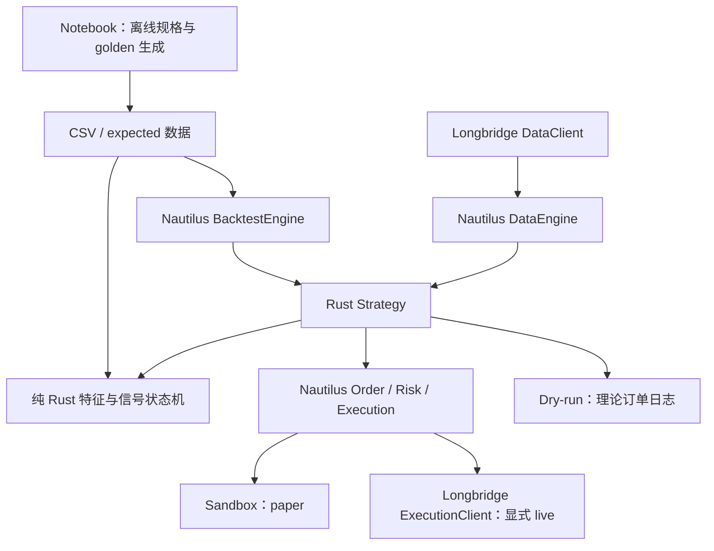

# Notebook 日内动量迁移：仓库审计

审计日期：2026-09-19。先完成本审计与数学规格，再实现策略修改。

## 当前环境

- 分支：`codex/longbridge-adapter`；HEAD：`7db22e01b8a354093aabe1e8c53197bf4bb519a7`。
- Workspace 版本：0.63.0；Rust edition 2024；rustc/cargo 1.98.0。
- origin：hadow 的 NautilusTrader fork（实际 remote 为 `https://github.com/hadow/nautilus_trader.git`）；upstream：nautechsystems。
- 工作区已有大量未提交策略、Longbridge 和撮合修复；保留这些修改，不执行提交、重置或清理原始数据。
- 初始磁盘可用约 6.2 GiB；已有 debug 构建约 6.4 GiB。使用定向、关闭 incremental 的构建和测试。
- 阅读了 `AI_POLICY.md`、`CONTRIBUTING.md`、根 `AGENTS.md`、Rust、测试与编码指南。

## 可复用组件与实际接口

| 范围 | 本仓库实现 | 用途 |
| --- | --- | --- |
| Strategy | `crates/trading/src/strategy`，`nautilus_strategy!` | DataActor 生命周期、Order API、Cache、Portfolio、订单/持仓事件 |
| 原生日内策略 | `crates/trading/src/examples/strategies/intraday_momentum` | 已有模型、配置、状态协调和 8 个测试；逐项审计后修改 |
| Backtest | `crates/backtest/src/engine.rs`，`BacktestEngine` | `add_venue/add_instrument/add_strategy/add_data/run/get_result` |
| 回测成本 | `crates/execution/src/models/fee.rs` | `FeeModelHandle` 可注入每股成本，不需要新撮合器 |
| 事件与数据 | `crates/model/src/data`，`Data::Bar/Quote/Custom` | 标准 Bar 没有 provider VWAP/turnover；CustomData 可保留该信息 |
| 时间 | `nautilus_core::UnixNanos`，jiff timezone | 纳秒事件时间；NY DST 转换；不能使用 ForexSession 代替美股日历 |
| Longbridge 数据 | `crates/adapters/longbridge/src/data.rs` | `subscribe_quotes/subscribe_trades/subscribe_bars/request_bars` |
| Longbridge 执行 | `crates/adapters/longbridge/src/execution.rs` | `submit_order/modify_order/cancel_order/cancel_all_orders/query_order/query_account` |
| 对账 | 同上与 LiveExecEngine | `generate_order_status_reports/generate_fill_reports/generate_position_status_reports` |
| 接入 | Longbridge Data/ExecutionClientFactory，`LiveNode::builder` | 注册现有 adapter，不另写 broker abstraction |
| 本地模拟成交 | `crates/adapters/sandbox` | `SandboxExecutionClientFactory`、`LiveNode::add_simulated_exec_client` |
| 日历/历史入口 | `examples/node_intraday_momentum.rs` | Longbridge trading_days/half_trading_days，已有速率限制封装 |

## 当前版本的差距

旧 intraday 实现使用 `(H+L+C)/3` 代替 Notebook 的逐分钟成交 VWAP；把 VWAP 当成额外入场条件；
RVOL 与日波动窗口随 sigma lookback 改变；缺乏 Notebook 的 fallback leverage=1。
旧回测生成 close 后的 close-price quote，不能保证 T+1 open 成交。
旧 live 示例的 paper 是 broker 模拟账户，且配置默认包含八只股票与真实账户路由；本任务要求单 SPY、
默认 dry-run，paper 使用 Nautilus sandbox。旧示例不能直接当作本任务验收结果。

缺少原始样本 golden、逐分钟 parity、lookahead 审计、训练独占参数选择、完整报告以及充分的生命周期测试。
已存在的 SLC 代码只作为基础设施接入模式参考，不复用其 alpha。

## 集成决策

沿用 trading 的 intraday_momentum 模块，将无 broker/engine 依赖的数学模型与 Nautilus 协调层分开。
回测入口放在 backtest，行情与 live 入口放在 Longbridge bin，复用 examples 的日历代码。明确保留 provider VWAP；
缺失该字段时拒绝宣称数学 parity，不静默换成典型价格。

